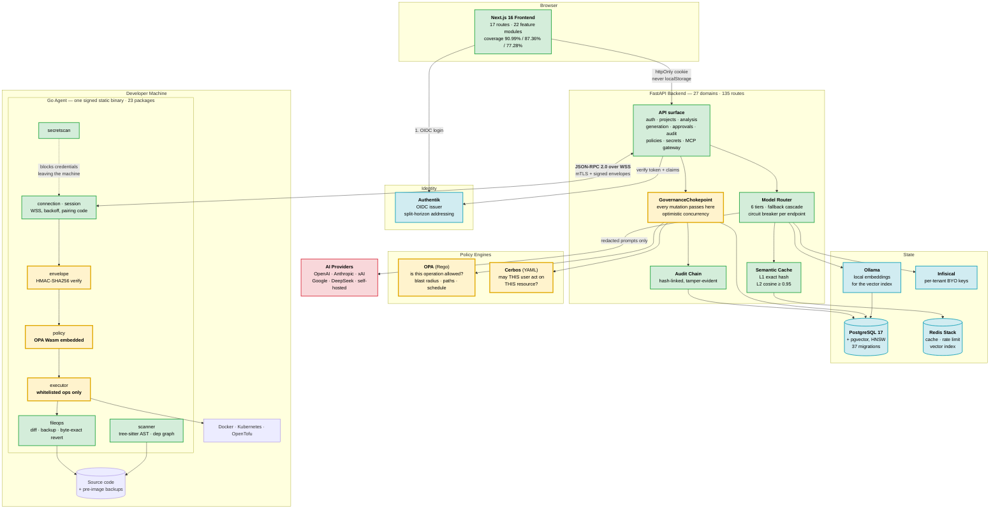
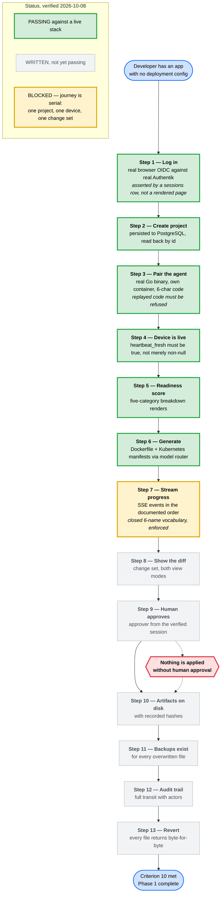

# ForgeOps — Architecture Diagrams

> Generated 2026-08-21 from commit `1207ca3`, and **re-verified 2026-10-08** by counting what is in
> the tree rather than reading the design documents. Every box below corresponds to code that exists.
> Status badges reflect the verified state on that second date.
>
> **Current state:** Phase 0 complete (18/18 criteria) · Phase 1 substantially complete, **13 of 14
> criteria** with only C10 open · Phase 2 `in-progress` at **120 of 123 boxes**. The end-to-end
> journey passes **6 of its 13 steps** against a live stack and stops at step 7's final clause.
> See [`PROGRESS.md`](PROGRESS.md) for the per-criterion evidence.

---

## How to view and export these

The diagrams are [Mermaid](https://mermaid.js.org). Three ways to render them:

| Method                        | How                                                                            |
| :---------------------------- | :----------------------------------------------------------------------------- |
| **VS Code / Kiro**            | Install "Markdown Preview Mermaid Support", then open Preview (`Ctrl+Shift+V`) |
| **Browser (best for slides)** | Paste the code block into <https://mermaid.live> → Actions → PNG/SVG           |
| **GitHub**                    | Renders automatically if you commit the file                                   |

For presentation slides, use mermaid.live and export **SVG** — it stays sharp when projected.

---

## Diagram 1 — System Architecture

**What this shows:** the three components, the services the launcher brings up, and the four
independent layers that stop the AI exceeding its permissions.

**What to say:** _"Three components. A Next.js frontend in the browser, a FastAPI backend
that orchestrates the AI, and a Go agent that runs on the developer's own machine. The agent
matters because the AI never touches anything directly — it proposes, and the agent executes
only whitelisted operations that a human approved and that the policy engine permitted."_

**Legend**

| Colour        | Meaning                                                          |
| :------------ | :--------------------------------------------------------------- |
| 🟩 Green      | Application code — built and tested                              |
| 🟨 **Yellow** | **The four security layers.** These are the point of the project |
| 🟦 Blue       | Infrastructure, all digest-pinned containers                     |
| 🟥 Red        | External services — the only thing outside your control          |

### The four security layers, in one line each

1. **`GovernanceChokepoint`** — every mutation in the system routes through one function.
   A property test (Q-03) proves it cannot be bypassed.
2. **Two policy engines, evaluated twice.** The backend asks Cerbos and OPA. The agent then
   asks its own embedded OPA independently. A property test (Q-06) proves the two evaluators
   always agree, so a disagreement is a detected bug rather than a silent hole.
3. **Signed command envelopes.** Every instruction reaching the agent carries an
   HMAC-SHA256 signature, so it cannot be altered in transit.
4. **Whitelisted operations only.** The agent executes named operations. There is no path
   that runs arbitrary shell input.

---

## Diagram 2 — The End-to-End Approval Flow, with build status

**What this shows:** how a single change travels from "scan my code" to "applied and
revertible", mapped onto the 13 formal verification steps — and exactly how far the
automated end-to-end test currently gets.

**What to say:** _"This is criterion 10, the one criterion still open. All thirteen steps are
written and each asserts something real — an HTTP status, a database row, or bytes on disk,
never just text on a screen. Six of them now pass against a live ten-service stack. Step seven
is where it stops, and only on its final clause: the SSE event names. Running it found three
genuine defects, including one where the application never requested the OAuth scope carrying
the claim its own verifier required, so no token from a real identity provider could ever have
been accepted."_

### Reading the status

|                            | Steps | State                                                                                                 |
| :------------------------- | :---- | :---------------------------------------------------------------------------------------------------- |
| 🟩 **Passing**             | 1–6   | Verified against ten live services. `/health/ready` returns 200 on postgres, redis, cerbos and opa    |
| 🟨 **Stops here**          | 7     | The run streams, but the event names fail its final clause — the six-name SSE vocabulary              |
| ⬜ **Written, unexecuted** | 8–13  | The journey is serial over one project, one device and one change set, so a stop at 7 blocks the rest |

**This went 0 → 4 → 6.** The zero was not laziness — it was the honest count when the steps
depended on endpoints that did not exist. Building the approvals surface, the generation SSE
endpoint, project persistence, the device read surface and the sign-in screen is what made
steps 1–4 possible; the readiness breakdown and the generation run carried it to 6.

### Three real defects found by running it

Worth having ready, because "what did the test actually catch?" is the natural follow-up.

1. **The app never requested the `forgeops` scope** that carries the `forgeops_role` claim
   its own token verifier requires. So no token from a real identity provider could ever be
   accepted, and every panel showed an authentication error to a user who _was_ correctly
   authenticated. Recorded as finding 87.
2. **The OIDC issuer needed split-horizon addressing** — the backend reaches Authentik at
   `authentik-server:9000` inside the Docker network, while the browser must reach it on
   `localhost`. One address cannot serve both. Finding 85.
3. **Pairing returned 503 until an internal CA existed.** `make init-ca` provides it.

None of those three would have been found by unit tests. They only appear when the whole
system runs together — which is the argument for criterion 10 existing at all.

---

## Quick reference — what's actually in the repo

_Counted 2026-10-08 from the working tree, not from the design documents._

| Component | Technology                 | Scale                          | Coverage                       |
| :-------- | :------------------------- | :----------------------------- | :----------------------------- |
| Agent     | Go 1.26                    | 23 internal packages           | 66.1% — **below its 70% gate** |
| Backend   | Python 3.13 / FastAPI      | 27 domains, 135 route handlers | 86.02%                         |
| Frontend  | Next.js 16 / React         | 17 routes, 22 feature modules  | 90.99% / 87.36% / 77.28%       |
| Policy    | Rego + Cerbos YAML         | 15 policy files, self-tested   | —                              |
| Scripts   | Bash / Python / PowerShell | ~60 verification gates         | —                              |

**The agent's coverage gate currently FAILS.** `scripts/check-coverage.sh 70` reports 66.1 %
against a threshold of 70 %, because `internal/executor` grew substantially for the
deployment work and its tests did not grow with it. The script refuses to lower its own
threshold by design, so this is a real open item rather than a configured warning. Recorded
here because a diagram that claims 78.8 % while the gate says otherwise is exactly the kind
of stale document this project has spent several passes correcting.

**The launcher brings up: 10 services** — PostgreSQL 17 + pgvector · Redis Stack 7.4 ·
OPA 1.4.2 · Cerbos 0.54.0 · Authentik server + worker · backend · ARQ worker · frontend ·
agent. Plus Ollama for local embeddings.

`docker-compose.yml` **declares 22 services** and the e2e overlay adds `agent`, for **23** in
the union the launcher actually uses. Only **13** of them belong to the default profile and
start with a bare `docker compose up`, which is why the launcher names its ten explicitly
rather than relying on `up` to pick them:

| Profile         | Services                                                                                                                                                  |
| :-------------- | :-------------------------------------------------------------------------------------------------------------------------------------------------------- |
| _(default)_     | postgres · redis · opa · cerbos · authentik-server · authentik-worker · frontend · backend · backend-agent · worker · inngest · ollama · ollama-secondary |
| `observability` | prometheus · grafana · mimir · loki · tempo · otel-agent · otel-gateway                                                                                   |
| `vault`         | infisical                                                                                                                                                 |
| `tools`         | agent-dev                                                                                                                                                 |
| _(e2e overlay)_ | agent                                                                                                                                                     |

That distinction is worth stating because it is easy to get wrong in both directions: a bare
`docker compose up` starts thirteen services, and a `--profile observability` run starts twenty.
All images pinned by digest, not tag.

**Six model tiers** in `backend/config/model-tiers.yaml`, each with a four-level fallback
cascade (primary → secondary → cross-vendor → self-hosted):

| Tier            | Primary         | Purpose                    |
| :-------------- | :-------------- | :------------------------- |
| `high_coding`   | gpt-5.6-sol     | Code generation            |
| `high_analysis` | claude-fable-5  | Reasoning about a codebase |
| `medium`        | grok-4.5        | General work               |
| `medium_value`  | claude-sonnet-5 | Cost-sensitive work        |
| `low_logs`      | gemini-3-flash  | Log summarisation          |
| `embedding`     | voyage-code-3   | Vectors for the L2 cache   |

**Verification:** 31 of 31 safety properties carry a negative control — a deliberately
broken version of the production code, proven to make the test fail. **2,011** backend unit
tests, plus 257 meta, 204 property/secret/generation and 33 scanner suites; **786** frontend
tests across 48 files.

---

## A note on these diagrams

I built them by reading the tree — `main.py`'s router registrations, `agent/internal/`'s
package list, `docker-compose.yml`'s services, `journey.spec.ts`'s step titles and
`PROGRESS.md`'s criteria cells — rather than from `design.md`. That distinction matters on
this project: the recurring defect has been documents describing intent rather than
behaviour. If a box is here, the code is there.

**Re-verified 2026-10-08, and the first pass was wrong on almost every number.** The
original published counts had drifted from the tree: services 9 → 14 defined, migrations
10 → 37, agent packages 22 → 23, frontend 10 routes / 8 modules → 17 / 22, backend
17 domains / 48 routes → 27 / 135, and the journey 4 of 13 steps → 6. The staleness is worth
naming rather than quietly correcting, because it is the same failure the note warns about:
a document that was accurate when written and was never re-measured.

That is the argument for the check the next paragraph proposes, and it now has evidence
behind it rather than a suspicion.

**The diagrams are committed** at the repository root, so GitHub renders them without any
extra step. The counts in the tables above are measured, not remembered — but a count in
prose still goes stale. If you want them kept honest automatically, the check to add is one
that asserts every service named in Diagram 1 exists in `docker-compose.yml`, and that the
package and route counts in the quick-reference table match the tree.
