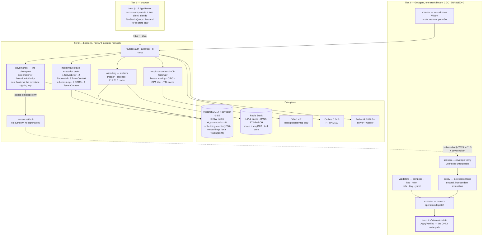
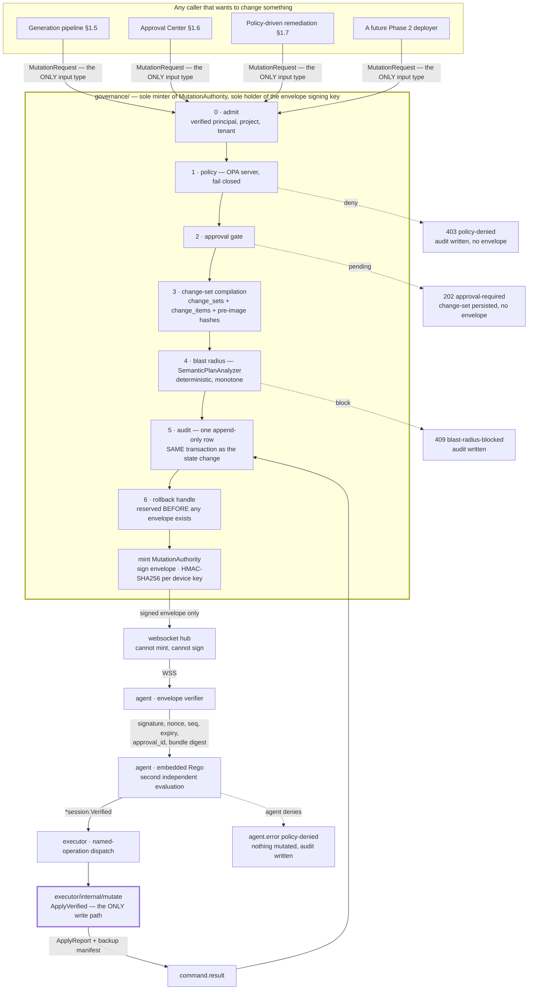

# ForgeOps — Learning Journal

| Field                  | Value                                                                                                                                                                                                                                                                                                                                                                                                                                                                                                                                                 |
| :--------------------- | :---------------------------------------------------------------------------------------------------------------------------------------------------------------------------------------------------------------------------------------------------------------------------------------------------------------------------------------------------------------------------------------------------------------------------------------------------------------------------------------------------------------------------------------------------- |
| Snapshot date          | **2026-08-01**                                                                                                                                                                                                                                                                                                                                                                                                                                                                                                                                        |
| Branch                 | `phase-1-implementation` (Phase 0 lives on `phase-0-implementation`, unmerged into `main`)                                                                                                                                                                                                                                                                                                                                                                                                                                                            |
| Phase                  | Phase 1 — MVP Core: Analysis, Generation & Approval, `in-progress`                                                                                                                                                                                                                                                                                                                                                                                                                                                                                    |
| Leaves reflected       | **56 of 166** `done` in `PROGRESS.md`, 0 `blocked`, 110 `pending`. Reconciled 2026-08-01; all three sources agree via `scripts/_state.sh`. **Group 7 is complete** — all eleven leaves plus its close-out (`verify-chain` proved end to end, comprehension artifact regenerated). **Group 8 is in progress**: leaves 8.1 (pairing-code issue and single-use exchange) and 8.2 (the internal CA and short-lived device certificates) are done. Decisions run to **D-77**; findings run to **61**, and finding 55's residual is closed. See chapter 10. |
| Comprehension artifact | `docs/understand-anything/` (see chapter 1)                                                                                                                                                                                                                                                                                                                                                                                                                                                                                                           |

This document teaches. It is not a changelog, not a status report, and never an
authority. Where it disagrees with `.kiro/specs/*/design.md`, `.kiro/specs/*/tasks.md` or
`PROGRESS.md`, those are right and this is wrong.

---

## 1. How to read this journal

**Who it is for.** Someone who has just been handed this repository and needs to hold an
informed conversation about it by the end of the day. It assumes you can read Python, Go
and TypeScript, and assumes nothing about this project.

**What each chapter does.**

| Chapter | What you get                                                                                      |
| :------ | :------------------------------------------------------------------------------------------------ |
| 2       | What the product is, in plain language, and why it has three tiers                                |
| 3       | The architecture, and the non-obvious choices inside it                                           |
| 4       | What Phase 0 built and the reproducibility discipline it established                              |
| 5       | The defect that reshaped every later decision. **Read this one even if you skip the rest.**       |
| 6       | Property-based testing as practised here, with worked examples                                    |
| 7       | Phase 1: what is being built now, and the hard parts                                              |
| 8       | The decisions that actually shaped the code, and what each rejected                               |
| 9       | Defects found in pre-existing code, grouped by pattern. This is where you learn to be suspicious. |
| 10      | Exactly where the work stands, as of the dated snapshot above                                     |
| 11      | Glossary                                                                                          |

**Where the authoritative documents live.**

Four read-only reference documents sit at the repository root and are never edited:
`PRD.md` (v2.0, 24 July 2026), `phases.md` (the six-phase plan), `Tech-Stack-Analysis.md`
(a technology-by-technology audit) and
`AI-Powered-DevOps-Platform-Complete-Technical-Research.md` (the research study whose §0
carries corrections that supersede its own later sections). They are excluded from every
mutating pre-commit hook and still scanned by Gitleaks.

Below them sit the specs, which are the _binding_ documents:
`.kiro/specs/phase-0-foundation/{design.md,tasks.md}` and
`.kiro/specs/phase-1-mvp-core/{design.md,tasks.md}`. `PROGRESS.md` is the durable progress
record, updated in the same commit as the work it describes. `REVIEW-PHASE-0.md` is an
untracked, append-only merge-gating review of the Phase 0 pull request; chapter 5 is mostly
about what it found.

`docs/development.md` is the project's build-rules home, `docs/architecture.md`,
`docs/api.md` and `docs/deployment.md` cover their titles, and `.kiro/steering/*.md` are
standing instructions that every agent session in this workspace inherits.

**The comprehension artifact.** `docs/understand-anything/` holds a knowledge graph of this
repository generated by the [Understand-Anything](https://github.com/Egonex-AI/Understand-Anything)
plugin, pinned at `v2.9.0`. It is a JSON graph of files, functions, classes, imports and
architectural layers, plus a dependency-ordered guided tour. To open it interactively you
need only Node.js ≥ 18:

```sh
npx https://github.com/Egonex-AI/Understand-Anything/releases/download/v2.9.0/understand-anything-viewer.tgz docs/understand-anything
```

That prints a tokenised `http://127.0.0.1:5173/?token=…` URL and serves the graph read-only
from local disk — no LLM calls, no network egress.

What it shows, as of the first generation: **2,002 nodes and 2,050 edges over 451 analysed
files**, grouped into **fourteen architectural layers**, with a **fifteen-step guided tour**
ordered so each step only depends on earlier ones. Files, functions and classes are clickable
nodes with a plain-English summary; the 499 `imports` edges and the line ranges on every
function and class are tree-sitter-derived, so they are facts about the code rather than
descriptions of it. Search works by name and semantically over the summaries.

Two honest caveats, both expanded in `docs/understand-anything/README.md`: source snippets do
not resolve in this layout, because the dashboard resolves a node's path relative to the
directory you hand it and these paths are relative to the repository root; and the node
summaries, layer definitions and tour are **authored** in `semantic-overlay.json` rather than
LLM-generated per run, so they are stable and reviewable but only as current as the last
person who edited them. The structural half is fully reproducible. The regeneration command is
in `docs/development.md` under "Comprehension artifact".

---

## 2. What ForgeOps is

ForgeOps is an AI DevOps engineer. Not an assistant that answers DevOps questions — a
system that does the work and then asks permission before it lands.

The PRD states the product in one sentence: a web-based system that "analyzes a developer's
local codebase, scores how production-ready it is, generates and applies missing DevOps
files (with user approval), deploys the application across multiple environments, manages
Docker and Kubernetes, monitors production, explains failures in plain language, self-heals
with guard-rails, learns from project history, and is operated through a web dashboard
connected to a lightweight local agent on the user's machine." The target user is a
developer or team without deep DevOps expertise, and an experienced team that is tired of
scaffolding the same Dockerfile for the eleventh time.

Phase 1 — the phase being built now — is the first five verbs of that sentence:

1. **Scan.** The agent walks your project directory, honouring `.gitignore` and
   `.dockerignore`, skipping binaries over 1 MB and `node_modules`, and detecting languages
   with a tiered strategy (package manager, then extension, then shebang, then content
   heuristics). It parses each file into an abstract syntax tree, chunks it along syntactic
   boundaries, and produces a **Codebase Index**: file-tree metadata, key file contents, and
   vector embeddings.
2. **Score.** A deterministic engine turns an inventory of roughly thirty checks into a
   0–100 **readiness score** across six weighted categories — Containerization 25, CI/CD 20,
   Orchestration 20, Env Config 15, Security 15, IaC 5 — and writes a plain-language report
   explaining every gap with why it matters. No LLM is involved in the number. The
   competitive research marks the readiness score as the one feature no competitor has at
   all.
3. **Generate.** Retrieval-augmented generation over that index produces Dockerfiles,
   Compose files, Kubernetes manifests, GitHub Actions workflows, Helm charts, OpenTofu
   modules, `.env.example` files and deployment docs.
4. **Validate.** Before you ever see the output, the agent runs it through real tools on
   your machine: `docker compose config`, JSON Schema validation, `kubectl --dry-run=server`
   against your actual cluster, `tofu validate` and `tofu plan`, `helm lint` and
   `helm template --validate`, a Trivy config scan. Failures loop back to the model, at most
   three times.
5. **Apply with approval.** Validated changes appear as diffs in the **Change Approval
   Center**. Nothing is written without an explicit approval, and what is written is written
   atomically with a timestamped backup, all-or-nothing.

The market gap the research identifies is not any one of those five. Code generators exist;
AI SRE tools exist; workflow platforms exist. What does not exist is one system that runs
the whole chain — analysis → scoring → typed change-set compilation → simulation → GitOps
deploy → monitoring → troubleshooting → learning. The research's conclusion is blunt: "The
risk is execution — not competition."

### The three-tier shape, and why

| Tier | What it is                                                                        | Where it runs                                    |
| :--- | :-------------------------------------------------------------------------------- | :----------------------------------------------- |
| 1    | Web frontend — dashboard, approval UI, generation surface                         | Browser, Next.js 16 + React 19                   |
| 2    | Backend — REST API, WebSocket hub, AI engine, policy engine, MCP gateway, secrets | Server, FastAPI + PostgreSQL 17 + pgvector       |
| 3    | Local agent — scanning, validation, file mutation, IaC execution                  | The developer's machine, single static Go binary |

The frontend talks to the backend over REST, SSE and WebSocket. The backend talks to the
agent over one WebSocket that **the agent always dials outward**.

The interesting question is not why there is a frontend and a backend. It is why tier 3
exists at all, when the backend could clone the repository and do the work server-side.
Three reasons, in increasing order of importance.

**The work is physically local.** Validation is the product's differentiator, and real
validation needs the real environment. `kubectl --dry-run=server` is not a schema check; it
asks _your_ API server whether _your_ admission webhooks, CRDs, quotas and field-pruning
rules accept this manifest. `docker compose config` needs a Docker daemon. `tofu plan` needs
your provider credentials and your state. None of that can be faked from a server that has
only your source code.

**Your code can stay on your machine.** The platform ships a self-hosted tier and a
BYO-key model, and the research elevates fully air-gapped operation to a first-class product
goal — the one thing every named competitor, all cloud-only, structurally cannot offer. The
agent is what makes that possible: it can run a local embedding model and a local LLM and
never open a socket to a vendor.

**The agent is the last line of enforcement, and it does not trust the backend.** This is
the load-bearing reason. The PRD lists eight non-negotiable security invariants; the fourth
is double policy evaluation, and the research states its consequence flatly: "Policy is
evaluated both server-side (before command is sent) and agent-side (before command is
executed). **The agent does not trust the backend.**" A compromised or simply buggy backend
can, at worst, send the agent bytes the agent refuses. That turns a deployment boundary into
a security boundary. The other seven invariants: outbound-only connectivity; named
whitelisted operations and never arbitrary shell; every mutation carries an approval id;
secrets encrypted at rest, redacted before any LLM sees them, injected only at deploy time;
backup before every mutation; atomic all-or-nothing change sets; and a path blocklist that
refuses `~/.ssh`, `~/.aws`, `.env` and `*.pem`.

Read the invariants again and notice that six of the eight are properties of tier 3. The
agent is not a remote hand. It is the part of the system that says no.

---

## 3. The architecture, explained



Everything above is either implemented today or named in `design.md` with a task leaf that
owns it. Chapter 10 says which is which.

### Outbound-only WSS

The agent dials the backend; the backend never dials the agent. `NFR-12` states it as a
mandatory requirement — "Agent has zero inbound ports" — and the research names its
reference implementations: Portainer's agent, GitLab Runner, Tailscale's NAT traversal.

What it buys: no firewall hole on a developer's laptop, no port forwarding, no reverse
tunnel to configure, NAT traversal for free, and — the part that matters — a backend breach
yields no inbound path to any user machine.

What it costs, because every choice here has a cost:

- **The agent owns liveness.** Reconnect is the agent's job:
  `delay = min(60s, 1s · 2^(n−1))` multiplied by uniform jitter in `[0.5, 1.5]`, with the
  attempt counter reset only after a successful `session.connect`. Heartbeat every 30 s,
  timeout at 90 s.
- **Offline behaviour becomes a feature you must build.** `NFR-18` requires the agent to
  queue work while disconnected. That single requirement produced D-41, one of the most
  carefully reasoned decisions in the project (chapter 8).
- **The backend must hold 10,000+ long-lived sockets** (`NFR-28`), which forces Redis
  pub/sub behind the hub for multi-replica broadcast and a WebSocket-aware ingress.
- **Protocol discipline instead of ad-hoc frames.** JSON-RPC 2.0 over WSS with nine message
  types, and mutations carried in a signed command envelope.

### The stateless MCP Gateway

MCP — Model Context Protocol — is how the platform reaches tools. The research's argument
for adopting it is leverage: there are thousands of public MCP servers, so building each
integration _as_ an MCP server means any agent framework can consume it, and switching
framework does not mean rewriting integrations.

ForgeOps puts a gateway in front of them, and the gateway is stateless in a specific,
useful sense: it holds no session, and it routes without parsing the body. Two headers do
the work — `Mcp-Method` and `Mcp-Name` — and `mcp/routing.py` reads only those. The
`tools/list` path deliberately never calls `request.body()`.

That ordering is the point. The pipeline is: **verify the token → route → filter by policy →
serve.** Authentication precedes routing, so an unauthenticated caller cannot enumerate the
server registry by probing names. Policy filtering precedes the upstream call, so a denied
`tools/call` does zero upstream work — a property (`P-05`) rather than an implementation
detail. The tool list is cached in Redis with a server-supplied TTL, and the cache has no
process-local expiry authority: `mcp/cache.py` uses `SET … px=` and gates reads on
`pttl > 0`, storing no timestamps of its own. That is what makes the cache correct across
replicas with skewed clocks.

Statelessness is why this works. Every replica can answer any request, because the only
state is in Redis and OPA.

### RFC 9457 everywhere

Every non-2xx backend response is an RFC 9457 problem document with content type
`application/problem+json`. Not most. Every one — `P-09` quantifies over all routes.

The interesting part is what Phase 1 added. Phase 0 passed `type` and `status` as
independent arguments at each raise site, so the same problem type could be a 401 in one
handler and a 403 in another. `type` is the one member RFC 9457 promises is stable and
machine-readable, so that made the stable member mean two things. `core/errors.py` now
carries a registry:

```python
class ProblemSpec(NamedTuple):
    status: int
    title: str

PROBLEM_REGISTRY: Final[dict[str, ProblemSpec]] = {
    "unauthenticated":            ProblemSpec(401, "Unauthenticated"),
    "idp-unavailable":            ProblemSpec(503, "Identity provider unavailable"),
    "forbidden":                  ProblemSpec(403, "Forbidden"),
    "authorization-unavailable":  ProblemSpec(503, "Authorization service unavailable"),
    # … 38 entries in total
}
```

`problem("forbidden")` takes its status from the registry, so a caller cannot disagree with
it; and `ProblemException.__init__` raises `ValueError` if a directly constructed status
contradicts the registry, because direct construction is exactly the path that would bypass
`problem()`.

Two entries are not error statuses at all and are registered anyway so the body shape stays
uniform: `approval-required` is 202 and `iteration-bound-exhausted` is 200 — both carry a
real payload.

One more detail worth internalising, because it is a security control disguised as an error
format. `forbidden_problem()` takes **no arguments**:

```python
FORBIDDEN_DETAIL: Final[str] = "You do not have permission to perform this action."
```

A 403 that says "no such project" for an unknown id and "forbidden" for one you may not see
is an enumeration oracle: the difference tells an attacker which ids exist. So the detail is
a fixed string and there is nothing for a caller to vary. `Q-20` asserts the body is
byte-identical whether or not the resource exists.

And `_sanitize_detail` suppresses the **whole** detail — returns `None` — on any match
against eight leak patterns: authorization headers, PostgreSQL and Redis connection URLs,
three vendor API-key prefixes, PEM key headers, and the Python traceback marker. Partial masking would leave the
shape of the secret; suppression leaves nothing.

### Constructor injection in Go

There is no `func init()` anywhere in `agent/`, no package-level mutable state, and no
dependency-injection framework. `app.New(cfg, buildInfo)` builds the entire graph by hand
and returns it. The research's recommendation was explicit — constructor injection over
`wire` or `uber-fx`, for startup time and binary size.

The consequences are more interesting than the choice:

```go
a.closers = []namedCloser{
    {"connection", conn.Close},
    {"mcp", mcpSrv.Close},
    {"logger", func() error { return logger.Sync() }},
}
```

Closers are registered in construction order and walked in **reverse** on shutdown, with
`errors.Join` accumulating so one failing closer does not abort the rest, and a `sync.Once`
making `Close` idempotent. The whole sequence is bounded by `cfg.ShutdownTimeout`: the loop
runs in a goroutine and `Close` selects on the deadline, abandoning a stuck closer because
the process is exiting anyway. That is property `P-07`, and chapter 9 explains why its
timeout clause was worthless for most of Phase 0.

Constructor injection also has a cost that this project paid in full: because collaborators
arrive as constructor arguments and calls dispatch dynamically, **neither a type checker nor
a coverage report can tell you the graph is wired correctly**. Chapter 5 is about the day
that bill came due.

### pgvector with HNSW

Embeddings live in the same PostgreSQL that holds the relational data, not in a dedicated
vector database. The research's case: no extra infrastructure, ACID transactions spanning
relational _and_ vector writes, SQL instead of a bespoke API, one `pg_dump` to back up
everything. The stated ceiling is roughly 50 million vectors, and a separate vector store
before that is called premature optimisation. The hidden cost is recorded too: 50 M vectors
at 1536 dimensions is on the order of 300 GB of RAM.

The index is HNSW — Hierarchical Navigable Small World — with `m=16` and
`ef_construction=64`, using `vector_cosine_ops`. HNSW builds slowly and queries in
single-digit milliseconds at 99 %+ recall; IVFFlat builds fast and gives up recall. For
user-facing search the trade goes one way, and `phases.md` makes it a checklist item:
"Default to HNSW (not IVFFlat)."

Recall is tuned per query with `hnsw.ef_search`, and how that is done is a story in itself
(chapter 9, defect 1). The production helper is:

```python
async def with_ef_search(session: AsyncSession, ef_search: int) -> None:
    await session.execute(
        text("SELECT set_config('hnsw.ef_search', :value, true)"),
        {"value": str(int(ef_search))},
    )
```

`set_config(name, value, true)` with `true` meaning transaction-local. Not `SET LOCAL`,
which cannot take a bind parameter — the reason that matters is chapter 9's opening lesson.
Transaction scope is not cosmetic: under PgBouncer transaction-mode pooling, a session-level
`SET` would leak a tuning knob onto whichever connection the next request borrows.

### The six-tier model router

Frontier model pricing spans two orders of magnitude, so the router's job is to spend the
least money that still answers the question. Six tiers:

| Tier id         | Purpose                                      |
| :-------------- | :------------------------------------------- |
| `high_coding`   | multi-file generation, architecture          |
| `high_analysis` | deep reasoning over large context            |
| `medium`        | Dockerfiles, CI configuration, analysis      |
| `medium_value`  | cost-sensitive bulk work, the advisory judge |
| `low_logs`      | log analysis, formatting                     |
| `self_hosted`   | air-gapped and sensitive codebases           |

Three mechanisms make it survivable in production.

**A circuit breaker per endpoint.** Five failures inside 30 seconds trips it OPEN; after 60
seconds it goes HALF-OPEN and admits a single probe; success closes it, failure re-opens it.
Without it, a provider outage costs you one full timeout per request instead of one fast
failover.

**A fallback cascade.** Primary → cross-vendor → self-hosted → **Safe Default Template
Library**. Read the last rung carefully: the cascade does not terminate in an error, it
terminates in a deterministic, pre-verified artifact. `ModelRouter` returns
`RoutingOutcome.EXHAUSTED` as _data_, and Phase 0 reserved a `TerminalFallback` slot for
exactly this; Phase 1 drops the template library into that slot without modifying the router
(D-43).

**A tiered semantic cache.** L1 is an exact-match hash of the prompt; L2 is Redis vector
search above 0.95 similarity; L3 caches common prefixes such as system prompts. The research
adds a reframing that turns an optimisation into an architectural component: treat the L2
cache as a **fallback layer during a provider outage** — serve the closest cached response
with a staleness flag, so the platform degrades instead of stopping.

The router also carries a Redis/Lua token-bucket rate limiter on the expensive completion
seam, and BYO-key resolution so each tenant's keys are used for their own work.

---

## 4. Phase 0: building the foundation

A foundation phase builds no features. Its output is the ability to build features
predictably: a repository whose builds are reproducible, whose tests run in CI, whose
dependencies are pinned by hash, and whose artifacts can be proved to come from a specific
commit. `phases.md` says it plainly — "No features yet — just infrastructure."

Phase 0 delivered nine groups, all recorded `done` across 41 rows in `PROGRESS.md` (with the
narrative claiming 108 executable leaves, a figure the file does not decompose):

| Group                         | Delivered                                                                                                                                                                                                                |
| :---------------------------- | :----------------------------------------------------------------------------------------------------------------------------------------------------------------------------------------------------------------------- |
| 0.1 Repository structure      | monorepo layout, two-licence split, `.env.example` + idempotent `init-env.sh`, pre-commit, `Makefile` with 26 targets, four `docs/` files, default Compose profile                                                       |
| 0.2 Go agent scaffold         | module, pinned deps, config/logging/telemetry/fileops/watcher primitives, WSS transport, docker and k8s probes, `internal/app` composition, Cobra CLI, GoReleaser + Cosign + Syft + SLSA                                 |
| 0.3 Python backend scaffold   | exact pins and hash-pinned locks, config/logging/RFC 9457/trace/task seam, async engine and session, three SQLModel tables, `0001_initial` with pgvector HNSW, app factory, health and readiness, multi-stage Dockerfile |
| 0.4 Next.js frontend scaffold | exact pins, committed lockfile, shadcn primitives, providers, Zustand UI store, RFC 9457-aware API client, validated public env contract, accessible shell, Vitest + Playwright + k6                                     |
| 0.5 MCP Gateway               | registry, header routing, OIDC verification, Rego policy, Redis TTL cache, `tools/list` and `tools/call`, Tasks extension state machine, MCP Apps sandbox                                                                |
| 0.6 GitOps workflow           | Git/PR contracts, `TokenSource` seam, branch → commit → push → PR → poll                                                                                                                                                 |
| 0.7 Plan Analyzer             | validation pipeline with syntax and schema stages, deterministic destructive-action and blast-radius analysis, approval seam, `POST /api/v1/analysis/plan`                                                               |
| 0.8 OpenTofu switch           | bounded runner with streaming and signal propagation, env isolation, null-provider fixture, six-platform lock, devtools image                                                                                            |
| 0.9 Model routing             | six tiers, endpoint adapter and registry, circuit breaker, tiered cache, BYO-key resolvers, Redis/Lua bucket, fallback cascade                                                                                           |

### The discipline that made it reproducible

Four kinds of pinning, each closing a different hole.

- **Exact version pins, no ranges.** `pyproject.toml`, `go.mod` and `package.json` name
  exact versions. `frontend/__tests__/package-policy.test.ts` asserts it as a _test_ rather
  than trusting a convention — no `^`, no `~`.
- **Hash-pinned lockfiles.** `requirements.lock` and `requirements-dev.lock` carry hashes,
  and installs run `pip install --require-hashes`. A matching version with different bytes
  fails. `scripts/check-lock-freshness.sh` regenerates both in an isolated copy and fails on
  any diff.
- **Digest-pinned images.** Every Compose image carries `@sha256:…`. A tag is a mutable
  pointer; a digest is not.
- **SHA-pinned GitHub Actions.** Every `uses:` names a full 40-hex commit with the version
  in a trailing comment. `ci.yml` states the reasoning inline: "tags are mutable, SHAs are
  not."

### The chain of custody, link by link

Phase 0's release pipeline produces artifacts a third party can verify without trusting the
project. Each link proves something specific, and it is worth knowing exactly what:

| Link                                                              | What it does                                                                                                          | What it actually proves                                                                                                                                            |
| :---------------------------------------------------------------- | :-------------------------------------------------------------------------------------------------------------------- | :----------------------------------------------------------------------------------------------------------------------------------------------------------------- |
| **GoReleaser**                                                    | builds six targets (linux/darwin/windows × amd64/arm64) with `CGO_ENABLED=0`, `-trimpath` and a fixed `mod_timestamp` | that the same source produces the same bytes — `-trimpath` removes machine-specific paths, the timestamp removes build-clock variance                              |
| **Syft**                                                          | emits a CycloneDX SBOM per artifact                                                                                   | _what is inside_ the binary — a component inventory you can later match against a vulnerability feed                                                               |
| **Cosign** (keyless, via Fulcio)                                  | signs each artifact and SBOM using an ephemeral certificate bound to the CI workflow's OIDC identity                  | _who built it_ — the certificate says "this came from `release.yml` at `refs/tags/v*` in this repository", with no long-lived signing key to steal                 |
| **Rekor**                                                         | appends each signature to a public transparency log                                                                   | _that the signature is not backdated or private_ — an inclusion proof means the signature existed at a point in time and cannot be quietly replaced                |
| **SLSA provenance** (`cosign attest-blob --type slsaprovenance1`) | signs an in-toto statement describing the build                                                                       | _how it was built_ — the predicate names the builder, the source commit and the resolved dependencies, and `--check-claims=true` binds it to the artifact's digest |

For `v0.0.1-rc3` the recorded evidence is 94 release assets, 21 `sign-blob` plus 10
`attest-blob` Rekor entries, and eleven consecutive `Verified OK` lines from
`cosign verify-blob` against an anchored identity regexp. All 94 assets were later
downloaded to a workstation and re-checked off-runner: checksums 10/10, SBOMs 10/10 parsing
as CycloneDX, and all ten SLSA attestations verifying **offline** from their Sigstore
bundles — which works even though Rekor is unreachable from that network, because the
inclusion proof travels inside the bundle. The published Windows binary self-reports the
tagged commit, so source, provenance and shipped bytes agree.

Two honest asterisks, both recorded rather than hidden. `cosign verify-blob` cannot run on
that workstation at all: the network presents a TLS-intercepting certificate valid for
`*.airtel.com`, so any path requiring a Rekor _search_ fails locally — which is why
criterion 16 is proven inside the runner. And GitHub's native artifact attestation is
unavailable for user-owned private repositories, so that step is wired, gated on
`repository.private == false`, and reports `skipped` (D-20). The cost is written down: the
cosign attestation is not discoverable through GitHub's attestations API, and its predicate
is asserted by the workflow's own OIDC identity rather than issued by GitHub's attestation
service.

Phase 0 closed with all 18 completion criteria carrying evidence and all fifteen properties
`P-01`…`P-15` present and passing. And then it was reviewed.

---

## 5. The lesson that shaped everything after it

On 2026-07-30 a merge-gating review of the Phase 0 pull request reached this verdict:

> ### DO NOT MERGE — in this state.
>
> Not because tests fail, but because the green checks are not measuring the thing they
> claim to.

The headline number: **419 passing backend tests over an MCP gateway that could not serve a
single request.** Not slowly, not partially. `POST /api/v1/mcp` with a valid token returned
HTTP 500 for `tools/list`, `tools/call` and `tasks/create` — the three things deliverable
0.5 exists to do — in the container `docker compose up` actually starts.

### The break

`main.py` composes the gateway with the real collaborators and stores it on
`app.state.mcp_gateway`; `mcp/routes.py` reads exactly that object. So the broken
composition _is_ the served route. Four call sites disagreed with their callees:

| Caller                                                                                                                                   | Callee                                                                                               | Result                                                                                      |
| :--------------------------------------------------------------------------------------------------------------------------------------- | :--------------------------------------------------------------------------------------------------- | :------------------------------------------------------------------------------------------ |
| `gateway.py` calls `filter_tools(server=…, tools=…, claims=…, blast_radius=…)`                                                           | `policy.py` defines `filter_tools(self, tools, *, subject, context=None)`                            | `TypeError` on every `tools/list`                                                           |
| `gateway.py` calls `authorise_call(server=…, tool=…, metadata=…, claims=…, blast_radius=…)`                                              | `policy.py` defines `authorise_call(self, *, tool_name, subject, arguments=None, context=None)`      | `TypeError` on every `tools/call`                                                           |
| `gateway.py` does `(await upstream.list_tools(route.server)).get("tools", [])`, then `cache.put(name, tools, ttl_ms)` with `ttl_ms=None` | `list_tools` returns a `list`; `TtlToolCache.put` starts with `min(server_ttl_ms, self._max_ttl_ms)` | `AttributeError` on `list.get`; `TypeError: '<' not supported between 'NoneType' and 'int'` |
| `routes.py` calls `store.create(kind=…, owner="default")`                                                                                | `tasks.py` defines `create(self, *, tool_name, arguments=None)`                                      | `TypeError` on every task create                                                            |

The review proved this without starting the stack, by binding each call site against the
real class with `inspect.signature(...).bind(...)`:

```
BIND FAIL policy.filter_tools(server=,tools=,claims=,blast_radius=)   -> missing a required argument: 'subject'
BIND FAIL policy.authorise_call(server=,tool=,metadata=,claims=,...)  -> missing a required keyword-only argument: 'tool_name'
BIND FAIL RedisTaskStore.create(kind=..,owner=..)                     -> missing a required keyword-only argument: 'tool_name'
```

A second, independent break sat underneath it: the backend queried OPA at
`/v1/data/forgeops/mcp/{filter_tools,allow_call}`, while `policies/mcp/gateway.rego` declares
`package mcp.gateway` with rules `filter` and `allow`. OPA answers an _undefined_ document
with HTTP 200 and no `result` key, so `raise_for_status()` never fired,
`result.get("result", [])` yielded `[]` and `result.get("result", False)` yielded `False`.
Every `tools/list` returned an empty list and every `tools/call` returned 403 — and that is
**indistinguishable from a correctly working fail-closed policy**. The tests that celebrated
fail-closed behaviour were celebrating a wiring bug.

### The mechanism that hid it

This is the part to understand properly, because it generalises far beyond this repository.

`unittest.mock` lets you constrain a double to an interface:

```python
policy = AsyncMock(spec=OpaGatewayPolicy)
```

With `spec=`, the mock rejects attribute names the real class does not have, and — the part
that matters — calls to its child attributes are checked against the real method
signatures. `policy.filter_tools(bogus=1)` raises `TypeError`. That is a genuine contract
check, and it is why `spec=` is worth using.

Then the test did this:

```python
policy = AsyncMock(spec=OpaGatewayPolicy)
policy.filter_tools = AsyncMock(side_effect=lambda **kwargs: kwargs.get("tools", []))
policy.authorise_call = AsyncMock(return_value=None)
```

The second line **replaces the spec'd child with a brand-new, unconstrained mock**. `spec=`
constrains the parent's attribute _set_; it does not make the attributes immutable. Assigning
over `filter_tools` discards the signature-validating child entirely, and the replacement's
`**kwargs` swallows any keyword names at all. So `server=`, `claims=` and `blast_radius=` —
names the real `filter_tools` has never accepted — were absorbed in silence.

The doubles therefore encoded the contract the _caller wanted_, and the real collaborators
implemented a different one. Every test passed. The same construction appeared in three
files, and `grep -rn "McpGateway(" backend` found exactly four composition sites: `main.py`
and those three tests. **No test anywhere composed `McpGateway` with the real
`OpaGatewayPolicy`, `TtlToolCache` and `McpUpstream`.**

Why neither type checking nor coverage could see it, in the design's own words:

> Neither type checking nor coverage could see it, because collaborators arrive by
> constructor injection and the call sites dispatch dynamically.

Unpack both halves. A type checker sees `self._policy.filter_tools(...)` where `_policy` came
in as a constructor parameter; unless that parameter is annotated with a concrete type _and_
the checker is run in a mode that resolves it, the call is a dynamic attribute access on a
duck-typed object. There is nothing to contradict. Coverage is worse than unhelpful here —
it was actively misleading. The broken lines in `gateway.py` were **covered**. They ran, in
tests, thousands of times. They just ran against objects that accepted anything. Coverage
measures which lines executed; it cannot measure whether the thing they executed against
resembles production. The Phase 1 design says it in one sentence: "Coverage bounds the
untested surface; §0.4 bounds the _falsely_ tested surface."

### What it cost

Two completion criteria (10 and 11) had been marked `done` in `PROGRESS.md` on the strength
of route registration plus those tests. Of eighteen criteria, the review concluded that 13
stood up, 2 were actively not met, and 3 were unverified or ungated. Five P1 merge blockers.
The most expensive item is not on that list: the project's entire quality signal had to be
re-examined, because the question "which of our other green checks are measuring something
adjacent to the claim?" had no cheap answer. Chapter 9 is the answer, and it is long.

There is a second-order cost worth naming. `P-05` asserts that a denied call performs zero
upstream work. It passed — trivially, because _no_ call ever reached the upstream. A
property proved against a fake whose interface differs from production is a property proved
about code that does not run.

### The regime built in response

D-23 records the lesson. `.kiro/specs/phase-1-mvp-core/design.md` §0.4 turns it into five
normative clauses, each naming its enforcing mechanism and the CI job that runs it. This is
the most important section of the Phase 1 design.

**Clause 1 — wiring tests over the real object graph.** Every component composed in
production has at least one test that instantiates the _real_ collaborators exactly as
`create_app()` or `app.New()` does. The mechanism is a fixture derived from the production
factory, so the test cannot drift from production wiring:

```python
@pytest.fixture
async def production_app(monkeypatch, capability) -> AsyncIterator[FastAPI]:
    """Build the app through the PRODUCTION factory, substituting only I/O edges.

    … this fixture may substitute a *transport* (httpx.MockTransport, a local fixture
    HTTP server, a Redis or Postgres URL pointing at a container) but it may NEVER
    substitute a collaborator object. If a test needs a different OpaGatewayPolicy, the
    answer is a different OPA policy file, not a different Python object …
    """
    app = create_app()                      # the same callable uvicorn runs
    async with LifespanManager(app):
        yield app
```

The distinction between substituting a _transport_ and substituting a _collaborator_ is the
whole lesson compressed into one rule. And coverage of the clause is itself derived rather
than hand-maintained: `test_wiring_coverage.py` reads the attributes the lifespan places on
`app.state`, collects `@wires("…")` declarations from the integration tests by AST walk, and
asserts `composed <= covered`. A newly composed collaborator cannot arrive untested. The Go
side has `TestWiring_RealGraph` through `app.New` and `TestWiring_CoversEveryCloser`.

**Clause 2 — signature conformance, with a self-maintaining inventory.** The cheap guard the
review asked for, generalised. `scripts/collect_call_sites.py` AST-walks
`backend/src/**/*.py` and yields every cross-component call site as
`(module, line, target_class, method, args, kwargs)`; `test_contract_conformance.py`
parametrises over that and calls `inspect.signature(...).bind(...)` on each. It runs in
milliseconds and needs no services. `INVENTORY_FLOOR` is a committed integer that may only
be raised — which is what stops a refactor from quietly emptying the inventory and making
the clause vacuous. On the Go side, `var _ Iface = (*Impl)(nil)` assertions in
`contract_test.go` files, with `scripts/check-go-interface-assertions.sh` proving the
assertions _exist_, because a compile-time assertion cannot rot but it can be absent.

**Clause 3 — signature-enforcing doubles, enforced by tooling.** Ruff cannot express this
rule, so `scripts/check-test-doubles.py` is an AST lint over `backend/tests/**` with four
codes:

| Rule       | Detects                                                                                                                                                          | Why                                                                     |
| :--------- | :--------------------------------------------------------------------------------------------------------------------------------------------------------------- | :---------------------------------------------------------------------- |
| `FO-TD001` | assignment to an attribute of a name bound from `Mock(spec=…)` / `AsyncMock(spec=…)` / `MagicMock(spec=…)` / `create_autospec(…)` where the value is a bare mock | the exact Phase 0 defect (D-23)                                         |
| `FO-TD002` | `Mock(spec=X)` or `create_autospec(X)` without `spec_set=True`                                                                                                   | `spec_set` also rejects _new_ attribute names, closing the sibling hole |
| `FO-TD003` | `patch.object(..., autospec=False)`, or `patch(...)` without `autospec=True`, on a project-owned target                                                          | a patch without autospec is a reassignment by another name              |
| `FO-TD004` | `Mock` used at all under `tests/integration/**`                                                                                                                  | integration tests substitute transports, not objects                    |

Two details show the care. Suppression requires `# noqa: FO-TD00N — <reason>`, and a
suppression without a reason is itself `FO-TD001`. And the lint has its own tests:
`backend/tests/meta/fixtures/bad_double.py` must be flagged, `good_double.py` must not, and
`test_every_rule_fires_at_least_once` is parametrised over the codes — because "a lint whose
own tests are missing is a lint nobody trusts."

**Clause 4 — no silent skips.** A test skipped behind an environment variable that CI never
sets is a defect, not a gap. `require_capability` skips locally but **fails** when
`FORGEOPS_REQUIRE_INTEGRATION=1`, which CI sets, over eleven registered capabilities
(`postgres`, `redis`, `opa`, `cerbos`, `oidc`, `kubernetes`, `tofu`, `trivy`, `infisical`,
`agent_binary`, …). Then `scripts/check-no-skips.py` consumes a `pytest --report-log` JSONL
or `go test -json` stream and fails on any skip in the mandatory selection. Three design
choices in that sentence are load-bearing: the input is the report log, so the check cannot
disagree with what actually ran; the selection is defined by **marker, not path**, so moving
a file cannot drop it; and the script exits 1 if the mandatory selection is **empty**,
because a selector matching nothing would otherwise pass forever.

**Clause 5 — non-vacuity, with an executable negative control per property.** Every property
ships with the specific mutation that must make it fail. `backend/tests/mutation/mutations.toml`
declares them:

```toml
[Q-08]
property    = "backend/tests/property/test_q08_iteration_bound.py"
target      = "src.generation.loop.FeedbackLoop._next"
mutation    = "return replace(state, attempts_remaining=state.attempts_remaining)"  # never decrements
description = "removes the decrement that guarantees termination"
```

`scripts/mutation-harness.py` then: creates a temp directory with `tempfile.mkdtemp()`,
asserting it is outside the repository by comparing resolved paths; writes one pytest plugin
per mutation that applies it with `monkeypatch` at session start; runs
`pytest <property file> -p <plugin>`; **asserts the run fails, and reports `VACUOUS` if it
passes**; then removes the temp directory. Go properties use build-tagged variants compiled
through a `go build -overlay`, never by editing a tracked file. The job fails if any row is
`VACUOUS`, if `mutations.toml` lacks a row for any `Q-` id in Appendix B, or if the working
tree is dirty afterwards.

This technique is not invented — it is the review's own Pass 8 experiment, promoted to a CI
job. The review had loaded a pytest plugin from the OS temp directory that emptied both
redaction pattern lists, and observed:

```
pytest tests/unit/test_errors.py -p fo_break_redaction -q
  -> 6 FAILED   => these assertions are NON-VACUOUS
pytest tests/property/test_p09_rfc9457.py -p fo_break_redaction -q
  -> 13 passed  => P-09's secret clause is NOT encoded by this file
```

Thirteen tests stayed green with redaction _completely disabled_. `P-09` claimed to assert
that a problem `detail` never matches a secret pattern; the 500 handler emits a fixed
generic detail, so the sanitiser was never on the asserted path. The clause was decorative.
D-27 repaired it, and `Q-24` extends it to audit records and agent-side logs.

Read the two experiments together. The same technique, applied to two files, said "this one
is real" and "this one is theatre" — and no other tool in the project could tell them apart.
That is why non-vacuity is a CI job now.

**What the regime deliberately does not do.** It does not add a coverage ritual on top of
itself. Coverage _is_ a Phase 1 gate at ≥70 % per component (D-31), but the design is
explicit that "Phase 0 proved coverage cannot see this class of defect at all — the broken
gateway code was covered." Both gates run and neither is described as sufficient.

---

## 6. Property-based testing here

A **unit test** picks an input and asserts an output. A **property** states something that
must be true for _all_ inputs in a class, and the framework generates inputs trying to break
it — `hypothesis` in Python, `pgregory.net/rapid` in Go, `fast-check` in TypeScript. When it
finds a counterexample it shrinks it to the smallest failing case.

That difference matters here for one reason: the invariants this project cares about are
universally quantified in their natural statement. "Every non-2xx response is an RFC 9457
problem document." "No mutation happens without a signed envelope." "An incrementally
maintained index equals a full rescan." You cannot express those as three examples without
losing the claim.

Phase 0 defined `P-01`…`P-15`; Phase 1 uses a fresh prefix, `Q-01`…`Q-31`, so no id is ever
reused or renumbered, and Phase 0's fifteen keep running unchanged. Forty-six in total.
Twenty-four `Q-` rows are starred, marking behaviour that is easy to get subtly wrong and
expensive to discover late. (The appendix's own prose says twenty-one; the table has
twenty-four. The table is the data.)

Two features distinguish these from ordinary tests.

**They are indexed and traceable.** A property has an id, a target module, a library, and a
task leaf that owns writing it. Appendix E's completion criteria cite them. `PROGRESS.md`
records where each lives. You can ask "what asserts that?" and get a file path.

**Every one carries a negative control.** The mutation that must make it fail is declared
next to it, and CI runs it. This is the direct inheritance from chapter 5: a property whose
subject you can break while the property still passes is not a property, and the only way to
know which kind you have is to break it on purpose.

### Worked example 1 — `Q-08`, the generation loop terminates

**The property.** For every sequence of validation outcomes, the generation loop performs at
most 3 model calls and terminates with `Accepted`, `TemplateFallback` or `Unavailable`, and
`attempts_remaining` decreases strictly on every `Continue`.

**Why it needs to be a property.** The loop's shape is "call the model, validate, feed the
failures back, repeat". Every unbounded-retry bug in history looks locally correct. What you
want to assert is not "three attempts work" but "no reachable sequence of outcomes produces
a fourth call", and the outcome sequence is exactly the thing to generate.

**The implementation, and how it makes termination structural rather than conventional:**

```python
@dataclass(frozen=True, slots=True)
class LoopState:
    attempts_remaining: int          # invariant: 0 <= attempts_remaining <= 3
    findings: tuple[Finding, ...]
    artifacts: ArtifactSet | None

Step = Continue | Accepted | FallbackToTemplate       # a closed union; no other outcome exists

    def _next(self, state: LoopState, decision: GateDecision) -> Step:
        if not decision.blocked:
            return Accepted(state.artifacts)
        if state.attempts_remaining <= 1:               # this attempt was the last
            return FallbackToTemplate(reason="iteration-bound-exhausted")
        return Continue(replace(state, attempts_remaining=state.attempts_remaining - 1,
                                findings=tuple(decision.blocking_findings)))
```

`_next` is the only function that produces a new `LoopState`; it always decrements; and it
cannot return `Continue` at zero because the branch that would is unreachable. There is no
`while True`, no counter a caller can reset, and the bound is not configurable — `Settings`
types it as `Literal[3]`, so an operator who sets `GENERATION_MAX_ITERATIONS=10` gets a
config that refuses to load rather than a quietly widened safety bound. Migration `0008`
carries the same bound as a `CHECK (iterations_used BETWEEN 0 AND 3)`. Three independent
expressions of one invariant, which the design defends: "what makes a regression impossible
to ship quietly."

Note the `<= 1` rather than `<= 0`. Entering `_next` means an attempt has already been
consumed, so one remaining means there is nothing left to spend. The design calls this "the
sort of off-by-one that a property catches and a reviewer does not" — and it is right: read
it again and check that you believed `<= 0` on first pass.

**The negative control.** Make `_next` return `Continue` without decrementing. If `Q-08`
still passes, the property is not testing termination.

### Worked example 2 — `Q-13`, no cache key is ever computed over unredacted text

**The property.** For every prompt: every cache key is computed over a `RedactedPrompt`; no
cached completion is retrievable using unredacted text; no cache entry's stored key material
contains a synthetic secret.

**Why it needs to be a property.** `NFR-10` says no secrets in LLM context. The obvious
implementation is "call the redactor before building the prompt", which is a procedure, and
procedures get forgotten in the one code path added under deadline. What you want is for
forgetting to be impossible.

**The mechanism is the type system, not a check.**

```python
RedactedPrompt = NewType("RedactedPrompt", str)     # constructible only via secrets.redaction

def assemble_prompt(
    *,
    system: SystemBlock,
    chunks: Sequence[RedactedChunk],
    instruction: RedactedInstruction,
) -> RedactedPrompt:
    """The ONLY function in the codebase that builds an LLM prompt.

    Every parameter is a type that only secrets.redaction can produce. There is no
    overload taking `str`, so "forgetting to redact" is not a mistake a caller can
    make — it is a call that does not type-check and does not bind. The RAG retriever
    cannot bypass this because it returns RedactedChunk and nothing else: the store
    contains only redacted text.
    """
```

Then `TieredSemanticCache.lookup` and `.store` take `RedactedPrompt` rather than `str`
(D-44). Two consequences follow _mechanically_: a cache key cannot be computed over
unredacted text, and a cached completion is unreachable from an unredacted prompt, because no
code path can produce the key.

**The negative control.** Widen `lookup`/`store` back to `str`. `Q-13` must fail. Note what
that control tests — not whether redaction works, but whether the _type discipline_ is what
the property depends on. If `Q-13` still passed with a `str` signature, it would be asserting
something about a particular call site instead of about the whole surface.

`Q-12` is the sibling: add a `str` overload to `assemble_prompt` and the property must fail.

### Worked example 3 — `Q-10`, incremental equals full

**The property.** For every edit sequence — creates, modifies, deletes, renames, import
changes, cycles — over a generated project, the incrementally maintained index **equals**
`FullRescan(final_tree)`: same chunks, same edges, same summary invalidation, no orphans.

**Why the equality framing is the whole design.** Incremental indexing is an optimisation
whose failures are silent. A stale chunk does not throw; it just feeds slightly wrong context
into a generation and degrades an answer nobody can trace back. D-33's reasoning: "an
incremental index that is merely 'usually right' silently degrades every downstream
generation." So correctness is _defined_ as equality with the expensive path, which makes the
property a differential test — and differential tests are the strongest kind you can write
when you already have a slow reference implementation.

**The rule under test, stated exactly rather than described:**

```
dirty = changed
      ∪ { f : f imports g, g ∈ changed, exports(g) differs from before }
      ∪ { f : imports(f) differs from before }            // f's own edges moved
      ∪ { f : f imports g, g ∈ deleted }                  // dangling edges
```

with module summaries invalidated for everything in `dirty` plus every file that directly
imports a member of `dirty`, because a summary describes a file in the context of its
imports. Cycles terminate because the closure is a fixed point over a visited set. And note
what it deliberately does _not_ do: it does not take a full transitive closure. An
implementation-detail edit that leaves a file's exported surface identical does not dirty its
dependants — "which is what makes incremental scanning worth doing at all."

**The negative control.** Drop the `Dependants(deleted)` term from the dirty set. Now
deleting a file leaves dangling edges in the index, and the property must catch it.

That control is well chosen because it is the term a reasonable engineer would omit. The
first three terms are about _change_; the fourth is about _absence_, and absence is the case
people forget.

### Worked example 4 — `Q-02`, and the difference between a strong property and a strong generator

Q-02 says: for every apply-then-revert sequence, `Revert` restores every file byte-for-byte to
its pre-image **including deleting files that did not previously exist**, revert is idempotent,
and a consumed handle cannot be reused. Its negative control is "make `Revert` skip entries
marked `NO_PREVIOUS`".

The property is easy to state and easy to test weakly, and the three things that make it strong
are all in the **generator**, not in the assertions.

**Content is arbitrary bytes.** Q-01's generator draws from `[a-zA-Z0-9 ]`. A restore that
round-tripped the file through a Go `string` would pass every one of its examples. Q-02 draws
`rapid.SliceOfN(rapid.Byte(), 0, 40)`, so NUL, `0xFF` and invalid UTF-8 reach the pre-image and
"byte-for-byte" becomes a claim rather than a phrase. This costs nothing and is the single
cheapest strengthening available to a property about bytes.

**The action mix includes `Delete`.** Phase 0 had no delete, so Phase 0's property could not
have one. A delete is the only action whose target is **absent** between the apply and the
revert: there is nothing on disk for a partial implementation to leave behind and look correct
with. Every other action leaves a file that a wrong implementation might coincidentally get
right.

**The whole tree is compared, not the targets.** Each clause hashes every file under `root`
before the apply and compares the entire set after the revert, **in both directions**. Comparing
only what the manifest names would miss a revert that restored its targets perfectly and left
something else behind — which is precisely what the negative control produces. The one-direction
version of this check is the more common mistake: "everything I expected is there" passes while
something extra sits next to it.

**Two artifacts are excluded, and the exclusion is part of the claim.** Backup files are not
removed by a revert — `Revert` restores _from_ them and is not specified to delete them — and
`root/.forgeops-rollback/` is where the single-use marker is supposed to appear. Asserting their
absence would assert behaviour the design does not promise, which is how a property starts
failing for reasons its own statement does not cover.

**A third leftover is named and not asserted.** A revert removes the FILES an apply created but
not the DIRECTORIES it created on the way: revert a change-set whose only entry was
`d0/d1/x.txt` and `root/d0/d1` remains, empty. Appendix B words Q-02 over files, so a file-level
snapshot is faithful to the property **as specified** — and the gap is real. It is written into
the test file's header rather than quietly satisfied by a lenient assertion, because the
difference between "the property does not cover this" and "the property covers this and it
passes" is the whole value of chapter 5's lesson.

**Where "idempotent" actually lives.** The tempting reading is that a second `Revert` succeeds
and does the same thing again. It does not: the second call is **refused** with
`ErrHandleConsumed`, and the refusal is what makes the effect idempotent — a second success would
restore from backups that no longer describe the current state. So the clause asserts both halves
together, because either alone is satisfiable by the wrong implementation. A `Revert` that always
errored would pass the refusal check. One that re-restored identical bytes would pass the
filesystem check. Only the conjunction pins the behaviour.

And single-use had to be pinned to a **place**, not just to a fact. Two reuse attempts are
generated that a weaker implementation would let through: one with a **fresh authority mint**
(the revert is authorised by its own envelope, so "already reverted" cannot be a property of the
authority), and one with a **reconstructed manifest value** carrying the same `HandleID` (the
manifest is serialised to the backend and handed back, so in-memory state would not survive the
round trip). Both are refused, which locates single-use on the on-disk marker. The reverse
assertion is there too — a _different_ handle must **not** be refused — because without it
"single-use" could quietly become "one revert per root", which would break the second apply of
the same change-set.

**Why the control needed a guaranteed create.** `AFileThatDidNotExistIsDeleted` seeds a create on
top of the generated set instead of waiting for the generator to draw one. The generated sets do
contain creates most of the time, and the whole-tree clause does object on those examples — but a
control whose bite depends on the draw is one a future reader cannot trust, and rapid's shrinker
reports the first failing example, not the tenth. Seeding it makes the control fail on example
zero, every run.

**And the overlay deliberately still lies.** The mutated `revertOne` skips the filesystem removal
but **still appends the path to `report.Removed`**. That forces the property to fail on ground
truth — a `stat` of the path — rather than on a report that conveniently confesses. Had the
control also stopped reporting, the weaker of the two assertions would have caught it and the
on-disk assertion would never have been shown to do any work.

---

## 7. Phase 1: what is being built now

Eleven deliverables, fourteen completion criteria, 166 task leaves. The deliverables:

| #    | Deliverable                         | In one line                                                                                                                                |
| :--- | :---------------------------------- | :----------------------------------------------------------------------------------------------------------------------------------------- |
| 1.1  | Agent pairing & connection          | JSON-RPC 2.0 over outbound WSS, mTLS + device token, 6-character pairing code, signed command envelopes, named-operation whitelist         |
| 1.2  | Multi-project workspace             | project CRUD, GitHub import, settings, tags, activity feed                                                                                 |
| 1.3  | Codebase analysis engine            | language detection, tree-sitter AST, cAST chunking, embeddings, pgvector HNSW, watch mode, dependency-graph-aware incremental rescan       |
| 1.4  | Deployment readiness analysis       | deterministic weighted scoring over six categories, plain-language report, radar chart                                                     |
| 1.5  | AI generation & validation pipeline | hybrid retrieval, six-tier routing, structured artifacts, blocking gate vs advisory rubric, bounded loop, SSE streaming, template fallback |
| 1.6  | Change Approval Center              | change-set state machine, diff preview, approval, atomic apply, rollback handles                                                           |
| 1.7  | Policy engine                       | governance Rego bundle, backend client, bundle digest and publication, agent-side in-process evaluator, policy CRUD and dry-run            |
| 1.8  | Secret management                   | agent-side scanning and redaction, the backend redaction chokepoint, Infisical store, deploy-time injection                                |
| 1.9  | Audit logging                       | append-only hash-chained `audit_events` with database-enforced immutability                                                                |
| 1.10 | Agent Governance Control Plane      | the single chokepoint every mutation traverses, plus SPIFFE/SPIRE workload identity                                                        |
| 1.11 | Auth integration                    | Authentik, OIDC authorization-code + PKCE, sessions, Cerbos RBAC, device tokens                                                            |

Four of these are genuinely hard. Here they are.

### The Governance Control Plane: a chokepoint where bypass is a compile error

The research calls this the project's biggest architectural gap and its "trust moat": policy,
approval, audit, change-set compilation and rollback unified as **one enforced chokepoint** in
front of every mutating action. No agent framework ships it. It is what lets an organisation
allow an AI to change infrastructure.

"Enforced" is the word doing the work. A chokepoint that is merely documented is a
convention, and chapter 5 is a 419-test demonstration of what conventions are worth. So the
design supplies three independent enforcement mechanisms and states the principle: "Design
intent is not enforcement. These three are."



**Mechanism 1 — a capability type only the control plane can mint (Python).** Every mutation
primitive takes a `MutationAuthority` as a required argument, and the type cannot be
constructed outside `governance/`:

```python
_MINT_SENTINEL = object()          # module-private; never exported, never re-exported

@dataclass(frozen=True, slots=True)
class MutationAuthority:
    change_set_id: uuid.UUID
    approval_id: uuid.UUID
    policy_bundle_digest: str
    blast_radius: BlastRadius
    audit_seq: int
    envelope_digest: str
    _sentinel: InitVar[object]

    def __post_init__(self, _sentinel: object) -> None:
        if _sentinel is not _MINT_SENTINEL:
            raise TypeError(
                "MutationAuthority may only be minted by governance.chokepoint; "
                "see design §2.2.1 and Q-03"
            )
```

Note _where_ the enforcement lives. The design contrasts the two options directly: "A check
inside the primitive can be satisfied by a caller that fabricates a context; an argument of a
type that cannot be constructed outside `governance/` cannot be satisfied at all. The failure
mode moves from 'someone forgot to call `assert_authorized()`' to 'this does not compile /
does not bind'." A missing argument is caught in milliseconds by the §0.4.2 conformance test.

**Mechanism 2 — banned-api rules.** Ruff's `flake8-tidy-imports` confines four things to
`governance/`: the mint sentinel, `sign_envelope`, `_SIGNING_KEY`, and
`websocket.hub.send_command`. `DeviceService.envelope_key` is on the same list, with the
reason stated: "A service that can fetch a signing key is a service that can forge a
command." `SecretStore.get_value` is confined to `secrets.injection` by the same mechanism.

**Mechanism 3 — a compiler-enforced boundary in Go.** Go's nested-`internal` rule is real:
a package under `agent/internal/executor/internal/…` is importable **only** from packages
rooted at `agent/internal/executor/`. So the write implementation moves there:

```
agent/internal/executor/
├── executor.go                  # named-operation dispatch; takes *session.Verified
├── contract_test.go
└── internal/
    └── mutate/
        ├── apply.go             # ApplyVerified — the ONLY write path
        └── apply_test.go
```

Any package outside that subtree that tries to import it **does not compile**. No lint, no
review, no discipline. And the argument changed too: `ApplyVerified(ctx, *session.Verified,
root, entries)`. `session.Verified` has unexported fields and exactly one constructor —
`Verify` — so "we forgot to check the signature" is not a reachable state. The algorithm
inside is Phase 0's unchanged (validate paths, back up, temp + fsync + rename, roll back in
reverse), so `P-08` keeps guarding it; what changed is that a mutation without a verified
envelope is now a compile error (D-45).

Because a boundary can be widened by a well-meaning refactor,
`scripts/check-chokepoint.sh` also asserts it, from two derived enumerations:
`go list -deps -json ./...` for the import graph, and an AST walk for the Python half that
discovers primitives by scanning for the `@mutation_primitive` decorator. It exits 1 if the
discovered primitive set is **empty** — a renamed decorator would otherwise make the check
trivially pass. That guard clause appears in nearly every check script in this repository,
and chapter 9 explains why.

Finally, the key placement, stated as a security property rather than a hope: the control
plane is the sole holder of the per-device envelope signing key. The hub does not have it.
The generation pipeline does not have it. Consequence: **an unsigned or wrongly-signed
envelope is rejected by the agent regardless of backend bugs.** A compromised code path
elsewhere in the backend can at worst ask the hub to deliver bytes the agent will refuse.

The audit chain deserves its own note, because it is the part that makes the rest
inspectable. `audit_events` is append-only three ways: `seq BIGSERIAL` gives a total order so
a deletion leaves a gap; a per-tenant hash chain where
`hash = sha256(canonical(payload) || prev_hash)` over RFC 8785 JCS of the semantic fields
makes tampering detectable; and migration `0007` REVOKEs `UPDATE, DELETE, TRUNCATE` from
`forgeops_app` and installs three triggers that raise. Writers serialise on a
transaction-scoped advisory lock, because a chain is only well-defined under serial append.
`project_id` and `actor_user_id` are deliberately _not_ foreign keys — "an immutable log that
cascades away when a project is deleted is not an immutable log." `reason` is required and
non-empty: "A required `reason` is what stops the log from becoming a list of verbs." And
verification is a product feature, not an internal helper: `GET /api/v1/audit/verify`
recomputes the chain and returns the `seq` of the first divergence.

### Agent pairing and its revocable device token

```mermaid
sequenceDiagram
    autonumber
    participant U as User (browser)
    participant BE as Backend /api/v1/agents
    participant R as Redis
    participant CA as Internal CA (governance-owned)
    participant AG as Agent CLI (user's machine)

    U->>BE: POST /agents/pairing-codes (bearer, project_id)
    BE->>BE: authorise: admin or developer on the project<br/>code = crockford_base32(6) from crypto/urandom<br/>store ONLY HMAC-SHA256(pepper, code)
    BE->>R: SETEX pair:<hmac> 300s {project, tenant, issuer_sub, attempts:0}
    BE-->>U: 201 {code, expires_at, device_id} — shown once, 5:00 countdown

    U->>AG: forgeops-agent pair --code ABC234 --backend wss://…
    AG->>AG: generate P-256 keypair IN MEMORY, build CSR<br/>the secret half never leaves this machine
    AG->>BE: POST /agents/pair/exchange (the only PUBLIC route)<br/>{code, csr, agent_version, platform, fingerprint}
    BE->>R: ONE Lua script: fetch, INCR attempts, burn at >5, DEL on success
    alt unknown, expired or burned
        BE-->>AG: 401 pairing-code-invalid (all three indistinguishable)
    else valid
        BE->>BE: device_token = 32 random bytes, stored as HMAC(pepper, token)<br/>envelope_key = 32 random bytes, stored AES-256-GCM
        BE->>CA: sign CSR, notAfter = now + 24h
        BE->>BE: device active; pairing_token_hmac := NULL
        BE-->>AG: 201 {device_token, envelope_key, client_cert, ca_bundle,<br/>policy_bundle, policy_bundle_digest, renew_after}
    end
    AG->>AG: persist in OS keychain (0600 file fallback, reported by `agent doctor`)

    AG->>BE: WSS connect: client cert (mTLS) + device token in the authorization header
    BE->>R: SISMEMBER devtok:revoked <device_id>
    AG->>BE: session.connect {device_id, policy_bundle_digest, capabilities}
    alt digest stale
        BE-->>AG: {policy_bundle, digest} — agent reloads BEFORE any mutation
    else current
        BE-->>AG: {session_id, heartbeat_interval:30, heartbeat_timeout:90, seq_base}
    end
    loop every 30s, timeout 90s
        AG->>BE: session.heartbeat {seq, uptime, queue_depth}
        BE->>R: refresh session TTL; check revocation PER MESSAGE
    end
```

Numbers, because they are chosen rather than default: the code is 6 characters from
Crockford base32 with `I`, `L`, `O` and `U` removed — 32⁶ ≈ 1.07 × 10⁹ — live for 300
seconds, at most 5 attempts before it burns, at most one live code per project, and at most
10 exchange attempts per IP per minute plus a global bucket. That yields a guessing
probability around 4.7 × 10⁻⁷ from a single IP. The framing to remember: "The code is a
_bootstrap_, not an authorisation."

Three things in that flow are worth reading twice.

**Nothing reusable is stored in plaintext.** The code is stored only as
`HMAC-SHA256(pepper, code)`, the device token likewise, the envelope key under AES-256-GCM,
and on success `pairing_token_hmac` is set to `NULL` so the code cannot be reused even from
the database. `Q-17` additionally asserts the code value appears in no log, audit row or
column, and that expired, burned and unknown codes are **indistinguishable** in the response.

**Single-use is enforced atomically.** Fetch, increment, burn and delete happen in one Redis
Lua script. "Atomicity is what makes single-use true under concurrency" — `Q-17` generates
concurrent exchange attempts on one code and requires at most one to succeed. Its negative
control makes the script non-atomic (read then delete).

**Revocation is per message, not per connection.** `DELETE /api/v1/agents/{device_id}` adds
the device to a Redis set and publishes an event. The publish is an _optimisation_ that
closes the socket promptly; the guarantee is the `SISMEMBER` check on every inbound frame, so
a replica that missed the pub/sub event still refuses the next message (`Q-16`, whose
negative control checks revocation once per connection instead). If Redis is unavailable the
check raises and the hub closes the session — fail closed, "because the alternative is
honouring a revoked device during an outage."

The envelope is where backend and agent cannot be allowed to disagree about a single byte. The
signed bytes are the **RFC 8785 JCS** serialisation of the envelope with `signature` removed —
"not 'the JSON we happened to send'" — prefixed with a domain separator:

```
signing_input = "forgeops-envelope-v1" || 0x00 || jcs_bytes
signature     = base64url(HMAC-SHA256(envelope_key, signing_input))
```

The domain prefix means an envelope signature can never be replayed as a signature over
anything else the same key signs — an `approval.response` uses `"forgeops-approval-v1"`. Both
runtimes implement this against the _same_ fixture files in `agent/testdata/envelopes/`, with
a synthetic self-labelling key, so a divergence fails both suites instead of producing a
mystery in production (`Q-14`; negative control: remove the domain prefix on one side only).

Replay protection is three independent conditions, all required: **freshness**
(`not_after`, bounded by a 300 s max age, ±60 s tolerated clock skew reported in
`agent.status` so `agent doctor` can say "your clock is 4 minutes fast" instead of "signature
invalid"); **uniqueness** (128-bit nonce, `SETNX` on the backend, bounded LRU on the agent);
and **ordering** (strictly monotonic per-device `seq`, allocated by a Redis Lua
compare-and-set).

And one ordering detail that is a whole security lesson: signature verification happens
**before** the sequence and nonce updates. Verifying order first "would let an
unauthenticated attacker advance a device's `seq` counter and lock out the real backend — a
denial of service through a check that was supposed to be a defence." `Q-15`'s negative
control is exactly that: update `last_seq` before the signature check.

### Redaction before any LLM sees source

`NFR-10` — no secrets in LLM context — goes live in Phase 1, because Phase 1 is the first
phase that sends real code to a real model. The design's approach is to make forgetting
impossible rather than to remember carefully.

**Detection at the source.** The agent scans every chunk with the Gitleaks rule set plus
project patterns, and `Scan` returns findings _without values_ — `kind`, `path`, `line`,
`entropy`, and a fingerprint — "because a 'findings report' that quotes the secret is a
second copy of it." Redacted text carries `FORGEOPS_REDACTED:<kind>:<hash8>` where `hash8` is
the first 8 hex of `HMAC-SHA256(project_pepper, value)`. The keyed hash is deliberate: it lets
the same secret be recognised across files ("this key appears in 6 places") without being
reversible by anyone holding only the index. An unkeyed hash would be reversible by
dictionary attack for low-entropy secrets.

**A type that cannot be produced by accident.** `secretscan.Redact` is the only constructor of
`RedactedChunk` on the Go side; `secrets.redaction.Redactor` is the only constructor of
`RedactedChunk`, `RedactedPrompt` and `RedactedInstruction` on the Python side; and
`assemble_prompt` is the only function in the codebase that builds a prompt, accepting only
those types. Chapter 6 has the code.

**A second pass anyway.** The backend redacts again even though the agent already did, for
two stated reasons: defence in depth for a project imported by a path that never went through
an agent, and because "the backend knows secrets the agent does not — every key in the
project's vault is redacted by value from retrieved text, catching a credential that
Gitleaks' entropy rules would have missed."

**The cache clause.** Covered in chapter 6 as `Q-13`. And one more boundary: a change-set
containing a value matching a known secret is refused by the chokepoint with
`secret-redaction-failed` — "a mutation is not a laundering channel."

### The bounded loop and the Safe Default Template Library

The loop is chapter 6's worked example. Two things around it matter as much.

**The blocking gate and the advisory rubric have no path between them.** `phases.md` lists
both under "evaluation pipeline". The design assigns them different powers and enforces the
difference structurally:

```python
@dataclass(frozen=True, slots=True)
class GateDecision:
    """The blocking decision. Note what this type does NOT contain: any rubric score.

    Separation is structural, not procedural. decide() accepts only deterministic
    findings, so a non-deterministic judge CANNOT become a safety gate — there is no
    parameter through which its opinion could arrive (Q-09).
    """
    blocked: bool
    blocking_findings: tuple[Finding, ...]

def decide(findings: Sequence[Finding]) -> GateDecision: ...
```

Blocking checks are deterministic: syntax, JSON Schema, `compose-go` load, Kubernetes
server-side dry-run, `tofu validate`/`plan`, Helm lint and template, Trivy config scan, and
the Semantic Plan Analyzer's blast-radius verdict. The LLM-as-judge rubric — best-practice
compliance, security posture, cost efficiency, each 0–5 with written anchors, temperature 0,
a versioned prompt, and the judging model id recorded — is _advisory_: stored on
`generation_runs.rubric`, shown to the user, never consulted by `decide()`. It is computed
only on the accepting path. A CI stability probe judges one fixture twice and records the
variance — "reported, not gated, because gating on a stochastic value would be theatre."
`Q-09` asserts `GateDecision` is identical for all rubric values including all-zero and
all-five; its negative control adds a `rubric` parameter to `decide` and lets a low score
block.

**The template library is the terminal cascade slot, and "verified" has one honest meaning.**
Eight languages (Node.js, Python, Go, Rust, Java/Kotlin, Ruby, PHP, .NET) × five artifact
classes (Dockerfile; K8s Deployment + Service + Ingress; GitHub Actions CI; Helm chart;
OpenTofu module) = 40 artifact sets. Templates are Jinja-free and substitute parameters at
`string.Template` level, because "a template engine that can execute expressions inside a
security-relevant fallback is an unnecessary risk."

"Verified" means every template passes **the same validation pipeline the AI output passes**
— the same syntax, schema, dry-run (including Kubernetes server-side dry-run in the `k8s`
job) and semantic stages. A `templates` CI job renders all 40 sets against fixture projects
and runs them through the real pipeline. "'Verified' is not a review sign-off and not a
comment in a manifest." When no template exists for the detected language the answer is
`generation-unavailable` — an honest failure rather than a wrong-language template. And the
router is not modified at all: it already calls the terminal slot on exhaustion and already
returns `RoutingOutcome.EXHAUSTED` as data (D-43).

### Dependency-graph-aware incremental rescan

Chapter 6 covers the closure rule and why equality with a full rescan is the definition of
correctness. The surrounding machinery: fsnotify feeds a **250 ms** debouncer that coalesces
per path and drops ignored paths; the closure computer produces the dirty set; a bounded
fan-out of `min(GOMAXPROCS, 8)` parser workers parses and chunks; a fan-in aggregator batches
upserts and deletions into `PATCH /api/v1/projects/{id}/index` under optimistic concurrency
(`409 index-version-conflict` on a stale `base_version`).

Chunking is cAST — bottom-up grouping from statements to functions to classes, with
constraint-based splitting at the highest syntactic boundary that yields parts under the
target, and the file's import block prepended to every chunk so a retrieved chunk is
self-contained. Targets are the research's numbers, honoured rather than reinvented: ~512
tokens with 128-token overlap for function chunks, ~1024 for module summaries.

Three failure modes are handled explicitly rather than hoped away. A rename is delete + create
on both paths. Directory creation triggers a subtree walk. And inotify watcher-limit
exhaustion (`ENOSPC`) degrades to a periodic poll and is reported in `agent.status`, because
"silently watching nothing is the failure mode to avoid."

`Q-11` guards the debouncer specifically: for every raw event sequence, the coalesced stream
must produce the same dirty set as the un-coalesced one. Coalescing is an optimisation and
must not be able to lose a change. Its negative control coalesces a delete followed by a
create into a no-op — which is precisely the plausible-looking optimisation that is wrong.

---

## 8. The decisions, and why they went that way

Phase 0 recorded D-1…D-27. Phase 1 continues at D-28 and currently reaches **D-58**. Each
one names what it supersedes and what it rejected. These are the ones that shaped the code.

### D-1, and its reversal-that-is-not-a-reversal by D-29

`phases.md` §0.2 lists `github.com/tree-sitter/go-tree-sitter` as a Phase 0 dependency. The
same phase's completion criteria demand six cross-compiled binaries. Those binaries are built
with `CGO_ENABLED=0`, and that tree-sitter module requires cgo. Both requirements cannot hold.

**D-1** resolved it with a rule worth internalising: where a deliverable list and a completion
criterion disagree _inside the same document_, the criterion is the testable statement and
therefore governs. The dependency moved to Phase 1. Crucially, this deferred a _dependency_,
not a _capability_ — nothing in Phase 0 parses an AST, and `internal/scanner` still shipped
with its `Watcher` interface and a real `fsnotify` implementation. And the deferral was
enforced executably, not documented: `agent/internal/app/deps_test.go` asserted tree-sitter's
absence from `go.mod`.

Then Phase 1 has to actually parse ASTs. **D-29** chose between four options and took the one
that looks least obvious: compile the grammars to **WebAssembly**, vendor them under
`agent/internal/scanner/grammars/`, digest-pin them in `grammars.lock.json`, embed them with
`go:embed`, and execute them with `tetratelabs/wazero` — a **pure-Go** Wasm runtime.

Why that beats the alternatives comes down to counting how many times you pay the cgo tax.
Phase 1 needs two things that usually want cgo: an AST parser and an embedded policy
evaluator. Turning cgo on pays the tax twice; splitting the release into a static agent plus a
cgo analyzer pays it twice and produces two artifact classes to sign, SBOM and attest;
wazero plus a pure-Go Rego evaluator (D-30) pays it **zero** times. And it is the only option
that leaves the entire Phase 0 custody chain untouched — cgo would make `-trimpath` and
`mod_timestamp` reproducibility depend on a C toolchain and would need an osxcross-style SDK
for the darwin leg, "the least reproducible part of any cross-build". Moving parsing to the
backend was rejected for a different reason: it would ship more source content over the wire
and weaken the air-gapped story the `self_hosted` tier exists to serve.

Six reproducible, signed targets preserved. The design is careful about what happened to D-1:
its _guard mechanism_ changed, its _constraint_ did not. `deps_test.go` stops asserting
"tree-sitter is absent" — that assertion would now be misleading, since the capability is
present — and starts asserting (a) no dependency in the module graph requires cgo, checked by
a `CGO_ENABLED=0` build plus a known-cgo denylist, and (b) every `grammars.lock.json` entry
matches the embedded bytes. `scripts/check-go-module.sh` is updated in the same commit "so
the two guards cannot disagree."

The costs are stated plainly, which is the house style: grammar `.wasm` files become
vendored, pinned, checksummed supply-chain inputs that must appear in the SBOM — the first
non-Go artifacts ForgeOps ships; parse throughput is lower than native bindings; the binary
grows 25–45 MB; and not every grammar publishes a prebuilt `.wasm`, so some must be built by
a digest-pinned container with a reproducibility check. That last one is recorded as the
phase's largest single execution risk with a degrade-to-line-chunking fallback per language.

### D-2 and D-48: 1536 dimensions, `model_id`, and why truncation was not an option

**D-2** fixed `embeddings.embedding` at `vector(1536)` to match Voyage Code 3, mandated HNSW,
and kept a `model_id` column as provenance. That column is the interesting part. A vector is
meaningless without knowing which model produced it — two vectors from different models are
not comparable, and cosine distance between them is a number with no interpretation. Storing
`model_id NOT NULL` alongside every vector is what keeps a future multi-model story possible
instead of leaving you with a table of unattributable floats.

D-2 deferred the multi-model strategy to Phase 1 with two candidates: a second table per
dimension, or **Matryoshka truncation** to a common size. Matryoshka-trained embedding models
are trained so that the first _k_ dimensions of an output are themselves a usable embedding —
you can truncate 1536 → 768 and keep most of the recall. If both models were Matryoshka, one
column could hold both.

**D-48** rejected truncation on a factual ground rather than a preference: **BGE-M3 is not
Matryoshka-trained.** Truncating its 1024-d vectors would silently degrade recall, and
padding to 1536 is meaningless. So a second table, `embeddings_local` with `vector(1024)` and
its own HNSW cosine index at the same `m=16, ef_construction=64`. A project reads exactly one
table, selected by `projects.settings.embedding_backend`, which is **immutable once
embeddings exist** — changing it returns `409 project-embedding-backend-locked` and requires a
re-index. Two tables keep both vector spaces exact and make mixing impossible, because no
query references both. `model_id` stays `NOT NULL` on both.

### D-23: the mock lesson

Chapter 5 is this decision. Its three rules, verbatim: configure behaviour on the spec'd
child (`m.method.side_effect = …`), never by assigning over it; every seam carries at least
one test that composes the real classes; and `test_mcp_contract.py` binds every
gateway→collaborator call site with `inspect.signature().bind()`, so drift fails in
milliseconds without any service. What it rejected is the `test_mcp_e2e.py` pattern, and the
cost it records is the 419 green tests.

### D-30: in-process Rego, not Rego-to-Wasm

`phases.md` §1.10 and the research both say "OPA compiled to **Wasm** embedded in the Go
agent". D-30 embeds `github.com/open-policy-agent/opa/rego` and evaluates the signed,
versioned bundle in-process instead — no Wasm, no cgo.

The reasoning separates the wording from the requirement behind it. What the documents
actually need is: policy evaluated _inside the agent binary_, _offline_, _from a signed and
versioned bundle_, by _the OPA project's own evaluator_, at the same OPA version as the
server side — because that shared-semantics property is exactly what `Q-06` asserts when it
requires the backend's decision and the agent's decision to agree. All five hold. Meanwhile
the literal compilation target costs something: hosting compiled Rego needs a Wasm host (the
mainstream Go one is cgo, which D-29 exists to avoid), compiling Rego to Wasm **loses
builtins**, and it adds a build artifact that itself needs signing, versioning and
verification.

So this is recorded as a **deviation**, not as a claim of compliance — and it is reversible:
"the `policy.Evaluator` interface absorbs a Wasm implementation without touching a call site,
which is why it is an interface."

### D-41: an offline journal that cannot represent an authorisation

`NFR-18` requires the agent to queue work while offline. An earlier draft of the design
deferred it to Phase 2 to avoid adding SQLite. D-41 calls that "the wrong trade" and replaces
it, and the reasoning is the best worked example in the project of analysing a requirement
before answering it.

Four hazards were analysed _first_, because each could have made queueing unsafe rather than
merely awkward:

1. **Envelope expiry.** A command envelope's `not_after` is bounded by a 300-second max age.
   Queueing an inbound mutation envelope is therefore architecturally dead — it expires long
   before any realistic reconnect — and extending its lifetime so it could survive an outage
   "would widen exactly the replay window that bound exists to close."
2. **Replay protection.** `seq` is allocated by a backend Redis compare-and-set and the nonce
   set is backend-side. An offline agent cannot allocate a `seq`, cannot manufacture a
   deliverable envelope, "and must not be given a way to."
3. **Revocation during the outage.** Draining a queue before revalidating "would execute the
   intent of a principal that no longer has authority."
4. **Policy freshness.** Applying a queued mutation against the bundle held at disconnect
   would defeat `Q-07` and the double-evaluation invariant.

The resolution is **queue-and-revalidate**, and its defining property is a _negative_ one:
what the journal is not allowed to contain. Journalled: the agent's own outbound records —
completed scan batches, results and progress for work that finished before the disconnect,
status, secret-scan finding _metadata_, and **intents** (a record that the operator asked for
a change). Never journalled: a signed envelope, an `approval.response`, a
`MutationAuthority`, an `approval_id`, a device token, an envelope key, or any secret value.

> **Nothing that authorises a mutation is written to disk**, which is what makes items 1–4
> above moot rather than mitigated.

That sentence is the design. The four hazards do not need mitigations because the artefact
that would suffer from them cannot exist on disk. On reconnect the order is fixed: verify
mTLS, token and revocation — **and if the device is revoked the journal is discarded and wiped
with the credentials, never drained**; then check the bundle digest, where a stale digest
blocks the drain of intents; then deliver non-mutating records; then replay each intent as an
`approval.request`, an existing method, so **no tenth JSON-RPC method is added**. Each intent
re-enters `GovernanceChokepoint.submit` and gets a fresh envelope, `approval_id`, digest,
nonce, `seq` and `not_after`. Pre-image hashes are re-checked at apply time, so a file edited
during the outage yields `change-set-conflict` rather than a stale overwrite.

Storage is an append-only `0600` file: length-prefixed records, CRC32C per record, `fsync` on
append, bounded by size and age, truncated after a successful drain, and a corrupt tail record
discarded on load with a warning rather than failing startup. Delivery is at-least-once with
idempotent apply, deduplicated by `SETNX record:<device>:<record_id>`.

SQLite was rejected with an argument about access patterns: FIFO append-and-drain with no
queries, so SQLite "would buy indexing nobody uses at the cost of roughly 4 MB of binary
(already growing under D-29) and a new parser on the attack surface." The research's named
mechanism is deviated from in letter and honoured in substance, and that deviation is
recorded rather than left implicit. The reversal cost is stated too, and it is the kind of
honesty that makes a decision log useful: deferring would still leave Phase 2 inheriting both
the queue _and_ the revalidation design, "which is the expensive half, so deferring saves less
than it appears to."

### D-51: a premise that proved factually false

Inherited debt row D5 said two things: `infisical` is not digest-pinned, and OPA runs the
non-rootless variant where the design specified `openpolicyagent/opa:1.4.2-rootless`.
Implementing that row produced two facts.

**The tag does not exist.** OPA 1.x publishes `1.4.2`, `-static`, `-debug`, `-envoy*` and
`-istio*`. `docker manifest inspect openpolicyagent/opa:1.4.2-rootless` returns
`no such manifest`. The `-rootless` suffix belonged to the 0.x line and was retired when 1.0
made the default image non-root.

**The security intent was already met.** The image the repository already pins reports
`Config.User == "1000:1000"` with `org.opencontainers.image.vendor == "Chainguard"`.

So the requirement was unimplementable _and_ unnecessary. What is worth taking from D-51 is
not the OPA fact but the category error it names:

> A gate that pattern-matches a tag name proves a naming convention, not a runtime user; had
> the tag existed, a `-rootless` image reconfigured with `user: root` in Compose would have
> passed.

That is chapter 5's shape again — a check measuring something adjacent to the claim. The fix
replaces the substring assertion with two real ones: no service may override its image's
runtime user back to root, and `compose-smoke` runs `docker compose exec -T opa id -u` on the
**running** container and requires a non-zero uid. And keeping the requirement as written
would have been worse than dropping it, because `docker compose up` would fail on an
unresolvable image — "the design would have been unimplementable rather than merely
unproven." The reversal cost is nil: if OPA ever publishes a `-rootless` 1.x tag, the runtime
assertion still holds.

The companion, **D-52**, is the other half of the same row and carries its own lesson.
`infisical/infisical:v0.91.1` was _also_ never published; the live line is `v0.162.15`,
roughly seventy minor releases away. Rather than pin a digest and discover the API drift at
integration time, the assumptions were re-verified at pin time — deployment shape unchanged,
port unchanged, auth model unchanged and now the only supported one, migrations now automatic
at boot, and the v3 raw-secrets API now labelled legacy in favour of v4. So §11.8 is written
against v4. The principle: "A digest-pinned image whose API moved underneath the design is
worse than an unpinned one, because it converts a review-time question into a runtime
failure."

### D-53: a registry that was complete for the happy path

`/health/ready` deliberately does **not** probe Authentik, so an identity-provider outage
degrades login rather than draining every replica. Implementing `/login` and `/refresh` made
the gap concrete: degrading login requires login to _answer something a client can act on_,
and the problem registry had no type for it.

Every existing candidate was wrong, and the reasoning is precise. `unauthenticated` (401)
"asserts a fact about the caller's credential that is not in evidence — the caller may hold a
perfectly good refresh token and the server simply cannot reach the issuer — and a frontend
that treats 401 as 'log in again' would send the user into a redirect loop through the very
IdP that is down." `not-ready` is not in the registry at all and would say the service is
unready, which the readiness design forbids. `secret-store-unavailable` and
`validator-unavailable` name different subsystems. And inventing a type at the raise site is
"the exact practice the registry exists to prevent."

So `idp-unavailable` → 503, raised when the discovery document cannot be read, is not an
object, is missing an endpoint, or declares the wrong issuer, and when the token endpoint is
unreachable at transport level. A token-endpoint _rejection_ stays 401: "that is a statement
about the grant, not about availability."

The premise that proved wrong is stated explicitly, and it is a good thing to look for in your
own work: the registry "was assembled per subsystem — pairing, envelopes, policy, approval,
generation, secrets, indexing, audit, validation, tenancy — and login was the one subsystem
whose _unavailability_ case was never given a row." The distinction is load-bearing for a
caller because the remedies differ: "503 means retry with backoff and keep the session, 401
means discard the credential and re-authenticate."

**D-56** applies the same reasoning one layer along, for Cerbos, and adds a sharper argument.
Reusing `forbidden` for an authorization outage would be "byte-identical to a real deny by
design, so an outage would be indistinguishable from a working authorization layer refusing
everyone — the D-23 shape again, and unfalsifiable from the client side." It would also
defeat `Q-20`, which requires the 403 body to be byte-identical whether or not the resource
exists: a body also emitted for an outage makes "byte-identical" true for the wrong reason.

### The rest, briefly

- **D-31** — coverage becomes a gate at ≥70 % **per component**, never aggregated: "Aggregation
  would let a well-covered backend hide an untested agent — the component that writes to a
  user's disk."
- **D-32** — ARQ as the Phase 1 task runner behind the unchanged `TaskDispatcher` seam. No
  engine concept enters the Protocol — no workflow id, signal, query or run id — so Temporal
  and Inngest both stay open for Phase 2. Honest cost recorded: smaller community, fewer
  middlewares, no admin UI. Celery stays banned permanently.
- **D-35** — fill middleware row 6 with tenant context, issue `SET LOCAL app.tenant_id` per
  transaction, and do **not** turn on row-level security yet: "a single-tenant deployment
  cannot exercise an RLS policy, and an unexercised security control is worse than an absent
  one."
- **D-37** — Windows process-tree termination via Job Objects with
  `JOB_OBJECT_LIMIT_KILL_ON_JOB_CLOSE`, replacing `taskkill /T /F`, which can miss a
  re-parented provider plugin that then holds a state lock. `golang.org/x/sys/windows`
  provides the syscalls with no cgo, so the build matrix is unaffected.
- **D-39** — blast radius derived from attested identity, with the environment variable
  demoted to a development default and rejected in production: "A radius that an operator can
  widen with an environment variable is not a control." Because the Rego was already written
  against `input.agent_blast_radius`, the policy is untouched and its 27 tests keep passing —
  foresight paying off.
- **D-42** — reach Claude Fable 5 and Gemini 3 Flash through OpenAI-compatible surfaces rather
  than writing two native codecs in the highest-risk phase; keep the native descriptors,
  still marked unavailable, as honest data. Cost recorded: no vendor prompt caching until
  Phase 2.
- **D-49** — BM25 sparse retrieval in Redis Stack, fused with dense results by Reciprocal Rank
  Fusion at `k=60`. The reasoning refuses a substitution: "pgvector has no BM25, and Postgres
  full-text `ts_rank_cd` is not BM25 — claiming otherwise would be a quiet substitution of a
  different algorithm." RRF is chosen because it fuses two incomparable score scales without
  normalisation.
- **D-54** — drive Authentik's flow-executor API headlessly in the `auth` CI job rather than
  importing Playwright. Two undocumented mechanics had made the flow look browser-only: the
  executor answers a completed stage with `302 Location: <itself>` rather than the next
  challenge, and at 2026.5.6 the identification stage reports `password_fields: false`, so
  the password is a separate stage. Playwright was rejected because it would couple an
  authorization gate to vendor UI markup.
- **D-55** — reach Cerbos over its versioned HTTP API with the shared `httpx` client and drop
  the SDK pin, because the SDK's metadata makes `grpcio-tools`, `protobuf`, `grpcio-status`
  and a protoc plugin **runtime** requirements of the backend image "to make one JSON POST".
- **D-57** — give each policy engine only its own subtree. Chapter 9 tells this story; it is a
  defect, not just a decision.
- **D-58** — discover the JWKS URL from the OIDC discovery document instead of guessing it.
  Also chapter 9. The premise that proved wrong: that a JWKS lives at a conventional path. It
  does not; OIDC Discovery requires the metadata document to _name_ `jwks_uri`. Requiring
  discovery outright was rejected because it would break Phase 0's shipped gateway contract, so
  the guessed path survives as a fallback and a test asserts it is not consulted first.

### D-59, not yet taken

Worth knowing about because it is currently the only thing blocking group 7, and because the
decision to _stop_ is itself the interesting part.

Leaf 7.2 moves the agent's write path behind the compile boundary. `tasks.md` writes the
signature as `ApplyVerified(ctx, *session.Verified, …)`; design §2.2.1 writes it as
`*envelope.Verified`. Neither exists yet, and `session` is currently the _journal and credential_
package from leaf 4.6, which has no `Verified` type at all. Resolving it needs a numbered
decision plus creating the verified-envelope type, relocating the Phase 0 atomic-apply
implementation, adding `ExpectedHash`, `ErrConflict` and `BackupManifest`, and proving the
nested-internal boundary actually holds.

The session that hit this stopped rather than land a partial mutation boundary. That is the right
call for a specific reason: a half-built chokepoint is worse than none, because it looks like the
control it is not — the exact failure mode group 7's own gate (`Q-03`,
`scripts/check-chokepoint.sh`) exists to prevent. Leaves 7.3 through 7.11 all depend on 7.2, so
D-59 is the next thing that has to happen in this phase.

---

### D-59 — the verified envelope got its own package, because the obvious placement did not compile

This one is worth reading even if you skip the rest of the chapter, because it is the
clearest example in the project of a documentation conflict that had a **mechanical**
answer rather than a matter of taste.

Three parts of the design named the type that proves an envelope was verified, and they
disagreed. §10.4 defined it inside a code block headed `// Package session`. §10.5 wrote
every consumer's signature as `*session.Verified`, and the task plan restated that. §2.2.1's
package tree said `*envelope.Verified`. Neither type existed yet, so nothing was broken —
but group 7 could not start until the plan said which one it was.

The tempting move is to pick the majority spelling. Two of three said `session`, so that
looks like the answer. It is not, and the reason is a compile error. §10.1 draws
`session → executor`, and §10.3's `Manager` holds a dispatcher, so `session` really does
import `executor`. §10.1 also draws `executor → executor/internal/mutate`. If the mutation
boundary takes a `session` type, the graph closes:

```
session → executor → executor/internal/mutate → session
```

Go rejects import cycles. So the majority spelling was not merely inconsistent with the
minority one — **it could not be written down in working code**.

The fix is a leaf package: `agent/internal/envelope`, importing nothing from `internal/**`.
Nothing it might import can create a cycle with a consumer, and every consumer sits above
it. The alternative worth naming is the one that looks equally good and is much worse:
invert the dependency, let `executor` declare `Verified` as an **interface**, and have
`session` satisfy it. That compiles. It also destroys the entire point of the type. The
guarantee is "a `*Verified` in a signature means somebody checked the signature", and it
holds because the fields are unexported and `Verify` is the only constructor. An interface
can be implemented by anyone — including a test double whose `Operation()` returns whatever
the test wanted. That trade is a compile error swapped for a silent hole, which is the
Phase 0 defect wearing different clothes.

Cost accepted: one more package, so §10.1's diagram, §2.4's tree and
`scripts/check-structure.sh` each gained an entry, and §10.4's heading now describes code
that lives elsewhere — which is why D-59 says so explicitly instead of leaving a reader to
reconcile it. Reversal cost: moving the package is one import line per consumer. Reverting
to the `session` placement is not available at any price, because it is the cycle.

**Two things writing the tests taught us, both about encodings.** Go's
`base64.RawURLEncoding` ignores the four trailing bits of a 43-character encoding, so four
distinct strings decode to the same 32-byte MAC — "every single-byte mutation is rejected"
was false as written until `DecodeSignature` started round-tripping and refusing
non-canonical input. And RFC 8785 sorts object members by **UTF-16 code unit**, not by code
point. Those agree inside the Basic Multilingual Plane and disagree above it: U+1F600 is
the surrogate pair `D83D DE00`, which sorts _below_ U+E000 in UTF-16 and _above_ it in
UTF-8. One emoji key beside a private-use key is enough to make the Go and Python
canonicalisers produce different bytes, which would look exactly like a tampered envelope.

### Leaf 7.2 — the write path became unreachable, by the compiler

Phase 0 exported `fileops.Ops.ApplyAtomic`. D-45's sentence for why that had to change is
the best one-line statement of the whole chokepoint idea: _an exported write function that
any package can call is a bypass waiting to be written._

So the write implementation moved to `agent/internal/executor/internal/mutate`. Go's
nested-`internal` rule means only packages rooted at `agent/internal/executor/` can import
it. A package elsewhere that tries **does not compile** — no lint, no review step, no
discipline. `fileops` keeps the path rules and the diff renderer and now exports no write
function at all, which a test asserts by name.

**The algorithm is Phase 0's, unchanged.** Validate every path first, back up before
mutating, write to a temp file in the same directory, fsync, chmod, rename, fsync the
directory, roll every completed write back in reverse on any error. That mattered enough to
move P-08 with it: a property that guards an algorithm has to live where the algorithm
lives, or it quietly starts guarding the location. Phase 1's additions sit either side of
the preserved sequence rather than inside it — a required pre-image hash per entry checked
for _every_ entry before the first write, write-intent path rules, a `Delete` action, and a
`BackupManifest` as the rollback handle.

Three details worth carrying:

**Single-use is a fact on disk, not a field on a struct.** The `BackupManifest` is the
rollback handle, and Q-02 requires that a consumed handle cannot be reused. The obvious
implementation — a `consumed bool` on the struct — cannot work, and noticing why is the
useful part: the manifest is **serialised to the backend, persisted there, and handed back**
when someone clicks revert. In-memory state does not survive that round trip, so a boolean
would be `false` on every arrival and the handle would be infinitely reusable while looking
guarded. Consumption is therefore recorded as a marker file under
`<root>/.forgeops-rollback/`, written only after every restore has succeeded — marking first
would make a partially failed revert unrepeatable, which is the worst of both behaviours.

That also resolves what looks like a contradiction in Q-02's own wording, which asks for a
revert that is _idempotent_ **and** a handle that _cannot be reused_. Both hold once you
separate effect from authority: a second `Revert` returns `ErrHandleConsumed` and touches
nothing, so the filesystem is unchanged (idempotent in effect) while the second attempt is
refused (single-use in authority). A second revert that silently "succeeded" would restore
from backups that no longer describe the current state, which is neither.

**A negative test needs its positive twin.** The boundary is proved by building a fixture
outside the subtree and asserting the build **fails**. On its own that is weak evidence: if
`mutate` failed to compile for any unrelated reason the fixture would also fail, and the
test would pass while proving nothing. So there is a second fixture _inside_ the subtree
that must build, and the negative test additionally asserts the failure message names the
internal rule. Only the pair is evidence.

**A rule can be correct and unreachable.** Leaf 4.7 split the path blocklist by intent, and
`blockedForWrite` — the half that permits `.env.example` — had **no caller at all** until
this leaf. Phase 0's `ApplyAtomic` still resolved through the _read_ rule, so the write
exemption was right, tested in isolation, and never consulted by anything that writes.
That is not a defect in the usual sense; it is what a correctly-sequenced plan looks like
mid-flight. It is worth noticing anyway, because "the rule exists and its unit test passes"
and "the rule is on the path" are different claims, and only the second one protects a
user.

### D-60 — the envelope signing key arrives through a scoped `ContextVar`, not a parameter

**What it decided.** `backend/src/governance/envelope.py` — the backend half of §7.6 — takes
its per-device signing key from a module-private `ContextVar` named `_SIGNING_KEY`, installed
by a `signing_key_scope(key)` context manager. `sign_envelope` reads it and refuses to sign at
all when no scope is active.

**Why the shape was forced.** §2.2.1's banned-api table names `src.governance.envelope._SIGNING_KEY`
literally, as a module-level constant. Ruff's `banned-api` matches the written import path, so
an entry naming a symbol that does not exist bans nothing while looking exactly like an entry
that does — the vacuity trap §0.4.5 exists to close. The symbol therefore has to be real, and
it has to be the thing that actually turns "a device row" into "key bytes".

**What was rejected.** A module-level `dict` of device keys was the obvious realisation and was
rejected because it is a process-wide cache that outlives a revocation, while Q-16 requires a
revocation to take effect on the _next message_. A plain `key: bytes` parameter on
`sign_envelope` was rejected for a narrower reason: it works, but it leaves `_SIGNING_KEY` with
nothing to be, and a decorative entry in the enforcement table is worse than no entry because a
reader cannot tell the difference.

**A sixth banned entry, beyond §2.2.1's five.** `signing_key_scope` is the only thing that sets
the ContextVar, so leaving it unbanned would let a module outside `governance/` install a key of
its choosing; a governance path that forgot its own scope would then sign with that key instead
of raising. Banning the setter restores the property that matters — **a missing scope always
raises**. The design's table is a minimum, not a maximum, and this is the first addition to it.

**Cost accepted.** The key is implicit at the call site, which is genuinely harder to follow
than an argument. It is paid down two ways: `sign_envelope` raises
`SigningKeyUnavailableError` naming the context manager, and the scope resets to its _previous_
token rather than to `None`, so a nested scope restores its parent instead of clearing it.
Nesting is not expected — but "not expected" is how a surrounding mint ends up signing with no
key at all.

### Leaf 7.4 — two implementations, one committed corpus, and a two-way lock

The signed bytes are RFC 8785 JCS of the envelope with `signature` absent, prefixed
`"forgeops-envelope-v1" || 0x00`. Two runtimes implement that: `agent/internal/envelope` in Go
and `governance/envelope.py` in Python. §7.6 requires them to read the **same files**, and the
reason is worth stating plainly: a one-byte disagreement is a rejected command that looks
exactly like a tampered one, and an operator cannot tell those apart.

**Why the corpus is generated by one side and verified by the other.** The expected values have
to come from somewhere, and hand-computing an HMAC is not reviewable.
`scripts/gen-envelope-fixtures.py` computes them with the Python implementation; the Go suite
verifies them independently. That asymmetry is what makes the committed corpus a two-way lock —
break Python and Python fails against the committed bytes; break Go and Go fails; regenerate
after breaking Python and Go fails, which is the case the whole arrangement exists to catch. So
**regenerating is a change to the contract, not a repair**, and the generator's docstring says
so. A test runs `--check` for real, so the committed bytes provably come from the committed
implementation rather than from an editor.

**Eight fixtures, each pinning one thing.** The ordinary case; nested objects and arrays;
RFC 8785's minimal string escaping including non-ASCII left alone; UTF-16 member ordering,
which is D-59's finding made executable across runtimes; the exact-integer boundary; the
approval prefix over an otherwise identical envelope; a revert; and a read-only operation with
no approval. Plus six **invalid** fixtures, because a corpus of documents that must be accepted
says nothing about whether the two runtimes refuse the same documents.

**The corpus carries the canonical bytes twice** — as hex, which is authoritative and immune to
an editor's encoding habits, and as UTF-8 text, which is what a reviewer reads. A test asserts
the two agree, because editing one without the other leaves a fixture that looks right and
tests something else. `.gitattributes` pins the directory to `eol=lf`: a byte-exact
cross-runtime contract whose bytes depend on which platform checked it out is not one.

**No skips, deliberately.** Two fixtures cannot reach the full six-check `Verify` path — the
approval-prefixed one by construction, and the empty-`approval_id` one because of the
over-strictness recorded in chapter 9. Both were initially `t.Skip`ped, which was wrong twice
over: §0.4.4 says a skip inside a green run is indistinguishable from coverage, and
`check-no-skips.py --go` treats every Go test as mandatory, so it would have turned the build
red. They are now positive assertions — the approval-prefixed envelope must fail with
`ErrSignature`, and the empty-`approval_id` one with `ErrSchema` naming the member — which is
strictly better than a skip, because it pins the behaviour instead of stepping over it.

**Cost accepted.** The corpus is a third artifact to maintain beside two implementations, and a
deliberate contract change now means editing the generator, regenerating, and re-running both
suites. That is the intended friction. The smaller cost is that the fixture floors (8 and 6) are
committed integers in two languages; a test reads the Go constants out of the source and asserts
they equal the Python ones, so the two cannot drift to different corpora.

### D-61 — the chain verifier reads the `prev_hash` column, not just the previous row's hash

**What it decided.** `verify_chain` compares each row's stored `prev_hash` against its
predecessor's stored `hash`, before recomputing the row's own hash, and reports that as a distinct
kind of divergence.

**Why.** Appendix A.8 excludes `prev_hash` from the hashed payload — correctly, because it enters
the digest through the `|| prev_hash` concatenation and hashing it twice would make the chain's
structure depend on which list a field happened to appear in. But the verifier as specified walks
forward carrying `prev = row.hash` and never reads the `prev_hash` column at all. So an actor with
database write access can rewrite one row's `prev_hash`, recompute that row's hash from the new
value, recompute every later hash, and produce a chain that verifies. It is arithmetically sound
and it no longer describes the history it came from, which is the one thing tamper evidence exists
to rule out.

**What was rejected.** Putting `prev_hash` back into the payload — that breaks the correspondence
between Q-05's negative control ("drop `prev_hash` from the hashed payload") and a single clause.
Relying on `seq` gaps — a gap catches deletion, and this attack deletes nothing.

**Cost.** One 32-byte comparison per row, and a third value in the reported divergence kind, which
is why the API returns it as a string rather than an enum.

### Leaf 7.6 — the audit writer, and the four things that had to be true of the transaction

The chain arithmetic is the easy part. Everything that makes this writer trustworthy is a property
of the **transaction**, and each one is asserted against a real PostgreSQL rather than in memory.

**It joins the caller's transaction and never commits.** That single choice is what makes Q-04's
"exactly one record per transit" provable instead of probable: the change-set transition and its
audit record commit or roll back together, so there is no window in which one exists without the
other, and a failed audit write aborts the mutation because the exception propagates into the
caller's transaction. The writer therefore holds no session and no connection — every method takes
the caller's `AsyncSession`. A writer with its own session could not have this property at all.

**The timestamp comes from the database's clock.** `clock_timestamp()`, fetched in the same
round-trip as the advisory lock, rather than `datetime.now()`. Two API replicas with drifting
clocks would otherwise disagree about the order of their own records, and `created_at` is inside
the hash, so a caller-supplied time would be a caller-chosen digest. `clock_timestamp()` rather
than `now()` because `now()` is transaction start time and two records in one transit would then
share a value — asserted, because it is exactly the kind of thing that looks fine until someone
needs to order two records.

**Appends serialise on a transaction-scoped advisory lock, keyed by tenant.** Per tenant, because
the chain is per tenant and one lock for everybody would make one noisy tenant everybody's
problem. Transaction-scoped, because a session-scoped lock outlives a rollback and a pooled
connection hands that session to the next request. The lock key is derived from SHA-256 rather
than Python's `hash()`, which is randomised per process — two workers would take _different_ locks
and fork the chain under precisely the concurrency the lock exists to prevent. Eight concurrent
transactions on eight connections prove it holds.

**`tenant_id IS NOT DISTINCT FROM :tenant`, never `=`.** `tenant_id` is nullable in Phase 1 (D-35
defers `NOT NULL` to Phase 2) and `tenant_id = NULL` matches no row, so a plain equality would
restart the untenanted chain at genesis on every append and every row in it would verify against
the wrong predecessor. This is the sort of bug that passes every test written by the person who
wrote the bug, because the writer and the verifier make the same mistake — so the test asserts
the second untenanted record's `prev_hash` equals the first's `hash`, which is a fact about the
data rather than about the code path.

**How tampering is tested, and why that shape is the honest one.** Migration `0007`'s trigger
refuses UPDATE for _every_ role, including the migrator. So the tamper test disables the trigger
as the table's owner, edits one row, and re-enables it. That is deliberately the threat model
tamper evidence exists for — an actor already inside the database — and it is what lets the test
assert the real thing: `verify_chain` reports that exact `seq`. Simulating the tamper in the
verifier's _input_ instead, which is what leaf 5.6 had to do before a writer existed, proves the
comparison and leaves the interesting question unasked.

**What the field set costs, and the test that keeps it honest.** `SEMANTIC_FIELDS` is data, and a
unit test derives the column set from `AuditEvent.__table__` and fails if any column other than
`seq`, `hash` and `prev_hash` is missing from it. Without that, a column added in a later migration
would sit outside the chain and be editable without breaking anything — a hole that no chain test
would notice, because the chain would still verify.

**Two closed vocabularies, and why closing them is worth the friction.** `ACTOR_KINDS` and
`OUTCOMES` are tuples, validated on every draft. An open `actor_kind` makes "show me everything a
device did" stop working the first time a writer spells it `device`; an open `outcome` makes the
log unfilterable. Extending either is a one-line edit here rather than a new string at a call
site. The API's query parameters are `Literal` over the same tuples, so the surface and the writer
cannot disagree — a retyped list would be one edit away from accepting a value the writer refuses,
and the filter would then return an empty page instead of an error.

**The read surface is two GETs and no POST.** A route that could post an audit record would be a
route that could forge one, and a test asserts the whole `/api/v1/audit` prefix exposes nothing but
`get`. `GET /verify` is admin-only — not because a hash comparison is sensitive, but because an
unbounded recomputation available to any authenticated caller is a cheap way to make the database
everybody's problem, which is why `since_seq` exists. A divergence returns **200 with `ok: false`**:
5xx would make "the chain is broken" indistinguishable from "the verifier is broken", and those
need different responses. Tenant scope comes from the principal and never from a parameter, because
D-35 leaves the column nullable with no RLS policy behind it in Phase 1.

**`make verify-chain` exists as well as the route, for one reason.** An integrity check obtainable
only from the service whose integrity is in question is not much of a check. The CLI runs after a
restore, during an incident, or when the answer must not come from the audited process. It prints
the divergent `seq` and nothing about the row's content: the job is to say where to look, and
dumping tampered audit content into a CI log moves it somewhere with weaker access control than
the table it came from. Its output is deliberately ASCII — this leaf spent real minutes on a
message that vanished because an em dash did not survive a Windows console redirect, and a
diagnostic nobody can see is worse than no diagnostic.

### D-62 — one pepper, two uses, and an AEAD bound to the row it lives in

`agent_devices.envelope_key_enc` is the only secret in the schema that has to be _recoverable_.
Every other credential is stored as an HMAC, because a database read should not be equivalent to a
stolen token — but the backend has to **sign** command envelopes with the envelope key, so hashing
it is not an option. §6.3 said "encrypted (AES-256-GCM under an app-level key from the secret
store)" and stopped there: it named neither where that key comes from nor what the AEAD is bound
to, and the chokepoint cannot mint an envelope without both answers.

**The choice: derive, don't configure.** The key-encryption key is `HKDF-SHA256(ENVELOPE_PEPPER)`
under the label `forgeops-envelope-key-v1`. No new environment variable, and domain-separated from
the pepper's other job — the HMAC under which pairing codes and device tokens are stored. A test
compares the derived KEK against the naive `HMAC-SHA256(pepper, label)` an implementation might
reach for if the HKDF step were dropped, so "domain-separated" is a property of the bytes rather
than a word in a docstring.

The rejected option is the interesting one. A **dedicated KEK variable** looks more rigorous:
separate secret, separate rotation. But rotating the pepper already invalidates every stored
device-token and pairing-code HMAC, so the fleet has to re-pair regardless — the second variable
would buy independent rotation of something that cannot rotate independently, at the cost of one
more secret in §13.1 that an operator must get right. The other rejected option, leaving the column
plaintext, fails on a simpler ground: the column name says `_enc`, and a column that lies about its
contents is worse than one that is honestly named.

**The addition that changes the threat model.** The device id is the AES-GCM _additional
authenticated data_. Without it, an attacker holding nothing but `UPDATE` on `agent_devices` can
take a ciphertext whose plaintext they know — from a device they own, say — write it into a victim
device's row, and then sign envelopes that device will accept. They never learn the victim's key;
they replace it. With the device id bound in, the transplant fails authentication. The test seals
under one device id, fails to unseal under another, **and then opens the same bytes under the
original**, so the refusal is attributable to the binding rather than to a corrupt ciphertext.

**The nonce is asserted, not assumed.** A fresh 96-bit nonce per seal, from the OS CSPRNG, stored
in front of the ciphertext in the same column. AES-GCM nonce reuse under one key leaks the
authentication subkey outright, which makes "the nonce is random" too important to take on faith:
512 seals of the _same_ plaintext under the _same_ key and the _same_ device id, and every nonce
must differ. The API also simply does not let a caller supply a nonce, because the single most
damaging mistake available here is reusing one.

**Two costs, written down because both are real.** The derived KEK cannot rotate independently of
the pepper, so rotating it means re-sealing every device row — and **Phase 1 does not implement
that re-seal.** It is `OQ-33`, and the honest runbook answer for now is "rotate and re-pair", not
"rotate". And if the pepper leaks, the envelope keys fall with it. The marginal loss is smaller
than it first sounds — a leaked pepper already forges device-token and pairing-code HMACs, which is
enough to impersonate a device _to_ the backend — so the coupling adds the ability to forge commands
_to_ a device. That is still a widening, and saying so is better than implying the coupling is free.

One smaller thing worth knowing, because it is the vacuity trap in a new place. §2.2.1's
confinement of the key-fetching function is a Ruff `banned-api` entry naming
`src.auth.devices.envelope_key`. That mechanism matches **imports**, so it can only ever bite a
module-level name; §11.2 writes `envelope_key` as a `DeviceService` method, and a `banned-api` entry
naming a method bans nothing while looking exactly like one that does. So the module-level function
is the real, banned surface and the method delegates to it — with a test asserting the delegation,
so the two cannot drift into being separate implementations.

### D-63 — a state machine the database could not store

Appendix A.3's transit has six outcomes. Three of them — `blocked`, `pending_approval`, `reverted`
— could not be written to the database at all, and nothing in the suite could see it.

`0004` generated `ck_change_sets_status_allowed` from `CHANGE_SET_STATUSES`, which is exactly the
arrangement §6.5 asks for: the constraint the database enforces is generated from the tuple the
application validates against, so a new state cannot be added to one without the other. What that
arrangement does _not_ protect against is the tuple having been written from memory rather than from
§3.6. It carried three names §3.6 does not define (`validated`, `awaiting_approval`, `failed`) and
was missing six it does. Nine disagreements with the authority, in the one table whose legality
Q-22 quantifies over.

Revision `0010` sets the tuple to §3.6's thirteen states and swaps the constraint. Two details in
it are worth the reading.

**The two directions are deliberately asymmetric.** The upgrade _validates_ against existing rows
and refuses if any status falls outside §3.6, because three of `0004`'s names are being removed and
a row carrying one would become unreadable by the state machine. The downgrade restores the narrower
list as **`NOT VALID`**. That is not laziness: the first version of this revision guarded both
directions symmetrically, and the immediate consequence was that `alembic downgrade base` failed —
which every §6.5 revision proof runs _before_ it migrates up, so the whole integration suite went
red for a reason that had nothing to do with what it was testing. `NOT VALID` says the right thing
anyway: the narrower vocabulary constrains every future write, and rows already written stay
readable rather than being deleted. A downgrade must never destroy a lifecycle to satisfy a
constraint.

**The proof reads the design, not the code.** `test_0010_change_set_statuses.py` parses §3.6's
mermaid block out of `design.md` and asserts the tuple equals the states it names. That is the
assertion `0004`'s proof could not make, because it parametrised over the very tuple that was
wrong — and it is the only shape that will catch the next divergence rather than the last one.

The cost: a tenth revision beyond §6.5's stated eight, so §6.5's table and
`test_alembic_linearity.py::EXPECTED_HEAD` both moved. That constant moving is the point — it is
the reviewable signal that a revision outside the plan was added on purpose.

### D-64 — what `approval_id` means when nobody approved anything

§7.6 makes `approval_id` a required, signed member of every envelope. On the human path it is
`approvals.id`. On the **auto-approved** path there is no approval row, because nobody approved it
— and `approvals.approver_id` is `NOT NULL`, so there is no honest row to write.

The answer is the `audit_events.id` of the record that recorded the auto-approval. That row is
immutable by construction, it necessarily exists before the authority does — `MutationAuthority`
refuses an `audit_seq` below 1 — and it is the only artifact that actually authorised the mutation.

Both rejected options are instructive. A **fresh random UUID persisted nowhere** would be joinable
to nothing: an operator holding a signed envelope could never find out what authorised it, which is
an unjoinable identifier carrying a UUID's air of authority. Writing an **`approvals` row naming the
submitter as approver** would record that a person approved their own change set when in fact the
gate decided — and §11.2's self-approval rule exists precisely to keep that distinction.

The cost is that `approval_id` now resolves in two tables depending on the path. Mitigated rather
than hidden: the audit row's `action` distinguishes them, and the auto-approved envelope's
`approval_id` is always findable as an `audit_events.id` for the same change set.

### D-65 — a blast-radius analyser built for Terraform, pointed at file edits

`SemanticPlanAnalyzer` was built in Phase 0 to read OpenTofu plan JSON: it classifies each resource
type as stateful, network, IAM or compute and multiplies an action weight by that class's
multiplier. Appendix A.3 names it for stage 4 of a chokepoint whose change sets are **file** edits,
and says nothing about what `PlanFrom(cs)` produces.

`plan_from_change_items` emits one resource change per item with a single synthetic type,
`forgeops_file`, which `classify_resource` does not recognise — so every item lands in the `unknown`
class. Blast radius for a file change set is therefore a function of how many files change and how
destructively, which is exactly what a file change set has to offer. In practice: a create-only set
of a few files auto-approves, one deletion needs a human, four deletions block.

The tempting alternative was to map file paths onto cloud resource classes so that deleting
something important would block. It invents a class the change set does not have, and the
multipliers were calibrated for infrastructure — a `.tf` file edit is not an `aws_db_instance`
deletion. A second analyser for file change sets is worse still: two blast-radius implementations
is how the two come to disagree, and P-11's monotonicity property would then guard only one of them.

The cost is stated and then **asserted**, so nobody later reads it as a bug: a file change set can
never reach `stateful_deletions`, so a single deletion of a critical file is a `warn`, not a
`block`. Protecting a specific path is the policy layer's job — `policies/agent/paths.rego`, "never
edit `package.json`" — not the analyser's.

### D-66 — a revert is a new change set, not a flag on the old one

§11.6 says a revert "runs the full chokepoint again and mints its own authority". §3.6 gives exactly
one edge out of a success state: `applied --> reverted : rollback handle used`. What §3.6 does _not_
give is any in-flight state for a revert — no `applied → applying`, no `reverting`.

So `revert(X)` compiles a **new** change set `Y` whose items are `X`'s inverted — create↔delete,
update with its two contents swapped, in reverse ordinal order because the forward apply wrote them
ascending — and runs the stages over `Y`. `Y` has an ordinary lifecycle and its own minted
authority. `X` becomes `reverted` when `Y` has been applied and the handle consumed, which is
precisely what §3.6's edge label says.

Reverting _in place_ was the obvious alternative and it needs an `applied → applying` edge the
design does not define, so Q-22 would have to be weakened to accept an edge §3.6 does not have.
Marking `X` `reverted` at mint time is worse: it records a revert that has not happened, and if the
apply fails the record says the change was undone while the disk still holds it.

Three costs. Two change-set rows per revert, with the link from `Y` to `X` living in the audit
record and the envelope's `args` rather than in a column. **`X`'s transition to `reverted` is
written by the `command.result` handler, which arrives with the hub in group 8** — so in this wave a
reverted original stays `applied` after its reverse set is minted, and that is a named gap rather
than something the code pretends about. And the rollback handle is consumed at _authorisation_
rather than at completion, so a revert whose delivery fails cannot be retried without a new handle;
single-use is the property Q-02 asserts and re-use is the more dangerous failure, so the asymmetry
is deliberate — but a denied or approval-pending revert leaves the handle untouched, and there is a
test for each.

### Leaf 7.5 — the six stages, and the four places the pseudocode had to be read against itself

Appendix A.3 is 40 lines of pseudocode. Implementing it surfaced four places where the literal code
and the stated postconditions disagree, and in every case the postcondition is what the design
actually means.

**The stage numbers are not the execution order, and that is correct.** A.3 numbers the stages 0–6
but executes 3 (compile) and 4 (blast radius) _before_ 2 (approval gate). That is not a slip: the
gate's input **is** the blast radius, and the blast radius is computed from the compiled change set.
The executed order is admission → policy → compile → blast radius → gate → audit → handle, with the
last five inside one transaction. The method is straight-line for the reason A.3 gives — "a loop
here would be a place to skip a stage".

**Every early return writes a record, including the three A.3's body forgets.** The pseudocode calls
`AuditDenied` on two of its five early returns. Its postcondition says "every early return writes
exactly one audit record", and §11.6 says "a denial is as auditable as an approval — an audit trail
with only successes in it is a marketing artifact". So the unauthenticated, no-device and
revoked-device paths write one too. There is a subtlety in making that true: `AuditWriter.append`
joins the caller's transaction and never commits, so the refusal path has to **commit before it
raises**. Raise first and the record rolls back, and the denial leaves no trace — the exact failure
the clause exists to prevent.

**The mint and the digest had to swap places.** A.3 writes `authority ← MintAuthority(...)` then
`envelope ← SignCommand(authority, ...)`, but `MutationAuthority.envelope_digest` names the
envelope, and the authority is frozen. So the envelope is composed first, digested, _then_ the
authority is minted over that digest, and only then is anything signed. The stage ordering A.3
cares about is untouched — the mint still follows all six stages — but the field now cannot lie
about which bytes were signed.

**Delivery is not a transit.** After the mint, the envelope goes to the hub and _then_ the change
set advances to `applying`, in a second small transaction that writes no audit record. Two reasons.
Q-04 counts one record per transit, and delivery is the transit's outcome leaving the building
rather than a transit of its own. And advancing afterwards means a failed delivery leaves the set
`approved` and retryable instead of stuck in `applying` with nothing in flight — which is exactly
the state the rollback handle was reserved for, and there is a test that makes the sink fail and
asserts the handle is already on disk.

Two collaborators do not exist yet, and both defaults refuse rather than allow.
`UnavailableGovernancePolicy` raises on every evaluation, which the chokepoint turns into a deny
with an audit record; `UnavailableCommandSink` refuses delivery with `device-not-connected` instead
of discarding the envelope. A backend at this wave therefore refuses every mutation and says why. A
sink that silently dropped commands would let every transit report success while nothing ever ran.

One structural assertion is worth more than its five lines suggest. §2.2's whole claim is that the
stages cannot be skipped, and the thing that would falsify it is a _second_ mint. So an `ast` walk
over `backend/src/**` asserts that `mint_authority`, `sign_envelope`, `signing_key_scope` and
`auth.devices.envelope_key` each have exactly one call site, that it is `governance/chokepoint.py`,
and that `_mint_and_sign` is the only method that reaches the mint. Leaf 7.7 generalises this into
Q-03 over generated call graphs; these fixed assertions stay, because a property test over generated
inputs still benefits from one example nobody can argue about.

### Leaf 7.3 and D-67 — the check that could not be written until there was something to check

This leaf was resequenced twice before it was built, and the reason is worth understanding
because it is the same reason the whole §0.4 regime exists.

§2.2.1 requires `check-chokepoint.sh` to **exit 1 when the discovered primitive set is empty**.
The set is discovered by scanning for the `@mutation_primitive` decorator, so after leaf 7.1 —
which _created_ the decorator — the set had zero members and the check would have correctly
refused to pass on a correct tree. Wiring it into CI at that point would have redded the build
until 7.5 and 7.6 landed. The leaf's own non-vacuity rule made the leaf unbuildable in its own
position, and the answer was to move the leaf, not to weaken the rule.

**What the vacuity rule is for.** Without it, the check's happy path is indistinguishable from
its broken path. Rename `mutation_primitive` to `state_changing` and the scan finds nothing, so
"every call is authorised" is vacuously true and the gate goes green over a codebase with no
enforcement at all. That is exactly the P-09 shape chapter 5 is about, and it is why the rule is
`exit 1` rather than a warning.

**D-67, gap 1: matching by name is unusable.** The first primitive to exist is
`AuditWriter.append`. The first run of the checker reported five offenders — and four of them
were `list.append`. A gate that flags `findings.append(...)` in a pipeline stage gets switched
off within a week, which is pattern O's failure by another route. So an attribute call counts as
a primitive call only when its **receiver resolves to the owning class**, by a deliberately
shallow syntactic analysis: annotated parameters, attributes assigned anywhere in a class body
from an annotated parameter, locals assigned from a constructor call, annotations, and literals.
`clauses = ["..."]` types `clauses` as `list`, so `clauses.append(...)` is not a primitive call.

The shallowness is a decision, not a limitation to apologise for. A full type checker would make
the gate depend on an inference engine and a warm cache, for one question about one decorator.
What matters is which way it fails: a receiver the analysis **cannot** type is a third verdict,
`unresolved-receiver`, and it **blocks**, with a message telling the author to annotate it. A
receiver that might be the primitive's owner is not something a mutation-path check may assume
away.

**D-67, gap 1b: "receives a MutationAuthority" is a name-binding question.** Accepting any
argument merely _named_ `authority` would let a caller satisfy the gate with `authority=None` —
which is precisely the "someone forgot to call `assert_authorized()`" failure §11.6 says the
capability type replaces. So the analysis tracks which names hold an authority (a parameter
annotated `MutationAuthority`, or a local assigned from `mint_authority(...)`) and asks whether
the call passes one of _those_. The negative fixture has both spellings side by side, and the
test asserts the untyped one is an offender while the annotated one is clean.

**D-67, gap 2: the Go half's vacuity guard has two readings, and the naive one is wrong.**
"Exit 1 if the discovered set is empty", applied to the _importer_ set, fails on a correct tree.
Go's nested-`internal` rule means only packages rooted at `internal/executor/` may import
`mutate`, and the only such package is `executor` itself — whose dispatcher arrives in leaf 8.7.
Zero importers is today's correct answer. §2.2.1's own wording resolves it: the _enumerations_
are "`go list -deps -json ./...` for the import graph, and an `ast` walk of `backend/src/**`",
so the graph is what must be non-empty, and it must contain the boundary package as a node. An
empty importer set is printed as a note that names when it will change, rather than passed
silently.

**Two Windows traps, both of which produced a check that failed with no output.** `go list -deps
-json ./...` emits Go's standard-library package docs, which contain characters outside cp1252;
`subprocess.run(..., text=True)` decoded with the platform codec, the reader thread died, and
`run` returned `returncode 0` with `stdout is None`. Then the same class of bug hit the other
direction: a section sign in a failure message made `print` raise, and the process exited **1
with no output at all**. Leaf 7.6 met this wall once already with an em dash in
`verify-chain`'s output. The remedy here is both belts: the subprocess decodes UTF-8 with
`errors="replace"`, and `main` reconfigures `stdout`/`stderr` to UTF-8. The test is behavioural
rather than a source grep — it runs the real entry point with `PYTHONIOENCODING=cp1252` and
asserts the verdict came through — because the module's docstrings legitimately quote design
sections and only what is _printed_ matters.

**Where the analysis lives, and why that is not the script.** `scripts/chokepoint_graph.py`
holds both halves; `scripts/check-chokepoint.sh` is a thin driver. Leaf 7.7's Q-03 quantifies
over generated call graphs using the same module, so the property and the gate cannot come to
disagree about what "reachable without authority" means — which is the Q-06/Q-14 lesson (one
implementation, one fixture corpus) applied to a lint.

### Leaf 7.7 — the property that found a bug in the gate, one commit after the gate landed

Q-03 is the property behind §2.2.1's whole claim: no mutation primitive is reachable without a
`MutationAuthority`, the authority cannot be constructed outside `governance/`, and
`executor/internal/mutate` has no importer outside `executor/**`.

**Why it is not three example tests.** `scripts/check-chokepoint.sh` already asserts that
_today's tree_ is clean, in two CI jobs and a pre-commit hook. What Q-03 quantifies is different
and stronger: that the checker's **answer is correct for every call graph**, not only for the one
shape the current tree happens to have. A gate that is right about one tree and wrong about the
next refactor is a gate that will be wrong exactly once, at the worst possible moment.

So the file generates its input. `hypothesis` builds module trees of up to eight call sites drawn
from seven shapes — authorised by an annotated parameter, authorised by a `mint_authority()`
local, plainly unauthorised, `authority=None`, an untypable receiver, a typed non-owner, a
literal non-owner — in five different packages, and asserts the verdict equals the ground truth
the generator knows by construction. The `list.append` cases are generated rather than asserted
once, because "the check does not flag a list" is the clause that makes it usable rather than
merely loud.

**And it immediately found a defect in the gate.** `classify_importers` tested the Go boundary
with a bare `importer.startswith(GO_EXECUTOR_PREFIX)`. The generator includes
`agent/internal/executorish` — a _different_ package that shares the prefix as a string — and the
check reported it **permitted**. Go itself refuses to compile that import, so the gate was more
lenient than the mechanism it exists to police, in the one direction that matters. The fix is one
line (the path separator is part of the boundary, so it has to be part of the test) and
`executorish` stays in the sample set so a regression fails here rather than in review.

That is the argument for property tests in one paragraph. The gate was written carefully, reviewed
carefully, tested with a negative fixture, and shipped with a defect that a generated input found
in its first run. The negative fixture could not have found it, because a fixture contains the
cases its author thought of.

**One measurement worth keeping.** `MutationAuthority` is `@dataclass(frozen=True, slots=True)`,
and the two ways of writing to it raise _different_ exceptions on CPython 3.13.3: assigning an
existing field raises `dataclasses.FrozenInstanceError`, while assigning a **new** attribute
raises `TypeError` ("super(type, obj): obj … is not an instance or subtype of type") because
`slots=True` rebuilds the class and the frozen `__setattr__` closes over the pre-rebuild one. Both
refuse, so the guarantee holds — but code written as `except FrozenInstanceError` around a
`setattr` on this type would silently miss half of it. The test asserts what was measured rather
than hiding the asymmetry behind an exception tuple.

**The negative control.** `mutations.toml` Q-03 replaces `__post_init__` with a no-op, which is
§2.2.1 mechanism 1 switched off — and the other two mechanisms rest on it, because the banned-api
rule exists to stop the sentinel being _named_ and the reachability check accepts a call that
"receives a `MutationAuthority`". Both are worthless if anybody can produce one. The patch asserts
its own observability first (it forges an authority with a plain `object()` and checks the field
survived), then the property fails on the first generated sentinel. Harness verdict: `Q-03 …
EXPECTED FAIL OBSERVED OK`, with the mutated run reporting two failures, both in clause B.

### Leaf 7.8 — Q-04, and a negative control that was broken rather than biting

Q-04 is the property behind §11.9's central promise: **exactly one audit record per governance
transit, committed with the transit**. Every clause in it is a claim about a _transaction_, so it
runs against the real Postgres the integration suite uses rather than against arithmetic.

**Why sequences and not one test per kind.** A per-kind example proves each kind writes one
record and says nothing about _ordering_, which is where the interesting failures are: a refusal
that writes two because a later stage re-audited, or one that writes none because the exception
outran the commit. So the seven transit kinds are generated into sequences of up to four, and the
property compares row **actions in order** — because "six rows for six transits" is satisfied by
six copies of the wrong record.

One clarification worth stating because Appendix B's list invites the mistake: `apply` is not a
separate transit kind. A.3's apply path _is_ the auto-approved transit, whose record is
`change_set_auto_approved`. Counting it twice would double-count one transit and make the
cardinality clause wrong in the lenient direction.

**The clause that matters most is the negative one.** `AuditWriter.append` joins the caller's
transaction and never commits, so a refusal that raised before committing would leave no trace at
all — the exact failure "a denial is as auditable as an approval" exists to exclude. The property
asserts the record survives the `ProblemException` for every refusing kind, and separately that a
_failed_ audit write **aborts** the state change: a draft the writer must refuse, inside a
transaction that has already changed a change set's status, and the status must not survive. That
is Appendix C.1's `audit-write-failed` (500) as behaviour rather than as a registry entry —
availability traded for auditability, deliberately.

**And the part worth reading twice: the first negative control was broken, not biting.** It built
a detached `AsyncSession` from `session.get_bind()` to write the record on a second connection.
`get_bind()` on an `AsyncSession` returns the **sync** engine, so the mutation raised
`ArgumentError` and all eight tests failed. The harness reported the row healthy — "the property
failed as required" — and it was wrong, because the property failed for a reason with nothing to do
with audit atomicity. A control that crashes is indistinguishable from a control that bites if you
only read the exit code.

That is the whole §0.4.5 problem restated one level up. The regime exists because a _property_ can
be decorative; this is a reminder that a _control_ can be decorative too, and the only defence is
to read what the mutated run actually failed on. The shipped control commits the caller's session
instead — the minimal edit that produces exactly Appendix B's semantics — and the mutated run now
reports **1 failed, 7 passed**, with the failure being `assert 'blocked' == 'validating'` in the
rollback clause. That message is the property saying the right thing.

**A refactor rode along, and it was not optional.** The transit fixtures moved into
`tests/integration/chokepoint_support.py`, re-exported through two conftests. Two copies of "how a
transit is set up" is how the property comes to quantify over a shape the integration tests never
exercise — and then a green property says nothing about the system those tests describe. The first
attempt imported the fixtures _by name_ into the test module and produced 88 `F811` findings,
because a module-level `sessions` shadows every test method's `sessions` parameter; fixtures belong
in a conftest, where pytest discovers them instead.

### Leaf 7.9 — Q-05, and the clause a working negative control forced into existence

Q-05 is tamper evidence: UPDATE and DELETE refused, the chain recomputable from any start point,
and an edited row reported at _its own_ `seq` rather than "the chain is broken somewhere".

The tamper is performed the way an actor who already has the database would: `0007`'s trigger
refuses UPDATE for **every** role including the owner, so the test disables it, edits one row, and
re-enables it in a `finally`. That is deliberately the threat model tamper evidence exists for. A
test that recomputed hashes in memory would prove the arithmetic and leave the interesting
question — does a real edit get caught — unasked.

**And then the negative control did not bite.** Appendix B's control for Q-05 is "drop `prev_hash`
from the hashed payload". Installed on both the writer and the verifier, it left a self-consistent
non-chain — and every clause Q-05 had written still passed.

The reason is D-61. That decision added an explicit comparison of each row's stored `prev_hash`
against its predecessor's `hash`, and that comparison catches a rewritten column _whatever the
digest covers_. So the clause everyone reaches for — "rewrite `prev_hash` and get caught" — is
guarded by D-61, not by the concatenation, and dropping the concatenation does not touch it.

What is the concatenation for, then? **A splice.** Delete a middle row and re-link the next one to
the row before it. Afterwards every `prev_hash` legitimately equals its new predecessor's `hash`,
so D-61's comparison agrees, and the `seq` gap proves nothing because `seq` is a `BIGSERIAL` and
gaps are ordinary. The only surviving objection is that the re-linked row's own hash was computed
over `payload || hash(the row that is now gone)`. Remove that term and the splice is invisible.

So `TestASplicedChainIsDetected` exists because the control demanded it, and it carries a second
test asserting the re-link was done **correctly** — otherwise the detection test would be about a
clumsy attacker rather than about the chain. Under the mutation the property now fails with the
message it should: _"a spliced chain verified: row N was deleted and row N+1 re-linked to its
predecessor, and nothing objected."_

That is the negative-control regime paying for itself in the most direct way available. The
property was not wrong before — every clause it asserted was true and worth asserting — it was
**incomplete**, and the control is what proved it. A property that survives its own mutation is
not necessarily decorative; sometimes it is merely aimed slightly to one side of what the
mechanism actually protects.

**Two smaller lessons.** The tamper matrix contained a no-op: `outcome="allowed"` is what the
honest row already carries, so that generated example edited nothing, the chain correctly verified,
and the property failed. `test_no_tamper_value_matches_the_honest_row` now forbids a variant equal
to the honest value — a tamper matrix that can contain a no-op reports the verifier broken when it
is right. And a `pytest.skip` inside a generated clause (for the case where the chosen row was the
first, whose `prev_hash` is genesis) was replaced by arithmetic that always selects a successor: a
skip inside a property is the silent-skip shape §0.4.4 forbids, and here it was avoidable.

### Leaf 7.10 — Q-01, and two gates that had never been run

Q-01 is the agent's side of the trust moat: after `ApplyVerified`, either every target holds its
new content and every pre-existing target has a backup, or every target byte-equals its pre-image.
Nothing outside `root` is written, the write blocklist is honoured, and `.env.example` is writable
while `.env` is not.

**What Q-01 adds that P-08 did not have: a generated failure point.** P-08 (relocated with the
algorithm by D-45) quantifies the same disjunction, and it is kept. But "either all or nothing" is
trivially satisfied by a change-set that always succeeds, so the interesting quantification is over
_where_ the apply breaks — and the only way to observe the `CATCH` branch is to make it run.

The existing example test injects a failure with a `0555` directory and is **skipped on Windows**,
which is the "gate that can never pass locally" shape D-51 rejects. Q-01 injects by **ordering**
instead: one entry creates a plain file `collide`, a later entry targets `collide/child.txt`, and
`MkdirAll` refuses because the parent is a regular file. Both survive pre-validation — neither path
exists when it runs — the failure position is generated so rollback is exercised with 0..n
completed writes, and it is deterministic on every platform. It is also a change-set shape a real
caller could produce, which a permission trick is not.

**Two generator bugs that looked like product bugs, worth recording because they are the common
kind.** The confinement generator built traversal candidates with `filepath.Join`, which _cleans_:
`Join("nested", "../canary.txt")` is `"canary.txt"`, a perfectly legitimate in-root path. The
property failed on a candidate that had stopped being an escape. And the same test asserted that
every suspicious path is _refused_, which is not what the design promises: on Windows
`\canary.txt` is drive-relative rather than absolute, so it is joined onto root and lands safely
inside it, while on Linux the same string is absolute and is refused. The clause is now the
disjunction the design actually makes — either refused, or every written path is inside root — and
the canary outside root is checked either way.

The blocklist clause was a guess and had to be corrected against the code: §7.11(f) and D-46 define
exactly three rules (the `.env` family, `*.pem`, and anything under `~/.ssh` or `~/.aws`), not the
wider set of credential filenames one might assume. The generator now produces those rules
including **case variants**, because `blocklist.go`'s own comment records that the `.env`
comparison was once case-sensitive — so `.ENV.PRODUCTION` was unblocked, and on Windows and macOS
that is the same file.

**`rollback` moved into its own file, for the control's sake.** `go build -overlay` replaces a
whole file. With `rollback` inside `apply.go` the negative control would have carried a copy of
nearly six hundred lines, rotting on the first unrelated edit. Extracted, the overlay is a
four-line diff — and it keeps `backupInfo` and the signature identical, so a change to either stops
the mutated build compiling rather than silently ceasing to mutate anything.

**Then the harness's Go path turned out never to have worked.** Q-01 is the first `go` row in
`mutations.toml`, and the harness assembled its argv as
`go test -overlay=… -count=1 -rapid.nofailfile -run … <package>`. `-rapid.nofailfile` is a flag of
the **test binary**, not of `go test`: placed before the package, `go test` stops parsing its own
flags at the first one it does not recognise and treats everything after as a package list. The
pattern was consumed as a flag value, the command resolved to `.`, and the run died with
`no Go files in <module>` / `FAIL . [setup failed]`. The harness's guard listed `build failed`,
`cannot find` and `syntax error` — not those two — so it read the non-zero exit as **"failed as
required"** and reported the row healthy.

That is the Q-04 lesson in the other runtime, and it is now guarded twice: the two shapes are in
the ERROR list, three meta tests pin the argv order, and the verdict was verified with a
**control-of-the-control** — swapping the overlay for a byte-copy of the real `rollback.go` makes
the harness report `VACUOUS`. So the OK verdict is attributable to the mutation rather than to the
mechanism, which is the only form of evidence worth having about a negative control.

**And a second stale gate.** `scripts/check-go-module.sh` still listed `internal/executor` among
the _structural_ directories that must contain no `.go` files — a Phase 0 fact that leaf 7.2
falsified when it put the mutation boundary there. The check had been failing since, and nothing
noticed because it is wired into neither CI, nor `pre-commit`, nor `make lint`. Its list is now
phase-scoped, with a second rule asserting the other direction: a directory removed from the list
must actually hold code, so deleting the rule is not indistinguishable from satisfying it.

### D-68 — when a gate cannot pass locally, and both available answers are wrong

This one is worth reading as a method rather than as a rule, because the decision sat between two
of this project's own principles pointing in opposite directions.

**The situation.** `check-no-skips.py --go` reported nine skipped Go tests on a Windows machine.
§0.4.4's position is absolute and well earned: a skip inside a green run is indistinguishable from
coverage, and Phase 0 proved it by paying for a real Postgres service beside seven tests that never
executed. Its remedy is "provide the capability in CI". But six of the nine assert POSIX file
semantics — symlink escape, a `0555` directory refusing a write, owner-only mode bits under NTFS
ACLs — and you cannot provide POSIX mode bits to Windows. So the gate could not pass on a
developer's machine, ever, which is exactly the shape **D-51** rejects, and the pressure that
creates is not "fix the tests" but "stop running the gate".

**The first move was not to decide.** It was to stop treating "nine platform skips" as one thing.
Reading them individually, one group behaved oddly: the three `TestTerminateGroup_*` tests skipped
with "powershell.exe is not available" on a machine where powershell is plainly available. Running
one alone made it pass. Three of the nine were a sibling test's unrestored `os.Setenv("PATH", …)`
(finding 50) — a defect, not a platform limit, and one that both of the tempting decisions below
would have permanently concealed. **Roughly a third of the population the decision was about did
not belong in it.** That is the transferable move: before choosing between two ways to tolerate a
set of exceptions, check that every member is actually an exception.

**Then the two obvious answers, and why both are wrong.** An **allowlist of exempt test names,
with an expiry date** is the conventional answer, and it restates data away from the guard that
causes the skip — rename the test and the entry is dead weight; delete the guard and the entry
keeps exempting a name that no longer skips. That is finding 49's rot in a new place, three days
after finding 49. And an expiry date asks you to re-approve on a calendar rather than when reality
changes. **Leaving it strict and telling developers not to run it** is D-51's failure by name, and
it would have hidden finding 50 forever, because the only reason that defect surfaced is that
someone ran the failing gate and read the output.

**What was chosen.** The test declares the platform it needs, in its own skip message, from a
closed vocabulary: `t.Skip("platform-only: posix - NTFS uses ACLs …")`. The declaration travels
with the guard, so it cannot outlive it. Three clauses keep it from becoming a blanket pass: an
undeclared skip fails, a vocabulary typo fails, and — the load-bearing one — **a declaration whose
requirement the reporting platform SATISFIES fails**. On Linux, where CI runs, `posix` is
satisfied, so all six of those tests must execute and the guarantee is precisely what it was
before. The same report judged `--os linux` exits 1; that is the control, and it is a test.

**The cost, stated rather than implied.** The tag is self-declared, so an author can write
`platform-only: posix` into a capability skip and be believed on Windows. Three things contain it
and none of them is a proof: the lie fails in CI, the permitted set is printed on every run
including when it is empty, and the declaration is a source edit a reviewer sees. It is not
airtight. Saying so is the difference between a documented limitation and a false claim, and this
chapter exists because of the second kind.

**The part that had nothing to do with the decision.** The gate was invoked nowhere for Go
(finding 51). Design §0.4.4 gives the exact command and criterion 11 says the `agent` job runs it;
`ci.yml` did not. So all of the above would have been a well-reasoned improvement to something
that never executed. The wiring is the fix; the reasoning is the interesting part, and the order in
which they matter is the reverse of the order in which they were done.

### D-69 — the command that was true twice and evidence neither time

Group 7's close-out asked for one thing: run `make verify-chain` end to end against the real stack
and record what it says. It had never been run. It said two things, and both of them were true.

Against a **fresh** stack: a forty-line SQLAlchemy traceback ending in
`UndefinedTableError: relation "audit_events" does not exist`. Correct — nothing in Compose applies
migrations, and that is deliberate, because §6.4 splits schema ownership from the application role
and having the backend container migrate on start would collapse the split `check-db-roles.py`
exists to keep. But the reader's next action is `alembic upgrade head`, and nothing in the traceback
says so. **An integrity tool whose first-run output looks like a crash is a tool an operator stops
trusting before it has told them anything.**

Against a **migrated but empty** stack:
`verify-chain: OK - 0 row(s) of the untenanted chain reproduce their stored hashes`, exit 0. Also
correct. An empty chain has nothing that fails to reproduce. And as evidence it is worth exactly
nothing: a CI step gating on that exit code is green over an empty table, indistinguishable in the
log from a step that verified a real chain. This is §0.4.5's `VACUOUS` row and §0.4.4's empty
selection, arriving for the third time in this project, in an operator command nobody had thought
to look at — `verify_cli.py` landed with leaf 7.6 carrying **no tests at all**.

**The decision worth studying is what NOT to change.** The tempting fix is to make a zero-row chain
exit non-zero. It is wrong: it would make the command lie to an operator on a fresh install, turning
"I have nothing to audit yet" into an error. The vacuity is not a property of the chain. It is a
property of **the caller's expectation**, and the caller is the one who should say it — hence
`--require-rows N`, default 0, with `compose-smoke` passing 1 after writing records. The same
distinction is worth carrying elsewhere: when a command is truthful and a gate built on it is
vacuous, the defect is usually in what the gate assumed, not in what the command said.

**And the part that makes it end-to-end.** `scripts/audit-chain-smoke.py` writes records through the
real `AuditWriter`, verifies them — and then **tampers one row and requires the verifier to object at
exactly that seq**. Without the third step the whole exercise proves the command runs. A
`verify_chain` that returned `ok` unconditionally would have passed steps one and two, printed
`OK - 3 row(s)`, and looked like success. The observed line is
`CONTROL BITES - altering seq 2 is reported as hash at seq 2`, and it is the only line in the output
that is evidence about tamper detection rather than about plumbing.

Three smaller choices, each rejecting a faster route. The chain is seeded **through the writer**, not
from a SQL fixture, because a fixture would make the verifier agree with the fixture by construction
— pattern F. The tamper runs **as the table owner with `0007`'s trigger disabled**, because that is
`0007`'s own threat model and the application role genuinely cannot do it. And the guard is asserted
to **fire** on an empty chain in the job that depends on it, before that job relies on it — a flag a
caller can forget is weaker than a command that refuses, and the containment for that is to prove the
flag works where it matters.

### D-70 — the audit log has two shapes of row, and the second one cannot pretend to be the first

Leaf 8.1 needed to write an audit record from `backend/src/auth/devices.py`, and could not.
`AuditWriter.append` carries `@mutation_primitive`, so the chokepoint checker demands that every
caller be lexically inside `src/governance/` or hold a `MutationAuthority`. A pairing exchange can
hold neither: minting an authority requires a change set, an approval id, a blast radius and the
sequence number of an already-written audit row, and a pairing has none of those. It is genuinely not
a mutation that traversed the chokepoint. Appendix A.1 nonetheless requires a record on issue, on
failure and on success — a device pairing that leaves no trace is exactly the invisible action §1.9
exists to prevent.

The obvious fix is to move the write into `governance/`, and it is the wrong one. Position is what
the checker looks at, so a governance-positioned helper taking an ordinary `AuditDraft` passes — and
becomes a second door onto the **entire** audit vocabulary. That matters because of what Q-04 can
see. Q-04 asserts "exactly one `audit_events` row per chokepoint transit", and it does so by driving
transits itself and counting the rows they produced. It has no view of rows written by anything else.
So a second unrestricted writer would leave Q-04 green forever while the property it names quietly
became false. That is chapter 5's lesson in a new location: not a wrong answer, an answer that can no
longer be wrong.

So the confinement is on the **shape**. `audit/device_log.py` defines `DeviceAuditEvent` with four
actions asserted disjoint from `GovernanceAction`, `resource_kind` as a module constant rather than a
field, no `before_state` and no `after_state`, and a `details` mapping whose **keys** are a closed
set. Each of those closes a specific route: a device record cannot carry a transit's action, cannot
name `change_set`, cannot carry the transit's evidence pair, and — because there is no `code` key and
no catch-all — cannot carry a pairing code, which is how Q-17's "the code appears in no audit row"
stops being a review obligation and becomes a construction. The write itself lives in
`governance/device_audit.py`, because positional authorisation is the only kind §2.2.1 offers, and
`DeviceService` reaches it through a `DeviceAuditRecorder` Protocol declared in `audit/` so the
import direction stays `governance → auth` rather than becoming a cycle.

What was rejected: giving `DeviceService` an authority (unbuildable); a non-primitive
`append_operational(draft)` on the writer (the same vacuity, plus it needs the chain logic shared
through an undecorated private core that anything could import); a governance helper taking
`AuditDraft` (the vacuity, relocated); importing `governance` from `auth/devices.py` (no rule forbids
it, but it inverts a layering the chokepoint already depends on); and a free `Mapping[str, str]` for
`details`.

The cost is a sentence people quote becoming narrower. "Every row in `audit_events` came through the
chokepoint" is no longer true; "every transit-shaped row did" is. That is a real loss of a simple
claim, and it is the price of Appendix A.1 wanting a pairing to be auditable. The compensation is
that the new claim is mechanical — `tests/meta/test_device_audit_shape.py` parametrises over every
`GovernanceAction` member, so a transit action added next year is covered the day it is added. The
second cost is subtler: `governance/` now contains a module that mints nothing, so "everything in
`governance/` is authority" stops being a safe reading. That is answered in the file's own docstring,
which is the place a reader looks first.

### D-71 — three problem types the exchange can reach that Appendix C.1 had no row for

`core/errors.py`'s registry is asserted **equal** to Appendix C.1, parsed out of `design.md`, so an
unregistered type fails the build. That is the mechanism working rather than an obstacle: adding a
type is a design edit with a numbered decision, not a string invented at a raise site. Leaf 8.1
needed three.

`pairing-unavailable` (503) is the one that matters. Redis holds both §14.6 rate-limit buckets **and**
the single-use consume script, so a Redis outage refuses the exchange whichever half is reached
first. Without a type it arrives as an unhandled 500 — a status a client must not retry — or, if
someone reaches for the nearest existing type, as 429, which tells the client a rate was measured
when none was. That is precisely D-56's mistake one layer along, and D-56 is in this same log.
`csr-invalid` (400) is distinguishable from `pairing-code-invalid` on purpose, and it is safe to
distinguish because of D-72's ordering: the CSR is checked before the code is consumed, so the
answer reveals nothing about whether the code exists. Folding it into the 401 would leave an agent
author debugging a credential problem they do not have. `device-not-found` (404) is a plain 404 rather
than the non-disclosing `forbidden` body, because the revocation route is admin-only and an admin may
already read every device; §4.2's enumeration rule constrains the 403 body, not an admin-scoped 404.

The cost is three more URIs in a vocabulary that, once published, must never change meaning — and a
backend build that now depends on three table rows in `design.md`. That coupling is the point.

### D-72 — the CSR is checked before the code is spent, and `fingerprint` was given a definition

Appendix A.1 orders the exchange as consume-then-sign. Read literally, an agent holding a valid code
and sending a malformed CSR spends the code's single use and gets nothing back: the consume script
has already deleted it. Since validating a CSR is pure and cheap, every request-shaped check moved in
front of the `EVAL` — it parses as PEM, its self-signature verifies, and its key is EC P-256 as §3.1
fixes. The CA call stays where A.1 puts it, after the consume, because it is the one step that
genuinely cannot precede consumption.

The self-signature check is the one with security content. Without it, an attacker who intercepted a
CSR could pair a device whose private key it does not hold, and every later mTLS handshake would be
made by someone else.

Separately, §3.1's request body lists a `fingerprint` member and defines neither what it fingerprints
nor what the server does with it. It is now the SHA-256 of the CSR's SubjectPublicKeyInfo DER in
lowercase hex, and `exchange` compares it against the CSR with `compare_digest`. A field the server
accepts and ignores is worse than no field: it reads like a bound and is not one, which is exactly
the shape the non-vacuity regime exists to remove. Making it optional-and-checked-when-present was
considered and rejected for the same reason.

Two costs. The reordering is a **documented deviation from A.1's pseudocode**, so a reader comparing
the two finds a difference; `exchange`'s docstring states it and why. And the 5-attempt burn branch
gets harder to reach, because the failures that could plausibly increment a live code's counter now
happen before the counter is touched. It remains reachable by repeated presentation of one digest
inside the window, and the test drives that state directly — with a control below the cap beside it,
so the burn clause cannot be passing for a service that refuses everything.

### D-73 — the CA does not let the caller choose who it is

The internal CA turns an agent's CSR into a client certificate that lives at most twenty-four hours.
The interesting question is not how to sign — `cryptography` does that — but **what the certificate
says**, and §3.1 forces the issue: the agent builds its CSR _before_ the exchange, so before the
device id exists. Its subject is, by construction, not the identity anyone wants.

The answer is that the CA **discards** the CSR's subject and issues `CN=<device_id>`. That is the
right direction independent of the timing accident: a CSR arrives on the one unauthenticated route
in the system, and a CA that copies caller-supplied data into the identity field of a credential is
a CA that lets the caller choose who it is. What the CSR contributes is the public key and the proof
— its own self-signature — that the requester holds the matching private key. Without that proof an
attacker who intercepted a CSR could pair a device whose key it does not have, and every later mTLS
handshake would be made by somebody else.

Three smaller choices follow the same reasoning. **No SAN**, because a SAN exists for _name_
verification and nothing here verifies a name — the fingerprint comparison against the device row is
a stronger binding, and an unused extension is surface. **`clientAuth` only**, because a certificate
that could also serve as a server credential is one a thief can use to impersonate the backend to
another agent. And **`basicConstraints CA:FALSE`, critical**, because some verifiers will treat a
leaf as an issuer if you let them.

The subtlest part is what the certificate is _for_. It is a **precondition**, not the authorisation
input. `verify_chain` answers "did this CA issue this, and is it valid now"; it does not answer "does
this belong to device X", and `agent_devices.cert_fingerprint` does. The two are deliberately not
collapsed, because a chain check alone accepts any certificate this CA ever issued — including one
issued to a different device — so neither check is sufficient alone. There is a test whose only job
is to say that out loud.

What it costs: nothing verifies the certificate by name, so a future component that wants name-based
verification has to add a SAN and a decision; `path_length=0` means this CA can never mint an
intermediate, so a production PKI is a new hierarchy rather than an extension of this one (**OQ-31**);
and the subject rewrite means the CSR and the certificate disagree, which is surprising the first
time an operator diffs them.

### D-74 — rotation takes a new CSR, so §11.2's signature is extended rather than obeyed

§11.2 sketches `rotate_certificate(self, *, device_id)`. Implemented literally it cannot work: with
no CSR, the CA must reissue over the device's existing public key, which means either the backend
keeps every device's public key — a store this design does not have — or the certificate is issued
over a key the CA cannot see.

So rotation takes a fresh CSR, exactly as pairing does. The reason is the point of short-lived
certificates in the first place: one whose **key** never changes gives up most of what short-lived
buys, because a key stolen once stays useful for as long as the device does. Rotating the key is what
rotating the certificate is for.

Two supporting choices. Rotation **replaces** `cert_serial` and `cert_fingerprint` rather than
appending, so the previous certificate stops being accepted the moment the transaction commits —
otherwise rotation would accumulate valid credentials, which is the opposite of the intent. And there
is **no REST route**: rotation travels over the live authenticated session, because a device
certificate handed out over a route authenticated by anything other than the device's current
certificate would be a second, weaker enrolment path. A `policy_stale` device is refused too, which
is worth stating because it is tempting to allow: `policy_stale` is a live device, but it is a
_mutation-blocking_ state, and widening a device's permissions during a blocked period is the wrong
direction.

The honest cost is that the design document's signature and the code's now disagree, which is exactly
the drift the authority order exists to prevent — hence a numbered decision rather than a silent
difference. And the method has no caller until leaf 8.4's hub, so its correctness rests entirely on
its tests until then.

### D-75 — the `.env` trap is fixed at the point of use and at the point of failure, not by changing precedence

`make init-env` copies `.env.example` to `.env`. That file is **Compose-targeted**: its DSNs name
the services `postgres:5432` and `redis:6379`, which resolve on the Compose network and nowhere
else. `.env` is also where `make init-ca` writes the development CA key, so a host-side developer
has a real reason to load it — and loading it puts `ALEMBIC_DATABASE_URL=...@postgres:5432` into
the OS environment, where it outranks anything a fixture configures. Every DB-backed test then
errors at setup inside `schema_at_head`'s `alembic downgrade base` with `socket.gaierror: [Errno
11001] getaddrinfo failed`. Finding 61.

Three places could hold the fix, and the interesting part is which one was rejected.

**`alembic/env.py`'s variable precedence — rejected outright.** Preferring `DATABASE_URL` over
`ALEMBIC_DATABASE_URL` would make the symptom vanish, and it would reintroduce the defect that
preference was written to fix: migrations running as the **application** role, which then owns
`audit_events` and can drop its own append-only triggers. §6.4 says a single-role deployment
silently defeats mechanism 3. Relaxing a security-relevant precedence because it made a local
failure noisy is the wrong trade in every direction, and it is worth recording that it was
considered and refused rather than leaving a future reader to wonder.

**Restructuring `.env.example` — rejected as disproportionate.** Splitting it into
Compose-targeted and host-targeted halves touches §13.3's fresh-clone guarantee, the CI assertion
that no `.env` is committed, `docker compose`'s `env_file` chain and `load_project_dotenv`'s key
validation. That is a large change to four contracts to fix a load-order problem.

**Taken: fix it where it is caused and where it surfaces.** At the point of use,
`scripts/local-env.ps1` reads **no** `.env` at all: it clears every key `.env.example` declares —
names only, never values — and then exports one explicit set of host-facing variables. At the point
of failure, `alembic/env.py` catches `socket.gaierror` and re-raises naming the host, the variable
it came from, and the remedy — credentials never printed, only which variable was chosen.

**The first version of the first mechanism was wrong, and the mandatory selection is what said
so.** It loaded `.env` in full and then overrode the endpoint variables, reasoning that a
host-side run needs the CA key and that an allow-list of "safe" keys would be pattern H. Both
halves of that reasoning were defensible and the result was 22 failures.

Two distinct causes, and the second one hid behind the first. `.env.example` documents its enums
inline — `MCP_AGENT_BLAST_RADIUS=read_only    # read_only | workspace | infrastructure` — so a
parser that treats the rest of the line as the value exports the comment too, and pydantic then
reports `Input should be 'read_only', 'workspace' or 'infrastructure'` for a variable whose value
is `read_only`. Fixing the parser would have made the errors go away and left the real problem:
overriding the **endpoints** answers finding 61 and does nothing at all about finding 57, which is
the larger claim. `test_the_derived_radius_ignores_the_variable` cannot pass with
`MCP_AGENT_BLAST_RADIUS` set to anything, because the property it asserts is that the variable is
ignored, and the test establishes that by the variable being absent.

So the mechanism became "clear, then set", and clearing turned out to matter more than setting. The
guard found `CERBOS_URL`, `INFISICAL_URL` and `OPA_URL` still pointing at Compose service names in
a process that had never read `.env` — they had survived in the parent shell from one earlier
dot-source. A script that only sets variables is not reproducible in a shell somebody has already
polluted, and every session inherits its predecessor's shell. The cleared key set is discovered
from `.env.example`, so a new setting is covered without editing anything, and the script refuses
to run if that discovered set is empty.

The exported set is now exactly `scripts/_env.sh`'s, which the suite is known to pass under.
The first version also set `CERBOS_URL`, `OPA_URL`, `POSTGRES_PORT` and `REDIS_PORT` because they
looked useful; every one is a registered project key some test asserts is absent. A variable is
added there only with a test run behind it.

What it costs: the guard and the clear are Windows-only, because `local-env.ps1` is. A Linux
developer who sources `.env` still hits the trap and now gets a message that explains it, which is
the second mechanism doing its job but not the first. The honest state is one mechanism per
platform and a documented trap, not a solved problem. The `alembic/env.py` change also has no
test — it fires on a DNS failure, and manufacturing one inside the migration path would need
either a fake resolver or a deliberately broken DSN in a fixture, so its correctness rests on
reading it until something needs it. And the diagnostic cost of getting this wrong was a
58-minute suite run: the lesson filed with it is that a change to the _environment_ must be
proved by the mandatory selection before it is committed, not after.

### D-77 — finding 55's residual is closed by parsing the ban table, not by narrowing the globs

§2.2.1 mechanism 2 is a Ruff `banned-api` table with two halves: eight SYMBOL bans that keep the
chokepoint's private surface private, and seventeen cross-domain MODULE bans that say a domain
depends on `src/core` and never on a peer. Leaf 8.1 re-asserted the symbol half by parsing, because
`["TID251"]` suppresses per RULE and four domains carry a glob. The module half stayed Ruff-only,
so for `src/ai`, `src/mcp`, `src/analysis` and `src/projects`, `src/ai` importing `src/mcp` was
uncaught. That was recorded as finding 55's residual with three options.

**(a) Narrow the four globs to file-by-file entries, as `src/auth` and `src/governance` already
are. Rejected.** It trades one mechanism for forty-odd hand-maintained entries that churn on every
new module — pattern H waiting to happen, and the churn falls on whoever adds a file rather than on
whoever weakens a boundary.

**(c) Leave it advisory for four domains. Rejected.** Group 7 was spent making boundaries
mechanical. This would have been the one place left where a boundary was a convention.

**(b) Taken: parse the bans out of the same `pyproject.toml` table Ruff reads.** Immune to lint
ignores, which is the actual defect, and the ban set cannot drift from Ruff's because there is only
one copy of it. Three design points earned rather than chosen:

The ban set is **discovered, never restated**, and the check exits 1 when the discovered set is
empty — the same guard §2.2.1 requires for the primitive set, for the same reason: a renamed table
key or a moved file must not make the clause trivially pass. Module bans and symbol bans share one
table and one syntax, and they are told apart **against the filesystem**: `src.auth.devices` is a
module because `src/auth/devices.py` exists, `src.governance.envelope.sign_envelope` is a symbol
because `src/governance/envelope/sign_envelope.py` does not. A naming convention would have
mis-classified `sign_envelope` and `send_command` on its first use. And a domain importing its own
namespace is decided **structurally** — the importer's first component against the ban's — not by
an exemption, which is why this needs no equivalent of Ruff's four globs.

It found two things on its first run over the real tree, which is the argument for having it.
`governance/chokepoint.py` imports `analysis.plan_analyzer` three times; its `["TID251"]` ignore
had unbanned every cross-domain module for that file, so the crossing had never been reviewed **as**
a crossing. It is legitimate — plan analysis is a stage of the single mutation path, not a peer
domain calling in — and it is now an exemption with a written reason instead of a side effect. The
second was a defect in the check itself: `import secrets` is the standard library and `src.secrets`
is a banned domain, so matching by suffix rather than by resolution reported `core/trace.py` as a
cross-domain importer. That is pattern R in a new place, it now requires the `src.` prefix on any
absolute import exactly as Ruff does, and there is a named regression control for it.

The negative control was designed first, as required: `backend/tests/meta/fixtures/crossdomain/`
holds `ai/reaches_mcp.py`, which must be reported, and the same crossing written as an absolute
import, which must also be reported — otherwise the check is bypassable by writing the import the
other way. The control-of-the-control is three separate clean cases: a within-domain import, a
`core` import, and the stdlib `import secrets`. One further test removes each exemption in turn and
requires a violation to appear, so an exemption nobody needs cannot sit there waiting to be widened.

What it costs: the four globs remain in `pyproject.toml`, so Ruff still reports nothing for those
domains and a developer reading the config alone would still draw the wrong conclusion — the
comment there now says so explicitly. The check reads `pyproject.toml` with `tomllib`, which ties
the script to Python 3.11+; it already runs under the backend venv, so this is a constraint rather
than a change. Two exemptions exist, and every exemption is a place where the boundary is a
decision rather than a mechanism. And the parse is import-graph-shaped only: it sees that
`governance` imports `analysis`, not what it does with it.

## 9. What has actually been found by building it

### D-76 — Python is launched from PowerShell; Git Bash keeps the `.sh` scripts and nothing else

Three sessions lost time to one mechanism. Git Bash rewrites environment **values** that look
like absolute POSIX paths when it starts a native Windows executable. `.env` carries
`API_PREFIX=/api/v1`; `core/config.py` sets `env_file=None`, so settings come from the OS
environment only; `python.exe` therefore receives `API_PREFIX=C:/Program Files/Git/api/v1`,
`create_app()` registers a route whose path does not begin with `/`, and Starlette asserts.
`check-route-auth.py` reported that as "could not build the app from `src.main:create_app`" — a
sentence that reads like a repository defect and is not one.

The per-script workaround was `MSYS2_ENV_CONV_EXCL='*'`. It works, and it has to be remembered
every time, which is a convention. The rejected variant is instructive: adding
`MSYS_NO_PATHCONV=1` beside it on the assumption they were two spellings of one switch broke
`check-chokepoint.sh`, because that one governs **arguments**, and the check passes
`scripts/chokepoint_graph.py` to a native `python.exe` that then receives an unconverted `/c/...`.
One variable is about the environment, the other about the argument vector; the failure they
produce looks the same and the fix does not.

Taken: remove the boundary instead of excluding things from it. `pytest`, `ruff`, `alembic` and
the `check-*.py` scripts now run from tracked PowerShell entry points — `scripts\pytest.ps1`,
`scripts\leaf-gate.ps1`, `scripts\secret-gate.ps1`, `scripts\local-env.ps1` — and bash is left
with the `.sh` check scripts, where it is the right tool. Neither MSYS variable appears in any of
them. In the same move, the hand-rolled `_belint.sh` / `_hyg.sh` / `_prettier.sh` substitutes are
retired in favour of running **pre-commit itself**, hash-installed from
`requirements-tools.lock`: findings 46 and 52 were both a hand-written stand-in drifting from the
hook it stood in for, and the only way to stop that recurring is to stop having a stand-in. The
first run of the real hook set immediately found something all three substitutes had missed —
prettier rewriting `docs/LEARNING-JOURNAL.md`, because an unbackticked `OIDC_ISSUER` paired its
underscore with a later `_different_` and produced `OIDC*ISSUER`.

What it costs: the entry points are PowerShell, so they are Windows-only, and CI remains the
authority for the Linux path. `.ps1` is a new file type in `scripts/`, which until now held only
`.sh` and `.py`. And PowerShell 5.1 brought its own trap — it decodes UTF-8 files as ANSI and
child stdout as the console code page, so the same en dash compares unequal to itself across the
two; that produced a false "NEW secret shape" verdict in `secret-gate.ps1` before both sides were
pinned to UTF-8. The knowledge that used to live in untracked scratch scripts now lives in
`docs/development.md`, which is the point: the scripts were being rewritten from memory every
session at full cost.

## 9. What has actually been found by building it

Chapter 5 was one defect. Building Phase 1 on top of Phase 0 found many more, and they are
not random. Read this chapter for the pattern, not the list.

**The recurring one, in one sentence: a check or a test that passes while examining nothing.**

Not a check that examines the wrong thing — that would fail eventually. A check that
successfully examines an empty set, or a substring, or a document _about_ the thing instead of
the thing. Those pass forever, and their green tick is indistinguishable from evidence.

A note on counting before the list. `PROGRESS.md` does not carry a defect log, so there is no
authoritative count. What follows is what is documented in-place, in the docstrings and
comments of the code that fixed each one, and in the Phase 1 design's decision log.
No total is restated here, for the reason finding 49 records: the sentence that used to sit in
this spot said "thirty-seven numbered entries across fifteen named patterns, A through O" and was
contradicted two paragraphs later by the patterns added since. **The entries are numbered and are
never renumbered, so the list is its own index — the highest number in it is the count, and the
pattern letters are the `###` headings, A through R with no Q.** Several entries collapse into one
another depending on how you group them (the two `|| true` steps are one habit; the two logging
holes are one hole seen twice), which is roughly how the design's own inherited-debt table counts
them. Do not quote a number from this chapter as though it were authoritative.

Leaf 7.4 added entries **38 through 43** and one new pattern, **P**; leaf 7.6 added **44**; leaves
7.5, 7.7, 7.8 and 7.10 added **45 through 48**, one of them a second new pattern, **O**; leaf 7.11
added **49**; resolving the Go skip gate afterwards added **50, 51 and 52** — none of them a
new pattern, which is itself the point: they are N, I and K recurring, in a repository that had
already written all three down. **53** is leaf 7.7's unnumbered finding, given a number and a
seventeenth pattern, **R**, at group 7's close-out; **54** is that close-out's own, and it is
entry 51 with the roles swapped. Leaf 8.1 added **55**, which is pattern **I** again and the most
expensive instance of it so far: a per-file lint ignore that switched off four of the five bans
making the chokepoint unbypassable, defended by a comment asserting the enforcement it removed.
Leaf 8.2 added **56** (pattern **D**, and the mildest entry here — two `ge=1` bounds plus a strict
inequality that leave the documented range's lower end unusable) and **57** (pattern **N**, and the
inverse of the usual shape: sixty-odd tests coupled to variables being **absent**, which `make
init-env` is enough to break and which leaves no trace in the tests' own source).
Pattern P is the first one that is not about a
single implementation being wrong — it is about two implementations of one written contract agreeing
where the document warns and diverging where it is silent. Pattern R is the asymmetric version of
that: a check and the mechanism it polices, where only one of the two is authoritative.

### Pattern A — dead wiring: a registered surface whose composition was never assembled

**1. `with_ef_search` had never worked.** The Phase 0 design prescribed
`text("SET LOCAL hnsw.ef_search = :v")` with a bind parameter. `SET` is _utility syntax_ in
PostgreSQL and accepts no bind parameters, so every call failed with
`syntax error at or near "$1"`. The function had never executed successfully — not once.

Why nothing caught it is the part to learn: the Phase 0 integration test _issued the raw SQL
itself_ and never called the production function. The unit test asserted the mock received
`SET LOCAL hnsw.ef_search = :v` — a string the mock accepted happily and PostgreSQL rejects
outright. The fix is `set_config('hnsw.ef_search', :value, true)`, the parameterisable
equivalent; string interpolation was rejected because it "turns a tuning knob into a
SQL-injection surface for no benefit." The repaired integration clause now calls the
production function, and asserts the value is visible inside the transaction **and gone in the
next transaction on the same pooled connection** — which is what actually proves `SET LOCAL`
semantics rather than merely `SET`.

And here is the sting: `REVIEW-PHASE-0.md` listed this line under **VERIFIED CORRECT** —
"`hnsw.ef_search` is transaction-scoped: `core/db.py:90` uses `SET LOCAL`, not `SET`." The
review read the code, checked the property it cared about (transaction scope), and confirmed
it. It was right about scope and wrong about whether the statement could run at all. A careful
human reviewer reading real code missed this. Only executing the production function found it.

**2. The two-role database arrangement was unreachable, because nothing created a login.**
`DATABASE_URL` connects as `forgeops_app`, which cannot `UPDATE` or `DELETE` audit rows;
`ALEMBIC_DATABASE_URL` connects as `forgeops_migrator`, which owns the schema. Migration
`0002` creates both roles `NOLOGIN` with no password — deliberately, because "a migration is
committed source, so a role created with a password here would be a committed credential." But
a `NOLOGIN` role cannot be connected as, so the split existed on paper only.

The resolution is a separate `scripts/postgres-init/10-forgeops-roles.sh` that runs from
`/docker-entrypoint-initdb.d/`, reads the untracked `.env`, and grants `LOGIN` and a password
— "and is never itself a credential." Two ordering traps are recorded in that script: it runs
_before_ any migration, so `0002`'s idempotent `DO` block finds the roles present and only
grants privileges; and since PostgreSQL 15 the `public` schema no longer grants `CREATE` to
`PUBLIC`, so without an explicit grant `0001` cannot run as the migrator at all.

Why the split matters, in the script's own words: "A single-role deployment silently defeats
mechanism 3 — every trigger is still installed, every test still passes, and the application
can drop the triggers whenever it likes, because dropping a trigger needs the ownership a
merged role holds." `scripts/check-db-roles.py` is what turns that into a build failure, and
CI now runs the job with two distinct DSNs so the check _can_ pass — with a comment naming the
alternative: "A single-role job would leave `scripts/check-db-roles.py` unable to pass, which
is the 'gate that can never pass' pattern D-51 exists to reject."

**3. `app.state.ai_deps` was never set, so every AI route raised `AttributeError`.**
`ai/routes.py` reads it; the Phase 0 lifespan never assigned it. `GET /api/v1/ai/tiers` and
`POST /api/v1/ai/complete` failed on every request. The routes were _registered_, so route
introspection and `PROGRESS.md` both reported them live. The fix records the diagnosis
directly: "That is the same class of defect as D-23: a registered route whose composition was
never assembled, reported as live."

**4. `load_tier_config` had no production caller.** `main.py` never built the model router
from `config/model-tiers.yaml`, so the shipped YAML was never what a running backend loaded.
Criterion 17's six-tier cascade was genuinely proven — against a configuration source
production never read. This was tracked as inherited debt D1 and had to land _before_ any
generation code, "because §1.5 sits directly on six-tier routing." The wiring now happens in
the lifespan, and `Q-27` asserts provenance against the **running app**: it mutates a copy of
the YAML in a temp directory, points `MODEL_TIER_CONFIG_PATH` at it, rebuilds through
`create_app()`, and asserts the running app's tiers changed.

There is a second decision hidden in that fix worth noticing. A missing or malformed tier file
is now a **startup failure**, deliberately unlike the MCP registry, where a missing file
yields an empty registry. The reasoning: an empty registry fails closed, because every route
returns 404; but "an empty tier map would leave `/api/v1/ai/complete` answering 422 for every
tier while looking healthy, which is precisely the silent-degradation shape D1 exists to
remove."

### Pattern P — two implementations of one contract, agreeing where the spec looked

This is the pattern the fixture corpus of leaf 7.4 exists to catch, and building the corpus
found two instances of it immediately. Both halves of §7.6 had been written carefully against
the same document. They agreed exactly on the case the document warns about, and diverged on the
adjacent case it does not mention — which is the shape to expect, because a spec's warnings are
where both authors looked.

It is worse than a byte-level disagreement, and that is the part worth internalising. If two
runtimes produce different bytes, both agree the document exists and one signature fails to
verify. If they disagree about whether the document is **canonicalisable at all**, one side
reports "malformed" and the other reports "signature invalid" for the same input, and nobody
reading either log learns what happened.

**38. Integers above 2⁵³−1 canonicalised on one side and raised on the other.** §7.6 says "no
floats appear anywhere in an envelope, which sidesteps JCS's hardest corner entirely", and both
implementations enforced exactly that. Neither enforced RFC 8785's _other_ numeric limit: the
scheme defines numbers through ES6 `Number`, an IEEE-754 double, so `2**53` is already
unrepresentable. The Python library refuses it — `rfc8785.dumps({"n": 2**53})` raises
`IntegerDomainError: 9007199254740992 exceeds safe integer domain for JSON floats` — while the
Go canonicaliser wrote the decimal digits verbatim and produced bytes happily. `seq` is an
`int64` on the wire and a monotonic per-device counter, so this is a value the system can
legitimately reach rather than a contrived one. Both sides now enforce `±(2**53 - 1)` explicitly,
with the bound named in each and a `seq-beyond-safe-integer` fixture asserting the refusal from
both. It was found by probing the library rather than by reading it, which is the only way this
class of thing is found.

**39. `args` had to be a JSON object, and only one side checked.** The Go `Envelope.Args` is
`json.RawMessage` — deliberately, so that unmarshalling cannot turn integers into `float64` —
and a `RawMessage` accepts an array, a string or a number without complaint. The canonicaliser
then serialised it into perfectly valid bytes that mean nothing, while the Python side refused
it because §7.7's operations all take an object. The Go comment beside the code even _said_ "§7.7's
operations all take an object", one line above the branch that did not check. The type is now
checked, and an `args-not-an-object` fixture asserts both runtimes refuse it.

The general lesson for anything with two implementations: **enumerate the cases the spec does
not discuss, and make a fixture out of each one.** Agreement on the documented corner is the
weakest evidence available, because it is the corner both authors read about.

### Pattern B — the gate that could never fail

**5. `scripts/check-route-auth.py` saw only the three health routes.** The script enumerates
`create_app().routes` and fails when a route lacks `require_principal` and is not in
`PUBLIC_ROUTES`. It reported success while examining almost nothing, because **FastAPI 0.139
does not flatten `include_router` into `app.routes`**: each inclusion appears as one opaque
`_IncludedRouter` holding the real router. Walking only the top level therefore sees the three
health endpoints and nothing else.

Three details in the fix are worth copying. It was found "by printing `type(r).__name__` for
every route rather than trusting the shape" — inspect the object, do not assume the schema.
The descent is duck-typed on `original_router` and `include_context.prefix` rather than
importing the private class, so a renamed internal degrades to "found no sub-routes". And
`check()` asserts a **non-zero examined count**, which turns that degradation into a loud
failure. The script's own docstring names the general lesson: "That is the difference between
asserting the router and asserting a document about the router."

**6. `compose-smoke` never started the stack.** Phase 0's job ran `docker compose config`
three times and nothing else — no build, no `up -d --wait`, no healthcheck evaluation. It was
green in 7 seconds and named `compose-smoke`, so criterion 4's own wording and the container
half of criterion 1 rested on a developer's local runs. The review's blunter finding: **no CI
job built either application image at any point.**

**7 and 8. Two `|| true` steps.** The frontend build-URL assertion — the only check proving
`NEXT_PUBLIC_*` is inlined at build time rather than read at runtime — ended in `|| true`, so
it "could never fail the job". `pnpm audit --audit-level high` did too, so the frontend
vulnerability gate "was decorative" while the Go and Python halves of the same control were
enforced. Both were listed as gates in the design.

**9. `check-govulncheck.sh` exited 0 when the tool was absent.** `if ! command -v govulncheck
…; then … exit 0; fi`. The same pattern sat in `check-tofu-lock.sh`. A developer running all
thirteen `scripts/check-*.sh` saw thirteen passes while two gates did nothing. The fix
resolves the tool from a pinned module so it is always present, rather than adding an
`ALLOW_SKIP` escape hatch.

**10. The healthcheck-required service set excluded the frontend.** `check-compose-validate.py`
required a healthcheck on `{postgres, redis, opa, backend}`, excusing the frontend "because
`depends_on` gates it" — but `up -d --wait` waits only for _running_ when there is no
healthcheck. The exemption was already obsolete when it was written, and Authentik made it
actively wrong: its first boot runs migrations for minutes, "so a stack that reports ready
before `ak healthcheck` passes reports an IdP that cannot yet serve a login."

**11. `P-07`'s shutdown-timeout clause could not fail, and the reason is worse than it
looks.** The clause was `elapsed > 5*time.Second` — a hard-coded literal, unrelated to
`cfg.ShutdownTimeout` — asserted over closers that return immediately. But the deeper problem
is that the test **re-implemented `App.Close`'s loop instead of calling it**, and that copy had
no timeout in it at all. So the assertion could not fail for any configuration, _and_, in the
words of the replacement test: "because the loop was a copy, deleting `App.Close`'s context
entirely would not have disturbed it."

The replacement is a `rapid` property over generated (timeout, closer-delay) pairs driving the
**real** `App.Close`, with the negative control being `_ = ctx` in `App.Close` — which makes
the case hang until the Go test timeout. Timing margins are deliberately generous (20×) with
a stated reason: "a flaky property gets deleted, which would lose the clause a second time."

**40. `TestJournalFile_IsOwnerOnly` accepted a world-writable journal.** The assertion was
`perm != 0o600 && perm != 0o666`, with a comment saying "0666 only on Windows, where Go
synthesises the mode" — but the tolerance was **unconditional**, so on Linux, where the mode bits
are real, a journal at `0666` passed a test named `IsOwnerOnly`. The outbound journal holds
queued intents, so its permissions are a security property rather than a tidiness one.

The reason nobody noticed is the interesting half. Immediately above sat
`if os.Getenv("GOOS") == "windows" { t.Skip("NTFS uses ACLs") }`. `GOOS` is a Go build constant,
not an environment variable — it is not set at test time — so that guard **never fired**. A reader
skimming the function saw a Windows skip and reasonably assumed the `0o666` branch below it was
unreachable dead weight. Two mechanisms for one platform difference, one of them inert, is how a
tolerance ends up applying everywhere.

The fix keeps the test running on both platforms rather than reinstating the skip: on Windows the
synthetic mode is asserted as a recognised value, and everywhere else the assertion is exactly
`0o600`. Making the skip _work_ would have been the wrong repair — the test passes on Windows, so
skipping it there loses coverage that exists.

### Pattern C — a reference to something that does not exist

**12. `openpolicyagent/opa:1.4.2-rootless`.** Chapter 8, D-51. The tag was never published in
the 1.x line, and the property it was supposed to prove was already true.

**13. `infisical/infisical:v0.91.1`.** Also never published. The service sat behind an optional
profile and its integration was unwritten, so nothing ever pulled it. D-52.

**14. CI jobs cited as evidence that did not exist.** Phase 0's Appendix E named `build`,
`test` and `lint` jobs; `ci.yml` has `changes`, `pre-commit`, `lock-integrity`, `agent`,
`backend`, `frontend`, `compose-smoke`, `audit` and `supply`. Its header comment also listed an
`e2e` stage that was never a job. The diagnosis is the chapter's thesis in one line: "The
evidence column read like proof and named nothing real, and no tool disagreed."

The fix is `scripts/check-ci-jobs.py`, and its design is instructive. It extracts every
**bold _and_ backticked** token from Appendix E — that pairing is what distinguishes a job
citation from an ordinary code span like `kubectl` or a bold property id like `Q-17` — and
compares against the workflow's `jobs:` keys. It exits 1 when the extracted set is **empty**,
"a pattern that stopped matching would otherwise pass forever." And `ci-jobs-baseline.txt`
stages the six jobs a later task will add, failing **both ways**: a cited job that is neither
defined nor baselined fails, and a baselined job that _is_ now defined also fails, "so the
file cannot outlive its purpose."

**15. Still-unfixed documentation drift, recorded honestly.** `docker-compose.yml`'s header
comment says the default profile is "postgres, redis, opa, backend, frontend" and calls it a
"five-service set", and says "No optional service is declared here." The default set is now
eight services and both optional services are declared. Nothing mechanical can see the comment
rot, because every check reads `scripts/compose-default-services.txt` instead.

**60. `scripts/requirements-tools.lock` cannot be installed on Windows, because a row that its
own `--require-hashes` contract needs does not exist in it.** The lock is the repository's answer
to inherited debt D4: floating tool versions meant the linter and the vulnerability scanner were
the two least reproducible pieces of the pipeline, so `requirements-tools.in` is compiled with
`--generate-hashes` and installed with `pip install --require-hashes`. CI does exactly that, on
`ubuntu-latest`, and it passes.

The same command on Windows stops with `In --require-hashes mode, all requirements must have
their versions pinned with ==. These do not: colorama ... (from build==1.5.0)`. `build` is a
pip-tools dependency and requires `colorama; os_name == "nt"`. `make lock-tools` runs on Linux,
where that marker is false, so the row was never emitted — and under `--require-hashes` a missing
row is not resolved leniently, it is fatal. The lock presents as a universal pinned closure and is
a Linux one.

This is pattern C rather than a packaging inconvenience because of what the lock is _for_. Its
claim is "the tools that gate the build are verified by digest rather than resolved at run time".
That claim is true on one platform and unverifiable on another, and nothing said so.

The fix taken is deliberately not a hand-added row: `pip-compile` would drop it on the next
`make lock-tools`, which is pattern H. `scripts/install-pre-commit.ps1` installs the **pre-commit
subtree only**, every row still taken from the lock and still with its digests, so
`--require-hashes` stays in force and `colorama` — reachable only through pip-tools, which is not
needed to run hooks — never enters the resolution. The script refuses to install if any wanted
package has no hash-pinned row, so the subset cannot quietly become unverified. It also earned
that check immediately: the first attempt omitted `python-discovery`, virtualenv 21.x's own
dependency, and `--require-hashes` named it rather than silently resolving a newer one.

What is left unfixed and is recorded rather than hidden: the full lock is still not installable on
Windows, and `make lock-tools` will keep producing Linux-only locks. A proper fix is a
`--generate-hashes` run per target platform, or `pip-compile --universal` where the tool supports
it, and it belongs with whoever next touches D4 rather than in a group 8 environment pass.

### Pattern D — a rule right in intent and one case wrong

**16. `.env.example` was blocked for writing.** The Phase 0 blocklist refused `.env` and any
basename starting with `.env.`, which also refuses `.env.example` — a committed,
placeholder-only file that `scripts/init-env.sh` copies from and that `phases.md` lists as a
_generated artifact_. D-46 splits the rule by intent: "Reading a real `.env` into an LLM prompt
and writing a placeholder template are opposite acts that one rule conflated."

The exemption is a closed list of exactly three names, never a glob, and the reason is
concrete: `.env.production.example.bak` matches `.env.*example*` and is a backup of a real
production environment file. "Three exact names cannot be widened by accident; a glob can be
widened by a filename somebody else chooses."

**17. The same blocklist compared case-sensitively, so it was bypassable by renaming.**
`.ENV.PRODUCTION` was not blocked at all — and on Windows and macOS, where the filesystem is
case-insensitive by default, that is the _same file_ as `.env.production`. The `.pem` check
immediately below already folded case. The comment records why nobody noticed: "the `.env`
family did not, and nothing had asked." Note the deliberate asymmetry in the fix: reads fold
case, while the three write exemptions are matched **exactly**, so `.ENV.EXAMPLE` stays
refused for writing. Strictness goes in the safe direction on each side.

**18 and 19. Redaction had the same hole on both sides of the wire.** D-27 had already fixed
the Python half: `SecretRedactingFilter` rewrote `record.msg` and `record.args` while
`JSONFormatter.format` emitted the inherited, unredacted `formatException` output — "the
likeliest leak of all, since `asyncpg`, `sqlalchemy` and `httpx` all put the URL (with its
password) in the exception message."

The Go redacting core then turned out to scrub `StringType` fields only. So `zap.Error(err)`
after a failed git push wrote the token verbatim, for exactly the same reason. The comment
names it: "the Go side had the same shape and no test had asked." The fix handles
`ByteStringType`, `ErrorType`, `StringerType`, `ReflectType` and `AnyType`, replacing an error
field with a plain error carrying scrubbed text rather than hoping the encoder never calls
`Error()`. Numeric and boolean kinds are left alone, and a test asserts redaction is _not_
total — deliberately, because an over-broad redactor is the shape of the decorative clause the
review found in `P-09`.

Separately, `logging.New` (the non-redacting constructor) was reachable from any subsystem with
only a convention against it. The mechanism now is an AST test: no file under
`agent/internal/**` may call `logging.New`, and `internal/app` must call `NewRedacted`. The
rationale is worth quoting because it is this project's whole thesis: "'Remember to use the
redacting constructor' is a convention, and Phase 0 demonstrated at length what conventions are
worth without a mechanism (D-23)." `logging.New` is deliberately kept rather than deleted —
"removing an exported function to enforce a policy is a blunter instrument than asserting the
policy" — and a second test guards against the first passing vacuously if the constructor is
renamed.

**41. Envelope verification requires `approval_id` for every operation; §7.7 says some need
none.** `envelope.parse` refuses an empty `approval_id` unconditionally. §7.7's operation table
marks the read-only half — `scan.full`, `validate.*`, `readiness.inventory`, `secretscan.run` —
as requiring no approval, so a correct envelope for one of them carries the member present and
empty, and the verifier rejects it. The rule is right for the operations that matter and wrong
for a third of the catalogue.

It has deliberately **not** been relaxed. "Empty is allowed" and "empty is allowed for
non-mutating operations only" differ by exactly the operation catalogue, which `internal/envelope`
cannot import — it is a leaf package by construction (D-59) — and which does not exist anywhere in
the agent yet, because it arrives with the dispatcher in task group 8. Relaxing the check now
would open a window in which nothing enforces that a _mutating_ envelope names an approval.
Leaving it strict refuses some valid envelopes and accepts no invalid ones, which is the safe
direction to be wrong in. The corpus asserts the current behaviour with a named reason rather
than skipping past it, and the code comment says the same thing at the line that enforces it, so
the reconciliation is a known cost rather than a rediscovery.

**42. A comment's arithmetic was wrong while its conclusion was right.** `DecodeSignature`'s
doc comment read "43 base64 characters carrying 258 bits, so the final character has four bits
that decode to nothing… four distinct 43-character strings therefore decode to the same MAC."
The conclusion is correct and the mechanism is not: 32 bytes is 256 bits, 43 base64url
characters carry 258, so **two** bits are ignorable — and two free bits is what gives four
spellings. Small, and worth fixing precisely because the sentence was persuasive: it had already
been repeated verbatim into a session handover note, where "four trailing bits" would have sent
the next reader looking for a bug that is not there. A wrong number inside a correct explanation
propagates further than an obviously wrong claim.

**44. `core/canonical.py` claimed to own the concatenation order and supported only one of the two
orders it named.** Its `canonical_hash` docstring says the prefix is passed in "rather than
concatenating at the call site" so "the audit chain and the envelope signer cannot end up hashing
`payload || prefix` and `prefix || payload`" — and the function had a `prefix` parameter only. The
envelope needs `prefix || payload` (§7.6) and the audit chain needs `payload || prev_hash`
(Appendix A.8): genuinely opposite, both correct, and one of them unrepresentable. So the module as
written forced exactly the outcome its docstring existed to prevent — the audit writer would have
had to concatenate for itself, and the second call site would be the one nobody compared against
the first. Fixed by adding `suffix`, which is three characters of behaviour and one paragraph of
explanation, because the explanation is the part that stops it drifting back.

Worth noting as a pattern-D case rather than a trivial gap: the rule was right, the reasoning was
right, and it was written before the second consumer existed. That is the normal way this happens.

### Pattern E — the skip that reads as coverage

**20. Four real-OpenTofu integration tests never ran.** `integration_test.go` calls
`t.Skip("tofu not found")` and the `agent` CI job had no OpenTofu, so the readonly-init,
validate, plan and plan-sample tests behind deliverable 0.8 "silently did not run." The fix is
environmental and asserted: install OpenTofu, then a step named "Assert tofu is on PATH so the
iac integration tests cannot skip" runs `tofu version`. The `t.Skip` stays; what changed is
that the environment is now asserted.

**21. The readiness-recovery test defaulted to a Windows-only path.** It looked for
`C:\Program Files\Redis\redis-server.exe`, so on Linux — including CI — the capability probe
never found a binary and the test skipped. It is the only test that observes the
unavailable → available readiness transition _in the same process_. The fix prefers
`shutil.which("redis-server")` and routes the failure through `require_capability` rather than
a bare skip, so an environment that promised Redis fails instead of skipping.

**22. A dead OPA container was laundered into a missing capability.** See defect 23 for the
cause. The consequence belongs here: the only test that starts OPA reports the failure through
`require_capability("opa", "the OPA container never became healthy")`, so "a hard failure was
being laundered into a _missing capability_, which skips locally." A total, hard, startup
failure presented as an absent optional dependency.

### Pattern F — the fixture shaped around the implementation

**23. The JWKS URL was guessed, not discovered.** `OidcTokenVerifier` built its JWKS URL as
`f"{issuer}/.well-known/jwks.json"`. That path is in no specification: OIDC Discovery
standardises `/.well-known/openid-configuration` and requires it to _name_ `jwks_uri`, and
providers publish keys wherever they like. Real Authentik serves `<issuer>jwks/`, so the fetch
404'd, `PyJWKClientError` was mapped to the signature-failure branch, and **every token real
Authentik minted was rejected as if its signature were bad.**

The concealment is the most instructive in this chapter:

> It survived Phase 0 and most of Phase 1 because **the test fixture issuers were written to
> serve the guessed path**, so the guess and the discovery document agreed by construction — a
> fixture shaped around the implementation rather than around the protocol.

Which yields the right shape for the repair's test: not "a JWKS can be fetched", but "when the
two disagree, the **discovered** one is used". Every fixture issuer now serves its keys
somewhere the old guess would never look, and one test asserts the guessed path "was never
requested" — guarding against a fix that works for the wrong reason. The well-known path is
kept as a _fallback_ so an issuer publishing only a JWKS still works, "rather than breaking a
shipped contract to fix a different bug." Recorded as D-58.

Note that defects 1 and 11 belong here too. In each case the test was written against what the
code did, so it could not disagree with it.

**36. `alembic upgrade head` migrated as the application role, and every migration test
proved the opposite by accident.** Design §6.4 states the two-role split and calls it easy to
lose: `DATABASE_URL` is `forgeops_app`, which cannot `UPDATE` or `DELETE` audit rows;
`ALEMBIC_DATABASE_URL` is `forgeops_migrator`, which owns the schema. "A single-role
deployment silently defeats mechanism 3", because the application would then own
`audit_events` and could drop its own append-only triggers. `backend/alembic/env.py` read
`os.environ.get("DATABASE_URL")` and nothing else. `ALEMBIC_DATABASE_URL` was registered in
`core/config.py`, shipped in `.env.example`, and read by no code path at all.

The Pattern F part is why it survived nine migrations and 250-odd green migration
assertions. `migration_support.run_alembic` set `DATABASE_URL` to whatever URL the test handed
it — and the tests hand it the **migrator** URL. So the fixture supplied the migrator
credential under the _application's_ variable name, the implementation read that name, and the
two agreed by construction. Exactly defect 23's shape: the fixture was built around the
implementation rather than around the contract, so no test could see the difference between
"connects as the migrator" and "connects as whoever `DATABASE_URL` names".

It was found by producing evidence rather than by reading code. Leaf 5.6's `PROGRESS.md` row
needed something better than a migration path, so `scripts/check-db-roles.py` was actually
run — and it reported `permission denied for table alembic_version`, because the live database
had been migrated by a role that could not read its own version table.

Fixed: `env.py` prefers `ALEMBIC_DATABASE_URL` and falls back to `DATABASE_URL`, and prints
which one it chose (the name only, never the URL). `test_alembic_role_selection.py` makes the
assertion the old arrangement could not: it gives the two variables **different** values —
migrator pointing at the real database, `DATABASE_URL` pointing at a port nothing listens on —
and proves the migrator's wins. Reverting `env.py` makes two of its four tests fail, so it is
a control rather than a comment. The grep-level test matches the read expression
`os.environ.get("ALEMBIC_DATABASE_URL")` and not the bare name, because the bare name also
appears in the comment above it and a reverted implementation with an intact comment would
otherwise pass.

**45. The change-set state vocabulary was written from memory, and its proof read the same
memory.** `src/governance/models.py::CHANGE_SET_STATUSES` disagreed with design §3.6 in nine
places: three states §3.6 does not define (`validated`, `awaiting_approval`, `failed`) and six it
does but the tuple lacked (`rejected_by_policy`, `blocked`, `pending_approval`, `expired`,
`conflicted`, `reverted`). Migration `0004` generates the database's CHECK constraint from that
tuple — which is the good arrangement §6.5 asks for, and it faithfully propagated the error into
the schema. The consequence was concrete rather than cosmetic: **three of the six outcomes
Appendix A.3's chokepoint transit produces could not be stored at all.** A blast-radius block
writes `blocked`; the approval gate writes `pending_approval`; a completed revert writes
`reverted`.

The Pattern F part is why nine migrations and a full revision proof went green over it.
`test_0004_change_sets.py` asserts "the status check constraint rejects an unknown state" and
parametrises the accepting half over `CHANGE_SET_STATUSES` itself. So the test's expectation and
the implementation's tuple were the same object. It could confirm that the database agreed with
the code and could never notice that the code disagreed with the design — the same shape as
defects 23 and 36, one layer up: not a fixture built around the implementation, but an
**expectation derived from the thing under test**.

It was found by trying to write the code the design describes. The first `submit` that reached a
blast-radius block raised a `23514` check violation, which is a fairly loud way to be told your
vocabulary is wrong; the alternative history, where nobody implemented A.3 until much later, ends
with someone quietly choosing `rejected` for a blast-radius block because that is what the schema
accepts.

Fixed by D-63 and revision `0010`, and the repair's test is the shape that matters:
`test_0010_change_set_statuses.py::test_the_tuple_equals_the_states_named_by_the_diagram`
**parses §3.6's mermaid block out of `design.md`** and compares. Two smaller assertions ride
along — `CHANGE_SET_TRANSITIONS` and `TERMINAL_CHANGE_SET_STATUSES` are now data derived from the
same section, so Q-22 has one source to quantify over, and a test asserts that the only edge
leaving a terminal state is `applied → reverted`.

The generalisable rule: **a test whose expected value comes from the code under test can only
prove self-consistency.** When there is an authority — a specification, a protocol document, a
state diagram — the test should read the authority, even when that means parsing a Markdown file.
Parsing `design.md` in a test looked odd until it caught something.

### Pattern G — a second engine walked into a single-engine assumption

**24. OPA refused to start once Cerbos policies landed.** Phase 0 mounted `./policies` and ran
`opa run --server … /policies`, which was correct while `policies/` held nothing but Rego.
Task 6.4 added `policies/cerbos/` — six YAML resource policies. `opa run <dir>` loads **every**
file under the path, and a `.yaml` is loaded as a _data document_, so six documents each
declaring `apiVersion` at the top level collide:

```
error: load error: 6 errors occurred during loading: /policies/cerbos/audit.yaml: merge error ...
```

**before binding a port.** The gateway's entire Rego surface was unserveable, and
`docker compose up` produced a stack with no policy engine at all.

D-57 gives each engine only its own subtree, and the rejected alternatives are the interesting
part. `opa run --ignore='*.yaml'` was rejected because "a denylist inverts the burden — it
silently excludes any legitimate future YAML data document, and the next engine to arrive with
`.json` policies breaks OPA again." Moving the Cerbos policies out of `policies/` was rejected
because "relocating them to hide from another engine's loader puts the workaround in the wrong
file." And fixing only the command while leaving the mount wide was rejected because "the mount
is what makes the mistake possible; a container that cannot see another engine's files cannot
load them by accident."

The new validator rule resolves every path the `opa` service loads back through its volume
list and fails if that directory holds a non-Rego file, holds no Rego at all, or cannot be
resolved — with a negative control proving the rule fails when the command is put back to
`/policies`.

### Pattern H — the same data in several places

**25. One list existed in four copies.** The default (unprofiled) Compose service set lived in
`scripts/compose-default-services.txt`, in `scripts/check-compose-validate.py`, in
`backend/tests/unit/test_dockerfile_compose.py`, and in
`backend/tests/unit/test_vault_profile.py`. Task 6.3 promoted two services and broke three of
the four.

Two extra lessons ride along. The data file's own header claimed it was "Read by the
`compose-smoke` CI job and by `scripts/check-compose-validate.py`" — **and it was not**: the
module carried its own literal set, "so the two could drift and the file documented a coupling
it did not have." And one of the copies was asserted as a _count_: `len(defaults) == 5`. A
count proves less than it appears to — "five wrong services would have satisfied it."

The single source is now parsed once, and a missing or empty data file is a hard failure rather
than an empty set, "because an empty expected set would make the 'unprofiled set must be
exactly this' assertion pass for any compose file at all."

**26. The same shape again, smaller.** `PROJECT_CONFIG_KEYS` was asserted as the literal
`== 74`: "a hard-coded count is a number to bump every phase and proves nothing beyond
arithmetic." It now compares the inventory against `.env.example` in **both** directions.

**49. Three records restated a total they did not own, and all three understated the tree —
found in leaf 7.11, in the records this project calls its sources of truth.** `PROGRESS.md`'s
reconciliation paragraph read "**47 of 166** leaves are `done` … 44 at the reconciliation
described below, plus 7.2, 7.4 and 7.6 since". By leaf 7.11 the Status column said 54. The
sentence had been wrong for six consecutive leaves — 7.5, 7.3, 7.7, 7.8, 7.9, 7.10 — each of
which flipped its row, added its evidence and ran `scripts/_state.sh`, which compares
`PROGRESS.md`'s **column** against `tasks.md`'s **checkboxes** and never reads the prose. The
same file's "what is explicitly not verified" section said "the `mutation` job's manifest is at
**4 of 31** rows — `Q-27`, `Q-19`, `Q-20`, `Q-30`" after five further rows had landed. And
`mutations.toml`'s own `CURRENT STATE` header read "One `Q-` row: Q-27, landed with
task 2.2. The remaining thirty arrive with their own property leaves", written when that was
true and still there after Q-01, Q-03, Q-04 and Q-05 had landed. The harness prints the live
figure on every single run — "Appendix B defines 31 properties; mutations.toml carries 9 rows" —
directly above a comment block claiming there was one.

None is dangerous on its own. Together they are the finding, because of **why** they rotted:
every one of those sentences was **derivable** from data in the same file, and every one was
**restated** instead.
That is exactly entry 25's lesson and exactly entry 26's, arriving a third time in the documents
whose job is to keep this project honest. The fix is not to update the numbers — the next leaf
would rot them again. All three now say where the figure is counted from and refuse to hold a
copy: `PROGRESS.md` points at its own Status column and at the harness's output, and
`mutations.toml` points at the harness's output. The historical `44` is kept, because it
describes a dated event rather than a live state.

**The cost.** A reader who wants the total now has to count a column or run a script instead of
reading a sentence, and `PROGRESS.md`'s opening is slightly less quotable. That is the right
trade: a number that is one edit from being a lie is worse than no number, and a document that
tells you where to look cannot be stale about where to look.

**Why no check catches this class.** `scripts/check-progress.sh` validates structure;
`scripts/_state.sh` reconciles the column against the checkboxes. Neither reads prose, and
writing one that did would mean parsing English out of a teaching document — the cure being
worse than the disease. The durable fix is the one applied: remove the derived copy, so there is
nothing to drift.

### Pattern I — the tool that gates the build, verified against nothing

**27. `govulncheck` came from `@latest`.** It "resolves at run time to whatever the proxy
serves and is verified against nothing." `golangci-lint@v1.62.2` was pinned by a _mutable tag_.
`pip install pre-commit` and `pip install pip-audit` were unpinned entirely. So "the gate that
proves the dependency set is safe was the one dependency verified against nothing," and two
builds of the same commit could use different tools.

The fix is a separate `agent/tools` module with a committed `go.sum`, run via `go run`, plus a
hash-pinned `scripts/requirements-tools.lock` installed with `--require-hashes`, plus
`scripts/check-no-latest.sh` over every tracked workflow, script, Dockerfile, Makefile and
compose file. Putting the tool dependencies in `agent/go.mod` was rejected: "A tool dependency
in the shipped module joins the graph that D-1's cgo guard, `scripts/check-go-module.sh` and
the release SBOM all police."

One incidental fact recovered on the way, worth keeping: `golangci-lint` must be built from
source here because "the prebuilt binaries are compiled with an older toolchain and refuse to
analyse a go1.26 module."

**47. The mutation harness's Go path had never been run, and reported a healthy row for a build
that never happened.** `mutations.toml` carried only Python rows until leaf 7.10 added Q-01, so the
`run_go_row` branch had never executed against a real overlay. Its argv was
`go test -overlay=… -count=1 -rapid.nofailfile -run … <package>`, and `-rapid.nofailfile` is a flag
of the **test binary** rather than of `go test`: placed before the package, `go test` stops parsing
its own flags at the first unrecognised one and treats the rest as a package list. The pattern was
consumed as a flag value, the command resolved to `.`, and the run died with `no Go files in
<module>` / `FAIL . [setup failed]`.

The harness's build-failure guard listed `build failed`, `cannot find` and `syntax error`. Neither
of those two shapes was in it, so the non-zero exit fell through to **"failed as required"** and the
row was reported healthy. A control that never ran had certified a property.

This is pattern I in its purest form — the tool that gates the build, verified against nothing — and
it is also defect 44's shape one level up: the harness exists to catch decorative properties, and
its own Go half was decorative. Fixed by moving the flag after the package, adding both shapes to
the guard, and pinning the order with three meta tests. The verdict is now backed by a
**control-of-the-control**: swapping the overlay for a byte-copy of the real file makes the harness
report `VACUOUS`, so an `OK` is attributable to the mutation rather than to the mechanism.

The generalisable rule: **a branch of a gate that has never had a real input is not a gate.** The
Python half had four rows and worked; the Go half had none and did not, and the only thing that
distinguished them was whether anything had ever asked.

**51. The skip gate's Go half was invoked nowhere, and the design said twice that it was.**
`scripts/check-no-skips.py` has had a `--go` mode since leaf 1.5. Design §0.4.4 gives its exact
invocation — `go test -json -tags=integration ./... > agent.jsonl` then
`check-no-skips.py --go agent.jsonl` — and criterion 11 says "**`backend`**/**`agent`** run
`check-no-skips.py`". The only invocation in `ci.yml` was the backend `auth` job's, over a pytest
report. Nine Go tests were skipping.

Two things make this worse than defect 47 rather than the same as it. First, the `--go` path was
not merely unexercised, it was **tested** — `tests/meta/test_check_no_skips.py` had a
`TestGoOutputIsUnderstood` class proving the parser understood `go test -json` events, so the
component was demonstrably correct and simply never called. A working part that nothing invokes
looks exactly like a working feature from inside its own test file. Second, the evidence row for
leaf 7.4 says the corpus tests "add **zero** skips … which matters because `check-no-skips.py
--go` treats every Go test as mandatory" — a true statement about the script, written in a place
that implies the script runs. Nobody was careless; the claim was checked against the wrong thing.

And the parser had a defect that would have blunted the gate even once wired. It collected the
output lines containing "skip", which matches the `--- SKIP: TestX (0.00s)` **banner** and not the
`x_test.go:176: <reason>` line above it. So the gate whose entire purpose is reporting skips could
not report why any of them skipped — visible in its own output as
`TestApplyVerified_SymlinkEscape - --- SKIP: TestApplyVerified_SymlinkEscape (0.00s)`, a reason
field containing the test's own name. It had a meta test asserting the reason was captured, and
that test passed, because its fixture put the word "SKIP" inside the reason line. **A fixture that
satisfies the parser's filter is not a sample of real input.**

The rule worth carrying: for every gate the design names, ask _which file invokes it_ and read
that file. "The script exists, is tested, and is documented" answers a different question, and
three yeses to it are not one yes to this.

**54. `verify_cli.py` had no tests, and `make verify-chain` had never been executed.** §13.4 lists
it as an operator command and §11.9 specifies what it verifies. It shipped with leaf 7.6, whose
evidence row cites passing integration tests for the audit _writer_ — and none for the CLI, because
the CLI is not the writer and nobody noticed the gap between "the chain logic is tested" and "the
command an operator will type works". The first execution, at group 7's close-out, found both
defects D-69 records: a traceback where a diagnostic belonged, and `OK` over zero rows.

This is entry 51's shape with the roles swapped, and the pair is the useful thing. Entry 51 was a
component that was **tested and never invoked**. This is a component that was **invoked by a
documented Make target and never tested**. Both look complete from where anyone was standing: 51
from inside its own passing test file, 54 from inside a design that names the command and a
Makefile that provides it. The question that would have caught either is the same one asked from
two directions — _has this been run, and does anything check what it did?_ — and a repository can
answer yes to one for a long time while the other is no.

The cheapest generalisation available: **a target in a Makefile is a claim, and a claim nobody has
typed is an untested one.**

**55. A per-file lint ignore switched off four of the five bans that make the chokepoint
unbypassable — and the comment above it said the opposite.** §2.2.1's mechanism 2 is a Ruff
`banned-api` table naming the five private symbols a caller would need in order to forge authority:
`_MINT_SENTINEL`, `sign_envelope`, `_SIGNING_KEY`, `signing_key_scope`, `send_command`, plus
`auth.devices.envelope_key`. Separately, `pyproject.toml` exempts four domains from that table with
`"src/ai/**/*.py" = ["TID251"]` and three siblings, because a domain must be able to import itself and
the ban is module-shaped. The comment above those globs read: _"the ban still catches the case that
matters, e.g. src/ai reaching into src/mcp."_

It does not. `per-file-ignores` suppresses a **rule**, not an entry, so each of those globs unbans
every row in the table for that domain — cross-domain imports and the private surface alike. Measured
rather than reasoned: `ruff check --select TID251 --stdin-filename src/ai/_probe.py` over
`from ..mcp.gateway import McpGateway` reports **zero** diagnostics, and so does the same file
importing `..governance.authority._MINT_SENTINEL`. The comment's own example is precisely what is not
caught. `src/mcp`, `src/analysis` and `src/projects` carry the same glob; `src/main.py`,
`src/core/tasks.py`, `src/worker.py`, `alembic/**` and `tests/**` carry the same ignore for their own
reasons.

The consequence is worth stating plainly, because it is larger than a wrong comment. A module in
`src/ai` could name `_MINT_SENTINEL`, construct a `MutationAuthority`, and hand it to a mutation
primitive — and `check-chokepoint.sh` would have classified that call as `authority` and passed it,
because passing an authority is exactly what the checker looks for. Four of the backend's domains were
outside mechanism 2 entirely.

One name survived, and **why** it survived is the lesson. `_MINT_SENTINEL` was genuinely confined,
not because Ruff banned it but because Q-03's clause B re-asserted it by **parsing the tree** —
`test_the_sentinel_is_not_importable_by_name_anywhere_but_its_own_module`, written with the comment
"a banned-api entry is a lint, and a lint that was not run is not a boundary". That instinct was
right and was applied to one name out of six. Leaf 8.1 generalised it: `CONFINED_NAMES` in
`scripts/chokepoint_graph.py` carries all six with their permitted modules, the Python half of
`check-chokepoint.sh` enforces it by parse, and a further test reads `pyproject.toml` and fails if
the lint confines a symbol the parse does not. The control of the control is a synthetic tree with one
offender: exit 1 naming `src/ai/forge.py:1`, exit 0 with the offender removed.

This is pattern I in its purest form — a tool that gates the build, whose scope nobody measured —
with a twist worth naming separately: **the false claim was in a comment defending the very line that
broke it.** The author who wrote the exemption knew it needed justifying, wrote the justification, and
did not test it. A comment asserting an enforcement is not weaker evidence than no comment; it is
worse, because it stops the next reader asking.

The residual is recorded rather than implied: the **cross-domain module** bans are still Ruff-only,
so `src/ai` importing `src/mcp` remains uncaught. Narrowing those four globs to file-by-file entries,
as `src/auth` and `src/governance` already are, is the fix, and it is larger than one leaf.

**Closed, 2026-08-01, by D-77, and not by that fix.** Narrowing the globs was rejected as pattern H
— forty-odd hand-maintained entries churning on every new module. Instead the seventeen cross-domain
module bans are now **discovered from the same `pyproject.toml` table** and enforced by
`scripts/chokepoint_graph.py`'s `parse_module_bans` and `find_module_ban_violations`, so there is
one copy of the ban set and a lint ignore cannot switch it off. The four globs remain, and they no
longer hide anything. Two things surfaced the moment the check ran on the real tree: a
`governance` → `analysis` crossing that had never been reviewed **as** a crossing, because
`chokepoint.py`'s own `["TID251"]` had unbanned it; and a defect in the new check, where
`import secrets` was matched against the banned `src.secrets` domain by suffix rather than by
resolution — pattern R again. `backend/tests/meta/fixtures/crossdomain/` is the negative control,
and its clean cases include that stdlib import as a named regression control.

**56. `DEVICE_CERT_TTL_HOURS`'s documented lower bound of 1 cannot be used.** §13.1 gives it
`ge=1, le=168`, and gives `DEVICE_CERT_RENEW_BEFORE_HOURS` the same `ge=1` — then a validator
requires the renewal margin to be _strictly smaller_ than the TTL. A one-hour certificate therefore
has no legal renewal margin and the configuration refuses to load. Found by parametrising the CA's
TTL test over the documented ends of the range and watching the first case raise.

It is pattern D — a rule right in intent, one case wrong — and it is the mildest instance in this
chapter, because it fails in the safe direction: the config refuses rather than accepting an
incoherent pair. It is recorded rather than fixed for the same reason, and the test now covers `2, 6,
24, 168` with a comment saying why 1 is missing. The generalisation is small but real: **two
independent bounds plus a strict inequality between the values do not compose into a usable range,
and nobody notices until something enumerates the ends.**

**57. Sixty-odd tests were reading the ambient environment, and `make init-env` was enough to break
six of them.** `core/config.py` is `env_file=None` — `Settings` reads the OS environment only, which
is deliberate and documented. The config tests build settings from explicit kwargs, and those kwargs
win; every registered key they do _not_ pass still arrives from the environment. The
production-settings tests assert on what is **absent**, so they only ever held on a machine where no
project variable was exported.

`.env` is exactly such an export, and the repository tells you to create one: `make init-env` copies
`.env.example`, `docker compose` loads it, and any shell that sources it puts `MCP_AGENT_BLAST_RADIUS`,
`OIDC_ISSUER`, `ENVELOPE_PEPPER` and sixty-odd others into the environment. Leaf 8.2 needed a `.env`
to prove `make init-ca` works, created one, and six tests turned red —
`test_every_missing_credential_appears_in_one_report` failing with "`OIDC_ISSUER` was not reported",
because a _different_ production guard fired first and the assertion never saw the message it was
looking for.

This is pattern N — test isolation that held only in isolation — and the shape is worth naming
precisely, because it is the inverse of the usual one. The usual non-hermetic test **depends on
something being present**. These depend on things being **absent**, which is invisible: you cannot
grep for a variable a test does not mention. The fix is an autouse fixture that deletes every
`PROJECT_CONFIG_KEYS` name for the duration of the test, scrubbing from the registered inventory
rather than from a hand-written list that would go stale the moment §13.1 grows — and scoped narrowly
in `test_config.py`, because the ambient-tolerance tests in the same file read the real environment on
purpose. Both directions are then asserted: the suite passes with `.env` exported and with the
variables removed.

The lesson that transfers: **a test that asserts an absence is coupled to the whole environment, and
the coupling leaves no trace in the test's own source.** The two questions worth asking of any such
test are "what would make this variable present?" and "has anybody run the setup command the README
recommends?"

### Pattern J — review integrity: the change nobody could see

**28. `.gitattributes` marked all four lockfiles `-diff`.** `linguist-generated` collapses a
diff in GitHub's UI and is correct. `-diff` is different in kind: it tells git the file is
**binary**, so `git diff` prints "Binary files differ" — "not in the terminal, not by expanding
the diff, not by a reviewer who asks for it." The two flags sat together, so the pair looked
like one cosmetic decision.

Then the concrete consequence, observed while fixing it. Adding one dev dependency reported:

```
backend/requirements-dev.lock | Bin 124995 -> 121317 bytes
```

Reviewing it required `git diff --text`, which showed `+asgi-lifespan==2.1.0` **and that a
Windows regeneration had silently dropped the Linux-only `uvloop`** — which would have broken
CI. "A lockfile diff is the highest-signal artifact in a dependency bump."

`scripts/check-lockfile-attrs.sh` now queries `git check-attr` — the attributes git _actually_
applies, including any inherited from a nested `.gitattributes` — "rather than grepping the
file and hoping the two agree." And it fails when no lockfile is found, "so a rename cannot
make the check trivially pass."

### Pattern K — the gate that was red, and nobody looked

Found while landing group 6 (2026-07-31).

**29. Three files were committed unformatted, so `ruff format --check` was already red on this
branch** before the session that noticed. **30. `policies/cerbos/matrix_test.yaml` failed
prettier, so the `pre-commit` job was red too.** Both are trivial to fix and neither is
interesting on its own. What is interesting is that a red required check sat on the branch
across sessions without blocking anything, which means the signal had already been discounted
by the people reading it. A gate nobody reads is a gate that does not exist — the same
conclusion as chapter 5, arrived at from the opposite direction.

**31. The pinned formatter and the installed formatter disagreed.**
`.pre-commit-config.yaml` pins prettier `3.3.3`; the `frontend/node_modules` copy is `3.9.6`.
Formatting locally with whatever was on hand produced output CI rejected. The fix was to
install the pinned version into a gitignored scratch directory and use that. Worth
generalising: a pinned tool you do not actually run is a pin in name only, which is the same
class of defect as pattern I.

**46. Defect 29 happened again, in this repository, one commit later — and the cause is that
`pre-commit` is not installed locally.** Leaf 7.5's commit `6baaef2` landed three test files
that `ruff format --check` rejects, and one of them carried a `# noqa: F811` on a line
`ruff format` moves, so formatting it revealed a second finding underneath. Both were caught by
leaf 7.3 running `ruff format --check` by hand and fixed forward in the same commit as the
check that would have caught them.

The instructive part is not the miss; it is _why_ it was possible. There is no
`.git/hooks/pre-commit` in this working tree and no `pre_commit` module in the backend venv, so
the entire hook set — ruff, ruff-format, prettier, gofmt, FO-SEC001, the four regime checks —
runs **only in CI**. Every local commit is therefore made without the gate that polices it, and
the author's substitute is remembering to run six commands. Defect 29's conclusion was "a gate
nobody reads is a gate that does not exist"; this one adds the sharper version: **a gate nobody
can run locally will be discovered in CI, one push too late.**

The remedy taken here is not "remember harder". `scripts/_hyg.sh` reproduces the three
file-hygiene hooks and `scripts/_prettier.sh` runs the _pinned_ prettier from
`.evidence/tools/`, so the equivalents are one command each — and writing `_hyg.sh` immediately
found a bug in itself worth recording separately: `grep -E '[ \t]+$'` does **not** match tabs,
because `grep -E` does not expand `\t`. The pattern is the character class `{space, t}`, so the
first run reported every line ending in the letter "t" — including `import pytest` — as trailing
whitespace. `[[:blank:]]` is the correct spelling. A hygiene checker that reports false
positives is a hygiene checker that gets ignored, which is this pattern all over again.

**52. Defect 46's remedy had a narrower scope than the hook it replaced, so defect 29 happened a
third time.** `backend/alembic/versions/0010_change_set_status_vocabulary.py` landed in leaf 7.5
carrying a line `ruff format` splits, and survived leaves 7.3, 7.7, 7.8, 7.9, 7.10 and 7.11 — six
pushes, including the one whose whole point was fixing defect 46 forward.

The cause is a scope mismatch, and it is worth more than the file. `.pre-commit-config.yaml`'s
`ruff-format` hook matches `^backend/.*\.py$` — every Python file under `backend/`. The backend CI
job runs `ruff format --check src/ tests/`. And `scripts/_belint.sh`, the local hand-equivalent
written as defect 46's remedy, ran `ruff format --check src tests` — copied from the CI job rather
than from the hook. So the substitute for the gate had a smaller reach than the gate, and `194
files already formatted` looked identical to clean while `206 files` was the real question. Leaf
7.3 ran the substitute, saw green, and fixed the three files it could see.

The general form: **a hand-written stand-in for a gate must be derived from the gate's own
configuration, not from another gate that happens to run something similar.** Two invocations that
differ only in scope are indistinguishable in their output — both print a count and the word
"formatted" — so the mismatch cannot be noticed by reading either one. `_belint.sh` now checks
`.`, and prints the narrower CI-job scope beside it so the two numbers being different is visible
rather than latent.

There is a second half, and it is the reason this went six pushes rather than one. The
`pre-commit` CI job runs `--all-files`, so it **would** have been red from `6baaef2` onward — but
`.github/workflows/ci.yml` triggers on `push` to `main` and on `pull_request`, and
`phase-1-implementation` is neither. `gh run list --branch phase-1-implementation` returns `[]`.
So this is pattern K's title taken literally: not a gate that was red and nobody looked, but a
gate that was red and **nobody could look**, because it never ran. Every CI claim about Phase 1 in
`PROGRESS.md` is a claim about what the workflow would do, and that file now says so where a
reader will meet it.

### Pattern L — the mechanism the steering rule never had

**32. Nine sites carried credential-shaped literals in tests.** The values were harmless: a
self-labelling placeholder behind an HTTP authorization scheme name, a base64 encoding of a
short self-labelling string, and an unsigned JWT whose header declared the `none` algorithm
over an empty payload. Nothing authenticated anything and nothing needs rotating.

Those three are described here rather than quoted, deliberately, and that is not squeamishness
— see the note at the end of this entry.

The violation is the _shape_, not the value, and the reason is on record: this repository
already collected GitGuardian incident 35267706 for a JWT-shaped placeholder that was equally
harmless. A scanner cannot tell the difference, and neither can a reviewer at a glance.

Two things make this the most instructive entry in the chapter. First, auditing the whole tree
rather than the session's own diff found **two vendor-prefixed API-key shapes in Phase 0's
`test_errors.py` that were not even self-labelling** — older and worse than the ones being
fixed. Second, `backend/tests/synthetic_secrets.py` already existed for exactly this purpose
and was not being used. All nine sites now build their values through it.

The root cause, stated plainly in the session that fixed it: **the steering rule had no
mechanical enforcement.** `.kiro/steering/secret-safety.md` said "never use a value that
resembles a real provider token format" and nothing checked. So
`scripts/check-test-credentials.py` (`FO-SEC001`) now does, wired into pre-commit and the
`backend` job — nine patterns covering both HTTP authorization schemes, the JWT header prefix
and the vendor key prefixes. Three details in it are
the now-familiar house style: it **folds constant concatenation**, so `"Bea" + "rer …"` cannot
evade it; it **ignores docstrings**, so prose _about_ a shape stays legal (this journal would
otherwise be a violation); and it **requires a 16-character token payload** after a first draft
fired on an English sentence that merely named an HTTP authorization scheme. Its own tests
drive good and bad fixtures with one parametrised case per rule, assert that **no finding
echoes the matched value**, and assert the vacuity guard. Result on a clean tree: 91 files,
6,866 literals, 0 findings.

This is the chapter's thesis applied to the project's own rules. A steering document is a
convention. `FO-SEC001` is a mechanism.

**And then this document became the next instance of the same defect.** The first draft of the
entry you are reading quoted all three literals, because quoting them felt like better
teaching. A later session's mandated pre-push grep found five high-risk hits in
`docs/LEARNING-JOURNAL.md` and correctly refused to push. `gitleaks` was clean, which is
exactly the trap: `gitleaks` scores likelihood, and the rule in `secret-safety.md` is about
_shape_, because a scanner cannot read intent and neither can a reviewer at a glance. This
repository already collected GitGuardian incident 35267706 for a placeholder that was equally
harmless.

The fix was to describe every shape instead of printing it, throughout this chapter. Two
reasons, and the second is the important one. It reads no worse — "an unsigned JWT whose
header declared the `none` algorithm" carries the lesson better than the base64, because the
lesson _is_ that the encoding alone is the problem. And granting a "prose is fine" exemption
would have put a human back in the loop for every future hit, which is a convention. The rule
now has no exception to remember: no credential shape appears in this file, so the pre-push
grep stays a mechanical gate rather than a judgement call.

**35b. The grep was measuring the wrong unit, and that is the more useful finding.** Fixing
the prose produced a clean tip, a clean cumulative diff and a clean `gitleaks` — and the push
was still unsafe. Four commits were waiting to go out. The first had swept in the unfixed
journal text; the third removed it. So the _net_ change published nothing, while the first
commit's blob still carried all five shapes.

That distinction matters because **GitHub secret scanning and GitGuardian read each pushed
commit individually, not the range's net diff.** There is direct precedent in this
repository: `REVIEW-PHASE-0.md` Pass 2 found GitGuardian red on a pull-request head because an
earlier commit still carried a JWT-shaped literal the tip had already removed, and the review's
recommendation was to squash so the offending blob never reached `main`.

The gate therefore has three stages, and each catches something the others cannot:

| Stage | Unit examined                          | Catches                                                           |
| :---- | :------------------------------------- | :---------------------------------------------------------------- |
| a     | added lines of the diff                | a shape being introduced now, localised to a line                 |
| b     | full content of every file in the push | a shape sitting in a file's unchanged region, which no diff shows |
| c     | **each commit's own added lines**      | a range whose net diff is clean while an intermediate blob is not |

Stage (c) is the one that blocked, and stage (c) is why the four commits were rebuilt so that
no commit ever contained a shape. Timing was the whole argument: rebuilding unpushed commits is
trivial, and the same repair after a push is a force-push over published history. Deciding
"fixed forward is good enough" would have been choosing the expensive version of the decision
later. The safety proof was that `git diff <old tip> <new tip>` is **empty** — history changed,
content did not.

**Where this sits in the chapter.** It is **pattern B's mirror image.** Pattern B is a gate
that examines nothing — an empty set, a substring, a document _about_ the thing. This was a
gate that examined the _wrong unit_: a real check, on real content, aggregated at a level that
could not see the problem. Both pass while the property they claim to guard is false, and the
second is harder to notice because the output looks like work being done.

Two smaller lessons came out of writing stage (c), and both are the same shape as everything
else in this chapter. The baseline comparison used `git show <ref>:<path>`, which MSYS rewrites
on Windows — the colon becomes a semicolon, git answers "ambiguous argument", the lookup
returns **nothing**, and every pre-existing line is classified as new. It failed _safe_, so the
gate was over-strict rather than permissive; that is still fatal in practice, because a gate
that reports fifteen false positives gets switched off, which is pattern O arriving by another
route. And the comparison needed line endings normalised, because `git show` emits the blob at
LF while a Windows working copy is CRLF, so `grep -Fqx` matched nothing.

### Pattern M — a default-profile service that phones home

**33. Cerbos ships anonymous telemetry enabled by default.** It arrived as a default-profile
Compose service, so the local stack began reporting to a vendor endpoint without anyone
choosing that. Not a leak of project content, but it is outbound traffic from a service the
topology claims is loopback-only — and the header comment in `docker-compose.yml` says every
published port binds to `127.0.0.1`, which is true of _inbound_ and says nothing about
outbound. Worth checking for on every new service, because the default is usually on.

### Pattern N — test isolation that held only in isolation

**34. A property test mutated process environment permanently.** `Q-19` set `APP_ENV`,
`DATABASE_URL` and `REDIS_URL` and did not restore them, so six production assertions in
`test_config*.py` failed when the suite ran in order and passed when run alone. The first fix —
a module-scoped fixture — was insufficient, because `Q-20` imports `built_app` from the same
module and the import happens outside the fixture's scope. The mutation is now contained where
it is made rather than cleaned up afterwards.

Two lessons. A test that passes in isolation and fails in a suite is reporting a shared-state
bug, not a flake, and the distinction is worth ten minutes before rerunning. And containment at
the point of mutation beats cleanup after it, because cleanup has an ordering assumption and
containment does not.

**35. The one test positioned to catch defect 23 examined nothing.** Recorded here rather than
under pattern F because it is the same file: its docstring said the fetch went "through
`IdTokenVerifier`'s own JWKS client", and the body used a bare `httpx.get`. So it proved a JWKS
could be fetched from a URL the test itself supplied, which is true of any URL. The repaired
version asserts the guessed path was never requested.

**43. `Q-27` passed alone and failed under load, because it inherited a 5-second timeout it
never chose.** The property builds the real app through `create_app()` once per hypothesis
example, against deliberately unreachable `DATABASE_URL` and `REDIS_URL` so the lifespan
exercises its degraded path. That path spends a few seconds letting two connection attempts give
up — and `LifespanManager`'s default `startup_timeout` is 5 s. On a machine also running the five
integration containers, some example exceeded it and the test failed with a bare
`asyncio.TimeoutError` that says nothing whatsoever about tier configuration, which is what the
property actually asserts. Run without the integration environment sourced it passed three for
three.

Two things worth copying. The attribution was cheap and was done before changing anything: the
same test was run with the integration variables unset, which separated "my change broke it" from
"this environment is slower" in one command. And the fix states the timeout instead of raising it
— every other `LifespanManager` in the tree also inherits the default, and the one that builds an
app dozens of times per test is the one that should be choosing its own bound rather than
discovering it.

**50. A test set `PATH` for the whole binary, and three other tests reported it as a platform
limitation.** `agent/internal/iac/env_test.go`'s `TestBuildEnv_AllowlistOnly` called
`os.Setenv("PATH", "/usr/bin")` with no restore. Every test that ran afterwards in that package
saw a one-entry PATH, so `exec.LookPath("powershell.exe")` failed and the three
`TestTerminateGroup_*` tests in `procattr_windows_test.go` skipped with "powershell.exe is not
available". They **passed** when run with `-run TestTerminateGroup` and **skipped** in the full
package run.

This is entry 34's shape, and the reason it is worth a second entry is what the skip LOOKED like.
Entry 34's victim failed, and a failure demands attribution. This one's victims skipped, with a
message that reads as a true statement about the machine — and `procattr_windows_test.go` is a
Windows-only file, so "a Windows thing that Windows cannot do" is exactly plausible enough to
stop looking. It was found only because `check-no-skips.py --go` was run by hand, its nine skips
were read individually instead of being dismissed as platform noise, and one of them was checked
in isolation. The three-minute version of that check is the whole finding: **run the skipping
test alone.** If it passes, the skip is a lie about the platform and the truth is in a sibling.

`defer os.Unsetenv(...)` — which the other three tests in that file used — is not the fix, and
that is the second lesson. `Unsetenv` DELETES the name. For a variable that did not exist
beforehand the two are the same; for one that did, and `PATH` always does, "restoring" by
deleting leaves the process in a state neither the test nor anything after it asked for. The
correct primitive is `t.Setenv`, which records the previous value including "was absent", restores
it in a cleanup, and panics if the test also calls `t.Parallel` — so the isolation cannot be
quietly undone by concurrency later. The same defect sat in `property_test.go` with a **random**
trigger: its generator draws names matching `[A-Z_][A-Z0-9_]{2,20}`, which matches `PATH`, `HOME`
and `TMP`, so on some seeds it would have deleted one of them. `t.Setenv` is unusable inside a
rapid closure — its cleanup is scoped to the whole test, not to one example — so that one
snapshots and restores by hand, per example.

Two tests now assert the class rather than the instance: no `_test.go` file in that package calls
`os.Setenv` outside the one save-and-restore shape, and none restores a variable by deleting it.
Both scans first flagged the _comment paragraphs explaining the defect_, because those quote the
offending call — a source scan that cannot tell code from prose reports its own documentation as
a violation, and the tempting fix is the wrong one.

**61. The same `.env` broke the migration path too, and this time the error named nothing at
all.** Finding 57 above is `.env` reaching the ambient environment and defeating tests that assert
on what is **absent**. This is its sibling, found one leaf later, and it is worth its own number
because the symptom, the mechanism and the fix are all different.

`.env.example` is Compose-targeted: `ALEMBIC_DATABASE_URL=...@postgres:5432`. `alembic/env.py`
prefers `ALEMBIC_DATABASE_URL` over `DATABASE_URL` **by design** — §6.4, so the migrator role and
not the application role owns the schema. `os.environ` outranks anything a fixture sets. So a
shell that has loaded `.env` runs `schema_at_head`'s `alembic downgrade base` against a hostname
that exists only inside Docker, and **every DB-backed test errors at setup** with
`socket.gaierror: [Errno 11001] getaddrinfo failed`.

The instructive part is the distance between cause and message. The failure names a Windows
sockets errno. It does not name the variable, the file that set it, the fact that a Compose
service name is involved, or the design clause that made this variable win. Nothing about it is
Windows-specific either — `getaddrinfo` fails the same way on Linux, and the CI job never sees it
only because CI never creates a `.env`. Finding 57's remedy was per-test isolation; that cannot
help here, because the failure is in a fixture's subprocess before any test body runs.

Two mechanisms, D-75: `scripts/local-env.ps1` overrides the endpoint variables after loading
`.env` and asserts against the Compose file's own service names, and `alembic/env.py` catches
`socket.gaierror` and re-raises naming the host, the source variable and the remedy. The cost is
stated in D-75: one mechanism is Windows-only, and a Linux developer gets the improved message but
not the prevention.

### Pattern O — the check frozen at a previous phase, so its findings are noise

This is the inverse of Pattern B and it is worse than it sounds. Pattern B is a gate that
cannot fail. This is a gate that **fails on correct code**, because its definition of correct
was written for a phase that has ended. The damage is not the false finding; it is that a
developer learns the check is wrong and stops reading it, which disarms it for the case it
would legitimately have caught.

**37. `scripts/check-structure.sh` reported 42 violations against a correct tree.** It enforces
design §1.3 — "no structural placeholder that carries no behaviour" — by listing directories
that must contain only `README.md` or `.gitkeep`. That list was written for Phase 0, and it
named nine directories Phase 1 owns and populates: `backend/src/{auth,generation,policies,
secrets,websocket}` (design §11.2, §11.5, §11.7, §11.8, §11.10) and
`agent/internal/{executor,policy,validator,devtools}` (§10.5, §10.6, §10.7, §10.10). Groups 5
and 6 legitimately filled four of them, so the check produced a finding for every file — and
would have produced more at leaf 7.2, which is about to fill `agent/internal/executor`.

Two aggravating details. It walked the filesystem rather than the index, so `__pycache__`
inflated 22 real-sounding findings out of build artifacts that §1.3 says nothing about. And it
had **no negative controls of its own** — the repository's Python checks all have fixture
pairs proving they flag the bad case and pass the good one, and this shell check had none, so
nobody had ever asked whether its list still described the tree.

What kept it from being caught: it is wired into **nothing**. Not CI, not `pre-commit`, not the
`Makefile` — only into `scripts/check-area1.sh`, a Phase 0 aggregator. So no build went red and
no one was forced to look. A check nobody runs cannot be wrong in a way anybody notices, which
is a different failure from a check that passes vacuously and needs its own name.

Fixed four ways, and the fourth is the one that matters. The lists were narrowed to what is
genuinely still deferred (`agent/pkg`, plus the four backend domains design §1.2 excludes from
Phase 1 outright), with a comment naming the design section that moved each entry out. The
walk now reads `git ls-files`, because §1.3 forbids a _committed_ placeholder and a local build
artifact is not one. It gained the vacuity guard every other check here carries, so a list that
resolves to no existing directory is itself a failure. And it gained
`scripts/tests/check-structure.test.sh`: four controls proving the real tree passes, that an
emptied list is reported vacuous, that a committed `.go` file in a structural-only directory is
still caught, and that an untracked artifact produces no finding. The vacuity control was
itself wrong on the first attempt — it ran the mutated copy from a temp directory, so
`dirname $0/..` resolved away from the repository and the script "failed" on a tree with no
files in it. A control that fails for a reason unrelated to its mutation proves nothing, which
is the whole subject of §0.4.5 arriving one level up.

**48. `check-go-module.sh` had the same defect as `check-structure.sh`, in a script nothing runs.**
Its rule 5 lists the agent's _structural_ directories — the ones that must contain no `.go` file —
as `executor validator policy devtools`. Leaf 7.2 put the mutation boundary under
`internal/executor` (design §2.2.1 mechanism 3, D-45), so the check has been failing since then. It
went unnoticed for a reason worth stating plainly: **the script is wired into nothing.** Not the
`agent` CI job, not `pre-commit`, not `make lint`. It is run by hand or not at all, and it had not
been run.

Two things came out of the repair. The list is now phase-scoped, with a note naming the leaf each
remaining entry leaves in (`validator` with group 14, `policy` with 9.4). And it gained the
assertion that stops it rotting the same way again — the **other direction**: a directory removed
from the structural list must actually hold `.go` files. Without that, deleting the rule and
satisfying it look identical from the outside, which is the failure defect 47 shows in the mutation
harness and defect 24's vacuity guard was added to prevent.

Worth noticing that this and defect 47 were both found by the same act: adding the first Go row to
`mutations.toml` and then running the checks around it because the row's evidence needed them. Neither
was found by reading code. Producing evidence finds things that inspection does not, which is the
same conclusion defect 36 reached from the database side.

**58. The pre-push secret gate's shape grep scanned the whole staged diff, so it flagged lines
nobody had written, in files nobody had changed.** `docs/development.md` specifies the gate in
three stages, and stage 3 — the per-commit pass — was implemented correctly: it filters the diff
to `^\+` lines before grepping. Stage 2 was not. It piped `git diff --cached` straight into
`grep`, which sees **context** lines and **removed** lines as readily as added ones.

The consequence is exactly pattern O's, reached from a different direction. Pattern O's checks are
frozen at an earlier phase and so report correct code as wrong. This check was never frozen; its
_unit of analysis_ was wrong. Either way the operator is handed hits that are not their work and
must clear them one by one, and the thing an operator learns from a report they must repeatedly
overrule is to stop reading it carefully. The gate that guards against a credential leak is the
worst possible place to teach that habit.

It cost a real error immediately. Four matches were reported before leaf 8.2's push; one of them
was a bearer-clause literal in `backend/tests/synthetic_secrets.py` — the repository's own
synthetic-credential helper, an unmodified pre-existing line, present in the diff only as context.
That is one quarter of the report being noise on its first use.

The fix is not to widen the pattern list or to add an allowlist. Stage 2 now parses the unified
diff and considers `+` lines only, so context and removals can never be reported. Publishing an
unchanged shape is still a real question and it now has its own stage: the full-content pass
classifies every line of every pushed file against **the blob the remote already has**, so a
pre-existing shape is labelled pre-existing and a new one blocks. The two questions were
previously conflated into one grep that answered neither well.

A second defect surfaced while proving the fix, and it belongs to the new stage rather than to
this one: PowerShell 5.1 decodes a UTF-8 file as ANSI and a child process's stdout as the console
code page, so a line containing one en dash was unequal to itself across the comparison and three
long-standing lines in `synthetic_secrets.py` were reported as NEW. A gate that cries wolf teaches
the same lesson as a gate that flags context lines, so it is the same finding wearing a second
costume. Both sides are now pinned to UTF-8.

### What to take from this chapter

Four habits, all visible in the fixes above.

1. **Assert a non-zero examined count.** Almost every check script in this repository now
   fails when its discovered set is empty. `check-route-auth.py`, `check-ci-jobs.py`,
   `check-chokepoint.sh`, `check-no-skips.py`, `check-go-interface-assertions.sh`,
   `check-lockfile-attrs.sh` and `check-compose-validate.py` all do it. An empty set satisfies
   every universally quantified claim you can make about it.
2. **Assert the thing, not a document about the thing.** Enumerate `create_app().routes`, not
   the OpenAPI schema. Run `id -u` in the container, not a substring of the image tag. Read
   `git check-attr`, not `.gitattributes`. Call the production function, not the SQL you think
   it emits.
3. **Shape fixtures around the contract, not around your implementation.** If your fixture
   serves the path your code guesses, you have built a mirror. Ask what an _independent_
   implementation of the protocol would do, and make the fixture do that.
4. **Break it on purpose.** Every one of these defects would have been caught in seconds by
   disabling the thing the check claims to verify and observing that the check still passed.
   That is now a CI job.

### Pattern R — the check that restates a mechanism's rule in a weaker dialect

Lettered **R** rather than Q, because `Q-` is this phase's correctness-property prefix and
"pattern Q" sitting beside "Q-03" would read as the same thing.

Found by Q-03's generated graphs (2026-07-31), one leaf after the check they found it in.

**53. `classify_importers` decided a Go import rule with a bare `startswith`, so it was more
lenient than the compiler it exists to police.** §2.2.1 mechanism 3 is Go's nested-`internal`
rule: only a package rooted at `internal/executor/` may import
`internal/executor/internal/mutate`, and anything else **does not compile**. That is the
mechanism, and it is stronger than any lint. `scripts/check-chokepoint.sh --go` exists to make it
_visible_ — to walk the real import graph and report who imports the boundary — and it decided
"rooted at" with `importer.startswith(GO_EXECUTOR_PREFIX)`.

`.../agent/internal/executorish` shares that prefix as a string. It is a different package, Go
refuses to compile the import, and the check reported it **permitted**.

Why this is its own pattern rather than pattern B's or P's. It is not a gate that could never fail
(B): it fails correctly on every other input, and it caught real offenders in its own fixtures. It
is not two implementations of one written contract diverging (P): there is no symmetry here, and
neither implementation is a peer of the other. **One of them IS the mechanism, and the other is a
check whose only purpose is to describe it.** The two failure directions are not equivalent, and
naming the axis is the point:

- **Stricter than the mechanism** → false positives, findings get discounted, the check gets
  switched off. That is pattern O's ending, reached by a different road.
- **More lenient than the mechanism** → the check reports clean on inputs the mechanism rejects.
  Nothing unsafe reaches the tree, because the compiler still refuses. What is lost is the
  **evidence**: a green run stops being a statement about the mechanism, while continuing to look
  exactly like one. That is the more expensive direction, because it is silent.

The rule worth carrying: **when a check restates a rule the language, the database or the
filesystem already enforces, the string operation you reach for is almost always weaker than the
real one.** Path rules are the common case — the separator is part of the grammar, so
`startswith("a/b")` is not "under `a/b`". SQL identifier rules, case-insensitive filesystems and
module-path resolution all have the same shape. The fix here is three tokens —
`importer == PREFIX or importer.startswith(PREFIX + "/")` — and the interesting part is not the
fix but how it was found: not by review, and not by the check's own 23 hand-written fixtures, but
by a property test **generating** package names into the same space, with `executorish` deliberately
kept in the generator's sample set so the case cannot regress.

That is also the answer to "why write a property test for a checker that already has tests". The
hand-written fixtures encoded the cases their author had thought of, which is the same set of cases
the implementation encoded — pattern F's problem, one level up. The generator did not share that
blind spot because it did not share the author.

### Pattern S — the finding that reports the symptom but not the rule, so acting on it needs a guess

Lettered **S** because `Q-` is the correctness-property prefix and R is taken. Found 2026-08-01,
by the finding being acted on incorrectly.

**59. The secret gate printed the matching line and not the matching pattern, so the operator
inferred which rule had fired — and the inference was wrong.** The gate greps a twenty-one-rule
pattern list with a single alternation and prints `grep -n` output. The reader sees a file, a line
number and the text; the rule that matched is left to be worked out.

Before leaf 8.2's push, three hits in `backend/src/auth/ca.py` and `test_internal_ca.py` were
reported and attributed, in writing, to the **private-key-armour** rule. That rule cannot have
matched: `grep -nE` is case-sensitive, its token is uppercase, and the only private-key wording in
that file is lowercase English prose in docstrings. The rule that actually fired was the
**password-assignment** one, tripped by `serialization.load_pem_private_key`'s no-passphrase
keyword argument — a required argument of the `cryptography` library whose value asserts that there
is **no** passphrase.

Both readings lead to "clear it", so nothing unsafe happened. That is precisely why the pattern is
worth naming: the outcome was right and the reasoning was wrong, and only the reasoning
generalises. Under the private-key-armour reading the remedy is to reword prose, which would have
been attempted and would not have worked, because the matching token is a third-party API's
parameter name — "describe the shape, never print it" is a rule for text we author and cannot apply
to a library's signature. Under the correct reading there is nothing to remedy at all. A clearance
decision was made against an inference where a fact was available.

The axis this pattern names, and its distance from pattern R: R is about a check whose **rule** is
weaker than the mechanism it describes, so the check's verdict is wrong. S is about a check whose
verdict is **right** and whose **report** is not actionable without reconstruction. R fails
silently in the direction of permissiveness; S fails by transferring work to the operator and
tolerating a wrong reconstruction indefinitely, because nothing ever contradicts it.

The fix is small and the design consequence is not. Every hit now reports
`pattern -> file:line`, all matching patterns rather than the first — an authorization header
carrying a bearer token trips two rules and an operator clearing one should see the other — and each
pattern carries its **own** case sensitivity instead of inheriting one flag for the whole list. The
AWS key-id and private-key-armour rules are provider literals and match uppercase only; the
password-assignment and api-key rules match things we write in any casing. Folding twenty-one rules
into one alternation with one case flag is what made the mis-attribution possible in the first
place, because it left no way to ask which rule fired.

Naming the rules had a second consequence nobody planned. Once every hit was attributed, the fixed
gate's first full run reported **forty-two** hits — and twenty-eight of them were in the gate's own
pattern table, because a file that enumerates credential shapes as string literals matches every
one of them. The obvious remedy is a path-scoped allowlist for the checker, and it was rejected:
`check-gitleaks-config.sh` exists precisely because an allowlist is the cheapest way to make a
secret scan green and therefore the easiest thing to widen under pressure. The remedy taken is the
one the repository already uses for test credentials — **assemble the shape so no source line
carries it**, exactly as `backend/tests/synthetic_secrets.py` does. Every regex is now built from
fragments, every rule name is a name rather than the token, and this journal's own paragraphs about
the finding describe the shapes instead of quoting them. That took the report from forty-two hits
to the three that are real, with no exemption anywhere. The rule generalises: **a checker whose
subject is a set of literals should hold those literals in assembled form, or it becomes its own
loudest false positive.**

The general rule: **a check that aggregates several rules must say which rule fired.** If the
report needs the reader to re-derive the match, the report is an invitation to re-derive it wrongly,
and the wrong derivation is never corrected because the check does not disagree with it.

---

## 10. Where we are right now

### The record and the tree agreed on 2026-07-31 — and how they had drifted

Read this before the numbers below, because until 2026-07-31 three sources gave three
answers, and the shape of that drift is worth more to a newcomer than the number is.

| Source                              | Said, before reconciliation                                                                                                                                                                           | Says now                                                                                                                                                             |
| :---------------------------------- | :---------------------------------------------------------------------------------------------------------------------------------------------------------------------------------------------------- | :------------------------------------------------------------------------------------------------------------------------------------------------------------------- |
| The working tree                    | group 6 complete and 7.1 landed — `backend/src/governance/{authority,primitives}.py`, `backend/src/auth/cerbos.py`, `policies/cerbos/`, `scripts/check-test-credentials.py`, migrations `0002`–`0009` | unchanged                                                                                                                                                            |
| The session report that produced it | **44 of 166**, group 6 complete, 7.1 complete                                                                                                                                                         | unchanged                                                                                                                                                            |
| `PROGRESS.md`                       | **25 `done`**; rows **6.1 through 7.11 all `pending`**; two rows `blocked` with no reason; header `Last updated: 2026-07-29`                                                                          | **44 `done`, 0 `blocked`, 122 `pending`**, header `2026-07-31`, and a **Phase 1 leaf evidence** section giving every `done` row a test node id or a command's output |

So `PROGRESS.md` had never been updated for nineteen leaves of work. That broke its own
stated rule — "Statuses move `pending` → `in-progress` → `done` **in the same commit as the
work**" — and it meant the project's audit trail understated what had been built.

This belongs in chapter 9 as much as here, and it is the pattern that chapter is about: a
record that says one thing while the tree says another, with nothing mechanically
disagreeing. `scripts/check-progress.sh` validates `PROGRESS.md`'s _structure_ — headings,
the status vocabulary, table shape — not whether a row's status matches reality. So it
passed. The review of Phase 0 asked for the opposite gate ("each `done` row's evidence must
name a test node id, CI run id, or artifact path — not a source file"), and even that would
not have caught this direction: **a row left `pending` while the work exists is invisible to
a check that only inspects `done` rows.** That asymmetry is the lesson. A record can fail
in two directions and only one of them is usually guarded.

Two things fell out of doing the reconciliation properly, and both are in chapter 9: the
`alembic/env.py` role-selection defect, found because producing evidence for leaf 5.6 meant
actually running `check-db-roles.py` rather than citing the migration file; and
`scripts/check-structure.sh` returning 42 findings against a correct tree. Neither would
have surfaced from reading the code. That is the argument for the evidence rule in one
sentence: _citing a source path proves the file exists, and nothing else._

**Snapshot: 2026-07-31, branch `phase-1-implementation`.** Phase 0 is `completed` but
**unmerged into `main`** — that is the repository owner's decision and has deliberately not
been taken. Phase 1 is `in-progress`. Phases 2 through 5 are `not-started`, and no
future-phase behaviour exists in the tree beyond named seams.

### The count

|                             |  Leaves |
| :-------------------------- | ------: |
| `done`, with cited evidence |  **56** |
| `blocked`                   |       0 |
| `pending`                   |     110 |
| **Total**                   | **166** |

`PROGRESS.md` is the authority for this table. It is verified mechanically after every leaf by
`scripts/_state.sh`, which reports `done 56`, `pending 110`, `TOTAL 166` over the Phase 1 section
alone, cross-checks those rows against `tasks.md`'s checkboxes **in both directions**, and lists
any `done` row that carries no evidence row. All four lists are empty as of this snapshot.

### By group

| Group                                                                    | Leaves | State                                                                                                                                                                                                                                                                                                                                                                                                                                                                                                                                                                                                                                                                                 |
| :----------------------------------------------------------------------- | -----: | :------------------------------------------------------------------------------------------------------------------------------------------------------------------------------------------------------------------------------------------------------------------------------------------------------------------------------------------------------------------------------------------------------------------------------------------------------------------------------------------------------------------------------------------------------------------------------------------------------------------------------------------------------------------------------------ | --- |
| 1 · Establish the test-integrity regime before the components it polices |      8 | **complete**                                                                                                                                                                                                                                                                                                                                                                                                                                                                                                                                                                                                                                                                          |
| 2 · Close the inherited debt that all later work sits on                 |      7 | **complete** — 2.5 resolved by D-51 and D-52                                                                                                                                                                                                                                                                                                                                                                                                                                                                                                                                                                                                                                          |
| 3 · Extend backend core primitives                                       |      5 | **complete**                                                                                                                                                                                                                                                                                                                                                                                                                                                                                                                                                                                                                                                                          |
| 4 · Extend Go agent primitives                                           |      7 | **complete** — 4.2's unbuildable clause resequenced into 10.1                                                                                                                                                                                                                                                                                                                                                                                                                                                                                                                                                                                                                         |
| 5 · Eight linear migrations, each with a gated proof                     |      9 | **complete** — nine migrations, `0001`–`0009`, each gated; a tenth (`0010`) arrived later with D-63                                                                                                                                                                                                                                                                                                                                                                                                                                                                                                                                                                                   |
| 6 · Auth, authorization and the identity provider                        |      7 | **complete** — `Q-19`, `Q-20`, `Q-30` all landed                                                                                                                                                                                                                                                                                                                                                                                                                                                                                                                                                                                                                                      |
| 7 · Governance chokepoint and the mutation boundary                      |     11 | **complete, including its close-out** — `verify-chain` proved end to end against the running Compose stack, tamper control included (D-69), and the comprehension artifact regenerated. 7.3 ran after 7.6, its own vacuity rule having forbidden its original position; Q-01, Q-02, Q-03, Q-04 and Q-05 have `mutations.toml` rows — Q-01 and Q-02 are the first `go` rows, and building them found two gates that had never been run                                                                                                                                                                                                                                                 |
| 8 · Pairing, session protocol, named-operation executor                  |     12 | **2 of 12** — 8.1 and 8.2 done. 8.1: pairing-code issue and single-use exchange, with D-70 settling where a non-transit audit write may live, D-71's three problem types, D-72's check-before-consume ordering, and finding 55 (a lint ignore that had disabled four of §2.2.1's five bans). 8.2: the internal CA, `make init-ca`, and certificate rotation, with D-73 (the CA discards the CSR's subject; the fingerprint, not the chain, is the authorisation input), D-74 (rotation takes a new CSR) and findings 56 and 57. Revocation is durable-only until 8.4 adds the per-message Redis check, and `rotate_certificate` and `verify_chain` have no caller until the same leaf |     |
| 9 · Policy engine and double-evaluation agreement                        |      7 | not started                                                                                                                                                                                                                                                                                                                                                                                                                                                                                                                                                                                                                                                                           |
| 10 · Secret handling and the redaction chokepoint                        |      9 | not started                                                                                                                                                                                                                                                                                                                                                                                                                                                                                                                                                                                                                                                                           |
| 11 · Codebase analysis engine and incremental index                      |     13 | not started                                                                                                                                                                                                                                                                                                                                                                                                                                                                                                                                                                                                                                                                           |
| 12 · Multi-project workspace and readiness analysis                      |      5 | not started                                                                                                                                                                                                                                                                                                                                                                                                                                                                                                                                                                                                                                                                           |
| 13 · AI generation pipeline                                              |     13 | not started                                                                                                                                                                                                                                                                                                                                                                                                                                                                                                                                                                                                                                                                           |
| 14 · Agent validators and the Kubernetes harness                         |      9 | not started                                                                                                                                                                                                                                                                                                                                                                                                                                                                                                                                                                                                                                                                           |
| 15 · Safe Default Template Library                                       |      7 | not started                                                                                                                                                                                                                                                                                                                                                                                                                                                                                                                                                                                                                                                                           |
| 16 · Change Approval Center API                                          |      4 | not started                                                                                                                                                                                                                                                                                                                                                                                                                                                                                                                                                                                                                                                                           |
| 17 · Frontend feature surfaces                                           |     11 | not started                                                                                                                                                                                                                                                                                                                                                                                                                                                                                                                                                                                                                                                                           |
| 18 · End-to-end journey and the `e2e` job                                |      4 | not started                                                                                                                                                                                                                                                                                                                                                                                                                                                                                                                                                                                                                                                                           |
| 19 · Coverage gates, negative controls, workflow assembly                |      3 | not started                                                                                                                                                                                                                                                                                                                                                                                                                                                                                                                                                                                                                                                                           |
| 20 · Verify all fourteen criteria, then finalise records                 |     15 | not started                                                                                                                                                                                                                                                                                                                                                                                                                                                                                                                                                                                                                                                                           |

Note the ordering. The test-integrity regime came first, before any component it polices. Then
inherited debt, before anything that sits on it. Then primitives on both sides. Then the
schema. Then identity — because the chokepoint needs a verified principal. The governance
chokepoint lands _before_ any mutating operation exists, and secret redaction lands _before_
the first prompt is assembled. That sequencing is the design's answer to chapter 5: build the
thing that would have caught the defect before building the thing that would have contained it.

### What exists on disk today

**Backend.** `core/` is complete for Phase 1's needs: `Settings` with the full configuration
surface and cross-field validators that accumulate every missing production secret into one
error; the 38-entry RFC 9457 registry; the redacting logging stack with `formatException`
overridden in both formatters; the async engine with `pooler_connect_args`,
`apply_tenant_context` and `with_ef_search`; the `TaskDispatcher` seam with `InlineDispatcher`
and `ArqDispatcher`; `canonical.py` for RFC 8785 JCS (which rejects floats with a path in the
error); and six middlewares. `main.py` composes 24 attributes onto `app.state`. `mcp/` is
complete and repaired. `ai/routing/` is complete and now wired from the shipped YAML.
`analysis/` has the plan analyzer and the SQLModel tables. `auth/` is real: OIDC client, PKCE,
ID-token and app-token verifiers, sessions, principals, blast radius, the Cerbos client,
per-route dependencies and the public-route set. Nine linear Alembic migrations exist, `0001`
through `0009`.

`governance/`, `audit/`, `policies/`, `secrets/`, `projects/` and `generation/` currently
contain **SQLModel tables and constants only** — no services, no routes. `deployment/`,
`incidents/`, `monitoring/`, `notifications/` and `websocket/` are README-only structural
markers. That distinction is deliberate: the design forbids importable placeholders.

**Agent.** `app`, `config`, `logging`, `connection`, `fileops` (with the blocklist split),
`git`, `iac`, `identity` (with the paired-device provider), `session` (the journal and the
credential store), `mcp`, `scanner` (a watcher only — no parser yet), `telemetry` (trace
context and a no-op tracer), `docker`, `k8s` and `selfupdate` (signature verification only) are
real. `devtools`, `executor`, `policy` and `validator` are README-only markers.

**Frontend.** The shell and nothing else: one layout, one page, an error boundary, a 404, the
RFC 9457-aware API client, the validated env contract, one Zustand UI store, the shadcn
primitives, and eight Vitest files plus a Playwright shell spec. No route segments beyond
`app/(shell)`, no hooks, no feature modules.

**CI.** Ten jobs exist: `changes`, `pre-commit`, `lock-integrity`, `agent`, `backend`, `auth`,
`frontend`, `compose-smoke`, `audit`, `supply`. The design's full set is fifteen; the six
missing (`e2e`, `k8s`, `mutation`, `policy`, `secrets`, `templates`) are listed in
`scripts/ci-jobs-baseline.txt` and are owned by task 19.3. The `backend` job now runs against
real pgvector and Redis Stack with `FORGEOPS_REQUIRE_INTEGRATION=1`, starts a real digest-pinned
Cerbos, grants the two database roles a login with the same script Compose mounts, and runs
`check-route-auth.py` and `check-db-roles.py`. The `auth` job drives real Authentik.

**Compose.** Eight unprofiled services — postgres, redis, opa, cerbos, authentik-server,
authentik-worker, backend, frontend — plus `infisical` behind the `vault` profile and
`agent-dev` behind `tools`. All images digest-pinned.

### What is explicitly not verified

This section exists because the sources are careful about it and this journal must not be less
careful.

- **Coverage.** The ≥70 % per-component gate is decided (D-31) but leaf 19.1 has not landed.
  No Phase 1 coverage figure is stated anywhere.
- **The mutation harness runs, but the manifest is mostly empty.** `mutations.toml` carries
  **four** rows — `Q-27`, `Q-19`, `Q-20`, `Q-30` — of the thirty-one Appendix B requires, and
  the harness runs with `--allow-incomplete`. Leaf 19.2 removes that flag and adds the
  `mutation` CI job. Until then the non-vacuity regime is built and proven on itself
  (`backend/tests/meta/`), and it guards four properties rather than the set.
- **Q-properties.** Four are implemented: `Q-27`, `Q-19`, `Q-20` and `Q-30`. The other
  twenty-seven are pending task leaves and are therefore **not implemented and not
  verified**.
- **Phase 0's release chain.** `REVIEW-PHASE-0.md` states in five places that the reviewer did
  not independently verify the `v0.0.1-rc3` artifacts, signatures, SBOMs or attestations —
  `cosign`, `syft` and `goreleaser` were not installed on that host. `PROGRESS.md` records a
  separate off-runner verification of all 94 assets which did succeed. Both statements are
  true; they are different exercises.
- **Criterion 4 and the container half of criterion 1** were unverified by both CI and the
  review at the time of the review. Leaf 2.3 is `done` and `compose-smoke` now builds and starts
  the stack, so that gap is addressed in the tree — but the review's finding is what the
  historical record says, and `PROGRESS.md`'s Phase 0 deviations section still lists the old
  state as `Outstanding`, because that section describes the Phase 0 baseline and is finalised
  by leaf 20.15. If you read those two sections side by side they contradict each other; the
  Phase 1 task table is the current truth.
- **GitHub secret scanning is disabled on the repository** — an owner-only setting. A local
  gitleaks history scan is the only secret-scanning evidence, and there is no server-side alert
  list to reconcile against.

### The two leaves that were `blocked`, and why neither really was

`PROGRESS.md` recorded **no reason** for either, contrary to its own rule. Both reasons were
recoverable, and in both cases the leaf's _own wording_ was the problem rather than the work.

- **2.5 — was "Digest-pin every image and move OPA to the rootless variant."** The wording
  was factually wrong twice over. D-51 establishes that OPA 1.x publishes no `-rootless` tag
  and that the pinned `1.4.2` image already runs as `USER 1000:1000`, so the security intent
  was met before the leaf was written; D-52 establishes that the Infisical tag the leaf
  inherited was never published, so the digest it demanded could not be resolved. `tasks.md`
  was rewritten to "Digest-pin every image and **prove the OPA container is not root**", and
  the proof moved from a tag substring to `id -u` inside the running container. Done.
- **4.2 — was "Make the redacting logger the only agent logger and redact validator
  output."** The second clause needs `agent/internal/secretscan`, which leaf 10.1 creates
  nine waves later. It was unbuildable _here_ and was resequenced into 10.1. The remaining
  clause is implemented and asserted, including a wiring assertion that no unfiltered logger
  constructor is reachable. Done.

The general lesson, and it is the one worth carrying: **a leaf that will not move is more
often a wrong instruction than blocked work.** Both of these sat as `blocked` for a day
while the actual obstacle was a sentence in the plan. Reading the leaf against the design
rather than against the tree is what unstuck them.

### What remains, in one paragraph

The chokepoint and the mutation boundary (group 7), then pairing and the session protocol
(group 8), then double policy evaluation (group 9) and the redaction chokepoint (group 10) —
those four groups are the trust architecture, and nothing after them is safe to build first.
Then the analysis engine and the incremental index (group 11), the workspace and readiness
scoring (group 12), and the generation pipeline (group 13), which is the product's headline
feature and depends on all of the above. Then the validators and the Kubernetes harness (14),
the template library (15), the approval API (16) and the eleven frontend surfaces (17). Then
the end-to-end journey (18), the coverage and non-vacuity gates (19), and finally group 20,
which verifies all fourteen completion criteria **using only earlier implementation** and
finalises the records from captured evidence.

---

## 11. Glossary

**Advisory rubric** — the LLM-as-judge score (best practice, security posture, cost
efficiency, each 0–5). Recorded and shown to the user; never consulted by the blocking gate.

**Agent** — the Go binary running on the developer's machine. Tier 3. Scans, validates,
mutates files, executes IaC. Dials outward only.

**Appendix B / Appendix C.1 / Appendix E** — sections of a phase's `design.md`: the property
list, the problem-type registry, and the completion criteria with their evidence.

**Approval id** — the identifier proving a specific mutation was approved. Carried in the
command envelope and verified independently by the agent.

**Blast radius** — how much a change can affect. Two distinct uses here. As an ordered scope on
an identity: `read_only < workspace < infrastructure`, used by the gateway to filter which
tools an agent may see. As a verdict from the Semantic Plan Analyzer: how many resources a plan
destroys, whether it exposes something, and whether that forces a block.

**cAST chunking** — "chunking by AST". Group source bottom-up (statements → functions →
classes) so a chunk is a syntactic unit, splitting oversized units at the highest syntactic
boundary that fits, and prepend the file's imports so a retrieved chunk is self-contained.
Contrast with chunking every _N_ tokens, which the research prohibits.

**Change set** — the unit of atomic modification: a `change_sets` row plus `change_items`
carrying old content, new content, an action and a pre-image hash. Applied all-or-nothing.

**Change Approval Center** — the UI surface where validated change sets appear as diffs for
explicit approval.

**Chokepoint** — one code path that every instance of some operation must traverse, enforced so
that bypass is impossible rather than discouraged. Two here: the governance chokepoint for
mutations, and `assemble_prompt` for LLM prompts.

**Circuit breaker** — a per-endpoint state machine (CLOSED → OPEN → HALF-OPEN) that stops
calling a failing dependency. Five failures in 30 s opens it; 60 s later a single probe is
admitted.

**Command envelope** — the signed message authorising one named operation on one device.
Carries `operation`, `args`, `approval_id`, `policy_context`, `nonce`, `seq`, `not_after` and an
HMAC-SHA256 signature over its JCS canonical bytes.

**Completion criterion** — a testable statement that must hold for a phase to be complete, with
a named piece of evidence. Phase 0 had 18, Phase 1 has 14. Where a criterion and a deliverable
list disagree, the criterion governs.

**Cosign / Fulcio / Rekor** — Sigstore. Cosign signs; Fulcio issues a short-lived certificate
bound to a CI workload's OIDC identity, so there is no long-lived key; Rekor is the public
transparency log that makes a signature's existence provable and non-repudiable.

**cAST, cascade, casing** — see cAST chunking; see fallback cascade; see chapter 9 defect 17.

**EARS** — Easy Approach to Requirements Syntax, a template for writing requirements as
"When ⟨trigger⟩ the system shall ⟨response⟩". **Worth knowing because it is _not_ used here** —
no `requirements.md` exists in this workspace. Requirements are `FR-nn`/`NFR-nn` rows in
`PRD.md` with P0/P1/P2 priorities.

**`ef_search`** — HNSW's query-time search-breadth parameter. Higher means better recall and
slower queries. Set per transaction with `set_config('hnsw.ef_search', v, true)`.

**Envelope** — see command envelope. Also, in a Sigstore context, a DSSE envelope: the signed
wrapper around an in-toto provenance statement.

**Fallback cascade** — the ordered list the model router walks on failure: primary →
cross-vendor → self-hosted → Safe Default Template Library.

**FSL-1.1-ALv2** — Functional Source License 1.1 with an Apache-2.0 future licence. The root
licence; source-available now, Apache-2.0 after two years. `agent/` is Apache-2.0 outright.

**HNSW** — Hierarchical Navigable Small World, an approximate-nearest-neighbour index. Slow to
build, fast and high-recall to query. `m=16`, `ef_construction=64`, `vector_cosine_ops` here.

**JCS / RFC 8785** — JSON Canonicalization Scheme. One byte-exact serialisation for a given
JSON value: UTF-8, no insignificant whitespace, members sorted by UTF-16 code unit, canonical
numbers. Necessary whenever two runtimes must sign or hash "the same JSON".

**Matryoshka truncation** — a property of some embedding models: the first _k_ dimensions of the
output are themselves a usable embedding, so vectors can be truncated to a smaller size without
retraining. Ruled out here because BGE-M3 does not have it (D-48).

**MCP** — Model Context Protocol. A standard for exposing tools to agents. The gateway in front
of them routes on two headers, authenticates, filters by policy and caches tool lists.

**Mint (of authority)** — construct a `MutationAuthority`. Only `governance.chokepoint` can, and
only after all six stages.

**Negative control** — the specific mutation that must make a property fail. If the property
still passes, the property is vacuous.

**Non-vacuous** — a test that actually depends on the thing it claims to test. Proved by
breaking the subject and observing failure.

**Outbound-only** — the agent opens connections; nothing connects to it. Zero inbound ports.

**Pre-image hash** — the hash of a file's content as it was when a change set was compiled.
Re-checked at apply time, so an edit during the interval yields a conflict instead of a silent
overwrite.

**Problem document / RFC 9457** — the standard error body: a stable `type` URI, a `title`, a
`status` equal to the HTTP status, an optional `detail`, an `instance` path, and here a
`trace_id`. Served as `application/problem+json`.

**Property (`P-nn`, `Q-nn`)** — a universally quantified correctness statement, tested by
generated inputs. `P-01`…`P-15` are Phase 0's and keep running; `Q-01`…`Q-31` are Phase 1's.

**Readiness score** — a deterministic 0–100 number over six weighted categories, with a
plain-language report. No LLM involved.

**RRF** — Reciprocal Rank Fusion: `RRF(d) = Σ 1/(k + rank_i(d))` with `k=60`. Merges two
ranked lists without needing their scores to be comparable.

**Safe Default Template Library** — 8 languages × 5 artifact classes of hardcoded templates,
each proven by the same validation pipeline the AI output traverses. The terminal rung of the
cascade.

**Seam** — an interface created in an earlier phase whose current implementation is _correct for
that phase_, so a later phase can plug in without touching callers. "A seam, not a stub":
`TokenSource`, `TaskDispatcher`, `KeyResolver`, `TerminalFallback`.

**Semantic Plan Analyzer** — the third validation layer after syntax and dry-run. Answers "what
will this change actually do?" by classifying destructive actions and computing blast radius.
Deterministic and monotone.

**SLSA** — Supply-chain Levels for Software Artifacts. Its provenance predicate records who
built an artifact, from which source, with which dependencies.

**SBOM / CycloneDX** — Software Bill of Materials: the component inventory of a built artifact.
CycloneDX is the format; Syft produces it here.

**SSE** — Server-Sent Events. One-way server → client streaming over plain HTTP with built-in
reconnect. Used for LLM token streaming and progress; WebSocket is reserved for the
bidirectional agent channel.

**SVID** — SPIFFE Verifiable Identity Document. An X.509-SVID is a short-lived certificate
whose subject is a workload identity, issued after platform attestation (namespace, service
account, image digest). Used for the in-cluster agent; the laptop path uses a paired device
certificate and is deliberately **not** called attestation.

**Vacuity** — the failure mode of a check that passes while examining nothing. Chapter 9.

**Wiring test** — a test that composes the real collaborators exactly as production does and
drives them through the real entry point. May substitute a transport; never a collaborator.

---

## Appendix — how to keep this journal current

`.kiro/steering/learning-journal.md` carries the standing obligation, and it is short by
design. In summary: after every feature, task leaf, decision or defect fix, append what
changed, which chapter it belongs to, why the approach was chosen, what was rejected and what
cost was accepted; revise in place and never delete a chapter; update the header's date and
leaf count; give every new decision from D-59 onward a paragraph in chapter 8 and every
newly found defect a paragraph in chapter 9 with the pattern it belongs to; regenerate the
comprehension artifact when a group of leaves completes; and never write "verified" where the
underlying source says otherwise.
