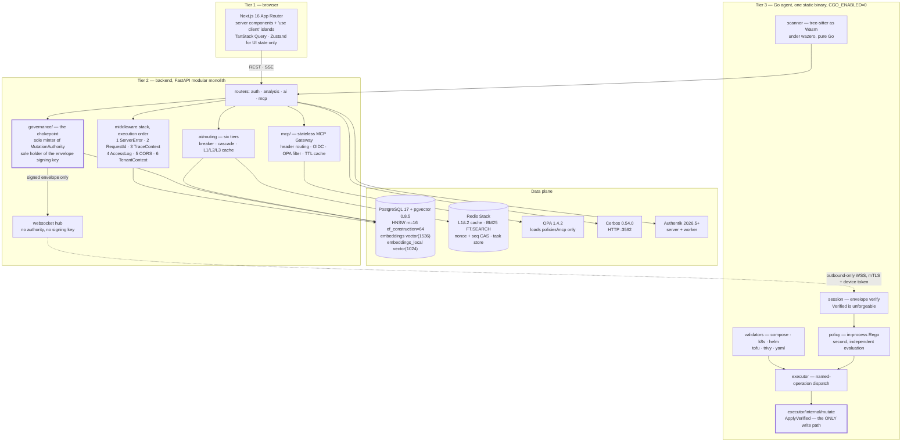
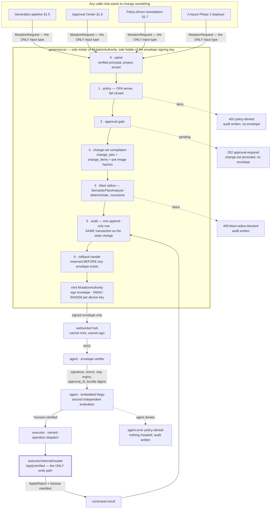

# ForgeOps — Learning Journal

| Field                  | Value                                                                                                                                                                                                    |
| :--------------------- | :------------------------------------------------------------------------------------------------------------------------------------------------------------------------------------------------------- |
| Snapshot date          | **2026-07-31**                                                                                                                                                                                           |
| Branch                 | `phase-1-implementation` (Phase 0 lives on `phase-0-implementation`, unmerged into `main`)                                                                                                               |
| Phase                  | Phase 1 — MVP Core: Analysis, Generation & Approval, `in-progress`                                                                                                                                       |
| Leaves reflected       | **38 of 166** Phase 1 task leaves implemented in the working tree; 2 recorded `blocked`. `PROGRESS.md`'s own table still reads 25 `done` because rows 5.1–6.4 are flipped in the commit that lands them. |
| Comprehension artifact | `docs/understand-anything/` (see chapter 1)                                                                                                                                                              |

This document teaches. It is not a changelog, not a status report, and never an
authority. Where it disagrees with `.kiro/specs/*/design.md`, `.kiro/specs/*/tasks.md` or
`PROGRESS.md`, those are right and this is wrong.

---

## 1. How to read this journal

**Who it is for.** Someone who has just been handed this repository and needs to hold an
informed conversation about it by the end of the day. It assumes you can read Python, Go
and TypeScript, and assumes nothing about this project.

**What each chapter does.**

| Chapter | What you get                                                                                      |
| :------ | :------------------------------------------------------------------------------------------------ |
| 2       | What the product is, in plain language, and why it has three tiers                                |
| 3       | The architecture, and the non-obvious choices inside it                                           |
| 4       | What Phase 0 built and the reproducibility discipline it established                              |
| 5       | The defect that reshaped every later decision. **Read this one even if you skip the rest.**       |
| 6       | Property-based testing as practised here, with worked examples                                    |
| 7       | Phase 1: what is being built now, and the hard parts                                              |
| 8       | The decisions that actually shaped the code, and what each rejected                               |
| 9       | Defects found in pre-existing code, grouped by pattern. This is where you learn to be suspicious. |
| 10      | Exactly where the work stands, as of the dated snapshot above                                     |
| 11      | Glossary                                                                                          |

**Where the authoritative documents live.**

Four read-only reference documents sit at the repository root and are never edited:
`PRD.md` (v2.0, 24 July 2026), `phases.md` (the six-phase plan), `Tech-Stack-Analysis.md`
(a technology-by-technology audit) and
`AI-Powered-DevOps-Platform-Complete-Technical-Research.md` (the research study whose §0
carries corrections that supersede its own later sections). They are excluded from every
mutating pre-commit hook and still scanned by Gitleaks.

Below them sit the specs, which are the _binding_ documents:
`.kiro/specs/phase-0-foundation/{design.md,tasks.md}` and
`.kiro/specs/phase-1-mvp-core/{design.md,tasks.md}`. `PROGRESS.md` is the durable progress
record, updated in the same commit as the work it describes. `REVIEW-PHASE-0.md` is an
untracked, append-only merge-gating review of the Phase 0 pull request; chapter 5 is mostly
about what it found.

`docs/development.md` is the project's build-rules home, `docs/architecture.md`,
`docs/api.md` and `docs/deployment.md` cover their titles, and `.kiro/steering/*.md` are
standing instructions that every agent session in this workspace inherits.

**The comprehension artifact.** `docs/understand-anything/` holds a knowledge graph of this
repository generated by the [Understand-Anything](https://github.com/Egonex-AI/Understand-Anything)
plugin, pinned at `v2.9.0`. It is a JSON graph of files, functions, classes, imports and
architectural layers, plus a dependency-ordered guided tour. To open it interactively you
need only Node.js ≥ 18:

```sh
npx https://github.com/Egonex-AI/Understand-Anything/releases/download/v2.9.0/understand-anything-viewer.tgz docs/understand-anything
```

That prints a tokenised `http://127.0.0.1:5173/?token=…` URL and serves the graph
read-only from local disk — no LLM calls, no network egress. What it shows: every analysed
file as a clickable node colour-coded by architectural layer, the import and dependency
edges between them, a plain-English summary per node, and a guided tour ordered so that
each step only depends on steps before it. `docs/understand-anything/README.md` records how
it was generated, what was in scope, and what was deliberately left out. The regeneration
command is in `docs/development.md` under "Comprehension artifact".

---

## 2. What ForgeOps is

ForgeOps is an AI DevOps engineer. Not an assistant that answers DevOps questions — a
system that does the work and then asks permission before it lands.

The PRD states the product in one sentence: a web-based system that "analyzes a developer's
local codebase, scores how production-ready it is, generates and applies missing DevOps
files (with user approval), deploys the application across multiple environments, manages
Docker and Kubernetes, monitors production, explains failures in plain language, self-heals
with guard-rails, learns from project history, and is operated through a web dashboard
connected to a lightweight local agent on the user's machine." The target user is a
developer or team without deep DevOps expertise, and an experienced team that is tired of
scaffolding the same Dockerfile for the eleventh time.

Phase 1 — the phase being built now — is the first five verbs of that sentence:

1. **Scan.** The agent walks your project directory, honouring `.gitignore` and
   `.dockerignore`, skipping binaries over 1 MB and `node_modules`, and detecting languages
   with a tiered strategy (package manager, then extension, then shebang, then content
   heuristics). It parses each file into an abstract syntax tree, chunks it along syntactic
   boundaries, and produces a **Codebase Index**: file-tree metadata, key file contents, and
   vector embeddings.
2. **Score.** A deterministic engine turns an inventory of roughly thirty checks into a
   0–100 **readiness score** across six weighted categories — Containerization 25, CI/CD 20,
   Orchestration 20, Env Config 15, Security 15, IaC 5 — and writes a plain-language report
   explaining every gap with why it matters. No LLM is involved in the number. The
   competitive research marks the readiness score as the one feature no competitor has at
   all.
3. **Generate.** Retrieval-augmented generation over that index produces Dockerfiles,
   Compose files, Kubernetes manifests, GitHub Actions workflows, Helm charts, OpenTofu
   modules, `.env.example` files and deployment docs.
4. **Validate.** Before you ever see the output, the agent runs it through real tools on
   your machine: `docker compose config`, JSON Schema validation, `kubectl --dry-run=server`
   against your actual cluster, `tofu validate` and `tofu plan`, `helm lint` and
   `helm template --validate`, a Trivy config scan. Failures loop back to the model, at most
   three times.
5. **Apply with approval.** Validated changes appear as diffs in the **Change Approval
   Center**. Nothing is written without an explicit approval, and what is written is written
   atomically with a timestamped backup, all-or-nothing.

The market gap the research identifies is not any one of those five. Code generators exist;
AI SRE tools exist; workflow platforms exist. What does not exist is one system that runs
the whole chain — analysis → scoring → typed change-set compilation → simulation → GitOps
deploy → monitoring → troubleshooting → learning. The research's conclusion is blunt: "The
risk is execution — not competition."

### The three-tier shape, and why

| Tier | What it is                                                                        | Where it runs                                    |
| :--- | :-------------------------------------------------------------------------------- | :----------------------------------------------- |
| 1    | Web frontend — dashboard, approval UI, generation surface                         | Browser, Next.js 16 + React 19                   |
| 2    | Backend — REST API, WebSocket hub, AI engine, policy engine, MCP gateway, secrets | Server, FastAPI + PostgreSQL 17 + pgvector       |
| 3    | Local agent — scanning, validation, file mutation, IaC execution                  | The developer's machine, single static Go binary |

The frontend talks to the backend over REST, SSE and WebSocket. The backend talks to the
agent over one WebSocket that **the agent always dials outward**.

The interesting question is not why there is a frontend and a backend. It is why tier 3
exists at all, when the backend could clone the repository and do the work server-side.
Three reasons, in increasing order of importance.

**The work is physically local.** Validation is the product's differentiator, and real
validation needs the real environment. `kubectl --dry-run=server` is not a schema check; it
asks _your_ API server whether _your_ admission webhooks, CRDs, quotas and field-pruning
rules accept this manifest. `docker compose config` needs a Docker daemon. `tofu plan` needs
your provider credentials and your state. None of that can be faked from a server that has
only your source code.

**Your code can stay on your machine.** The platform ships a self-hosted tier and a
BYO-key model, and the research elevates fully air-gapped operation to a first-class product
goal — the one thing every named competitor, all cloud-only, structurally cannot offer. The
agent is what makes that possible: it can run a local embedding model and a local LLM and
never open a socket to a vendor.

**The agent is the last line of enforcement, and it does not trust the backend.** This is
the load-bearing reason. The PRD lists eight non-negotiable security invariants; the fourth
is double policy evaluation, and the research states its consequence flatly: "Policy is
evaluated both server-side (before command is sent) and agent-side (before command is
executed). **The agent does not trust the backend.**" A compromised or simply buggy backend
can, at worst, send the agent bytes the agent refuses. That turns a deployment boundary into
a security boundary. The other seven invariants: outbound-only connectivity; named
whitelisted operations and never arbitrary shell; every mutation carries an approval id;
secrets encrypted at rest, redacted before any LLM sees them, injected only at deploy time;
backup before every mutation; atomic all-or-nothing change sets; and a path blocklist that
refuses `~/.ssh`, `~/.aws`, `.env` and `*.pem`.

Read the invariants again and notice that six of the eight are properties of tier 3. The
agent is not a remote hand. It is the part of the system that says no.

---

## 3. The architecture, explained



Everything above is either implemented today or named in `design.md` with a task leaf that
owns it. Chapter 10 says which is which.

### Outbound-only WSS

The agent dials the backend; the backend never dials the agent. `NFR-12` states it as a
mandatory requirement — "Agent has zero inbound ports" — and the research names its
reference implementations: Portainer's agent, GitLab Runner, Tailscale's NAT traversal.

What it buys: no firewall hole on a developer's laptop, no port forwarding, no reverse
tunnel to configure, NAT traversal for free, and — the part that matters — a backend breach
yields no inbound path to any user machine.

What it costs, because every choice here has a cost:

- **The agent owns liveness.** Reconnect is the agent's job:
  `delay = min(60s, 1s · 2^(n−1))` multiplied by uniform jitter in `[0.5, 1.5]`, with the
  attempt counter reset only after a successful `session.connect`. Heartbeat every 30 s,
  timeout at 90 s.
- **Offline behaviour becomes a feature you must build.** `NFR-18` requires the agent to
  queue work while disconnected. That single requirement produced D-41, one of the most
  carefully reasoned decisions in the project (chapter 8).
- **The backend must hold 10,000+ long-lived sockets** (`NFR-28`), which forces Redis
  pub/sub behind the hub for multi-replica broadcast and a WebSocket-aware ingress.
- **Protocol discipline instead of ad-hoc frames.** JSON-RPC 2.0 over WSS with nine message
  types, and mutations carried in a signed command envelope.

### The stateless MCP Gateway

MCP — Model Context Protocol — is how the platform reaches tools. The research's argument
for adopting it is leverage: there are thousands of public MCP servers, so building each
integration _as_ an MCP server means any agent framework can consume it, and switching
framework does not mean rewriting integrations.

ForgeOps puts a gateway in front of them, and the gateway is stateless in a specific,
useful sense: it holds no session, and it routes without parsing the body. Two headers do
the work — `Mcp-Method` and `Mcp-Name` — and `mcp/routing.py` reads only those. The
`tools/list` path deliberately never calls `request.body()`.

That ordering is the point. The pipeline is: **verify the token → route → filter by policy →
serve.** Authentication precedes routing, so an unauthenticated caller cannot enumerate the
server registry by probing names. Policy filtering precedes the upstream call, so a denied
`tools/call` does zero upstream work — a property (`P-05`) rather than an implementation
detail. The tool list is cached in Redis with a server-supplied TTL, and the cache has no
process-local expiry authority: `mcp/cache.py` uses `SET … px=` and gates reads on
`pttl > 0`, storing no timestamps of its own. That is what makes the cache correct across
replicas with skewed clocks.

Statelessness is why this works. Every replica can answer any request, because the only
state is in Redis and OPA.

### RFC 9457 everywhere

Every non-2xx backend response is an RFC 9457 problem document with content type
`application/problem+json`. Not most. Every one — `P-09` quantifies over all routes.

The interesting part is what Phase 1 added. Phase 0 passed `type` and `status` as
independent arguments at each raise site, so the same problem type could be a 401 in one
handler and a 403 in another. `type` is the one member RFC 9457 promises is stable and
machine-readable, so that made the stable member mean two things. `core/errors.py` now
carries a registry:

```python
class ProblemSpec(NamedTuple):
    status: int
    title: str

PROBLEM_REGISTRY: Final[dict[str, ProblemSpec]] = {
    "unauthenticated":            ProblemSpec(401, "Unauthenticated"),
    "idp-unavailable":            ProblemSpec(503, "Identity provider unavailable"),
    "forbidden":                  ProblemSpec(403, "Forbidden"),
    "authorization-unavailable":  ProblemSpec(503, "Authorization service unavailable"),
    # … 38 entries in total
}
```

`problem("forbidden")` takes its status from the registry, so a caller cannot disagree with
it; and `ProblemException.__init__` raises `ValueError` if a directly constructed status
contradicts the registry, because direct construction is exactly the path that would bypass
`problem()`.

Two entries are not error statuses at all and are registered anyway so the body shape stays
uniform: `approval-required` is 202 and `iteration-bound-exhausted` is 200 — both carry a
real payload.

One more detail worth internalising, because it is a security control disguised as an error
format. `forbidden_problem()` takes **no arguments**:

```python
FORBIDDEN_DETAIL: Final[str] = "You do not have permission to perform this action."
```

A 403 that says "no such project" for an unknown id and "forbidden" for one you may not see
is an enumeration oracle: the difference tells an attacker which ids exist. So the detail is
a fixed string and there is nothing for a caller to vary. `Q-20` asserts the body is
byte-identical whether or not the resource exists.

And `_sanitize_detail` suppresses the **whole** detail — returns `None` — on any match
against eight leak patterns (bearer tokens, `postgresql://`, `redis://`, `sk-`, `sk-ant-`,
`xai-`, PEM headers, `Traceback (most recent call last)`). Partial masking would leave the
shape of the secret; suppression leaves nothing.

### Constructor injection in Go

There is no `func init()` anywhere in `agent/`, no package-level mutable state, and no
dependency-injection framework. `app.New(cfg, buildInfo)` builds the entire graph by hand
and returns it. The research's recommendation was explicit — constructor injection over
`wire` or `uber-fx`, for startup time and binary size.

The consequences are more interesting than the choice:

```go
a.closers = []namedCloser{
    {"connection", conn.Close},
    {"mcp", mcpSrv.Close},
    {"logger", func() error { return logger.Sync() }},
}
```

Closers are registered in construction order and walked in **reverse** on shutdown, with
`errors.Join` accumulating so one failing closer does not abort the rest, and a `sync.Once`
making `Close` idempotent. The whole sequence is bounded by `cfg.ShutdownTimeout`: the loop
runs in a goroutine and `Close` selects on the deadline, abandoning a stuck closer because
the process is exiting anyway. That is property `P-07`, and chapter 9 explains why its
timeout clause was worthless for most of Phase 0.

Constructor injection also has a cost that this project paid in full: because collaborators
arrive as constructor arguments and calls dispatch dynamically, **neither a type checker nor
a coverage report can tell you the graph is wired correctly**. Chapter 5 is about the day
that bill came due.

### pgvector with HNSW

Embeddings live in the same PostgreSQL that holds the relational data, not in a dedicated
vector database. The research's case: no extra infrastructure, ACID transactions spanning
relational _and_ vector writes, SQL instead of a bespoke API, one `pg_dump` to back up
everything. The stated ceiling is roughly 50 million vectors, and a separate vector store
before that is called premature optimisation. The hidden cost is recorded too: 50 M vectors
at 1536 dimensions is on the order of 300 GB of RAM.

The index is HNSW — Hierarchical Navigable Small World — with `m=16` and
`ef_construction=64`, using `vector_cosine_ops`. HNSW builds slowly and queries in
single-digit milliseconds at 99 %+ recall; IVFFlat builds fast and gives up recall. For
user-facing search the trade goes one way, and `phases.md` makes it a checklist item:
"Default to HNSW (not IVFFlat)."

Recall is tuned per query with `hnsw.ef_search`, and how that is done is a story in itself
(chapter 9, defect 1). The production helper is:

```python
async def with_ef_search(session: AsyncSession, ef_search: int) -> None:
    await session.execute(
        text("SELECT set_config('hnsw.ef_search', :value, true)"),
        {"value": str(int(ef_search))},
    )
```

`set_config(name, value, true)` with `true` meaning transaction-local. Not `SET LOCAL`,
which cannot take a bind parameter — the reason that matters is chapter 9's opening lesson.
Transaction scope is not cosmetic: under PgBouncer transaction-mode pooling, a session-level
`SET` would leak a tuning knob onto whichever connection the next request borrows.

### The six-tier model router

Frontier model pricing spans two orders of magnitude, so the router's job is to spend the
least money that still answers the question. Six tiers:

| Tier id         | Purpose                                      |
| :-------------- | :------------------------------------------- |
| `high_coding`   | multi-file generation, architecture          |
| `high_analysis` | deep reasoning over large context            |
| `medium`        | Dockerfiles, CI configuration, analysis      |
| `medium_value`  | cost-sensitive bulk work, the advisory judge |
| `low_logs`      | log analysis, formatting                     |
| `self_hosted`   | air-gapped and sensitive codebases           |

Three mechanisms make it survivable in production.

**A circuit breaker per endpoint.** Five failures inside 30 seconds trips it OPEN; after 60
seconds it goes HALF-OPEN and admits a single probe; success closes it, failure re-opens it.
Without it, a provider outage costs you one full timeout per request instead of one fast
failover.

**A fallback cascade.** Primary → cross-vendor → self-hosted → **Safe Default Template
Library**. Read the last rung carefully: the cascade does not terminate in an error, it
terminates in a deterministic, pre-verified artifact. `ModelRouter` returns
`RoutingOutcome.EXHAUSTED` as _data_, and Phase 0 reserved a `TerminalFallback` slot for
exactly this; Phase 1 drops the template library into that slot without modifying the router
(D-43).

**A tiered semantic cache.** L1 is an exact-match hash of the prompt; L2 is Redis vector
search above 0.95 similarity; L3 caches common prefixes such as system prompts. The research
adds a reframing that turns an optimisation into an architectural component: treat the L2
cache as a **fallback layer during a provider outage** — serve the closest cached response
with a staleness flag, so the platform degrades instead of stopping.

The router also carries a Redis/Lua token-bucket rate limiter on the expensive completion
seam, and BYO-key resolution so each tenant's keys are used for their own work.

---

## 4. Phase 0: building the foundation

A foundation phase builds no features. Its output is the ability to build features
predictably: a repository whose builds are reproducible, whose tests run in CI, whose
dependencies are pinned by hash, and whose artifacts can be proved to come from a specific
commit. `phases.md` says it plainly — "No features yet — just infrastructure."

Phase 0 delivered nine groups, all recorded `done` across 41 rows in `PROGRESS.md` (with the
narrative claiming 108 executable leaves, a figure the file does not decompose):

| Group                         | Delivered                                                                                                                                                                                                                |
| :---------------------------- | :----------------------------------------------------------------------------------------------------------------------------------------------------------------------------------------------------------------------- |
| 0.1 Repository structure      | monorepo layout, two-licence split, `.env.example` + idempotent `init-env.sh`, pre-commit, `Makefile` with 26 targets, four `docs/` files, default Compose profile                                                       |
| 0.2 Go agent scaffold         | module, pinned deps, config/logging/telemetry/fileops/watcher primitives, WSS transport, docker and k8s probes, `internal/app` composition, Cobra CLI, GoReleaser + Cosign + Syft + SLSA                                 |
| 0.3 Python backend scaffold   | exact pins and hash-pinned locks, config/logging/RFC 9457/trace/task seam, async engine and session, three SQLModel tables, `0001_initial` with pgvector HNSW, app factory, health and readiness, multi-stage Dockerfile |
| 0.4 Next.js frontend scaffold | exact pins, committed lockfile, shadcn primitives, providers, Zustand UI store, RFC 9457-aware API client, validated public env contract, accessible shell, Vitest + Playwright + k6                                     |
| 0.5 MCP Gateway               | registry, header routing, OIDC verification, Rego policy, Redis TTL cache, `tools/list` and `tools/call`, Tasks extension state machine, MCP Apps sandbox                                                                |
| 0.6 GitOps workflow           | Git/PR contracts, `TokenSource` seam, branch → commit → push → PR → poll                                                                                                                                                 |
| 0.7 Plan Analyzer             | validation pipeline with syntax and schema stages, deterministic destructive-action and blast-radius analysis, approval seam, `POST /api/v1/analysis/plan`                                                               |
| 0.8 OpenTofu switch           | bounded runner with streaming and signal propagation, env isolation, null-provider fixture, six-platform lock, devtools image                                                                                            |
| 0.9 Model routing             | six tiers, endpoint adapter and registry, circuit breaker, tiered cache, BYO-key resolvers, Redis/Lua bucket, fallback cascade                                                                                           |

### The discipline that made it reproducible

Four kinds of pinning, each closing a different hole.

- **Exact version pins, no ranges.** `pyproject.toml`, `go.mod` and `package.json` name
  exact versions. `frontend/__tests__/package-policy.test.ts` asserts it as a _test_ rather
  than trusting a convention — no `^`, no `~`.
- **Hash-pinned lockfiles.** `requirements.lock` and `requirements-dev.lock` carry hashes,
  and installs run `pip install --require-hashes`. A matching version with different bytes
  fails. `scripts/check-lock-freshness.sh` regenerates both in an isolated copy and fails on
  any diff.
- **Digest-pinned images.** Every Compose image carries `@sha256:…`. A tag is a mutable
  pointer; a digest is not.
- **SHA-pinned GitHub Actions.** Every `uses:` names a full 40-hex commit with the version
  in a trailing comment. `ci.yml` states the reasoning inline: "tags are mutable, SHAs are
  not."

### The chain of custody, link by link

Phase 0's release pipeline produces artifacts a third party can verify without trusting the
project. Each link proves something specific, and it is worth knowing exactly what:

| Link                                                              | What it does                                                                                                          | What it actually proves                                                                                                                                            |
| :---------------------------------------------------------------- | :-------------------------------------------------------------------------------------------------------------------- | :----------------------------------------------------------------------------------------------------------------------------------------------------------------- |
| **GoReleaser**                                                    | builds six targets (linux/darwin/windows × amd64/arm64) with `CGO_ENABLED=0`, `-trimpath` and a fixed `mod_timestamp` | that the same source produces the same bytes — `-trimpath` removes machine-specific paths, the timestamp removes build-clock variance                              |
| **Syft**                                                          | emits a CycloneDX SBOM per artifact                                                                                   | _what is inside_ the binary — a component inventory you can later match against a vulnerability feed                                                               |
| **Cosign** (keyless, via Fulcio)                                  | signs each artifact and SBOM using an ephemeral certificate bound to the CI workflow's OIDC identity                  | _who built it_ — the certificate says "this came from `release.yml` at `refs/tags/v*` in this repository", with no long-lived signing key to steal                 |
| **Rekor**                                                         | appends each signature to a public transparency log                                                                   | _that the signature is not backdated or private_ — an inclusion proof means the signature existed at a point in time and cannot be quietly replaced                |
| **SLSA provenance** (`cosign attest-blob --type slsaprovenance1`) | signs an in-toto statement describing the build                                                                       | _how it was built_ — the predicate names the builder, the source commit and the resolved dependencies, and `--check-claims=true` binds it to the artifact's digest |

For `v0.0.1-rc3` the recorded evidence is 94 release assets, 21 `sign-blob` plus 10
`attest-blob` Rekor entries, and eleven consecutive `Verified OK` lines from
`cosign verify-blob` against an anchored identity regexp. All 94 assets were later
downloaded to a workstation and re-checked off-runner: checksums 10/10, SBOMs 10/10 parsing
as CycloneDX, and all ten SLSA attestations verifying **offline** from their Sigstore
bundles — which works even though Rekor is unreachable from that network, because the
inclusion proof travels inside the bundle. The published Windows binary self-reports the
tagged commit, so source, provenance and shipped bytes agree.

Two honest asterisks, both recorded rather than hidden. `cosign verify-blob` cannot run on
that workstation at all: the network presents a TLS-intercepting certificate valid for
`*.airtel.com`, so any path requiring a Rekor _search_ fails locally — which is why
criterion 16 is proven inside the runner. And GitHub's native artifact attestation is
unavailable for user-owned private repositories, so that step is wired, gated on
`repository.private == false`, and reports `skipped` (D-20). The cost is written down: the
cosign attestation is not discoverable through GitHub's attestations API, and its predicate
is asserted by the workflow's own OIDC identity rather than issued by GitHub's attestation
service.

Phase 0 closed with all 18 completion criteria carrying evidence and all fifteen properties
`P-01`…`P-15` present and passing. And then it was reviewed.

---

## 5. The lesson that shaped everything after it

On 2026-07-30 a merge-gating review of the Phase 0 pull request reached this verdict:

> ### DO NOT MERGE — in this state.
>
> Not because tests fail, but because the green checks are not measuring the thing they
> claim to.

The headline number: **419 passing backend tests over an MCP gateway that could not serve a
single request.** Not slowly, not partially. `POST /api/v1/mcp` with a valid token returned
HTTP 500 for `tools/list`, `tools/call` and `tasks/create` — the three things deliverable
0.5 exists to do — in the container `docker compose up` actually starts.

### The break

`main.py` composes the gateway with the real collaborators and stores it on
`app.state.mcp_gateway`; `mcp/routes.py` reads exactly that object. So the broken
composition _is_ the served route. Four call sites disagreed with their callees:

| Caller                                                                                                                                   | Callee                                                                                               | Result                                                                                      |
| :--------------------------------------------------------------------------------------------------------------------------------------- | :--------------------------------------------------------------------------------------------------- | :------------------------------------------------------------------------------------------ |
| `gateway.py` calls `filter_tools(server=…, tools=…, claims=…, blast_radius=…)`                                                           | `policy.py` defines `filter_tools(self, tools, *, subject, context=None)`                            | `TypeError` on every `tools/list`                                                           |
| `gateway.py` calls `authorise_call(server=…, tool=…, metadata=…, claims=…, blast_radius=…)`                                              | `policy.py` defines `authorise_call(self, *, tool_name, subject, arguments=None, context=None)`      | `TypeError` on every `tools/call`                                                           |
| `gateway.py` does `(await upstream.list_tools(route.server)).get("tools", [])`, then `cache.put(name, tools, ttl_ms)` with `ttl_ms=None` | `list_tools` returns a `list`; `TtlToolCache.put` starts with `min(server_ttl_ms, self._max_ttl_ms)` | `AttributeError` on `list.get`; `TypeError: '<' not supported between 'NoneType' and 'int'` |
| `routes.py` calls `store.create(kind=…, owner="default")`                                                                                | `tasks.py` defines `create(self, *, tool_name, arguments=None)`                                      | `TypeError` on every task create                                                            |

The review proved this without starting the stack, by binding each call site against the
real class with `inspect.signature(...).bind(...)`:

```
BIND FAIL policy.filter_tools(server=,tools=,claims=,blast_radius=)   -> missing a required argument: 'subject'
BIND FAIL policy.authorise_call(server=,tool=,metadata=,claims=,...)  -> missing a required keyword-only argument: 'tool_name'
BIND FAIL RedisTaskStore.create(kind=..,owner=..)                     -> missing a required keyword-only argument: 'tool_name'
```

A second, independent break sat underneath it: the backend queried OPA at
`/v1/data/forgeops/mcp/{filter_tools,allow_call}`, while `policies/mcp/gateway.rego` declares
`package mcp.gateway` with rules `filter` and `allow`. OPA answers an _undefined_ document
with HTTP 200 and no `result` key, so `raise_for_status()` never fired,
`result.get("result", [])` yielded `[]` and `result.get("result", False)` yielded `False`.
Every `tools/list` returned an empty list and every `tools/call` returned 403 — and that is
**indistinguishable from a correctly working fail-closed policy**. The tests that celebrated
fail-closed behaviour were celebrating a wiring bug.

### The mechanism that hid it

This is the part to understand properly, because it generalises far beyond this repository.

`unittest.mock` lets you constrain a double to an interface:

```python
policy = AsyncMock(spec=OpaGatewayPolicy)
```

With `spec=`, the mock rejects attribute names the real class does not have, and — the part
that matters — calls to its child attributes are checked against the real method
signatures. `policy.filter_tools(bogus=1)` raises `TypeError`. That is a genuine contract
check, and it is why `spec=` is worth using.

Then the test did this:

```python
policy = AsyncMock(spec=OpaGatewayPolicy)
policy.filter_tools = AsyncMock(side_effect=lambda **kwargs: kwargs.get("tools", []))
policy.authorise_call = AsyncMock(return_value=None)
```

The second line **replaces the spec'd child with a brand-new, unconstrained mock**. `spec=`
constrains the parent's attribute _set_; it does not make the attributes immutable. Assigning
over `filter_tools` discards the signature-validating child entirely, and the replacement's
`**kwargs` swallows any keyword names at all. So `server=`, `claims=` and `blast_radius=` —
names the real `filter_tools` has never accepted — were absorbed in silence.

The doubles therefore encoded the contract the _caller wanted_, and the real collaborators
implemented a different one. Every test passed. The same construction appeared in three
files, and `grep -rn "McpGateway(" backend` found exactly four composition sites: `main.py`
and those three tests. **No test anywhere composed `McpGateway` with the real
`OpaGatewayPolicy`, `TtlToolCache` and `McpUpstream`.**

Why neither type checking nor coverage could see it, in the design's own words:

> Neither type checking nor coverage could see it, because collaborators arrive by
> constructor injection and the call sites dispatch dynamically.

Unpack both halves. A type checker sees `self._policy.filter_tools(...)` where `_policy` came
in as a constructor parameter; unless that parameter is annotated with a concrete type _and_
the checker is run in a mode that resolves it, the call is a dynamic attribute access on a
duck-typed object. There is nothing to contradict. Coverage is worse than unhelpful here —
it was actively misleading. The broken lines in `gateway.py` were **covered**. They ran, in
tests, thousands of times. They just ran against objects that accepted anything. Coverage
measures which lines executed; it cannot measure whether the thing they executed against
resembles production. The Phase 1 design says it in one sentence: "Coverage bounds the
untested surface; §0.4 bounds the _falsely_ tested surface."

### What it cost

Two completion criteria (10 and 11) had been marked `done` in `PROGRESS.md` on the strength
of route registration plus those tests. Of eighteen criteria, the review concluded that 13
stood up, 2 were actively not met, and 3 were unverified or ungated. Five P1 merge blockers.
The most expensive item is not on that list: the project's entire quality signal had to be
re-examined, because the question "which of our other green checks are measuring something
adjacent to the claim?" had no cheap answer. Chapter 9 is the answer, and it is long.

There is a second-order cost worth naming. `P-05` asserts that a denied call performs zero
upstream work. It passed — trivially, because _no_ call ever reached the upstream. A
property proved against a fake whose interface differs from production is a property proved
about code that does not run.

### The regime built in response

D-23 records the lesson. `.kiro/specs/phase-1-mvp-core/design.md` §0.4 turns it into five
normative clauses, each naming its enforcing mechanism and the CI job that runs it. This is
the most important section of the Phase 1 design.

**Clause 1 — wiring tests over the real object graph.** Every component composed in
production has at least one test that instantiates the _real_ collaborators exactly as
`create_app()` or `app.New()` does. The mechanism is a fixture derived from the production
factory, so the test cannot drift from production wiring:

```python
@pytest.fixture
async def production_app(monkeypatch, capability) -> AsyncIterator[FastAPI]:
    """Build the app through the PRODUCTION factory, substituting only I/O edges.

    … this fixture may substitute a *transport* (httpx.MockTransport, a local fixture
    HTTP server, a Redis or Postgres URL pointing at a container) but it may NEVER
    substitute a collaborator object. If a test needs a different OpaGatewayPolicy, the
    answer is a different OPA policy file, not a different Python object …
    """
    app = create_app()                      # the same callable uvicorn runs
    async with LifespanManager(app):
        yield app
```

The distinction between substituting a _transport_ and substituting a _collaborator_ is the
whole lesson compressed into one rule. And coverage of the clause is itself derived rather
than hand-maintained: `test_wiring_coverage.py` reads the attributes the lifespan places on
`app.state`, collects `@wires("…")` declarations from the integration tests by AST walk, and
asserts `composed <= covered`. A newly composed collaborator cannot arrive untested. The Go
side has `TestWiring_RealGraph` through `app.New` and `TestWiring_CoversEveryCloser`.

**Clause 2 — signature conformance, with a self-maintaining inventory.** The cheap guard the
review asked for, generalised. `scripts/collect_call_sites.py` AST-walks
`backend/src/**/*.py` and yields every cross-component call site as
`(module, line, target_class, method, args, kwargs)`; `test_contract_conformance.py`
parametrises over that and calls `inspect.signature(...).bind(...)` on each. It runs in
milliseconds and needs no services. `INVENTORY_FLOOR` is a committed integer that may only
be raised — which is what stops a refactor from quietly emptying the inventory and making
the clause vacuous. On the Go side, `var _ Iface = (*Impl)(nil)` assertions in
`contract_test.go` files, with `scripts/check-go-interface-assertions.sh` proving the
assertions _exist_, because a compile-time assertion cannot rot but it can be absent.

**Clause 3 — signature-enforcing doubles, enforced by tooling.** Ruff cannot express this
rule, so `scripts/check-test-doubles.py` is an AST lint over `backend/tests/**` with four
codes:

| Rule       | Detects                                                                                                                                                          | Why                                                                     |
| :--------- | :--------------------------------------------------------------------------------------------------------------------------------------------------------------- | :---------------------------------------------------------------------- |
| `FO-TD001` | assignment to an attribute of a name bound from `Mock(spec=…)` / `AsyncMock(spec=…)` / `MagicMock(spec=…)` / `create_autospec(…)` where the value is a bare mock | the exact Phase 0 defect (D-23)                                         |
| `FO-TD002` | `Mock(spec=X)` or `create_autospec(X)` without `spec_set=True`                                                                                                   | `spec_set` also rejects _new_ attribute names, closing the sibling hole |
| `FO-TD003` | `patch.object(..., autospec=False)`, or `patch(...)` without `autospec=True`, on a project-owned target                                                          | a patch without autospec is a reassignment by another name              |
| `FO-TD004` | `Mock` used at all under `tests/integration/**`                                                                                                                  | integration tests substitute transports, not objects                    |

Two details show the care. Suppression requires `# noqa: FO-TD00N — <reason>`, and a
suppression without a reason is itself `FO-TD001`. And the lint has its own tests:
`backend/tests/meta/fixtures/bad_double.py` must be flagged, `good_double.py` must not, and
`test_every_rule_fires_at_least_once` is parametrised over the codes — because "a lint whose
own tests are missing is a lint nobody trusts."

**Clause 4 — no silent skips.** A test skipped behind an environment variable that CI never
sets is a defect, not a gap. `require_capability` skips locally but **fails** when
`FORGEOPS_REQUIRE_INTEGRATION=1`, which CI sets, over eleven registered capabilities
(`postgres`, `redis`, `opa`, `cerbos`, `oidc`, `kubernetes`, `tofu`, `trivy`, `infisical`,
`agent_binary`, …). Then `scripts/check-no-skips.py` consumes a `pytest --report-log` JSONL
or `go test -json` stream and fails on any skip in the mandatory selection. Three design
choices in that sentence are load-bearing: the input is the report log, so the check cannot
disagree with what actually ran; the selection is defined by **marker, not path**, so moving
a file cannot drop it; and the script exits 1 if the mandatory selection is **empty**,
because a selector matching nothing would otherwise pass forever.

**Clause 5 — non-vacuity, with an executable negative control per property.** Every property
ships with the specific mutation that must make it fail. `backend/tests/mutation/mutations.toml`
declares them:

```toml
[Q-08]
property    = "backend/tests/property/test_q08_iteration_bound.py"
target      = "src.generation.loop.FeedbackLoop._next"
mutation    = "return replace(state, attempts_remaining=state.attempts_remaining)"  # never decrements
description = "removes the decrement that guarantees termination"
```

`scripts/mutation-harness.py` then: creates a temp directory with `tempfile.mkdtemp()`,
asserting it is outside the repository by comparing resolved paths; writes one pytest plugin
per mutation that applies it with `monkeypatch` at session start; runs
`pytest <property file> -p <plugin>`; **asserts the run fails, and reports `VACUOUS` if it
passes**; then removes the temp directory. Go properties use build-tagged variants compiled
through a `go build -overlay`, never by editing a tracked file. The job fails if any row is
`VACUOUS`, if `mutations.toml` lacks a row for any `Q-` id in Appendix B, or if the working
tree is dirty afterwards.

This technique is not invented — it is the review's own Pass 8 experiment, promoted to a CI
job. The review had loaded a pytest plugin from the OS temp directory that emptied both
redaction pattern lists, and observed:

```
pytest tests/unit/test_errors.py -p fo_break_redaction -q
  -> 6 FAILED   => these assertions are NON-VACUOUS
pytest tests/property/test_p09_rfc9457.py -p fo_break_redaction -q
  -> 13 passed  => P-09's secret clause is NOT encoded by this file
```

Thirteen tests stayed green with redaction _completely disabled_. `P-09` claimed to assert
that a problem `detail` never matches a secret pattern; the 500 handler emits a fixed
generic detail, so the sanitiser was never on the asserted path. The clause was decorative.
D-27 repaired it, and `Q-24` extends it to audit records and agent-side logs.

Read the two experiments together. The same technique, applied to two files, said "this one
is real" and "this one is theatre" — and no other tool in the project could tell them apart.
That is why non-vacuity is a CI job now.

**What the regime deliberately does not do.** It does not add a coverage ritual on top of
itself. Coverage _is_ a Phase 1 gate at ≥70 % per component (D-31), but the design is
explicit that "Phase 0 proved coverage cannot see this class of defect at all — the broken
gateway code was covered." Both gates run and neither is described as sufficient.

---

## 6. Property-based testing here

A **unit test** picks an input and asserts an output. A **property** states something that
must be true for _all_ inputs in a class, and the framework generates inputs trying to break
it — `hypothesis` in Python, `pgregory.net/rapid` in Go, `fast-check` in TypeScript. When it
finds a counterexample it shrinks it to the smallest failing case.

That difference matters here for one reason: the invariants this project cares about are
universally quantified in their natural statement. "Every non-2xx response is an RFC 9457
problem document." "No mutation happens without a signed envelope." "An incrementally
maintained index equals a full rescan." You cannot express those as three examples without
losing the claim.

Phase 0 defined `P-01`…`P-15`; Phase 1 uses a fresh prefix, `Q-01`…`Q-31`, so no id is ever
reused or renumbered, and Phase 0's fifteen keep running unchanged. Forty-six in total.
Twenty-four `Q-` rows are starred, marking behaviour that is easy to get subtly wrong and
expensive to discover late. (The appendix's own prose says twenty-one; the table has
twenty-four. The table is the data.)

Two features distinguish these from ordinary tests.

**They are indexed and traceable.** A property has an id, a target module, a library, and a
task leaf that owns writing it. Appendix E's completion criteria cite them. `PROGRESS.md`
records where each lives. You can ask "what asserts that?" and get a file path.

**Every one carries a negative control.** The mutation that must make it fail is declared
next to it, and CI runs it. This is the direct inheritance from chapter 5: a property whose
subject you can break while the property still passes is not a property, and the only way to
know which kind you have is to break it on purpose.

### Worked example 1 — `Q-08`, the generation loop terminates

**The property.** For every sequence of validation outcomes, the generation loop performs at
most 3 model calls and terminates with `Accepted`, `TemplateFallback` or `Unavailable`, and
`attempts_remaining` decreases strictly on every `Continue`.

**Why it needs to be a property.** The loop's shape is "call the model, validate, feed the
failures back, repeat". Every unbounded-retry bug in history looks locally correct. What you
want to assert is not "three attempts work" but "no reachable sequence of outcomes produces
a fourth call", and the outcome sequence is exactly the thing to generate.

**The implementation, and how it makes termination structural rather than conventional:**

```python
@dataclass(frozen=True, slots=True)
class LoopState:
    attempts_remaining: int          # invariant: 0 <= attempts_remaining <= 3
    findings: tuple[Finding, ...]
    artifacts: ArtifactSet | None

Step = Continue | Accepted | FallbackToTemplate       # a closed union; no other outcome exists

    def _next(self, state: LoopState, decision: GateDecision) -> Step:
        if not decision.blocked:
            return Accepted(state.artifacts)
        if state.attempts_remaining <= 1:               # this attempt was the last
            return FallbackToTemplate(reason="iteration-bound-exhausted")
        return Continue(replace(state, attempts_remaining=state.attempts_remaining - 1,
                                findings=tuple(decision.blocking_findings)))
```

`_next` is the only function that produces a new `LoopState`; it always decrements; and it
cannot return `Continue` at zero because the branch that would is unreachable. There is no
`while True`, no counter a caller can reset, and the bound is not configurable — `Settings`
types it as `Literal[3]`, so an operator who sets `GENERATION_MAX_ITERATIONS=10` gets a
config that refuses to load rather than a quietly widened safety bound. Migration `0008`
carries the same bound as a `CHECK (iterations_used BETWEEN 0 AND 3)`. Three independent
expressions of one invariant, which the design defends: "what makes a regression impossible
to ship quietly."

Note the `<= 1` rather than `<= 0`. Entering `_next` means an attempt has already been
consumed, so one remaining means there is nothing left to spend. The design calls this "the
sort of off-by-one that a property catches and a reviewer does not" — and it is right: read
it again and check that you believed `<= 0` on first pass.

**The negative control.** Make `_next` return `Continue` without decrementing. If `Q-08`
still passes, the property is not testing termination.

### Worked example 2 — `Q-13`, no cache key is ever computed over unredacted text

**The property.** For every prompt: every cache key is computed over a `RedactedPrompt`; no
cached completion is retrievable using unredacted text; no cache entry's stored key material
contains a synthetic secret.

**Why it needs to be a property.** `NFR-10` says no secrets in LLM context. The obvious
implementation is "call the redactor before building the prompt", which is a procedure, and
procedures get forgotten in the one code path added under deadline. What you want is for
forgetting to be impossible.

**The mechanism is the type system, not a check.**

```python
RedactedPrompt = NewType("RedactedPrompt", str)     # constructible only via secrets.redaction

def assemble_prompt(
    *,
    system: SystemBlock,
    chunks: Sequence[RedactedChunk],
    instruction: RedactedInstruction,
) -> RedactedPrompt:
    """The ONLY function in the codebase that builds an LLM prompt.

    Every parameter is a type that only secrets.redaction can produce. There is no
    overload taking `str`, so "forgetting to redact" is not a mistake a caller can
    make — it is a call that does not type-check and does not bind. The RAG retriever
    cannot bypass this because it returns RedactedChunk and nothing else: the store
    contains only redacted text.
    """
```

Then `TieredSemanticCache.lookup` and `.store` take `RedactedPrompt` rather than `str`
(D-44). Two consequences follow _mechanically_: a cache key cannot be computed over
unredacted text, and a cached completion is unreachable from an unredacted prompt, because no
code path can produce the key.

**The negative control.** Widen `lookup`/`store` back to `str`. `Q-13` must fail. Note what
that control tests — not whether redaction works, but whether the _type discipline_ is what
the property depends on. If `Q-13` still passed with a `str` signature, it would be asserting
something about a particular call site instead of about the whole surface.

`Q-12` is the sibling: add a `str` overload to `assemble_prompt` and the property must fail.

### Worked example 3 — `Q-10`, incremental equals full

**The property.** For every edit sequence — creates, modifies, deletes, renames, import
changes, cycles — over a generated project, the incrementally maintained index **equals**
`FullRescan(final_tree)`: same chunks, same edges, same summary invalidation, no orphans.

**Why the equality framing is the whole design.** Incremental indexing is an optimisation
whose failures are silent. A stale chunk does not throw; it just feeds slightly wrong context
into a generation and degrades an answer nobody can trace back. D-33's reasoning: "an
incremental index that is merely 'usually right' silently degrades every downstream
generation." So correctness is _defined_ as equality with the expensive path, which makes the
property a differential test — and differential tests are the strongest kind you can write
when you already have a slow reference implementation.

**The rule under test, stated exactly rather than described:**

```
dirty = changed
      ∪ { f : f imports g, g ∈ changed, exports(g) differs from before }
      ∪ { f : imports(f) differs from before }            // f's own edges moved
      ∪ { f : f imports g, g ∈ deleted }                  // dangling edges
```

with module summaries invalidated for everything in `dirty` plus every file that directly
imports a member of `dirty`, because a summary describes a file in the context of its
imports. Cycles terminate because the closure is a fixed point over a visited set. And note
what it deliberately does _not_ do: it does not take a full transitive closure. An
implementation-detail edit that leaves a file's exported surface identical does not dirty its
dependants — "which is what makes incremental scanning worth doing at all."

**The negative control.** Drop the `Dependants(deleted)` term from the dirty set. Now
deleting a file leaves dangling edges in the index, and the property must catch it.

That control is well chosen because it is the term a reasonable engineer would omit. The
first three terms are about _change_; the fourth is about _absence_, and absence is the case
people forget.

---

## 7. Phase 1: what is being built now

Eleven deliverables, fourteen completion criteria, 166 task leaves. The deliverables:

| #    | Deliverable                         | In one line                                                                                                                                |
| :--- | :---------------------------------- | :----------------------------------------------------------------------------------------------------------------------------------------- |
| 1.1  | Agent pairing & connection          | JSON-RPC 2.0 over outbound WSS, mTLS + device token, 6-character pairing code, signed command envelopes, named-operation whitelist         |
| 1.2  | Multi-project workspace             | project CRUD, GitHub import, settings, tags, activity feed                                                                                 |
| 1.3  | Codebase analysis engine            | language detection, tree-sitter AST, cAST chunking, embeddings, pgvector HNSW, watch mode, dependency-graph-aware incremental rescan       |
| 1.4  | Deployment readiness analysis       | deterministic weighted scoring over six categories, plain-language report, radar chart                                                     |
| 1.5  | AI generation & validation pipeline | hybrid retrieval, six-tier routing, structured artifacts, blocking gate vs advisory rubric, bounded loop, SSE streaming, template fallback |
| 1.6  | Change Approval Center              | change-set state machine, diff preview, approval, atomic apply, rollback handles                                                           |
| 1.7  | Policy engine                       | governance Rego bundle, backend client, bundle digest and publication, agent-side in-process evaluator, policy CRUD and dry-run            |
| 1.8  | Secret management                   | agent-side scanning and redaction, the backend redaction chokepoint, Infisical store, deploy-time injection                                |
| 1.9  | Audit logging                       | append-only hash-chained `audit_events` with database-enforced immutability                                                                |
| 1.10 | Agent Governance Control Plane      | the single chokepoint every mutation traverses, plus SPIFFE/SPIRE workload identity                                                        |
| 1.11 | Auth integration                    | Authentik, OIDC authorization-code + PKCE, sessions, Cerbos RBAC, device tokens                                                            |

Four of these are genuinely hard. Here they are.

### The Governance Control Plane: a chokepoint where bypass is a compile error

The research calls this the project's biggest architectural gap and its "trust moat": policy,
approval, audit, change-set compilation and rollback unified as **one enforced chokepoint** in
front of every mutating action. No agent framework ships it. It is what lets an organisation
allow an AI to change infrastructure.

"Enforced" is the word doing the work. A chokepoint that is merely documented is a
convention, and chapter 5 is a 419-test demonstration of what conventions are worth. So the
design supplies three independent enforcement mechanisms and states the principle: "Design
intent is not enforcement. These three are."



**Mechanism 1 — a capability type only the control plane can mint (Python).** Every mutation
primitive takes a `MutationAuthority` as a required argument, and the type cannot be
constructed outside `governance/`:

```python
_MINT_SENTINEL = object()          # module-private; never exported, never re-exported

@dataclass(frozen=True, slots=True)
class MutationAuthority:
    change_set_id: uuid.UUID
    approval_id: uuid.UUID
    policy_bundle_digest: str
    blast_radius: BlastRadius
    audit_seq: int
    envelope_digest: str
    _sentinel: InitVar[object]

    def __post_init__(self, _sentinel: object) -> None:
        if _sentinel is not _MINT_SENTINEL:
            raise TypeError(
                "MutationAuthority may only be minted by governance.chokepoint; "
                "see design §2.2.1 and Q-03"
            )
```

Note _where_ the enforcement lives. The design contrasts the two options directly: "A check
inside the primitive can be satisfied by a caller that fabricates a context; an argument of a
type that cannot be constructed outside `governance/` cannot be satisfied at all. The failure
mode moves from 'someone forgot to call `assert_authorized()`' to 'this does not compile /
does not bind'." A missing argument is caught in milliseconds by the §0.4.2 conformance test.

**Mechanism 2 — banned-api rules.** Ruff's `flake8-tidy-imports` confines four things to
`governance/`: the mint sentinel, `sign_envelope`, `_SIGNING_KEY`, and
`websocket.hub.send_command`. `DeviceService.envelope_key` is on the same list, with the
reason stated: "A service that can fetch a signing key is a service that can forge a
command." `SecretStore.get_value` is confined to `secrets.injection` by the same mechanism.

**Mechanism 3 — a compiler-enforced boundary in Go.** Go's nested-`internal` rule is real:
a package under `agent/internal/executor/internal/…` is importable **only** from packages
rooted at `agent/internal/executor/`. So the write implementation moves there:

```
agent/internal/executor/
├── executor.go                  # named-operation dispatch; takes *session.Verified
├── contract_test.go
└── internal/
    └── mutate/
        ├── apply.go             # ApplyVerified — the ONLY write path
        └── apply_test.go
```

Any package outside that subtree that tries to import it **does not compile**. No lint, no
review, no discipline. And the argument changed too: `ApplyVerified(ctx, *session.Verified,
root, entries)`. `session.Verified` has unexported fields and exactly one constructor —
`Verify` — so "we forgot to check the signature" is not a reachable state. The algorithm
inside is Phase 0's unchanged (validate paths, back up, temp + fsync + rename, roll back in
reverse), so `P-08` keeps guarding it; what changed is that a mutation without a verified
envelope is now a compile error (D-45).

Because a boundary can be widened by a well-meaning refactor,
`scripts/check-chokepoint.sh` also asserts it, from two derived enumerations:
`go list -deps -json ./...` for the import graph, and an AST walk for the Python half that
discovers primitives by scanning for the `@mutation_primitive` decorator. It exits 1 if the
discovered primitive set is **empty** — a renamed decorator would otherwise make the check
trivially pass. That guard clause appears in nearly every check script in this repository,
and chapter 9 explains why.

Finally, the key placement, stated as a security property rather than a hope: the control
plane is the sole holder of the per-device envelope signing key. The hub does not have it.
The generation pipeline does not have it. Consequence: **an unsigned or wrongly-signed
envelope is rejected by the agent regardless of backend bugs.** A compromised code path
elsewhere in the backend can at worst ask the hub to deliver bytes the agent will refuse.

The audit chain deserves its own note, because it is the part that makes the rest
inspectable. `audit_events` is append-only three ways: `seq BIGSERIAL` gives a total order so
a deletion leaves a gap; a per-tenant hash chain where
`hash = sha256(canonical(payload) || prev_hash)` over RFC 8785 JCS of the semantic fields
makes tampering detectable; and migration `0007` REVOKEs `UPDATE, DELETE, TRUNCATE` from
`forgeops_app` and installs three triggers that raise. Writers serialise on a
transaction-scoped advisory lock, because a chain is only well-defined under serial append.
`project_id` and `actor_user_id` are deliberately _not_ foreign keys — "an immutable log that
cascades away when a project is deleted is not an immutable log." `reason` is required and
non-empty: "A required `reason` is what stops the log from becoming a list of verbs." And
verification is a product feature, not an internal helper: `GET /api/v1/audit/verify`
recomputes the chain and returns the `seq` of the first divergence.

### Agent pairing and its revocable device token

```mermaid
sequenceDiagram
    autonumber
    participant U as User (browser)
    participant BE as Backend /api/v1/agents
    participant R as Redis
    participant CA as Internal CA (governance-owned)
    participant AG as Agent CLI (user's machine)

    U->>BE: POST /agents/pairing-codes (bearer, project_id)
    BE->>BE: authorise: admin or developer on the project<br/>code = crockford_base32(6) from crypto/urandom<br/>store ONLY HMAC-SHA256(pepper, code)
    BE->>R: SETEX pair:<hmac> 300s {project, tenant, issuer_sub, attempts:0}
    BE-->>U: 201 {code, expires_at, device_id} — shown once, 5:00 countdown

    U->>AG: forgeops-agent pair --code ABC234 --backend wss://…
    AG->>AG: generate P-256 keypair IN MEMORY, build CSR<br/>the private key never leaves this machine
    AG->>BE: POST /agents/pair/exchange (the only PUBLIC route)<br/>{code, csr, agent_version, platform, fingerprint}
    BE->>R: ONE Lua script: fetch, INCR attempts, burn at >5, DEL on success
    alt unknown, expired or burned
        BE-->>AG: 401 pairing-code-invalid (all three indistinguishable)
    else valid
        BE->>BE: device_token = 32 random bytes, stored as HMAC(pepper, token)<br/>envelope_key = 32 random bytes, stored AES-256-GCM
        BE->>CA: sign CSR, notAfter = now + 24h
        BE->>BE: device active; pairing_token_hmac := NULL
        BE-->>AG: 201 {device_token, envelope_key, client_cert, ca_bundle,<br/>policy_bundle, policy_bundle_digest, renew_after}
    end
    AG->>AG: persist in OS keychain (0600 file fallback, reported by `agent doctor`)

    AG->>BE: WSS connect: client cert (mTLS) + Bearer device_token
    BE->>R: SISMEMBER devtok:revoked <device_id>
    AG->>BE: session.connect {device_id, policy_bundle_digest, capabilities}
    alt digest stale
        BE-->>AG: {policy_bundle, digest} — agent reloads BEFORE any mutation
    else current
        BE-->>AG: {session_id, heartbeat_interval:30, heartbeat_timeout:90, seq_base}
    end
    loop every 30s, timeout 90s
        AG->>BE: session.heartbeat {seq, uptime, queue_depth}
        BE->>R: refresh session TTL; check revocation PER MESSAGE
    end
```

Numbers, because they are chosen rather than default: the code is 6 characters from
Crockford base32 with `I`, `L`, `O` and `U` removed — 32⁶ ≈ 1.07 × 10⁹ — live for 300
seconds, at most 5 attempts before it burns, at most one live code per project, and at most
10 exchange attempts per IP per minute plus a global bucket. That yields a guessing
probability around 4.7 × 10⁻⁷ from a single IP. The framing to remember: "The code is a
_bootstrap_, not an authorisation."

Three things in that flow are worth reading twice.

**Nothing reusable is stored in plaintext.** The code is stored only as
`HMAC-SHA256(pepper, code)`, the device token likewise, the envelope key under AES-256-GCM,
and on success `pairing_token_hmac` is set to `NULL` so the code cannot be reused even from
the database. `Q-17` additionally asserts the code value appears in no log, audit row or
column, and that expired, burned and unknown codes are **indistinguishable** in the response.

**Single-use is enforced atomically.** Fetch, increment, burn and delete happen in one Redis
Lua script. "Atomicity is what makes single-use true under concurrency" — `Q-17` generates
concurrent exchange attempts on one code and requires at most one to succeed. Its negative
control makes the script non-atomic (read then delete).

**Revocation is per message, not per connection.** `DELETE /api/v1/agents/{device_id}` adds
the device to a Redis set and publishes an event. The publish is an _optimisation_ that
closes the socket promptly; the guarantee is the `SISMEMBER` check on every inbound frame, so
a replica that missed the pub/sub event still refuses the next message (`Q-16`, whose
negative control checks revocation once per connection instead). If Redis is unavailable the
check raises and the hub closes the session — fail closed, "because the alternative is
honouring a revoked device during an outage."

The envelope is where backend and agent cannot be allowed to disagree about a single byte. The
signed bytes are the **RFC 8785 JCS** serialisation of the envelope with `signature` removed —
"not 'the JSON we happened to send'" — prefixed with a domain separator:

```
signing_input = "forgeops-envelope-v1" || 0x00 || jcs_bytes
signature     = base64url(HMAC-SHA256(envelope_key, signing_input))
```

The domain prefix means an envelope signature can never be replayed as a signature over
anything else the same key signs — an `approval.response` uses `"forgeops-approval-v1"`. Both
runtimes implement this against the _same_ fixture files in `agent/testdata/envelopes/`, with
a synthetic self-labelling key, so a divergence fails both suites instead of producing a
mystery in production (`Q-14`; negative control: remove the domain prefix on one side only).

Replay protection is three independent conditions, all required: **freshness**
(`not_after`, bounded by a 300 s max age, ±60 s tolerated clock skew reported in
`agent.status` so `agent doctor` can say "your clock is 4 minutes fast" instead of "signature
invalid"); **uniqueness** (128-bit nonce, `SETNX` on the backend, bounded LRU on the agent);
and **ordering** (strictly monotonic per-device `seq`, allocated by a Redis Lua
compare-and-set).

And one ordering detail that is a whole security lesson: signature verification happens
**before** the sequence and nonce updates. Verifying order first "would let an
unauthenticated attacker advance a device's `seq` counter and lock out the real backend — a
denial of service through a check that was supposed to be a defence." `Q-15`'s negative
control is exactly that: update `last_seq` before the signature check.

### Redaction before any LLM sees source

`NFR-10` — no secrets in LLM context — goes live in Phase 1, because Phase 1 is the first
phase that sends real code to a real model. The design's approach is to make forgetting
impossible rather than to remember carefully.

**Detection at the source.** The agent scans every chunk with the Gitleaks rule set plus
project patterns, and `Scan` returns findings _without values_ — `kind`, `path`, `line`,
`entropy`, and a fingerprint — "because a 'findings report' that quotes the secret is a
second copy of it." Redacted text carries `FORGEOPS_REDACTED:<kind>:<hash8>` where `hash8` is
the first 8 hex of `HMAC-SHA256(project_pepper, value)`. The keyed hash is deliberate: it lets
the same secret be recognised across files ("this key appears in 6 places") without being
reversible by anyone holding only the index. An unkeyed hash would be reversible by
dictionary attack for low-entropy secrets.

**A type that cannot be produced by accident.** `secretscan.Redact` is the only constructor of
`RedactedChunk` on the Go side; `secrets.redaction.Redactor` is the only constructor of
`RedactedChunk`, `RedactedPrompt` and `RedactedInstruction` on the Python side; and
`assemble_prompt` is the only function in the codebase that builds a prompt, accepting only
those types. Chapter 6 has the code.

**A second pass anyway.** The backend redacts again even though the agent already did, for
two stated reasons: defence in depth for a project imported by a path that never went through
an agent, and because "the backend knows secrets the agent does not — every key in the
project's vault is redacted by value from retrieved text, catching a credential that
Gitleaks' entropy rules would have missed."

**The cache clause.** Covered in chapter 6 as `Q-13`. And one more boundary: a change-set
containing a value matching a known secret is refused by the chokepoint with
`secret-redaction-failed` — "a mutation is not a laundering channel."

### The bounded loop and the Safe Default Template Library

The loop is chapter 6's worked example. Two things around it matter as much.

**The blocking gate and the advisory rubric have no path between them.** `phases.md` lists
both under "evaluation pipeline". The design assigns them different powers and enforces the
difference structurally:

```python
@dataclass(frozen=True, slots=True)
class GateDecision:
    """The blocking decision. Note what this type does NOT contain: any rubric score.

    Separation is structural, not procedural. decide() accepts only deterministic
    findings, so a non-deterministic judge CANNOT become a safety gate — there is no
    parameter through which its opinion could arrive (Q-09).
    """
    blocked: bool
    blocking_findings: tuple[Finding, ...]

def decide(findings: Sequence[Finding]) -> GateDecision: ...
```

Blocking checks are deterministic: syntax, JSON Schema, `compose-go` load, Kubernetes
server-side dry-run, `tofu validate`/`plan`, Helm lint and template, Trivy config scan, and
the Semantic Plan Analyzer's blast-radius verdict. The LLM-as-judge rubric — best-practice
compliance, security posture, cost efficiency, each 0–5 with written anchors, temperature 0,
a versioned prompt, and the judging model id recorded — is _advisory_: stored on
`generation_runs.rubric`, shown to the user, never consulted by `decide()`. It is computed
only on the accepting path. A CI stability probe judges one fixture twice and records the
variance — "reported, not gated, because gating on a stochastic value would be theatre."
`Q-09` asserts `GateDecision` is identical for all rubric values including all-zero and
all-five; its negative control adds a `rubric` parameter to `decide` and lets a low score
block.

**The template library is the terminal cascade slot, and "verified" has one honest meaning.**
Eight languages (Node.js, Python, Go, Rust, Java/Kotlin, Ruby, PHP, .NET) × five artifact
classes (Dockerfile; K8s Deployment + Service + Ingress; GitHub Actions CI; Helm chart;
OpenTofu module) = 40 artifact sets. Templates are Jinja-free and substitute parameters at
`string.Template` level, because "a template engine that can execute expressions inside a
security-relevant fallback is an unnecessary risk."

"Verified" means every template passes **the same validation pipeline the AI output passes**
— the same syntax, schema, dry-run (including Kubernetes server-side dry-run in the `k8s`
job) and semantic stages. A `templates` CI job renders all 40 sets against fixture projects
and runs them through the real pipeline. "'Verified' is not a review sign-off and not a
comment in a manifest." When no template exists for the detected language the answer is
`generation-unavailable` — an honest failure rather than a wrong-language template. And the
router is not modified at all: it already calls the terminal slot on exhaustion and already
returns `RoutingOutcome.EXHAUSTED` as data (D-43).

### Dependency-graph-aware incremental rescan

Chapter 6 covers the closure rule and why equality with a full rescan is the definition of
correctness. The surrounding machinery: fsnotify feeds a **250 ms** debouncer that coalesces
per path and drops ignored paths; the closure computer produces the dirty set; a bounded
fan-out of `min(GOMAXPROCS, 8)` parser workers parses and chunks; a fan-in aggregator batches
upserts and deletions into `PATCH /api/v1/projects/{id}/index` under optimistic concurrency
(`409 index-version-conflict` on a stale `base_version`).

Chunking is cAST — bottom-up grouping from statements to functions to classes, with
constraint-based splitting at the highest syntactic boundary that yields parts under the
target, and the file's import block prepended to every chunk so a retrieved chunk is
self-contained. Targets are the research's numbers, honoured rather than reinvented: ~512
tokens with 128-token overlap for function chunks, ~1024 for module summaries.

Three failure modes are handled explicitly rather than hoped away. A rename is delete + create
on both paths. Directory creation triggers a subtree walk. And inotify watcher-limit
exhaustion (`ENOSPC`) degrades to a periodic poll and is reported in `agent.status`, because
"silently watching nothing is the failure mode to avoid."

`Q-11` guards the debouncer specifically: for every raw event sequence, the coalesced stream
must produce the same dirty set as the un-coalesced one. Coalescing is an optimisation and
must not be able to lose a change. Its negative control coalesces a delete followed by a
create into a no-op — which is precisely the plausible-looking optimisation that is wrong.

---

## 8. The decisions, and why they went that way

Phase 0 recorded D-1…D-27. Phase 1 continues at D-28 and currently reaches **D-58**. Each
one names what it supersedes and what it rejected. These are the ones that shaped the code.

### D-1, and its reversal-that-is-not-a-reversal by D-29

`phases.md` §0.2 lists `github.com/tree-sitter/go-tree-sitter` as a Phase 0 dependency. The
same phase's completion criteria demand six cross-compiled binaries. Those binaries are built
with `CGO_ENABLED=0`, and that tree-sitter module requires cgo. Both requirements cannot hold.

**D-1** resolved it with a rule worth internalising: where a deliverable list and a completion
criterion disagree _inside the same document_, the criterion is the testable statement and
therefore governs. The dependency moved to Phase 1. Crucially, this deferred a _dependency_,
not a _capability_ — nothing in Phase 0 parses an AST, and `internal/scanner` still shipped
with its `Watcher` interface and a real `fsnotify` implementation. And the deferral was
enforced executably, not documented: `agent/internal/app/deps_test.go` asserted tree-sitter's
absence from `go.mod`.

Then Phase 1 has to actually parse ASTs. **D-29** chose between four options and took the one
that looks least obvious: compile the grammars to **WebAssembly**, vendor them under
`agent/internal/scanner/grammars/`, digest-pin them in `grammars.lock.json`, embed them with
`go:embed`, and execute them with `tetratelabs/wazero` — a **pure-Go** Wasm runtime.

Why that beats the alternatives comes down to counting how many times you pay the cgo tax.
Phase 1 needs two things that usually want cgo: an AST parser and an embedded policy
evaluator. Turning cgo on pays the tax twice; splitting the release into a static agent plus a
cgo analyzer pays it twice and produces two artifact classes to sign, SBOM and attest;
wazero plus a pure-Go Rego evaluator (D-30) pays it **zero** times. And it is the only option
that leaves the entire Phase 0 custody chain untouched — cgo would make `-trimpath` and
`mod_timestamp` reproducibility depend on a C toolchain and would need an osxcross-style SDK
for the darwin leg, "the least reproducible part of any cross-build". Moving parsing to the
backend was rejected for a different reason: it would ship more source content over the wire
and weaken the air-gapped story the `self_hosted` tier exists to serve.

Six reproducible, signed targets preserved. The design is careful about what happened to D-1:
its _guard mechanism_ changed, its _constraint_ did not. `deps_test.go` stops asserting
"tree-sitter is absent" — that assertion would now be misleading, since the capability is
present — and starts asserting (a) no dependency in the module graph requires cgo, checked by
a `CGO_ENABLED=0` build plus a known-cgo denylist, and (b) every `grammars.lock.json` entry
matches the embedded bytes. `scripts/check-go-module.sh` is updated in the same commit "so
the two guards cannot disagree."

The costs are stated plainly, which is the house style: grammar `.wasm` files become
vendored, pinned, checksummed supply-chain inputs that must appear in the SBOM — the first
non-Go artifacts ForgeOps ships; parse throughput is lower than native bindings; the binary
grows 25–45 MB; and not every grammar publishes a prebuilt `.wasm`, so some must be built by
a digest-pinned container with a reproducibility check. That last one is recorded as the
phase's largest single execution risk with a degrade-to-line-chunking fallback per language.

### D-2 and D-48: 1536 dimensions, `model_id`, and why truncation was not an option

**D-2** fixed `embeddings.embedding` at `vector(1536)` to match Voyage Code 3, mandated HNSW,
and kept a `model_id` column as provenance. That column is the interesting part. A vector is
meaningless without knowing which model produced it — two vectors from different models are
not comparable, and cosine distance between them is a number with no interpretation. Storing
`model_id NOT NULL` alongside every vector is what keeps a future multi-model story possible
instead of leaving you with a table of unattributable floats.

D-2 deferred the multi-model strategy to Phase 1 with two candidates: a second table per
dimension, or **Matryoshka truncation** to a common size. Matryoshka-trained embedding models
are trained so that the first _k_ dimensions of an output are themselves a usable embedding —
you can truncate 1536 → 768 and keep most of the recall. If both models were Matryoshka, one
column could hold both.

**D-48** rejected truncation on a factual ground rather than a preference: **BGE-M3 is not
Matryoshka-trained.** Truncating its 1024-d vectors would silently degrade recall, and
padding to 1536 is meaningless. So a second table, `embeddings_local` with `vector(1024)` and
its own HNSW cosine index at the same `m=16, ef_construction=64`. A project reads exactly one
table, selected by `projects.settings.embedding_backend`, which is **immutable once
embeddings exist** — changing it returns `409 project-embedding-backend-locked` and requires a
re-index. Two tables keep both vector spaces exact and make mixing impossible, because no
query references both. `model_id` stays `NOT NULL` on both.

### D-23: the mock lesson

Chapter 5 is this decision. Its three rules, verbatim: configure behaviour on the spec'd
child (`m.method.side_effect = …`), never by assigning over it; every seam carries at least
one test that composes the real classes; and `test_mcp_contract.py` binds every
gateway→collaborator call site with `inspect.signature().bind()`, so drift fails in
milliseconds without any service. What it rejected is the `test_mcp_e2e.py` pattern, and the
cost it records is the 419 green tests.

### D-30: in-process Rego, not Rego-to-Wasm

`phases.md` §1.10 and the research both say "OPA compiled to **Wasm** embedded in the Go
agent". D-30 embeds `github.com/open-policy-agent/opa/rego` and evaluates the signed,
versioned bundle in-process instead — no Wasm, no cgo.

The reasoning separates the wording from the requirement behind it. What the documents
actually need is: policy evaluated _inside the agent binary_, _offline_, _from a signed and
versioned bundle_, by _the OPA project's own evaluator_, at the same OPA version as the
server side — because that shared-semantics property is exactly what `Q-06` asserts when it
requires the backend's decision and the agent's decision to agree. All five hold. Meanwhile
the literal compilation target costs something: hosting compiled Rego needs a Wasm host (the
mainstream Go one is cgo, which D-29 exists to avoid), compiling Rego to Wasm **loses
builtins**, and it adds a build artifact that itself needs signing, versioning and
verification.

So this is recorded as a **deviation**, not as a claim of compliance — and it is reversible:
"the `policy.Evaluator` interface absorbs a Wasm implementation without touching a call site,
which is why it is an interface."

### D-41: an offline journal that cannot represent an authorisation

`NFR-18` requires the agent to queue work while offline. An earlier draft of the design
deferred it to Phase 2 to avoid adding SQLite. D-41 calls that "the wrong trade" and replaces
it, and the reasoning is the best worked example in the project of analysing a requirement
before answering it.

Four hazards were analysed _first_, because each could have made queueing unsafe rather than
merely awkward:

1. **Envelope expiry.** A command envelope's `not_after` is bounded by a 300-second max age.
   Queueing an inbound mutation envelope is therefore architecturally dead — it expires long
   before any realistic reconnect — and extending its lifetime so it could survive an outage
   "would widen exactly the replay window that bound exists to close."
2. **Replay protection.** `seq` is allocated by a backend Redis compare-and-set and the nonce
   set is backend-side. An offline agent cannot allocate a `seq`, cannot manufacture a
   deliverable envelope, "and must not be given a way to."
3. **Revocation during the outage.** Draining a queue before revalidating "would execute the
   intent of a principal that no longer has authority."
4. **Policy freshness.** Applying a queued mutation against the bundle held at disconnect
   would defeat `Q-07` and the double-evaluation invariant.

The resolution is **queue-and-revalidate**, and its defining property is a _negative_ one:
what the journal is not allowed to contain. Journalled: the agent's own outbound records —
completed scan batches, results and progress for work that finished before the disconnect,
status, secret-scan finding _metadata_, and **intents** (a record that the operator asked for
a change). Never journalled: a signed envelope, an `approval.response`, a
`MutationAuthority`, an `approval_id`, a device token, an envelope key, or any secret value.

> **Nothing that authorises a mutation is written to disk**, which is what makes items 1–4
> above moot rather than mitigated.

That sentence is the design. The four hazards do not need mitigations because the artefact
that would suffer from them cannot exist on disk. On reconnect the order is fixed: verify
mTLS, token and revocation — **and if the device is revoked the journal is discarded and wiped
with the credentials, never drained**; then check the bundle digest, where a stale digest
blocks the drain of intents; then deliver non-mutating records; then replay each intent as an
`approval.request`, an existing method, so **no tenth JSON-RPC method is added**. Each intent
re-enters `GovernanceChokepoint.submit` and gets a fresh envelope, `approval_id`, digest,
nonce, `seq` and `not_after`. Pre-image hashes are re-checked at apply time, so a file edited
during the outage yields `change-set-conflict` rather than a stale overwrite.

Storage is an append-only `0600` file: length-prefixed records, CRC32C per record, `fsync` on
append, bounded by size and age, truncated after a successful drain, and a corrupt tail record
discarded on load with a warning rather than failing startup. Delivery is at-least-once with
idempotent apply, deduplicated by `SETNX record:<device>:<record_id>`.

SQLite was rejected with an argument about access patterns: FIFO append-and-drain with no
queries, so SQLite "would buy indexing nobody uses at the cost of roughly 4 MB of binary
(already growing under D-29) and a new parser on the attack surface." The research's named
mechanism is deviated from in letter and honoured in substance, and that deviation is
recorded rather than left implicit. The reversal cost is stated too, and it is the kind of
honesty that makes a decision log useful: deferring would still leave Phase 2 inheriting both
the queue _and_ the revalidation design, "which is the expensive half, so deferring saves less
than it appears to."

### D-51: a premise that proved factually false

Inherited debt row D5 said two things: `infisical` is not digest-pinned, and OPA runs the
non-rootless variant where the design specified `openpolicyagent/opa:1.4.2-rootless`.
Implementing that row produced two facts.

**The tag does not exist.** OPA 1.x publishes `1.4.2`, `-static`, `-debug`, `-envoy*` and
`-istio*`. `docker manifest inspect openpolicyagent/opa:1.4.2-rootless` returns
`no such manifest`. The `-rootless` suffix belonged to the 0.x line and was retired when 1.0
made the default image non-root.

**The security intent was already met.** The image the repository already pins reports
`Config.User == "1000:1000"` with `org.opencontainers.image.vendor == "Chainguard"`.

So the requirement was unimplementable _and_ unnecessary. What is worth taking from D-51 is
not the OPA fact but the category error it names:

> A gate that pattern-matches a tag name proves a naming convention, not a runtime user; had
> the tag existed, a `-rootless` image reconfigured with `user: root` in Compose would have
> passed.

That is chapter 5's shape again — a check measuring something adjacent to the claim. The fix
replaces the substring assertion with two real ones: no service may override its image's
runtime user back to root, and `compose-smoke` runs `docker compose exec -T opa id -u` on the
**running** container and requires a non-zero uid. And keeping the requirement as written
would have been worse than dropping it, because `docker compose up` would fail on an
unresolvable image — "the design would have been unimplementable rather than merely
unproven." The reversal cost is nil: if OPA ever publishes a `-rootless` 1.x tag, the runtime
assertion still holds.

The companion, **D-52**, is the other half of the same row and carries its own lesson.
`infisical/infisical:v0.91.1` was _also_ never published; the live line is `v0.162.15`,
roughly seventy minor releases away. Rather than pin a digest and discover the API drift at
integration time, the assumptions were re-verified at pin time — deployment shape unchanged,
port unchanged, auth model unchanged and now the only supported one, migrations now automatic
at boot, and the v3 raw-secrets API now labelled legacy in favour of v4. So §11.8 is written
against v4. The principle: "A digest-pinned image whose API moved underneath the design is
worse than an unpinned one, because it converts a review-time question into a runtime
failure."

### D-53: a registry that was complete for the happy path

`/health/ready` deliberately does **not** probe Authentik, so an identity-provider outage
degrades login rather than draining every replica. Implementing `/login` and `/refresh` made
the gap concrete: degrading login requires login to _answer something a client can act on_,
and the problem registry had no type for it.

Every existing candidate was wrong, and the reasoning is precise. `unauthenticated` (401)
"asserts a fact about the caller's credential that is not in evidence — the caller may hold a
perfectly good refresh token and the server simply cannot reach the issuer — and a frontend
that treats 401 as 'log in again' would send the user into a redirect loop through the very
IdP that is down." `not-ready` is not in the registry at all and would say the service is
unready, which the readiness design forbids. `secret-store-unavailable` and
`validator-unavailable` name different subsystems. And inventing a type at the raise site is
"the exact practice the registry exists to prevent."

So `idp-unavailable` → 503, raised when the discovery document cannot be read, is not an
object, is missing an endpoint, or declares the wrong issuer, and when the token endpoint is
unreachable at transport level. A token-endpoint _rejection_ stays 401: "that is a statement
about the grant, not about availability."

The premise that proved wrong is stated explicitly, and it is a good thing to look for in your
own work: the registry "was assembled per subsystem — pairing, envelopes, policy, approval,
generation, secrets, indexing, audit, validation, tenancy — and login was the one subsystem
whose _unavailability_ case was never given a row." The distinction is load-bearing for a
caller because the remedies differ: "503 means retry with backoff and keep the session, 401
means discard the credential and re-authenticate."

**D-56** applies the same reasoning one layer along, for Cerbos, and adds a sharper argument.
Reusing `forbidden` for an authorization outage would be "byte-identical to a real deny by
design, so an outage would be indistinguishable from a working authorization layer refusing
everyone — the D-23 shape again, and unfalsifiable from the client side." It would also
defeat `Q-20`, which requires the 403 body to be byte-identical whether or not the resource
exists: a body also emitted for an outage makes "byte-identical" true for the wrong reason.

### The rest, briefly

- **D-31** — coverage becomes a gate at ≥70 % **per component**, never aggregated: "Aggregation
  would let a well-covered backend hide an untested agent — the component that writes to a
  user's disk."
- **D-32** — ARQ as the Phase 1 task runner behind the unchanged `TaskDispatcher` seam. No
  engine concept enters the Protocol — no workflow id, signal, query or run id — so Temporal
  and Inngest both stay open for Phase 2. Honest cost recorded: smaller community, fewer
  middlewares, no admin UI. Celery stays banned permanently.
- **D-35** — fill middleware row 6 with tenant context, issue `SET LOCAL app.tenant_id` per
  transaction, and do **not** turn on row-level security yet: "a single-tenant deployment
  cannot exercise an RLS policy, and an unexercised security control is worse than an absent
  one."
- **D-37** — Windows process-tree termination via Job Objects with
  `JOB_OBJECT_LIMIT_KILL_ON_JOB_CLOSE`, replacing `taskkill /T /F`, which can miss a
  re-parented provider plugin that then holds a state lock. `golang.org/x/sys/windows`
  provides the syscalls with no cgo, so the build matrix is unaffected.
- **D-39** — blast radius derived from attested identity, with the environment variable
  demoted to a development default and rejected in production: "A radius that an operator can
  widen with an environment variable is not a control." Because the Rego was already written
  against `input.agent_blast_radius`, the policy is untouched and its 27 tests keep passing —
  foresight paying off.
- **D-42** — reach Claude Fable 5 and Gemini 3 Flash through OpenAI-compatible surfaces rather
  than writing two native codecs in the highest-risk phase; keep the native descriptors,
  still marked unavailable, as honest data. Cost recorded: no vendor prompt caching until
  Phase 2.
- **D-49** — BM25 sparse retrieval in Redis Stack, fused with dense results by Reciprocal Rank
  Fusion at `k=60`. The reasoning refuses a substitution: "pgvector has no BM25, and Postgres
  full-text `ts_rank_cd` is not BM25 — claiming otherwise would be a quiet substitution of a
  different algorithm." RRF is chosen because it fuses two incomparable score scales without
  normalisation.
- **D-54** — drive Authentik's flow-executor API headlessly in the `auth` CI job rather than
  importing Playwright. Two undocumented mechanics had made the flow look browser-only: the
  executor answers a completed stage with `302 Location: <itself>` rather than the next
  challenge, and at 2026.5.6 the identification stage reports `password_fields: false`, so
  the password is a separate stage. Playwright was rejected because it would couple an
  authorization gate to vendor UI markup.
- **D-55** — reach Cerbos over its versioned HTTP API with the shared `httpx` client and drop
  the SDK pin, because the SDK's metadata makes `grpcio-tools`, `protobuf`, `grpcio-status`
  and a protoc plugin **runtime** requirements of the backend image "to make one JSON POST".
- **D-57** — give each policy engine only its own subtree. Chapter 9 tells this story; it is a
  defect, not just a decision.
- **D-58** — discover the JWKS URL from the OIDC discovery document instead of guessing it.
  Also chapter 9.

---

## 9. What has actually been found by building it

Chapter 5 was one defect. Building Phase 1 on top of Phase 0 found many more, and they are
not random. Read this chapter for the pattern, not the list.

**The recurring one, in one sentence: a check or a test that passes while examining nothing.**

Not a check that examines the wrong thing — that would fail eventually. A check that
successfully examines an empty set, or a substring, or a document *about* the thing instead of
the thing. Those pass forever, and their green tick is indistinguishable from evidence.

A note on counting before the list. `PROGRESS.md` does not carry a defect log, so there is no
authoritative count. What follows is what is documented in-place, in the docstrings and
comments of the code that fixed each one, and in the Phase 1 design's decision log. Twenty-six
entries are described below; several collapse into one another depending on how you group them
(the two `|| true` steps are one habit; the two logging holes are one hole seen twice), which
is roughly how the design's own inherited-debt table counts them. Do not quote a number from
this chapter as though it were authoritative.

### Pattern A — dead wiring: a registered surface whose composition was never assembled

**1. `with_ef_search` had never worked.** The Phase 0 design prescribed
`text("SET LOCAL hnsw.ef_search = :v")` with a bind parameter. `SET` is *utility syntax* in
PostgreSQL and accepts no bind parameters, so every call failed with
`syntax error at or near "$1"`. The function had never executed successfully — not once.

Why nothing caught it is the part to learn: the Phase 0 integration test *issued the raw SQL
itself* and never called the production function. The unit test asserted the mock received
`SET LOCAL hnsw.ef_search = :v` — a string the mock accepted happily and PostgreSQL rejects
outright. The fix is `set_config('hnsw.ef_search', :value, true)`, the parameterisable
equivalent; string interpolation was rejected because it "turns a tuning knob into a
SQL-injection surface for no benefit." The repaired integration clause now calls the
production function, and asserts the value is visible inside the transaction **and gone in the
next transaction on the same pooled connection** — which is what actually proves `SET LOCAL`
semantics rather than merely `SET`.

And here is the sting: `REVIEW-PHASE-0.md` listed this line under **VERIFIED CORRECT** —
"`hnsw.ef_search` is transaction-scoped: `core/db.py:90` uses `SET LOCAL`, not `SET`." The
review read the code, checked the property it cared about (transaction scope), and confirmed
it. It was right about scope and wrong about whether the statement could run at all. A careful
human reviewer reading real code missed this. Only executing the production function found it.

**2. The two-role database arrangement was unreachable, because nothing created a login.**
`DATABASE_URL` connects as `forgeops_app`, which cannot `UPDATE` or `DELETE` audit rows;
`ALEMBIC_DATABASE_URL` connects as `forgeops_migrator`, which owns the schema. Migration
`0002` creates both roles `NOLOGIN` with no password — deliberately, because "a migration is
committed source, so a role created with a password here would be a committed credential." But
a `NOLOGIN` role cannot be connected as, so the split existed on paper only.

The resolution is a separate `scripts/postgres-init/10-forgeops-roles.sh` that runs from
`/docker-entrypoint-initdb.d/`, reads the untracked `.env`, and grants `LOGIN` and a password
— "and is never itself a credential." Two ordering traps are recorded in that script: it runs
*before* any migration, so `0002`'s idempotent `DO` block finds the roles present and only
grants privileges; and since PostgreSQL 15 the `public` schema no longer grants `CREATE` to
`PUBLIC`, so without an explicit grant `0001` cannot run as the migrator at all.

Why the split matters, in the script's own words: "A single-role deployment silently defeats
mechanism 3 — every trigger is still installed, every test still passes, and the application
can drop the triggers whenever it likes, because dropping a trigger needs the ownership a
merged role holds." `scripts/check-db-roles.py` is what turns that into a build failure, and
CI now runs the job with two distinct DSNs so the check *can* pass — with a comment naming the
alternative: "A single-role job would leave `scripts/check-db-roles.py` unable to pass, which
is the 'gate that can never pass' pattern D-51 exists to reject."

**3. `app.state.ai_deps` was never set, so every AI route raised `AttributeError`.**
`ai/routes.py` reads it; the Phase 0 lifespan never assigned it. `GET /api/v1/ai/tiers` and
`POST /api/v1/ai/complete` failed on every request. The routes were *registered*, so route
introspection and `PROGRESS.md` both reported them live. The fix records the diagnosis
directly: "That is the same class of defect as D-23: a registered route whose composition was
never assembled, reported as live."

**4. `load_tier_config` had no production caller.** `main.py` never built the model router
from `config/model-tiers.yaml`, so the shipped YAML was never what a running backend loaded.
Criterion 17's six-tier cascade was genuinely proven — against a configuration source
production never read. This was tracked as inherited debt D1 and had to land *before* any
generation code, "because §1.5 sits directly on six-tier routing." The wiring now happens in
the lifespan, and `Q-27` asserts provenance against the **running app**: it mutates a copy of
the YAML in a temp directory, points `MODEL_TIER_CONFIG_PATH` at it, rebuilds through
`create_app()`, and asserts the running app's tiers changed.

There is a second decision hidden in that fix worth noticing. A missing or malformed tier file
is now a **startup failure**, deliberately unlike the MCP registry, where a missing file
yields an empty registry. The reasoning: an empty registry fails closed, because every route
returns 404; but "an empty tier map would leave `/api/v1/ai/complete` answering 422 for every
tier while looking healthy, which is precisely the silent-degradation shape D1 exists to
remove."

### Pattern B — the gate that could never fail

**5. `scripts/check-route-auth.py` saw only the three health routes.** The script enumerates
`create_app().routes` and fails when a route lacks `require_principal` and is not in
`PUBLIC_ROUTES`. It reported success while examining almost nothing, because **FastAPI 0.139
does not flatten `include_router` into `app.routes`**: each inclusion appears as one opaque
`_IncludedRouter` holding the real router. Walking only the top level therefore sees the three
health endpoints and nothing else.

Three details in the fix are worth copying. It was found "by printing `type(r).__name__` for
every route rather than trusting the shape" — inspect the object, do not assume the schema.
The descent is duck-typed on `original_router` and `include_context.prefix` rather than
importing the private class, so a renamed internal degrades to "found no sub-routes". And
`check()` asserts a **non-zero examined count**, which turns that degradation into a loud
failure. The script's own docstring names the general lesson: "That is the difference between
asserting the router and asserting a document about the router."

**6. `compose-smoke` never started the stack.** Phase 0's job ran `docker compose config`
three times and nothing else — no build, no `up -d --wait`, no healthcheck evaluation. It was
green in 7 seconds and named `compose-smoke`, so criterion 4's own wording and the container
half of criterion 1 rested on a developer's local runs. The review's blunter finding: **no CI
job built either application image at any point.**

**7 and 8. Two `|| true` steps.** The frontend build-URL assertion — the only check proving
`NEXT_PUBLIC_*` is inlined at build time rather than read at runtime — ended in `|| true`, so
it "could never fail the job". `pnpm audit --audit-level high` did too, so the frontend
vulnerability gate "was decorative" while the Go and Python halves of the same control were
enforced. Both were listed as gates in the design.

**9. `check-govulncheck.sh` exited 0 when the tool was absent.** `if ! command -v govulncheck
…; then … exit 0; fi`. The same pattern sat in `check-tofu-lock.sh`. A developer running all
thirteen `scripts/check-*.sh` saw thirteen passes while two gates did nothing. The fix
resolves the tool from a pinned module so it is always present, rather than adding an
`ALLOW_SKIP` escape hatch.

**10. The healthcheck-required service set excluded the frontend.** `check-compose-validate.py`
required a healthcheck on `{postgres, redis, opa, backend}`, excusing the frontend "because
`depends_on` gates it" — but `up -d --wait` waits only for *running* when there is no
healthcheck. The exemption was already obsolete when it was written, and Authentik made it
actively wrong: its first boot runs migrations for minutes, "so a stack that reports ready
before `ak healthcheck` passes reports an IdP that cannot yet serve a login."

**11. `P-07`'s shutdown-timeout clause could not fail, and the reason is worse than it
looks.** The clause was `elapsed > 5*time.Second` — a hard-coded literal, unrelated to
`cfg.ShutdownTimeout` — asserted over closers that return immediately. But the deeper problem
is that the test **re-implemented `App.Close`'s loop instead of calling it**, and that copy had
no timeout in it at all. So the assertion could not fail for any configuration, *and*, in the
words of the replacement test: "because the loop was a copy, deleting `App.Close`'s context
entirely would not have disturbed it."

The replacement is a `rapid` property over generated (timeout, closer-delay) pairs driving the
**real** `App.Close`, with the negative control being `_ = ctx` in `App.Close` — which makes
the case hang until the Go test timeout. Timing margins are deliberately generous (20×) with
a stated reason: "a flaky property gets deleted, which would lose the clause a second time."

### Pattern C — a reference to something that does not exist

**12. `openpolicyagent/opa:1.4.2-rootless`.** Chapter 8, D-51. The tag was never published in
the 1.x line, and the property it was supposed to prove was already true.

**13. `infisical/infisical:v0.91.1`.** Also never published. The service sat behind an optional
profile and its integration was unwritten, so nothing ever pulled it. D-52.

**14. CI jobs cited as evidence that did not exist.** Phase 0's Appendix E named `build`,
`test` and `lint` jobs; `ci.yml` has `changes`, `pre-commit`, `lock-integrity`, `agent`,
`backend`, `frontend`, `compose-smoke`, `audit` and `supply`. Its header comment also listed an
`e2e` stage that was never a job. The diagnosis is the chapter's thesis in one line: "The
evidence column read like proof and named nothing real, and no tool disagreed."

The fix is `scripts/check-ci-jobs.py`, and its design is instructive. It extracts every
**bold *and* backticked** token from Appendix E — that pairing is what distinguishes a job
citation from an ordinary code span like `kubectl` or a bold property id like `Q-17` — and
compares against the workflow's `jobs:` keys. It exits 1 when the extracted set is **empty**,
"a pattern that stopped matching would otherwise pass forever." And `ci-jobs-baseline.txt`
stages the six jobs a later task will add, failing **both ways**: a cited job that is neither
defined nor baselined fails, and a baselined job that *is* now defined also fails, "so the
file cannot outlive its purpose."

**15. Still-unfixed documentation drift, recorded honestly.** `docker-compose.yml`'s header
comment says the default profile is "postgres, redis, opa, backend, frontend" and calls it a
"five-service set", and says "No optional service is declared here." The default set is now
eight services and both optional services are declared. Nothing mechanical can see the comment
rot, because every check reads `scripts/compose-default-services.txt` instead.

### Pattern D — a rule right in intent and one case wrong

**16. `.env.example` was blocked for writing.** The Phase 0 blocklist refused `.env` and any
basename starting with `.env.`, which also refuses `.env.example` — a committed,
placeholder-only file that `scripts/init-env.sh` copies from and that `phases.md` lists as a
*generated artifact*. D-46 splits the rule by intent: "Reading a real `.env` into an LLM prompt
and writing a placeholder template are opposite acts that one rule conflated."

The exemption is a closed list of exactly three names, never a glob, and the reason is
concrete: `.env.production.example.bak` matches `.env.*example*` and is a backup of a real
production environment file. "Three exact names cannot be widened by accident; a glob can be
widened by a filename somebody else chooses."

**17. The same blocklist compared case-sensitively, so it was bypassable by renaming.**
`.ENV.PRODUCTION` was not blocked at all — and on Windows and macOS, where the filesystem is
case-insensitive by default, that is the *same file* as `.env.production`. The `.pem` check
immediately below already folded case. The comment records why nobody noticed: "the `.env`
family did not, and nothing had asked." Note the deliberate asymmetry in the fix: reads fold
case, while the three write exemptions are matched **exactly**, so `.ENV.EXAMPLE` stays
refused for writing. Strictness goes in the safe direction on each side.

**18 and 19. Redaction had the same hole on both sides of the wire.** D-27 had already fixed
the Python half: `SecretRedactingFilter` rewrote `record.msg` and `record.args` while
`JSONFormatter.format` emitted the inherited, unredacted `formatException` output — "the
likeliest leak of all, since `asyncpg`, `sqlalchemy` and `httpx` all put the URL (with its
password) in the exception message."

The Go redacting core then turned out to scrub `StringType` fields only. So `zap.Error(err)`
after a failed git push wrote the token verbatim, for exactly the same reason. The comment
names it: "the Go side had the same shape and no test had asked." The fix handles
`ByteStringType`, `ErrorType`, `StringerType`, `ReflectType` and `AnyType`, replacing an error
field with a plain error carrying scrubbed text rather than hoping the encoder never calls
`Error()`. Numeric and boolean kinds are left alone, and a test asserts redaction is *not*
total — deliberately, because an over-broad redactor is the shape of the decorative clause the
review found in `P-09`.

Separately, `logging.New` (the non-redacting constructor) was reachable from any subsystem with
only a convention against it. The mechanism now is an AST test: no file under
`agent/internal/**` may call `logging.New`, and `internal/app` must call `NewRedacted`. The
rationale is worth quoting because it is this project's whole thesis: "'Remember to use the
redacting constructor' is a convention, and Phase 0 demonstrated at length what conventions are
worth without a mechanism (D-23)." `logging.New` is deliberately kept rather than deleted —
"removing an exported function to enforce a policy is a blunter instrument than asserting the
policy" — and a second test guards against the first passing vacuously if the constructor is
renamed.

### Pattern E — the skip that reads as coverage

**20. Four real-OpenTofu integration tests never ran.** `integration_test.go` calls
`t.Skip("tofu not found")` and the `agent` CI job had no OpenTofu, so the readonly-init,
validate, plan and plan-sample tests behind deliverable 0.8 "silently did not run." The fix is
environmental and asserted: install OpenTofu, then a step named "Assert tofu is on PATH so the
iac integration tests cannot skip" runs `tofu version`. The `t.Skip` stays; what changed is
that the environment is now asserted.

**21. The readiness-recovery test defaulted to a Windows-only path.** It looked for
`C:\Program Files\Redis\redis-server.exe`, so on Linux — including CI — the capability probe
never found a binary and the test skipped. It is the only test that observes the
unavailable → available readiness transition *in the same process*. The fix prefers
`shutil.which("redis-server")` and routes the failure through `require_capability` rather than
a bare skip, so an environment that promised Redis fails instead of skipping.

**22. A dead OPA container was laundered into a missing capability.** See defect 23 for the
cause. The consequence belongs here: the only test that starts OPA reports the failure through
`require_capability("opa", "the OPA container never became healthy")`, so "a hard failure was
being laundered into a *missing capability*, which skips locally." A total, hard, startup
failure presented as an absent optional dependency.

### Pattern F — the fixture shaped around the implementation

**23. The JWKS URL was guessed, not discovered.** `OidcTokenVerifier` built its JWKS URL as
`f"{issuer}/.well-known/jwks.json"`. That path is in no specification: OIDC Discovery
standardises `/.well-known/openid-configuration` and requires it to *name* `jwks_uri`, and
providers publish keys wherever they like. Real Authentik serves `<issuer>jwks/`, so the fetch
404'd, `PyJWKClientError` was mapped to the signature-failure branch, and **every token real
Authentik minted was rejected as if its signature were bad.**

The concealment is the most instructive in this chapter:

> It survived Phase 0 and most of Phase 1 because **the test fixture issuers were written to
> serve the guessed path**, so the guess and the discovery document agreed by construction — a
> fixture shaped around the implementation rather than around the protocol.

Which yields the right shape for the repair's test: not "a JWKS can be fetched", but "when the
two disagree, the **discovered** one is used". Every fixture issuer now serves its keys
somewhere the old guess would never look, and one test asserts the guessed path "was never
requested" — guarding against a fix that works for the wrong reason. The well-known path is
kept as a *fallback* so an issuer publishing only a JWKS still works, "rather than breaking a
shipped contract to fix a different bug." Recorded as D-58.

Note that defects 1 and 11 belong here too. In each case the test was written against what the
code did, so it could not disagree with it.

### Pattern G — a second engine walked into a single-engine assumption

**24. OPA refused to start once Cerbos policies landed.** Phase 0 mounted `./policies` and ran
`opa run --server … /policies`, which was correct while `policies/` held nothing but Rego.
Task 6.4 added `policies/cerbos/` — six YAML resource policies. `opa run <dir>` loads **every**
file under the path, and a `.yaml` is loaded as a *data document*, so six documents each
declaring `apiVersion` at the top level collide:

```
error: load error: 6 errors occurred during loading: /policies/cerbos/audit.yaml: merge error ...
```

**before binding a port.** The gateway's entire Rego surface was unserveable, and
`docker compose up` produced a stack with no policy engine at all.

D-57 gives each engine only its own subtree, and the rejected alternatives are the interesting
part. `opa run --ignore='*.yaml'` was rejected because "a denylist inverts the burden — it
silently excludes any legitimate future YAML data document, and the next engine to arrive with
`.json` policies breaks OPA again." Moving the Cerbos policies out of `policies/` was rejected
because "relocating them to hide from another engine's loader puts the workaround in the wrong
file." And fixing only the command while leaving the mount wide was rejected because "the mount
is what makes the mistake possible; a container that cannot see another engine's files cannot
load them by accident."

The new validator rule resolves every path the `opa` service loads back through its volume
list and fails if that directory holds a non-Rego file, holds no Rego at all, or cannot be
resolved — with a negative control proving the rule fails when the command is put back to
`/policies`.

### Pattern H — the same data in several places

**25. One list existed in four copies.** The default (unprofiled) Compose service set lived in
`scripts/compose-default-services.txt`, in `scripts/check-compose-validate.py`, in
`backend/tests/unit/test_dockerfile_compose.py`, and in
`backend/tests/unit/test_vault_profile.py`. Task 6.3 promoted two services and broke three of
the four.

Two extra lessons ride along. The data file's own header claimed it was "Read by the
`compose-smoke` CI job and by `scripts/check-compose-validate.py`" — **and it was not**: the
module carried its own literal set, "so the two could drift and the file documented a coupling
it did not have." And one of the copies was asserted as a *count*: `len(defaults) == 5`. A
count proves less than it appears to — "five wrong services would have satisfied it."

The single source is now parsed once, and a missing or empty data file is a hard failure rather
than an empty set, "because an empty expected set would make the 'unprofiled set must be
exactly this' assertion pass for any compose file at all."

**26. The same shape again, smaller.** `PROJECT_CONFIG_KEYS` was asserted as the literal
`== 74`: "a hard-coded count is a number to bump every phase and proves nothing beyond
arithmetic." It now compares the inventory against `.env.example` in **both** directions.

### Pattern I — the tool that gates the build, verified against nothing

**27. `govulncheck` came from `@latest`.** It "resolves at run time to whatever the proxy
serves and is verified against nothing." `golangci-lint@v1.62.2` was pinned by a *mutable tag*.
`pip install pre-commit` and `pip install pip-audit` were unpinned entirely. So "the gate that
proves the dependency set is safe was the one dependency verified against nothing," and two
builds of the same commit could use different tools.

The fix is a separate `agent/tools` module with a committed `go.sum`, run via `go run`, plus a
hash-pinned `scripts/requirements-tools.lock` installed with `--require-hashes`, plus
`scripts/check-no-latest.sh` over every tracked workflow, script, Dockerfile, Makefile and
compose file. Putting the tool dependencies in `agent/go.mod` was rejected: "A tool dependency
in the shipped module joins the graph that D-1's cgo guard, `scripts/check-go-module.sh` and
the release SBOM all police."

One incidental fact recovered on the way, worth keeping: `golangci-lint` must be built from
source here because "the prebuilt binaries are compiled with an older toolchain and refuse to
analyse a go1.26 module."

### Pattern J — review integrity: the change nobody could see

**28. `.gitattributes` marked all four lockfiles `-diff`.** `linguist-generated` collapses a
diff in GitHub's UI and is correct. `-diff` is different in kind: it tells git the file is
**binary**, so `git diff` prints "Binary files differ" — "not in the terminal, not by expanding
the diff, not by a reviewer who asks for it." The two flags sat together, so the pair looked
like one cosmetic decision.

Then the concrete consequence, observed while fixing it. Adding one dev dependency reported:

```
backend/requirements-dev.lock | Bin 124995 -> 121317 bytes
```

Reviewing it required `git diff --text`, which showed `+asgi-lifespan==2.1.0` **and that a
Windows regeneration had silently dropped the Linux-only `uvloop`** — which would have broken
CI. "A lockfile diff is the highest-signal artifact in a dependency bump."

`scripts/check-lockfile-attrs.sh` now queries `git check-attr` — the attributes git *actually*
applies, including any inherited from a nested `.gitattributes` — "rather than grepping the
file and hoping the two agree." And it fails when no lockfile is found, "so a rename cannot
make the check trivially pass."

### What to take from this chapter

Four habits, all visible in the fixes above.

1. **Assert a non-zero examined count.** Almost every check script in this repository now
   fails when its discovered set is empty. `check-route-auth.py`, `check-ci-jobs.py`,
   `check-chokepoint.sh`, `check-no-skips.py`, `check-go-interface-assertions.sh`,
   `check-lockfile-attrs.sh` and `check-compose-validate.py` all do it. An empty set satisfies
   every universally quantified claim you can make about it.
2. **Assert the thing, not a document about the thing.** Enumerate `create_app().routes`, not
   the OpenAPI schema. Run `id -u` in the container, not a substring of the image tag. Read
   `git check-attr`, not `.gitattributes`. Call the production function, not the SQL you think
   it emits.
3. **Shape fixtures around the contract, not around your implementation.** If your fixture
   serves the path your code guesses, you have built a mirror. Ask what an *independent*
   implementation of the protocol would do, and make the fixture do that.
4. **Break it on purpose.** Every one of these defects would have been caught in seconds by
   disabling the thing the check claims to verify and observing that the check still passed.
   That is now a CI job.
