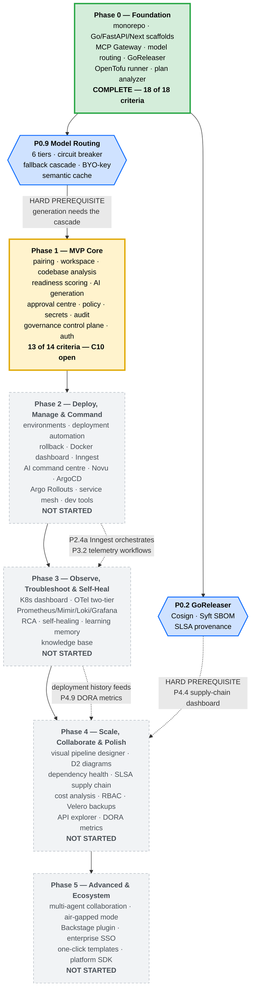
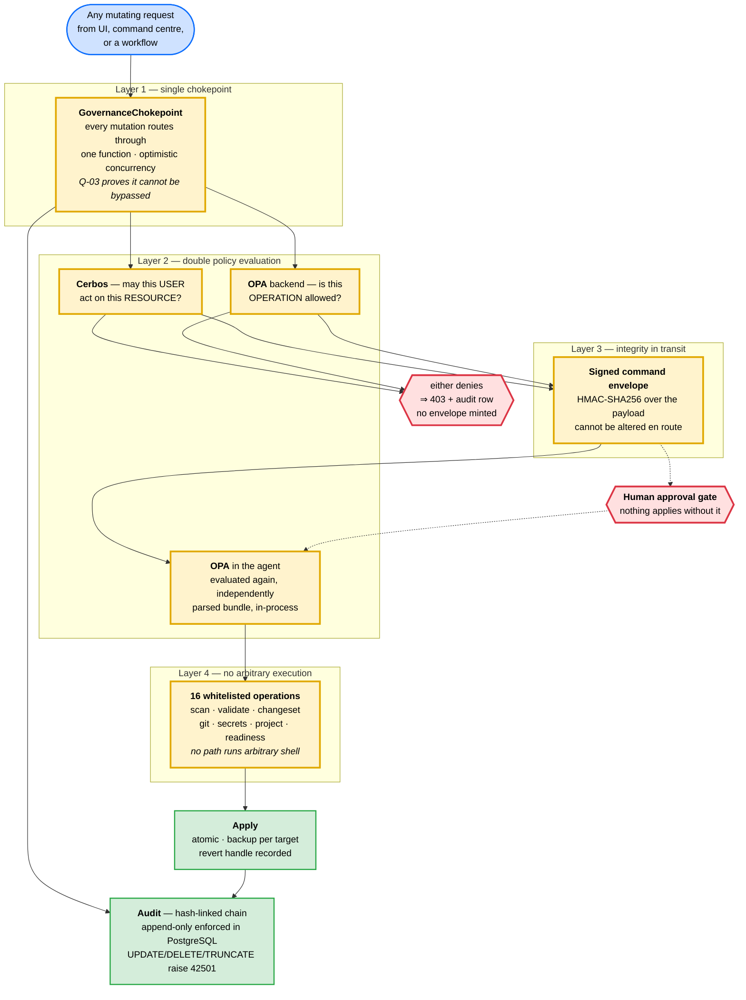
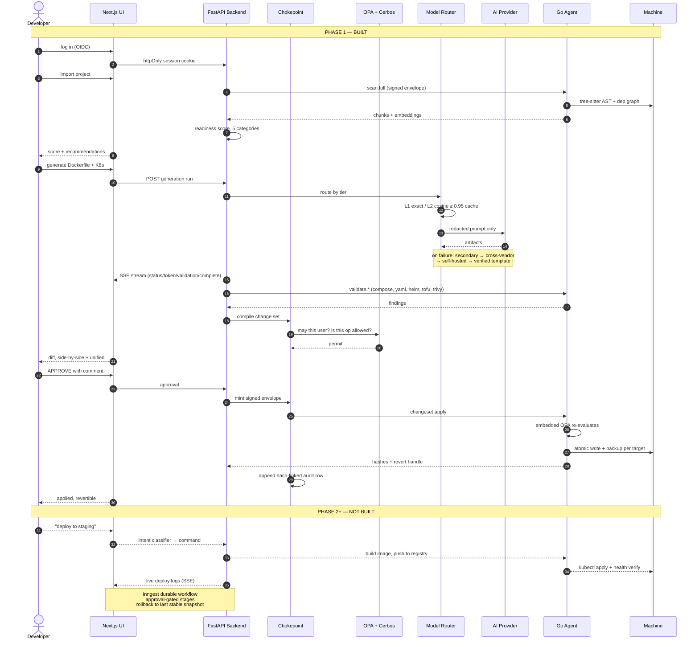
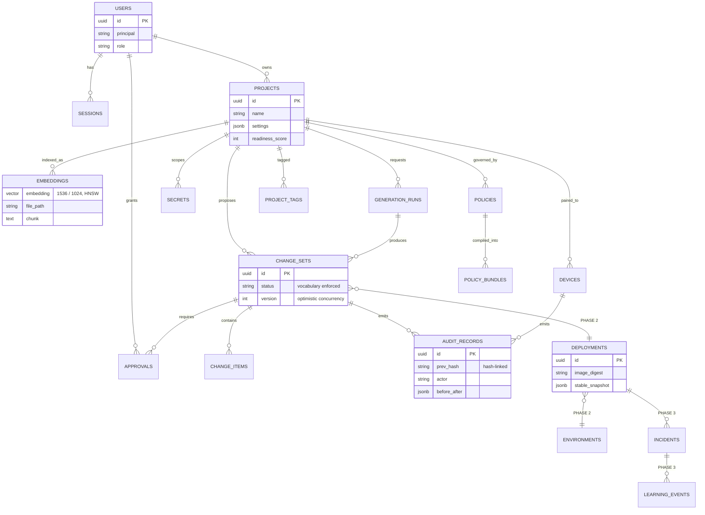

# ForgeOps — Complete Platform Architecture (All Phases)

> **Scope:** the whole platform as specified across `PRD.md` and `phases.md` — Phase 0
> through Phase 5. This is the **target architecture**, not the current one.
>
> **Status colouring is load-bearing.** Green boxes exist in the tree today. Grey dashed
> boxes are specified but unbuilt. Read the legend before reading the diagrams.
>
> Generated 2026-08-21 at commit `1207ca3`. Built state verified by inspecting the tree
> (`main.py` router registrations, `agent/internal/` package list, `docker-compose.yml`
> services, `docs/openapi.json`); planned state taken from `phases.md`.
>
> For **only what is built and verified**, see
> [`architecture-phase-0-1-as-built.md`](./architecture-phase-0-1-as-built.md).

---

## Contents

| #   | Diagram                                                                   | Answers                                            |
| :-- | :------------------------------------------------------------------------ | :------------------------------------------------- |
| 1   | [Complete system architecture](#diagram-1--complete-system-architecture)  | What are all the pieces, and which exist?          |
| 2   | [Phase roadmap & dependencies](#diagram-2--phase-roadmap--dependencies)   | What order must this be built in?                  |
| 3   | [The governance chokepoint](#diagram-3--the-governance-chokepoint)        | How is the AI prevented from exceeding permission? |
| 4   | [Full request lifecycle](#diagram-4--full-request-lifecycle-scan--deploy) | What happens end to end?                           |
| 5   | [Data model](#diagram-5--data-model)                                      | What is persisted?                                 |

### How to render these

The diagrams below are [Mermaid](https://mermaid.js.org) source. **Pre-rendered SVG and PNG
files are already in [`diagrams/`](./diagrams/README.md)** — open those if you just want to
look at a picture.

| Method               | How                                                                     |
| :------------------- | :---------------------------------------------------------------------- |
| **Already rendered** | [`docs/diagrams/`](./diagrams/README.md) — SVG for slides, PNG for docs |
| **VS Code**          | Install "Markdown Preview Mermaid Support", then `Ctrl+Shift+V`         |
| **Browser**          | Paste a block into <https://mermaid.live> → Actions → **SVG**           |
| **GitHub**           | Renders automatically on push                                           |

Export **SVG** for projection — it stays sharp at any size.

---

## Legend — applies to every diagram

| Style                       | Meaning                                                                    |
| :-------------------------- | :------------------------------------------------------------------------- |
| 🟩 **Green, solid**         | **Built.** Code exists in the tree at `1207ca3` and is covered by tests    |
| 🟨 **Yellow, thick border** | **Built, and security-critical.** The four enforcement layers              |
| 🟦 **Blue, solid**          | **Built infrastructure.** Digest-pinned containers in `docker-compose.yml` |
| ⬜ **Grey, dashed**         | **Specified but not built.** Phase 2–5 scope                               |
| 🟥 **Red**                  | **External.** Outside the trust boundary                                   |

---

## Diagram 1 — Complete system architecture

**What this shows:** every component of the finished platform across all five phases, and
the sharp line between what exists and what is still specification.

**What to say:** _"Three tiers. A browser frontend, a backend that orchestrates the AI, and
an agent that runs on the developer's own machine. The architectural claim is in the third
tier: the AI never touches infrastructure directly. It proposes; the agent executes only
named, whitelisted operations that a human approved and that two independent policy engines
permitted. Everything green is built. Everything dashed is the roadmap."_

```mermaid
graph TB
    subgraph BROWSER["Browser — Next.js 16 App Router"]
        UI["<b>Built UI</b><br/>10 routes · 7 feature modules<br/>projects · readiness · generation<br/>approvals · policies · vault · audit"]
        UI2["<b>Planned UI</b><br/>environments · deployments<br/>Docker &amp; K8s dashboards<br/>command centre · monitoring<br/>pipeline designer · analytics"]
    end

    subgraph IDP["Identity"]
        AK["<b>Authentik 2026.5.6</b><br/>OIDC issuer<br/>split-horizon addressing"]
    end

    subgraph BE["FastAPI Backend — Python 3.13 · modular monolith"]
        API["<b>API surface</b><br/>14 routers · 41 paths · 49 ops<br/>auth · projects · analysis<br/>generation · approvals · audit<br/>policies · secrets · MCP · agents"]
        CHOKE["<b>GovernanceChokepoint</b><br/>every mutation passes here<br/>optimistic concurrency"]
        ROUTE["<b>Model Router</b><br/>6 tiers · 4-level cascade<br/>circuit breaker per endpoint"]
        CACHE["<b>Semantic Cache</b><br/>L1 exact hash<br/>L2 cosine ≥ 0.95"]
        AUDIT["<b>Audit Chain</b><br/>hash-linked · append-only<br/>enforced in PostgreSQL"]
        MCPG["<b>MCP Gateway</b><br/>stateless header routing<br/>OIDC · OPA · TTL cache"]
        DEPL["<b>Deployment engine</b><br/>build · push · apply · verify<br/>rollback · promotion flows"]
        ORCH["<b>Durable workflows</b><br/>Inngest — approval-gated<br/>deployment pipelines"]
        CMD["<b>AI Command Centre</b><br/>intent router · NL to command<br/>5 guard-rail layers"]
        OBS["<b>Observability &amp; RCA</b><br/>OTel two-tier · incidents<br/>self-healing · learning memory"]
        NOTIF["<b>Notifications</b><br/>Novu · Slack · Discord · email"]
    end

    subgraph POL["Policy Engines — evaluated twice, independently"]
        OPA["<b>OPA 1.4.2</b> · Rego<br/>is this OPERATION allowed?<br/>blast radius · paths · schedule"]
        CERB["<b>Cerbos 0.54</b> · YAML<br/>may THIS user act on<br/>THIS resource?"]
    end

    subgraph DATA["State"]
        PG[("<b>PostgreSQL 17</b><br/>+ pgvector · HNSW<br/>10 migrations")]
        RD[("<b>Redis Stack 7.4</b><br/>cache · rate limit<br/>vector index")]
        INF["<b>Infisical</b><br/>per-tenant BYO keys"]
        METRICS[("<b>Prometheus · Mimir</b><br/><b>Loki · Tempo</b><br/>metrics · logs · traces")]
    end

    subgraph MACHINE["Developer Machine — one signed static binary"]
        subgraph AGENT["Go Agent 1.26 — 22 internal packages"]
            CONN["connection · session<br/>WSS · backoff · pairing"]
            ENVL["envelope<br/>HMAC-SHA256 verify"]
            APOL["policy<br/><b>OPA embedded in-process</b>"]
            EXEC["executor<br/><b>16 whitelisted ops only</b>"]
            SCAN["scanner<br/>tree-sitter AST · cAST<br/>dep graph · langdetect"]
            VAL["validator<br/>compose · yaml · helm<br/>tofu · trivy · k8s dry-run"]
            FOPS["fileops<br/>diff · backup · byte-exact revert"]
            SSC["secretscan · git · iac<br/>docker · k8s · devtools"]
        end
        FS[("Source code<br/>+ pre-image backups")]
        TOOLS["Docker · Kubernetes<br/>OpenTofu · Helm"]
    end

    subgraph EXT["External"]
        LLM["<b>AI Providers</b><br/>OpenAI · Anthropic · xAI<br/>Google · DeepSeek · self-hosted"]
        GIT["<b>GitHub</b><br/>PRs · Actions · ArgoCD sync"]
    end

    UI -->|"1. OIDC login"| AK
    UI -->|"httpOnly cookie<br/>never localStorage"| API
    UI2 -.-> API
    API -->|"verify token + claims"| AK
    API --> CHOKE
    CHOKE --> CERB
    CHOKE --> OPA
    CHOKE --> AUDIT
    API --> ROUTE
    API --> MCPG
    ROUTE --> CACHE
    CACHE --> RD
    ROUTE -->|"redacted prompts only"| LLM
    ROUTE --> INF
    CHOKE --> PG
    AUDIT --> PG
    API -.-> DEPL
    DEPL -.-> ORCH
    ORCH -.-> CHOKE
    API -.-> CMD
    CMD -.-> ROUTE
    API -.-> OBS
    OBS -.-> METRICS
    OBS -.-> NOTIF
    API <-->|"<b>JSON-RPC 2.0 over WSS</b><br/>mTLS + signed envelopes"| CONN
    CONN --> ENVL
    ENVL --> APOL
    APOL --> EXEC
    EXEC --> FOPS
    EXEC --> VAL
    EXEC --> TOOLS
    EXEC --> SSC
    SCAN --> FS
    FOPS --> FS
    SSC -->|"git PR flow"| GIT
    SSC -.->|"blocks credentials<br/>leaving the machine"| CONN

    classDef built fill:#d4edda,stroke:#28a745,stroke-width:2px,color:#000
    classDef security fill:#fff3cd,stroke:#e0a800,stroke-width:3px,color:#000
    classDef infra fill:#d1ecf1,stroke:#17a2b8,stroke-width:2px,color:#000
    classDef planned fill:#f1f3f5,stroke:#adb5bd,stroke-width:1px,stroke-dasharray:5 4,color:#495057
    classDef external fill:#f8d7da,stroke:#dc3545,stroke-width:2px,color:#000

    class UI,API,ROUTE,CACHE,AUDIT,MCPG,CONN,SCAN,VAL,FOPS,SSC built
    class CHOKE,OPA,CERB,ENVL,APOL,EXEC security
    class PG,RD,INF,AK infra
    class UI2,DEPL,ORCH,CMD,OBS,NOTIF,METRICS planned
    class LLM,GIT external
```

### Reading Diagram 1

The green mass on the left and bottom is Phase 0 + Phase 1: **analysis, generation,
approval, apply, revert** — the loop that turns an undeployable repository into one with a
validated Dockerfile and Kubernetes manifests, with a human in the middle.

The dashed boxes are Phase 2–5: **deployment, observability, self-healing, and the
command centre**. They attach to the same chokepoint rather than bypassing it, which is why
they can be added without re-auditing the security model.

---

## Diagram 2 — Phase roadmap & dependencies

**What this shows:** build order, and the two hard prerequisites that cannot be reordered.

**What to say:** _"Five phases, built strictly in order. Phase 0 is complete, Phase 1 is at
thirteen of fourteen criteria. The dependency that matters is the arrow from Phase 0's model
routing into Phase 1's generation pipeline — six tiers with a fallback cascade had to exist
before anything could generate a Dockerfile, because the generator's contract is 'never
fail, degrade to a verified template'."_

### Phase status — authoritative

Source: `PROGRESS.md` phase-status table.

| Phase | Name                                      | Status           | Criteria |
| :---- | :---------------------------------------- | :--------------- | :------- |
| **0** | Foundation & Project Scaffolding          | 🟩 `completed`   | 18 / 18  |
| **1** | MVP Core — Analysis, Generation, Approval | 🟨 `in-progress` | 13 / 14  |
| **2** | Deploy, Manage & Command                  | ⬜ `not-started` | —        |
| **3** | Observe, Troubleshoot & Self-Heal         | ⬜ `not-started` | —        |
| **4** | Scale, Collaborate & Polish               | ⬜ `not-started` | —        |
| **5** | Advanced & Ecosystem                      | ⬜ `not-started` | —        |

Phase 2's directories exist in the tree (`backend/src/deployment/`, `incidents/`,
`monitoring/`, `notifications/`) but hold **only a `README.md`** — no routers, no services.
They are structural placeholders mandated by the layout, not partial implementations.

---

## Diagram 3 — The governance chokepoint

**What this shows:** the four independent enforcement layers, and why a bypass is a detected
bug rather than a silent hole.

**What to say:** _"This is the part of the project that is actually novel. Four layers, and
each one is proved by a property test with a negative control — a deliberately broken copy
of the production code, proved to make the test fail. If the test can't fail, it isn't
evidence."_

### The four layers, one line each

1. **`GovernanceChokepoint`** — every mutation in the system routes through one function.
   Property **Q-03** proves it cannot be bypassed.
2. **Two policy engines, evaluated twice.** The backend asks Cerbos _and_ OPA. The agent
   then asks its own embedded OPA independently. **Q-06** asserts the two evaluators
   always agree over generated inputs, so a disagreement becomes a detected bug.
   **Q-07** asserts a digest mismatch makes both deny.
3. **Signed command envelopes.** Every instruction reaching the agent carries an
   HMAC-SHA256 signature over its payload.
4. **Whitelisted operations only.** 16 named operations. There is no code path that
   executes arbitrary shell input.

> **One deviation from spec, worth knowing.** `phases.md` §1.10 specifies "OPA compiled to
> **Wasm** embedded in the Go agent binary". The implementation instead links
> `open-policy-agent/opa/v1/rego` and evaluates a parsed bundle in-process
> (`agent/internal/policy/evaluator.go`). Same property — independent second evaluation
> inside the agent, no network call — different mechanism. The diagrams above show the
> implementation. (`wazero` _is_ in the agent, but it hosts tree-sitter grammars in the
> scanner, not policy.)
>
> **`PROGRESS.md` is stale here.** It records leaves 9.6 and 9.7 as `pending` on the grounds
> that the Q-06 and Q-07 test files do not exist. They exist and pass — verified by running
> them directly. See the as-built companion document for the output.

---

## Diagram 4 — Full request lifecycle (scan → deploy)

**What this shows:** one change travelling the whole platform, with the Phase 2+ tail
clearly marked as unbuilt.

---

## Diagram 5 — Data model

**What this shows:** what the platform persists. Green tables have migrations in the tree;
dashed tables are specified for later phases.

**Migrations in the tree (10):** `0001_initial` · `0002_identity_and_devices` ·
`0003_codebase_index_extensions` · `0004_change_sets_and_approvals` ·
`0005_policies_and_bundles` · `0006_secrets` · `0007_audit_append_only` ·
`0008_generation_runs` · `0009_project_tags_and_settings` ·
`0010_change_set_status_vocabulary`.

No migration exists for `deployments`, `environments`, `incidents`, or `learning_events`.

---

## Technology stack — decided, by phase

| Layer             | Technology                                                 | Phase | Built?  |
| :---------------- | :--------------------------------------------------------- | :---- | :------ |
| Agent             | Go 1.26, `coder/websocket`, `tree-sitter`, `wazero`        | 0–1   | 🟩      |
| Backend           | Python 3.13, FastAPI, SQLModel, Pydantic v2                | 0–1   | 🟩      |
| Frontend          | Next.js 16 App Router, shadcn/ui, TanStack Query, Zustand  | 0–1   | 🟩      |
| Database          | PostgreSQL 17 + pgvector (HNSW)                            | 0     | 🟩      |
| Cache             | Redis Stack 7.4 (vector search for L2)                     | 0     | 🟩      |
| Policy            | OPA 1.4.2 (Rego) + Cerbos 0.54 (YAML)                      | 0–1   | 🟩      |
| Identity          | Authentik 2026.5.6, OIDC / OAuth 2.1                       | 1     | 🟩      |
| Secrets           | Infisical                                                  | 1     | 🟩      |
| IaC               | OpenTofu 1.12.5, Helm                                      | 0–1   | 🟩      |
| Supply chain      | GoReleaser, Cosign, Syft, SLSA, Rekor                      | 0     | 🟩      |
| Streaming         | SSE via FastAPI `EventSourceResponse`                      | 1     | 🟩      |
| Job queue         | ARQ / Dramatiq (non-durable)                               | 1     | 🟩 seam |
| Durable workflows | **Inngest**                                                | 2     | ⬜      |
| GitOps            | **ArgoCD + Argo Rollouts**                                 | 2     | ⬜      |
| Notifications     | **Novu**                                                   | 2     | ⬜      |
| Service mesh      | **Cilium** (eBPF), Istio Ambient fallback                  | 2     | ⬜      |
| Telemetry         | **OTel two-tier**, Prometheus, Mimir, Loki, Tempo, Grafana | 3     | ⬜      |
| Diagrams          | **D2** (Mermaid fallback)                                  | 4     | ⬜      |
| Cost              | **Infracost + Kubecost**                                   | 4     | ⬜      |
| Backup            | **Velero**                                                 | 4     | ⬜      |

### Six model tiers — `backend/config/model-tiers.yaml`

Each tier declares a four-level cascade: `primary → secondary → cross_vendor → self_hosted`.

| Tier            | Primary          | Secondary       | Purpose                    |
| :-------------- | :--------------- | :-------------- | :------------------------- |
| `high_coding`   | gpt-5.6-sol      | claude-fable-5  | Multi-file code generation |
| `high_analysis` | claude-fable-5   | gpt-5.6-sol     | Reasoning about a codebase |
| `medium`        | grok-4.5         | claude-sonnet-5 | General work               |
| `medium_value`  | claude-sonnet-5  | deepseek-v4     | Cost-sensitive work        |
| `low_logs`      | gemini-3-flash   | deepseek-v4     | Log summarisation          |
| `self_hosted`   | qwen3-coder-next | glm-5.2         | Air-gapped / sensitive     |

Beyond the cascade sits the **Safe Default Template Library** — verified, hardcoded
templates for 8 languages × 5 artifact types. The generator's contract is that it never
returns nothing: after 3 failed AI attempts it degrades to a template that is known to pass
the validation pipeline.

---

## Security invariants — non-negotiable across all phases

These hold in every phase; adding Phase 2–5 features must not weaken them.

1. **The AI never executes.** It proposes. The agent executes named operations.
2. **No arbitrary shell.** 16 whitelisted operations, matched by name.
3. **Nothing applies without human approval.** The approval gate is not optional.
4. **Every mutation is backed up first**, with a byte-exact revert handle.
5. **Every mutation is audited** in a hash-linked, append-only chain.
6. **Secrets never reach an LLM.** Redaction happens before prompt assembly, and cache
   keys are computed over the redacted form.
7. **Policy is evaluated twice**, independently, on both sides of the connection.
8. **Every container is digest-pinned**, never tagged.

---

_Companion document: [`architecture-phase-0-1-as-built.md`](./architecture-phase-0-1-as-built.md)
— only what exists, with the evidence for each claim._
