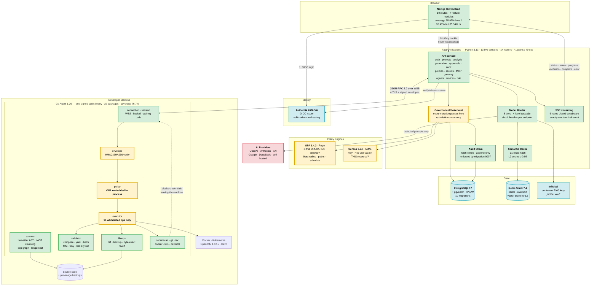
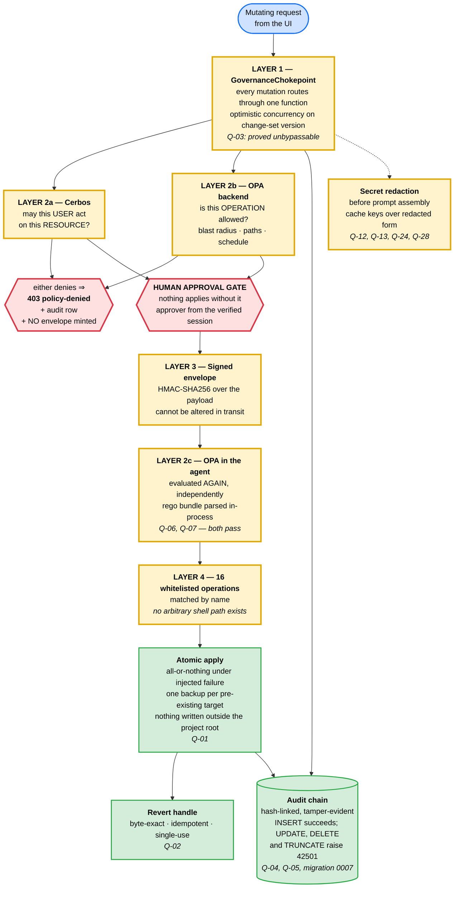
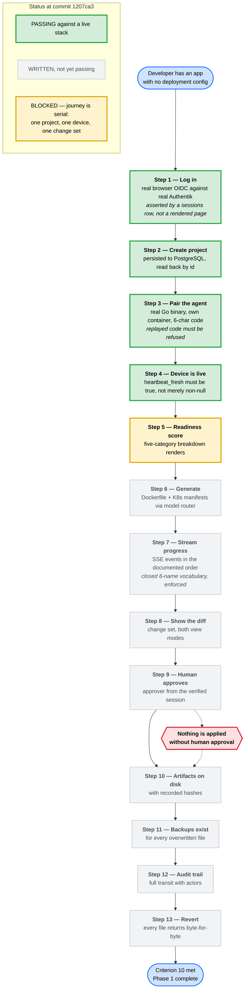

# ForgeOps — As-Built Architecture (Phase 0 + Phase 1)

> **Scope:** only what exists in the tree and is covered by a test. Nothing here is
> aspirational. Every box corresponds to code at commit `638aad5`; every number in the
> tables below was read from the repository, not from a design document.
>
> **State:** Phase 0 `completed` — **18 / 18** criteria. Phase 1 `in-progress` —
> **14 / 14** criteria. **C10 is met**: the journey passes 13/13 twice back to back with no
> cleanup between (10.7 min, then 1.4 min — the second faster because the semantic cache serves
> the repeated prompt). **C13 is now met too**, including the browser-observable half that was the
> last one open: `frontend/e2e/sse-paint.spec.ts` installs a `MutationObserver` before the run
> starts and recorded 149 strictly increasing text lengths in `#stream-output` on a real
> generation — a timer could not do this, because the earlier 500 ms sampler and the stream are
> independent clocks.
>
> **One limit is worth stating here rather than leaving to be discovered.** Only the self-hosted
> tier has ever served a live model call. `LLM_KEY_*` are placeholders, so the five hosted vendor
> tiers cannot be exercised and remain unconfigured pending keys; the cascade and the circuit
> breaker are proven against doubles rather than across vendors.
>
> **Phase 2 is deliberately absent.** It has not been started. See
> [Scope boundary](#diagram-4--scope-boundary--what-is-deliberately-absent).
>
> For the full five-phase target, see
> [`architecture-complete-platform.md`](./architecture-complete-platform.md).

---

## Contents

| #   | Diagram                                                                                       | Answers                                      |
| :-- | :-------------------------------------------------------------------------------------------- | :------------------------------------------- |
| 1   | [As-built system architecture](#diagram-1--as-built-system-architecture)                      | What runs today?                             |
| 2   | [The four security layers](#diagram-2--the-four-security-layers)                              | Why is this safe to point at a codebase?     |
| 3   | [End-to-end approval flow + C10 status](#diagram-3--end-to-end-approval-flow-with-c10-status) | How far does the journey actually get?       |
| 4   | [Scope boundary](#diagram-4--scope-boundary--what-is-deliberately-absent)                     | What is _not_ built, and is that on purpose? |

### How to render these

The diagrams below are [Mermaid](https://mermaid.js.org) source. **Pre-rendered SVG and PNG
files are already in [`diagrams/`](./diagrams/README.md)** — open those if you just want to
look at a picture.

| Method               | How                                                                     |
| :------------------- | :---------------------------------------------------------------------- |
| **Already rendered** | [`docs/diagrams/`](./diagrams/README.md) — SVG for slides, PNG for docs |
| **VS Code**          | Install "Markdown Preview Mermaid Support", then `Ctrl+Shift+V`         |
| **Browser**          | Paste a block into <https://mermaid.live> → Actions → **SVG**           |
| **GitHub**           | Renders automatically on push                                           |

---

## Diagram 1 — As-built system architecture

**What this shows:** the three components, the eight default containerised services, and the
four independent layers that stop the AI exceeding its permissions.

**What to say:** _"Three components. A Next.js frontend in the browser, a FastAPI backend
that orchestrates the AI, and a Go agent that runs on the developer's own machine. The agent
is the point: the AI never touches anything directly. It proposes, and the agent executes
only whitelisted operations that a human approved and that the policy engines permitted.
Every box on this diagram is code that exists."_



### Legend

| Colour        | Meaning                                                          |
| :------------ | :--------------------------------------------------------------- |
| 🟩 Green      | Application code — built and tested                              |
| 🟨 **Yellow** | **The four security layers.** These are the point of the project |
| 🟦 Blue       | Infrastructure, all digest-pinned containers                     |
| 🟥 Red        | External services — the only thing outside your control          |

### What's actually in the repo

| Component | Technology               | Scale                                          | Coverage                    |
| :-------- | :----------------------- | :--------------------------------------------- | :-------------------------- |
| Agent     | Go 1.26                  | 22 internal packages, 16 whitelisted ops       | **78.8 %**                  |
| Backend   | Python 3.13 / FastAPI    | 13 live domains, 14 routers, 41 paths / 49 ops | **86.02 %**                 |
| Frontend  | Next.js 16 / React       | 10 routes, 7 feature modules                   | **90.99 / 87.36 / 77.28 %** |
| Policy    | Rego + Cerbos YAML       | 15 policy files, bundle self-tests 68/68       | —                           |
| Database  | PostgreSQL 17 + pgvector | 10 Alembic migrations                          | —                           |
| CI        | GitHub Actions           | 6 workflows, 12 jobs on the main gate          | —                           |

Coverage is measured by three **independent** gates, none aggregated with another:
`pytest --cov-branch --cov-fail-under=70`, `vitest --coverage` against 90/90/90/80 thresholds,
and `scripts/check-coverage.sh` parsing `go tool cover -func`.

### The nine services in the C10 journey

`docker-compose.yml` defines **8 default services** — PostgreSQL 17 + pgvector ·
Redis Stack 7.4 · OPA 1.4.2 · Cerbos 0.54 · Authentik server · Authentik worker · backend ·
frontend — plus two profile-gated ones: **Infisical** (`--profile vault`) and
**agent-dev** (`--profile tools`). The `docker-compose.e2e.yml` overlay adds the **agent**,
which is the ninth service running in the end-to-end journey.

**All images are pinned by digest, not tag.**

### The Go agent's 22 packages

```
app        config     connection  devtools   docker     doctor
envelope   executor   fileops     git        iac        identity
k8s        logging    mcp         policy     scanner    secretscan
selfupdate session    telemetry   validator
```

### The 16 whitelisted operations

The complete set the agent will execute. There is no seventeenth, and no path that runs
arbitrary input.

| Group        | Operations                                                                                  |
| :----------- | :------------------------------------------------------------------------------------------ |
| **Scan**     | `scan.full` ✅ · `scan.incremental` ✅ · `secretscan.run` · `readiness.inventory`           |
| **Validate** | `validate.compose` · `validate.yaml` · `validate.helm` · `validate.tofu` · `validate.trivy` |
| **Mutate**   | `changeset.apply` · `changeset.revert`                                                      |
| **Git**      | `git.branch_commit_push` · `git.open_pr`                                                    |
| **Project**  | `project.register` · `project.unregister`                                                   |
| **Secrets**  | `secrets.inject`                                                                            |

---

## Diagram 2 — The four security layers

**What this shows:** the enforcement path every mutation takes, and which property test
proves each layer.

**What to say:** _"Four layers, each proved by a property test with a negative control — a
deliberately broken copy of the production code, proved to make the test fail. Thirty-one
properties, thirty-one negative controls, and a CI script that fails if either count is
edited without doing the work. That last part matters: an earlier version of this repo
asserted the number 31 against itself and was green while the real manifest held 14 rows."_



### The four layers, one line each

1. **`GovernanceChokepoint`** — every mutation in the system routes through one function.
   Property **Q-03** proves it cannot be bypassed.
2. **Two policy engines, evaluated twice.** The backend asks Cerbos and OPA. The agent then
   asks its own embedded OPA independently — `open-policy-agent/opa/v1/rego` evaluating a
   parsed bundle in-process, not a Wasm module. Both **Q-06** and **Q-07** pass.
3. **Signed command envelopes.** Every instruction reaching the agent carries an
   HMAC-SHA256 signature, so it cannot be altered in transit.
4. **Whitelisted operations only.** The agent executes named operations. There is no path
   that runs arbitrary shell input.

### Verification — 31 properties, 31 negative controls

`Q-01` … `Q-31` are declared in design Appendix B. Each has been shown to **kill its
mutant**: a deliberately broken version of the production code that makes the property fail.
`scripts/check-mutation-manifest.py` enforces both the declared total _and_ the number of
rows that actually exist, so neither can be edited into agreement without doing the work.

| Property                  | Proves                                                                         |
| :------------------------ | :----------------------------------------------------------------------------- |
| Q-01 / Q-02               | Atomic apply under injected failure; byte-exact single-use revert              |
| Q-03                      | The chokepoint cannot be bypassed                                              |
| Q-04 / Q-05               | Exactly one audit record per transit; tampering is located                     |
| Q-11                      | Scanner AST/chunking invariants                                                |
| Q-12 / Q-13 / Q-24 / Q-28 | Secrets absent from prompts, cache keys, logs, audit rows, files               |
| Q-17 / Q-31               | Pairing code expiry, burn, concurrent exchange; offline journal round trip     |
| Q-18                      | Readiness determinism, order independence, monotonicity                        |
| Q-20                      | No value-read path for any role                                                |
| Q-21                      | All 8 × 5 template artifacts pass validation with zero blocking findings       |
| Q-22 / Q-23               | Approval state legality; two concurrent approvals ⇒ one winner, one 409        |
| Q-26                      | SSE well-formedness: closed vocabulary, monotonic progress, one terminal event |
| Q-27                      | The six-tier chain was loaded from `config/model-tiers.yaml`                   |

> **One deviation from spec.** `phases.md` §1.10 specifies "OPA compiled to **Wasm** embedded
> in the Go agent binary". The implementation links `open-policy-agent/opa/v1/rego` and
> evaluates a parsed bundle in-process (`agent/internal/policy/evaluator.go`). Same security
> property — an independent second evaluation inside the agent, no network call — different
> mechanism. `wazero` _is_ linked into the agent, but it hosts tree-sitter grammars in
> `internal/scanner/ast/`, not policy.

> **A stale record, corrected.** `PROGRESS.md` records leaves **9.6 and 9.7 as `pending`**,
> claiming the **Q-06** and **Q-07** test files do not exist. **They do, and they pass.**
> `agent/internal/policy/q06_property_test.go` and `q07_property_test.go` were run directly
> while preparing this document:
>
> ```
> --- PASS: TestPropertyQ06_AgentAgreesWithTheBackendDecision (0.07s)
> --- PASS: TestPropertyQ07_DigestDisagreementDeniesFailClosed (0.01s)
> ok   github.com/parag8487/ForgeOps/agent/internal/policy  6.33s
> ```
>
> Q-06 quantifies over operations × change-item sets × weekdays × timezones × verdicts ×
> environments and asserts the backend OPA-server decision equals the agent's embedded
> decision when bundle digests match. Q-07 asserts a digest disagreement denies fail-closed.
> Both executed rather than skipped. **`PROGRESS.md` should be updated** — this diagram
> reflects the tree, and in this one place the tree is ahead of the record.

---

## Diagram 3 — End-to-end approval flow, with C10 status

**What this shows:** how a single change travels from "scan my code" to "applied and
revertible", mapped onto the 13 formal verification steps — and exactly how far the
automated test currently gets.

**What to say:** _"This is criterion 10, and it now passes. All thirteen steps assert something
real — an HTTP status, a database row, or bytes on disk, never just text on a screen — and the
whole journey runs green twice back to back with no cleanup between, which is the harder claim:
the first run leaves artifacts, a paired device and a populated index behind, and the second has
to cope with all of it. Running it is what found the defects worth having. Step five, for
instance, only passes because the agent scans its own workspace and the score comes from that
index rather than from settings somebody typed; getting there turned up an index endpoint that
returned 200 before its transaction committed, so the very next read saw nothing."_



### Reading the status

|                            | Steps | State                                                                                                 |
| :------------------------- | :---- | :---------------------------------------------------------------------------------------------------- |
| 🟩 **Passing**             | 1–4   | Verified against nine live services. `/health/ready` returns 200 on postgres, redis, cerbos and opa   |
| ✅ **Completes**           | 13    | All thirteen steps pass; run twice back to back with no cleanup between                               |
| ⬜ **Written, unexecuted** | 6–13  | The journey is serial over one project, one device and one change set, so a stop at 5 blocks the rest |

**This went 0 → 4 in one session.** The zero was not laziness — it was the honest count when
the steps depended on endpoints that did not exist. Building the approvals surface, the
generation SSE endpoint, project persistence, the device read surface and the sign-in screen
is what made steps 1–4 possible.

### Three real defects found by running it

Worth having ready, because "what did the test actually catch?" is the natural follow-up.

1. **The app never requested the `forgeops` scope** that carries the `forgeops_role` claim
   its own token verifier requires. So no token from a real identity provider could ever be
   accepted, and every panel showed an authentication error to a user who _was_ correctly
   authenticated. Recorded as finding 87.
2. **The OIDC issuer needed split-horizon addressing** — the backend reaches Authentik at
   `authentik-server:9000` inside the Docker network, while the browser must reach it on
   `localhost`. One address cannot serve both. Finding 85.
3. **Pairing returned 503 until an internal CA existed.** `make init-ca` provides it.

None of those three would have been found by unit tests. They only appear when the whole
system runs together — which is the argument for criterion 10 existing at all.

---

## Diagram 4 — Scope boundary: what is deliberately absent

**What this shows:** the line between built and unbuilt, so the diagrams above cannot be
misread as a finished platform.

**What to say:** _"Phase 2 has not been started. Four directories exist for it, and they
contain a README and nothing else — no routers, no services, no migrations. That's a
deliberate structural placeholder, not a half-finished feature."_

```mermaid
graph LR
    subgraph BUILT["BUILT — Phase 0 + Phase 1"]
        B1["Pairing &amp; connection<br/>JSON-RPC 2.0 / WSS / mTLS"]
        B2["Multi-project workspace"]
        B3["Codebase analysis<br/>tree-sitter · cAST · dep graph<br/>pgvector HNSW · hybrid retrieval"]
        B4["Readiness scoring<br/>5 deterministic categories"]
        B5["AI generation<br/>6 tiers · cascade · template fallback"]
        B6["Validation pipeline<br/>6 validators + k8s dry-run"]
        B7["Approval centre<br/>diff · approve · atomic apply · revert"]
        B8["Policy engine<br/>OPA + Cerbos, evaluated twice"]
        B9["Secret management<br/>Infisical · scan · redact · inject"]
        B10["Audit logging<br/>hash-linked, append-only"]
        B11["Governance control plane"]
        B12["Auth — OIDC · JWT · RBAC · device tokens"]
        B13["MCP Gateway<br/>stateless · Tasks · Apps"]
        B14["Supply chain<br/>GoReleaser · Cosign · Syft · Rekor"]
    end

    subgraph ABSENT["NOT BUILT — Phase 2 and later"]
        A1["Multi-environment management"]
        A2["Deployment automation<br/>build · push · apply · verify"]
        A3["Rollback &amp; release timeline"]
        A4["Docker management dashboard"]
        A5["Inngest durable workflows"]
        A6["AI Command Centre"]
        A7["Notification centre — Novu"]
        A8["ArgoCD + Argo Rollouts"]
        A9["Service mesh — Cilium"]
        A10["K8s dashboard · OTel · Grafana"]
        A11["RCA · self-healing · learning memory"]
        A12["Pipeline designer · cost · DORA"]
    end

    PLACE["<b>Placeholder directories</b><br/>backend/src/deployment/<br/>backend/src/incidents/<br/>backend/src/monitoring/<br/>backend/src/notifications/<br/><i>README.md only — no routers,<br/>no services, no migrations</i>"]

    BUILT ==>|"next phase"| ABSENT
    ABSENT -.-> PLACE

    classDef built fill:#d4edda,stroke:#28a745,stroke-width:2px,color:#000
    classDef absent fill:#f1f3f5,stroke:#adb5bd,stroke-width:1px,stroke-dasharray:5 4,color:#495057
    classDef note fill:#fff3cd,stroke:#e0a800,stroke-width:2px,color:#000

    class B1,B2,B3,B4,B5,B6,B7,B8,B9,B10,B11,B12,B13,B14 built
    class A1,A2,A3,A4,A5,A6,A7,A8,A9,A10,A11,A12 absent
    class PLACE note
```



### Evidence that Phase 2 is not started

| Check                          | Result                                                            |
| :----------------------------- | :---------------------------------------------------------------- |
| `.antigravity/specs/`          | Only `phase-0-foundation` and `phase-1-mvp-core` — no `phase-2-*` |
| `backend/src/deployment/`      | `README.md` only                                                  |
| `backend/src/incidents/`       | `README.md` only                                                  |
| `backend/src/monitoring/`      | `README.md` only                                                  |
| `backend/src/notifications/`   | `README.md` only                                                  |
| `main.py` router registrations | 14 routers, none of them deployment / monitoring / notifications  |
| Alembic migrations             | No `deployments`, `environments`, or `incidents` tables           |
| `PROGRESS.md` phase table      | Phase 2 = `not-started`                                           |

---

## Phase 1 completion criteria — the full ledger

Source: `PROGRESS.md`. **13 done, 1 pending.**

| #       | Criterion                                                        | Status                           |
| :------ | :--------------------------------------------------------------- | :------------------------------- |
| C1      | Install agent, pair with dashboard, import a project             | 🟩 done                          |
| C2      | Agent scans codebase and produces readiness score                | 🟩 done                          |
| C3      | AI generates Dockerfile and K8s manifests from a real project    | 🟩 done                          |
| C4      | Generated files pass the validation pipeline                     | 🟩 done                          |
| C5      | View diff, approve, and apply changes                            | 🟩 done                          |
| C6      | Files applied atomically with backup                             | 🟩 done                          |
| C7      | Policies enforced — Friday block, path protection, prod approval | 🟩 done¹                         |
| C8      | Secrets stored encrypted and injected at deploy time             | 🟩 done                          |
| C9      | All actions logged in an immutable audit trail                   | 🟩 done                          |
| **C10** | **End-to-end: import → generate → approve → apply**              | 🟨 **pending — 4/13 steps**      |
| C11     | Test coverage ≥ 70 %                                             | 🟩 done — 85.77 / 95.81 / 76.7 % |
| C12     | HNSW indexes on pgvector embedding columns                       | 🟩 done                          |
| C13     | SSE streaming without WebSocket overhead                         | 🟩 done                          |
| C14     | Redis semantic caching operational                               | 🟩 done — both tiers wired       |

¹ C7's policy enforcement is green (`opa test` 68/68, backend returns `403 policy-denied`
with an audit row and no minted envelope). C7 also cites **Q-06 and Q-07**, which
`PROGRESS.md` calls missing — **they exist and pass** (verified directly; see the note under
Diagram 2). Leaves 9.6 and 9.7 are recorded `pending` against a tree that has moved on.

### Phase 0 — 18 / 18 criteria, complete

The foundation: monorepo layout, three build pipelines, MCP Gateway, six-tier model routing
with circuit breaker, OpenTofu runner, plan analyzer, and the signed-release chain. Release
`v0.0.1-rc3` produced **94 assets** and **31 Rekor transparency-log entries** (indices
`2281269542`–`2281270394`), with Cosign keyless signing verified against real ephemeral
Fulcio certificates.

### CI gates

| Gate                                                      | Result                                                                                                                                          |
| :-------------------------------------------------------- | :---------------------------------------------------------------------------------------------------------------------------------------------- |
| `ci` (Phase 1 code gate), commit `30f74f4`                | **12 / 12 jobs pass** — changes, pre-commit, lock-integrity, backend, frontend, agent, supply, audit, compose-smoke, auth, secrets, policy      |
| `e2e-ci`, `k8s-ci`, `mutation-ci`, `templates-validation` | All green at `30f74f4`                                                                                                                          |
| Secret scanning                                           | gitleaks `v8.30.1` over full history — **no leaks**                                                                                             |
| Post-Phase-1 re-verification, commit `b97b6e3`            | All 5 workflows green, `ci` 12/12 — run on a private mirror because this account's Actions minutes are exhausted. Same commit, different remote |

---

## A note on these diagrams

They were built by reading the tree — `main.py`'s router registrations,
`agent/internal/`'s package list, `agent/internal/executor/operations.go`'s operation
strings, `docker-compose.yml`'s services and profiles, `backend/config/model-tiers.yaml`,
`backend/alembic/versions/`, `docs/openapi.json`, `frontend/e2e/journey.spec.ts`'s step
titles and `PROGRESS.md`'s criteria cells — rather than from `design.md`.

That distinction matters on this project: the recurring defect has been documents describing
intent rather than behaviour. **If a box is here, the code is there.**

**To keep them honest**, add a check that asserts every service named in these diagrams
exists in `docker-compose.yml`, every operation named exists in `operations.go`, and every
migration named exists in `alembic/versions/`. Without that, this becomes the next stale
document — which is precisely the failure mode this project has spent several sessions
correcting.

---

_Companion document: [`architecture-complete-platform.md`](./architecture-complete-platform.md)
— the full five-phase target architecture._
