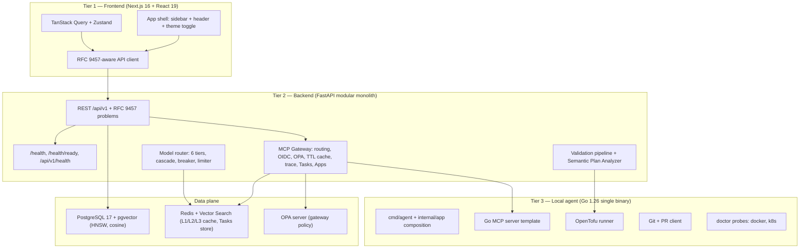

# ForgeOps Architecture — Phase 0

Repository: `github.com/parag8487/ForgeOps`. This document describes what Phase 0
actually builds, what it deliberately leaves out, and the cross-cutting contracts every
later phase inherits. Authority: `.antigravity/specs/phase-0-foundation/design.md` §1–§6.

## Scope boundary

Phase 0 is foundation and scaffolding. If a section of any document appears to describe
behaviour outside the table below, the table wins.

### In scope for Phase 0

| Deliverable | Content                                                                                                                                                                                     |
| :---------- | :------------------------------------------------------------------------------------------------------------------------------------------------------------------------------------------ |
| 0.1         | Monorepo layout, root `Makefile`, `docker-compose.yml`, `.env.example`, `.gitignore`, pre-commit (Gitleaks + Ruff + gofmt + Prettier), the two-licence layout, `docs/`                      |
| 0.2         | Go module `github.com/parag8487/ForgeOps/agent`, thin `cmd/agent/main.go`, `internal/` tree, constructor-injection DI, graceful shutdown, GoReleaser + Cosign + Syft SBOM + SLSA provenance |
| 0.3         | FastAPI modular monolith: config, logging, async session, app factory, health/readiness, PostgreSQL 17 + pgvector, single Alembic revision, multi-stage Dockerfile                          |
| 0.4         | Next.js 16 App Router shell: sidebar + header + theme toggle, TanStack Query + Zustand, RFC 9457-aware API client, Vitest, Playwright, k6                                                   |
| 0.5         | Stateless MCP Gateway: header routing, OIDC token verification, OPA policy, TTL tool cache, W3C Trace Context, Go and Python MCP server templates, Tasks Extension, MCP Apps hosting        |
| 0.6         | Git and PR client in the agent (`go-git` locally, `go-github` for the PR REST API)                                                                                                          |
| 0.7         | Validation pipeline skeleton and the deterministic Semantic Plan Analyzer wired to the approval seam                                                                                        |
| 0.8         | OpenTofu 1.12.5 runner in the agent: timeout, output streaming, signal propagation, environment isolation, `validate` and `plan`                                                            |
| 0.9         | Six model routing tiers, endpoint registry, OpenAI-compatible adapter, fallback cascade, circuit breaker, BYO-key resolvers, tiered semantic cache, Redis/Lua per-caller limiter            |

### Explicitly out of scope

Feature logic (analysis, generation, deployment), UI beyond the shell, migrations beyond
`0001_initial`, the **general user authentication system** (see below), agent pairing /
mTLS / heartbeat / reconnect / command whitelist, job-queue infrastructure (seam only),
the OTel SDK and the observability stack, the safe default template library, tree-sitter
and cAST chunking (including the `tree-sitter/go-tree-sitter` dependency itself, decision
D-1), agent auto-update behaviour, RLS / PgBouncer / tenant middleware, the Governance
Control Plane, OPA-Wasm in the agent, and SPIFFE/SPIRE.

Structural directories mandated by the authoritative layout but unused in Phase 0 hold
only a non-code `README.md` or `.gitkeep`. They are not packages: no `doc.go`, no
importable `__init__.py`, no exported placeholder types.

## Authentication posture in Phase 0

Phase 0 verifies tokens at two surfaces only:

- the MCP Gateway routes under `/api/v1/mcp*`
- the costly completion seam `POST /api/v1/ai/complete`, where a verified `sub` keys the
  per-caller rate-limit bucket

**Phase 0 adds no general user authentication.** There is no login flow, no session or
refresh-token lifecycle, no user/team records, and no RBAC. Every other non-MCP route is
unauthenticated by deliberate decision. A resource server validating a bearer token is not
an authentication system; Phase 1 §1.11 issues tokens and applies authentication and RBAC
across all routes. `backend/src/auth/` is therefore a structural marker only.

Consequence for the deployment topology: see `docs/deployment.md`, which restricts Phase 0
to local development on a trusted machine.

## Tiers

The agent ships as a binary, not as a default Compose service. The `agent-dev` container
exists only under the `tools` profile to carry OpenTofu for IaC integration tests.

## What runs after `docker compose up -d --wait`

Compose project name is `forgeops`. The unprofiled default set is exactly five services:
`postgres`, `redis`, `opa`, `backend`, `frontend`. Optional profiles are separate and are
verified only after their owning implementation exists: `vault` (Infisical) and `tools`
(`agent-dev` with OpenTofu). Every service loads the committed `.env.example` as required
and an optional `.env` as an override, so a fresh clone starts without any manual step.

## Health versus readiness

The distinction is a contract, not a convenience, and the probe endpoints are unversioned
so they do not move when the API version bumps.

| Endpoint             | Meaning                                                                  | Dependency I/O | Behaviour during a PostgreSQL or Redis outage                         |
| :------------------- | :----------------------------------------------------------------------- | :------------- | :-------------------------------------------------------------------- |
| `GET /health`        | Liveness: the event loop accepts work                                    | none           | stays `200`                                                           |
| `GET /health/ready`  | Readiness: PostgreSQL `SELECT 1` + Redis `PING`, each with a 2 s timeout | yes            | RFC 9457 `503` with one `errors[]` item per failed or timed-out check |
| `GET /api/v1/health` | Versioned informational echo of liveness                                 | none           | stays `200`                                                           |

Startup fails fast on invalid configuration and on failures to construct local resources.
It does **not** abort merely because PostgreSQL or Redis is unreachable; clients and pools
are built non-destructively and the Redis semantic-index creation retries idempotently
with bounded backoff. The Compose backend health check uses liveness only; readiness is
polled separately by `scripts/dev-up.sh`.

## Error contract

Every non-2xx backend response is an RFC 9457 problem document with
`Content-Type: application/problem+json`; `status` in the body always equals the HTTP
status, and `detail` never carries secrets, tokens, connection strings, or stack traces.
Full contract and the route inventory live in `docs/api.md`.

## Middleware order

Outermost first: `ServerErrorMiddleware` → `RequestIdMiddleware` →
`TraceContextMiddleware` → `AccessLogMiddleware` → `CORSMiddleware` → _(Phase 1
`TenantContextMiddleware` inserts here)_ → router and endpoint dependencies. Starlette
prepends middleware, so registration order in the app factory is the reverse of execution
order.

## Data model

Phase 0 has exactly one Alembic revision, `0001_initial`, creating three tables:
`projects`, `file_tree_entries`, and `embeddings`. The embedding column is fixed at 1536
dimensions with an HNSW cosine index (`m=16`, `ef_construction=64`) and a required
`model_id` provenance column (decision D-2). `hnsw.ef_search` is set per transaction, never
baked into the index. A nullable `tenant_id` seam exists with no RLS policies.

## Telemetry

Phase 0 propagates W3C Trace Context in Go and Python and ships a `Tracer` seam with only
a `NoopTracer` implementation. No OTel SDK, Collector, or exporter is introduced.

## Licence split

One repository, two licences, by path:

| Path                        | SPDX identifier | Covers                                                   |
| :-------------------------- | :-------------- | :------------------------------------------------------- |
| `LICENSE` (repository root) | `FSL-1.1-ALv2`  | everything except paths carrying their own `LICENSE`     |
| `agent/LICENSE`             | `Apache-2.0`    | the whole `agent/` subtree — the local agent and the CLI |

`FSL-1.1-ALv2` is the registered SPDX short identifier and the only form used in package
metadata and SBOMs. In prose the licence is the Functional Source License 1.1 with an
Apache 2.0 future licence: the backend and frontend are **source-available, converting to
Apache 2.0 after two years**, which is not the same as open source. The agent and CLI are
Apache-2.0 and carry a complete `agent/NOTICE`. Contributors: see `docs/development.md`,
since the licence a change lands under depends on the directory it touches.

## Recorded decisions carried by Phase 0

| Decision | Summary                                                                                                                                                      |
| :------- | :----------------------------------------------------------------------------------------------------------------------------------------------------------- |
| D-1      | `tree-sitter/go-tree-sitter` deferred to Phase 1; CGO conflicts with the `CGO_ENABLED=0` six-target static build. The real `fsnotify` watcher stays in scope |
| D-2      | Phase 0 vector column is 1536-d with an HNSW index and a `model_id` provenance column                                                                        |
| D-5      | `go-git/go-git/v5` for local Git operations, `google/go-github` for the PR REST API                                                                          |
| D-14     | Project identity ForgeOps; module path `github.com/parag8487/ForgeOps/agent`                                                                                 |
| D-19     | `FSL-1.1-ALv2` for the repository, `Apache-2.0` for the agent and CLI                                                                                        |

## Phase 1 additions

Everything above describes Phase 0. This section covers the Phase 1 structures that a reader
of the current tree will otherwise not find documented anywhere. Authority:
`.antigravity/specs/phase-1-mvp-core/design.md`.

### The tiered semantic cache, L1 and L2

`backend/src/ai/routing/cache.py` implements two tiers behind one `lookup`.

| Tier | Key                                                                  | Admission                                  | `served_from` |
| :--- | :------------------------------------------------------------------- | :----------------------------------------- | :------------ |
| L1   | SHA-256 over canonical JSON of `{model, prompt, params}`             | exact match                                | `L1_exact`    |
| L2   | cosine similarity against a per-model index of stored prompt vectors | `similarity >= threshold` (default `0.95`) | `L2_semantic` |

`lookup` tries L1 first and returns immediately on a hit, so an exact repeat costs no
embedding call. Only on an L1 miss does it embed the prompt and scan the L2 index.

Four properties of the design are load-bearing rather than incidental:

- **L2 is opt-in.** The embedder is injected as `embed=`. Omit it and the class behaves exactly
  as the L1-only version did, against the same two-method `AsyncRedisLike` surface. That is what
  lets `Q-13`'s property test drive the cache with a dict double instead of a mock.
- **The extra Redis surface is a separate protocol.** L2 needs `hset`/`hgetall` for the vector
  index, declared on `AsyncRedisWithHashes`. Passing `embed=` with a client that lacks them
  raises at construction, not on the first miss — a cache that accepted an embedder and then
  silently never used the index would look like a threshold problem.
- **The threshold is inclusive.** The comparison is `score < threshold` → reject, so a score of
  exactly `0.95` is admitted. A strict comparison would make the configured value itself
  unreachable.
- **The vector is computed from the `RedactedPrompt`, never from raw text** (D-44), so no
  unredacted value reaches the embedding provider or the stored index. `Q-13` asserts the key
  half of that and the same argument covers the vector, which is derived from the same input.

`cosine_similarity` returns `0.0` for a zero-magnitude vector rather than raising: a zero vector
has no direction, so it is not similar to anything, and `0.0` keeps it below every admissible
threshold instead of producing a `NaN` whose comparison a reader has to reason about.

**Wired into the running application, and it was not always.** `backend/src/main.py` constructs
the cache with the embedder and reads the threshold from `settings.semantic_cache_threshold`, so
a deployment's `SEMANTIC_CACHE_THRESHOLD` is what the cache admits on. That is recent: until
commit `1ce7267` the factory built `TieredSemanticCache(redis=redis_client)` with no
embedder, so L2 was unreachable at runtime and the threshold setting was read by nothing, while
the record claimed criterion 14 met. The history is kept here deliberately — the gap between a
tested capability and a constructed one is the lesson, and LEARNING-JOURNAL finding 79 carries it.

L2 is enabled only when the embedder is **input-sensitive**. `EmbeddingOrchestrator` falls back to
a fixed vector that ignores its argument on every path that is not Voyage-with-a-real-key,
including `bge_m3`; over that fallback every prompt is a near-duplicate of every other and the
cache would serve an arbitrary stored completion for any question. So an unconfigured or
placeholder key yields L1 only, logged once at startup, rather than a silently poisoned L2. The
construction is asserted by `TestTheSemanticCacheIsWiredForL2` in
`backend/tests/integration/test_wiring_tier_config.py`, on the constructed object rather than on
call arguments, so the wiring cannot quietly come undone.

### The Phase 1 verification gates

Two scripts decide whether Phase 1 may call itself finished. Both run in the `audit` job of
`.github/workflows/ci.yml`, and the first also runs as the whole of
`.github/workflows/mutation-ci.yml`.

| Script                               | Question it answers                                                                                                                                                                                                       |
| :----------------------------------- | :------------------------------------------------------------------------------------------------------------------------------------------------------------------------------------------------------------------------ |
| `scripts/check-mutation-manifest.py` | Does `backend/tests/mutation/mutations.toml` describe every property design Appendix B declares — with a real file behind each row — and do the counters in the root `mutations.toml` match the rows that actually exist? |
| `scripts/check-progress.sh`          | Does `PROGRESS.md` describe Phase 1 — 14 criteria with non-empty evidence, deliverables 1.1–1.11, `Q-01`…`Q-31` each with a location **and** a control, decisions D-28…D-50 — and is the phase status defensible?         |

Three details are worth knowing before trusting either:

- **`check-progress.sh` used to read Phase 0 only.** Its status-vocabulary check for leaf rows greps
  rows matching `0.x`, so 90 Phase 1 rows once carried a status the file's own header forbids and the
  check passed. The Phase 1 block was added by leaf 20.15, which had named it as a deliverable.
- **The control column rejects placeholders.** `absent`, `blocked`, `does not test`,
  `imports no production code`, `unreachable` and `tautolog` are all refused, because the honest
  wording used to _declare_ a missing control had otherwise satisfied the check that _measures_
  it.
- **The `completed` clause fails closed.** Before allowing the Phase 1 row to read `completed`
  the script runs `check-mutation-manifest.py`, and if it cannot find an interpreter it FAILS
  rather than skipping. An earlier version guarded that call with `command -v python3`, so on a
  host where the interpreter is named `python` — Git Bash on Windows — the guard short-circuited
  and the phase was certified on a check that never ran.

Neither script is a formality: `scripts/mutation-harness.py` applies each declared mutation and
reports a property that survives its own control as `VACUOUS`, and the manifest check is what
stops a row being declared without one.

## Reference documents

`AI-Powered-DevOps-Platform-Complete-Technical-Research.md`, `PRD.md`,
`Tech-Stack-Analysis.md`, and `phases.md` live at the repository root and are read-only
inputs. They are excluded from every mutating hook and formatter glob, and are still
scanned by Gitleaks.
