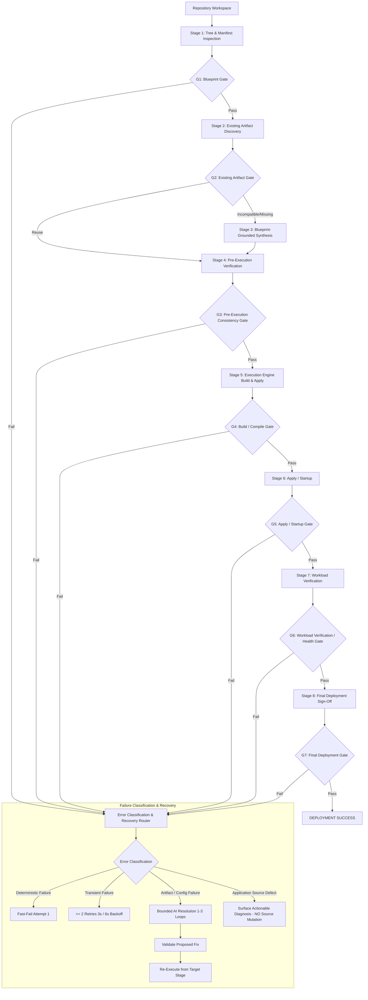

# Generic Deployment Engine Architecture & Implementation Specification

**Document Version:** 1.1.0
**Date:** 2026-10-08
**Status:** Approved by Operator
**Target Systems:**

- Backend: [`prompt_compiler.py`](file:///C:/IMP/antigravity-cli/Major%20Project/Devops%20Automation/backend/src/generation/prompt_compiler.py), [`service.py`](file:///C:/IMP/antigravity-cli/Major%20Project/Devops%20Automation/backend/src/generation/service.py), [`routes.py`](file:///C:/IMP/antigravity-cli/Major%20Project/Devops%20Automation/backend/src/deployments/routes.py)
- Agent: [`deployment.go`](file:///C:/IMP/antigravity-cli/Major%20Project/Devops%20Automation/agent/internal/executor/deployment.go), [`dispatcher.go`](file:///C:/IMP/antigravity-cli/Major%20Project/Devops%20Automation/agent/internal/executor/dispatcher.go)
- Shared Contracts: `ProjectBlueprint`, `DiagnosticBundle`, `ExecutionGateResult`

---

## 1. Executive Summary & Problem Statement

### 1.1 The Core Problem

ForgeOps previously relied on ad-hoc heuristics, hardcoded string matches (e.g. matching directory names such as `frontend`, `Frontent`, `backend`, `client`, `ui`), and rigid prompt assumptions (e.g., assuming monorepo applications build with `--prefix <subfolder>` while flattening files into `/app`). Furthermore, the deployment execution loop blindly retried build failures up to 10 times, locking deployments in a 10-to-15-minute retry cycle for deterministic compilation and configuration errors.

The nested Next.js build failure (`code-review/`) and subsequent infinite retry loop exposed these foundational architectural limitations. The nested Next.js application is treated strictly as **one regression test case**, rather than an architecture target.

### 1.2 Architectural Target & Acceptance Criteria

Transform ForgeOps into a **robust, generic, language-and-framework-agnostic deployment engine** based on **Approach 1: Unified Two-Tier Inspection & Dynamic Blueprint Engine**.

**Core Acceptance Criterion:**

> ForgeOps must eliminate avoidable ForgeOps-induced deployment errors for valid supported applications. Genuine application-source, infrastructure, or external-service failures must be correctly classified, diagnosed, and surfaced rather than hidden or incorrectly blamed on ForgeOps.

The engine dynamically determines:

1. What application(s) exist within an arbitrary repository tree.
2. What the actual application root and build context are.
3. Monorepo topology and dependency relationships.
4. Runtime language, framework, package manager, and build system.
5. Workload category (HTTP web service, TCP service, background worker, or batch job).
6. Deterministic ambiguity resolution before escalating to operator clarification.
7. Multi-level validation of pre-existing Docker/Compose/Kubernetes artifacts before reuse.
8. Blueprint-grounded artifact synthesis with zero hardcoded path assumptions.
9. Intelligent error classification that fast-fails deterministic errors on Attempt 1 and bounds transient retries.
10. Target-aware verification gates and bounded AI self-healing that never mutates user source code.

---

## 2. Canonical Pipeline Lifecycle & Verification Gates

The ForgeOps execution lifecycle follows a sequential 7-gate pipeline. Execution never advances to a subsequent stage without satisfying the preceding gate.

AI Resolution is **not** a verification gate. It is a **bounded recovery mechanism** that can operate after any failed verification gate.



### Complete Canonical Verification Gate Matrix

| Gate                                        | Stage               | Verification Criteria                                                                                                                              | Failure Action                                                                                   |
| :------------------------------------------ | :------------------ | :------------------------------------------------------------------------------------------------------------------------------------------------- | :----------------------------------------------------------------------------------------------- |
| **G1: Blueprint Gate**                      | Detection           | Manifest consistency, valid runtime, real entrypoints, valid project roots, complete build/start contracts, no hardcoded path assumptions.         | Deterministic resolution graph; operator clarification only if unresolvable.                     |
| **G2: Existing Artifact Gate**              | Selection           | Level 1 syntax validity and Level 2 semantic blueprint compatibility (path alignment, runtime compatibility, port alignment, context consistency). | Reject artifact; fall back to blueprint-grounded generation.                                     |
| **G3: Pre-Execution Consistency Gate**      | Pre-Execution       | Generated/selected manifests align exactly with blueprint contracts (build context exists on disk, referenced files exist, ports match).           | Halt before invoking container runtime; route to recovery router.                                |
| **G4: Build / Compile Gate**                | Build               | Build process exits 0, produces designated build artifacts/images, zero compilation or syntax errors.                                              | Fast-fail deterministic errors on Attempt 1; max 2 retries for transient errors.                 |
| **G5: Apply / Startup Gate**                | Startup             | Manifests applied successfully, containers transition out of `Pending`/`Creating`, zero immediate crash loops (`CrashLoopBackOff`).                | Inspect container lifecycle and daemon status; route to recovery router.                         |
| **G6: Workload Verification / Health Gate** | Health Verification | Target-aware verification: HTTP 200-399 for web, socket connect for TCP, sustained running state for workers, exit 0 for batch jobs.               | Capture container logs and system diagnostics; route to recovery router.                         |
| **G7: Final Deployment Gate**               | Final Sign-Off      | Comprehensive check that all artifacts, endpoints, ingress/port bindings, and container statuses are verified, stable, and ready for traffic.      | Transition deployment state to `SUCCESS`. If final state unstable, capture diagnostics and halt. |

---

## 3. Dynamic Project Detection & Deterministic Ambiguity Resolution

### 3.1 Manifest Discovery Without Path Assumptions

The repository scanner recursively discovers known ecosystem manifests and configuration files across arbitrary directory structures without assuming names like `frontend`, `backend`, or `app`:

- **Node.js / JavaScript / TypeScript:** `package.json`, `pnpm-workspace.yaml`, `lerna.json`, `rush.json`
- **Java / JVM:** `pom.xml`, `build.gradle`, `build.gradle.kts`, `settings.gradle`, `settings.gradle.kts`
- **Rust:** `Cargo.toml`
- **Go:** `go.mod`
- **Python:** `pyproject.toml`, `setup.py`, `setup.cfg`, `requirements.txt`, `Pipfile`
- **PHP:** `composer.json`
- **.NET / C#:** `*.csproj`, `*.fsproj`, `*.sln`
- **Elixir:** `mix.exs`
- **Ruby:** `Gemfile`

The scanner also discovers lockfiles and runtime version files:
`pnpm-lock.yaml`, `yarn.lock`, `bun.lockb`, `package-lock.json`, `poetry.lock`, `uv.lock`, `Pipfile.lock`, `Cargo.lock`, `go.sum`, `.nvmrc`, `.node-version`, `.python-version`, `runtime.txt`.

### 3.2 Strongly Typed `ProjectBlueprint` Contract

The `ProjectBlueprint` serves as the authoritative single source of truth across analysis, generation, validation, execution, and diagnostics.

```python
from dataclasses import dataclass, field
from enum import Enum
from typing import Dict, List, Optional

class WorkloadType(str, Enum):
    WEB_SERVICE = "web_service"
    TCP_SERVICE = "tcp_service"
    BACKGROUND_WORKER = "background_worker"
    BATCH_JOB = "batch_job"
    STATIC_SPA = "static_spa"

class ProtocolType(str, Enum):
    HTTP = "http"
    TCP = "tcp"
    NONE = "none"

@dataclass
class NetworkContract:
    listen_port: Optional[int] = None
    protocol: ProtocolType = ProtocolType.HTTP
    health_check_path: Optional[str] = "/health"
    exposed_endpoints: List[str] = field(default_factory=list)

@dataclass
class BuildConfig:
    source_dir: str                  # Relative path from repository root (e.g. "." or "apps/web")
    build_command: Optional[str]     # e.g. "npm run build", "cargo build --release"
    artifact_output_dir: Optional[str] # Discovered output directory (e.g. ".next", "dist", "target/release")
    install_command: Optional[str]   # e.g. "pnpm install --frozen-lockfile"
    cache_dirs: List[str] = field(default_factory=list)

@dataclass
class RuntimeContract:
    language: str                    # "nodejs", "python", "golang", "rust", "java", etc.
    runtime_version: str             # Discovered or resolved version, e.g. "20", "3.11", "1.22"
    framework: Optional[str]         # "nextjs", "fastapi", "react", "express", "gin", etc.
    package_manager: str             # "pnpm", "npm", "yarn", "poetry", "cargo", "go", "maven", etc.
    start_command: str               # e.g. "npm run start", "uvicorn main:app --host 0.0.0.0 --port 8000"
    environment_variables: Dict[str, str] = field(default_factory=dict)

@dataclass
class AmbiguityResolution:
    is_ambiguous: bool = False
    resolution_strategy: Optional[str] = None
    confidence_score: float = 1.0
    detected_candidates: List[str] = field(default_factory=list)
    unresolved_reason: Optional[str] = None

@dataclass
class ProjectBlueprint:
    blueprint_id: str
    repository_root: str
    is_monorepo: bool
    workload_type: WorkloadType
    build_config: BuildConfig
    runtime: RuntimeContract
    network: NetworkContract
    ambiguity: AmbiguityResolution = field(default_factory=AmbiguityResolution)
```

### 3.3 Workspace Graph Analysis & Deterministic Resolution

When multiple manifests are discovered, ForgeOps executes deterministic resolution before prompting an operator:

1. **Workspace Root Detection:** Parse `pnpm-workspace.yaml`, `workspaces` field in `package.json`, `settings.gradle`, or `[workspace]` in `Cargo.toml`.
2. **Dependency & Topology Analysis:** Construct a Directed Acyclic Graph (DAG) of project members. Separate shared libraries (referenced as internal dependencies) from leaf nodes.
3. **Runnable Entrypoint Verification:** Inspect leaf packages for runnable production scripts (`start`, `serve`, `prod`), main executables, or HTTP framework entrypoints.
4. **Resolution Precedence:**
   - Single runnable leaf package with web framework -> Automatically select as deployment target.
   - Gateway/Frontend service with backing libraries -> Select the gateway/main web entrypoint.
   - If multiple independent runnable entrypoints exist with equal priority (e.g. multiple distinct apps in `apps/` with no root router) and no target was specified in the deployment request -> Mark as unresolvable and present structured choices to the operator.

---

## 4. Multi-Level Existing Artifact Validation & Blueprint-Grounded Synthesis

### 4.1 Multi-Level Existing Artifact Validation

When pre-existing Dockerfiles, Compose files, or Kubernetes manifests exist in the repository, ForgeOps validates them before deciding whether to reuse them or generate fresh artifacts.

#### Level 1: Syntax & Schema Validation

- **Dockerfile:** Validate AST syntax, instruction sequencing, and valid base image syntax.
- **Docker Compose:** Validate against Compose Specification schema (v2/v3), verifying services, image/build stanzas, and network definitions.
- **Kubernetes:** Validate resource schemas (`apps/v1`, `core/v1`), pod specs, and selector definitions.

#### Level 2: Semantic Blueprint Compatibility Validation

An artifact that passes Level 1 syntax validation is rejected if it fails semantic blueprint compatibility:

1. **Path & Context Alignment:** Verify that `COPY`, `ADD`, and `WORKDIR` instructions correspond to actual paths on disk and match `build_config.source_dir`.
2. **Runtime & Version Consistency:** Verify that base images match `runtime.language` and `runtime.runtime_version` (e.g. rejecting a `node:16` image if the blueprint detected Next.js 14 requiring Node >= 18.17).
3. **Network Contract Alignment:** Verify that `EXPOSE` or Compose `ports` match `network.listen_port`.
4. **Entrypoint Alignment:** Verify that `CMD` or `ENTRYPOINT` aligns with `runtime.start_command`.
5. **Build Context Alignment:** Verify that Compose `build.context` correctly resolves relative paths to the application root.

If Level 1 or Level 2 validation fails, ForgeOps logs a clear diagnostic reason and transitions to Stage 3 (Blueprint-Grounded Synthesis).

### 4.2 Blueprint-Grounded Artifact Synthesis

In [`prompt_compiler.py`](file:///C:/IMP/antigravity-cli/Major%20Project/Devops%20Automation/backend/src/generation/prompt_compiler.py) and [`service.py`](file:///C:/IMP/antigravity-cli/Major%20Project/Devops%20Automation/backend/src/generation/service.py), generation rules are strictly bound to the `ProjectBlueprint`:

- **Explicit Working Directory:** Set `WORKDIR` according to `build_config.source_dir`.
- **Package Manager Adherence:** Use the exact package manager discovered (`pnpm`, `npm`, `yarn`, `poetry`, `cargo`).
- **Multi-Stage Structure:**
  - _Stage 1 (Builder):_ Copy manifest/lockfile first, execute `install_command`, copy application source according to `source_dir`, execute `build_command`, and verify `artifact_output_dir`.
  - _Stage 2 (Runner):_ Use a clean runtime base image, copy solely runtime artifacts and dependencies from the builder stage, set non-root user, expose `network.listen_port`, and set `ENTRYPOINT`/`CMD` to `runtime.start_command`.
- **Zero Path Guessing:** Delete all legacy substring patterns (`frontend`, `Frontent`, `client`, `ui`, `code-review/`).

### 4.3 Pre-Execution Consistency Gate (G3)

Before invoking any Docker, Compose, or Kubernetes commands:

- Statically assert that the build context exists.
- Statically assert that all files referenced in `COPY` exist within the build context.
- Assert that exposed ports align across the Dockerfile, Compose file, and blueprint.
- Any discrepancy halts execution immediately before entering the container runtime.

---

## 5. Execution Engine — Intelligent Retry, Fast-Fail & Diagnostics

### 5.1 Replacement of Blind 10-Attempt Retry Loop

The legacy loop in [`deployment.go`](file:///C:/IMP/antigravity-cli/Major%20Project/Devops%20Automation/agent/internal/executor/deployment.go) retried `docker compose up --build` up to 10 times unconditionally. This is replaced with **Contextual Error Classification**:

```go
type ErrorClass string

const (
    ErrorClassDeterministic   ErrorClass = "DETERMINISTIC"
    ErrorClassTransient       ErrorClass = "TRANSIENT"
    ErrorClassApplicationCode ErrorClass = "APPLICATION_CODE"
    ErrorClassEngineInternal  ErrorClass = "ENGINE_INTERNAL"
)

type ExecutionError struct {
    Class      ErrorClass
    Stage      string
    ExitCode   int
    Message    string
    RawOutput  string
    Suggestion string
}
```

#### Classification Rules:

1. **Deterministic Build/Syntax Failures (Fast-Fail on Attempt 1):**
   - Compilation errors (TypeScript `TS2307`, Go compilation errors, Rust `rustc` errors, Babel/Webpack/Vite build errors).
   - Missing file/module errors (`Module not found`, `No such file or directory`, `cannot find package`).
   - Dockerfile syntax or instruction failures (`COPY failed: file not found in build context`).
   - Port conflicts (`bind: address already in use`).
   - Action: **Halt immediately on Attempt 1.** Do not retry. Capture diagnostic bundle.
2. **Transient Failures (Max 2 Retries):**
   - Network timeouts downloading images or packages (`dial tcp: i/o timeout`, `ETIMEDOUT`, `TLS handshake timeout`).
   - Registry rate limiting (`429 Too Many Requests`).
   - Docker daemon socket lock or temporary contention.
   - Action: Retry maximum 2 times with exponential backoff (Attempt 1: 3 seconds backoff; Attempt 2: 6 seconds backoff).

### 5.2 Target-Aware Workload Verification (Gate G6)

ForgeOps verifies deployment health based on the `workload_type`:

- **Web Service (`web_service` / `static_spa`):** Poll `http://<host>:<port><health_check_path>` with a 30-second window. Expect HTTP status code in range 200–399.
- **TCP Service (`tcp_service`):** Verify TCP socket connection on `<host>:<port>` completes a handshake.
- **Background Worker (`background_worker`):** Monitor container status for 15 seconds. Ensure container remains in `running` state without restarting (`restartCount == 0`, exit status 0).
- **Batch Job (`batch_job`):** Wait for process termination. Assert exit status equals 0.

### 5.3 Diagnostic Bundle & Bounded AI Self-Healing

When any gate fails, ForgeOps compiles a comprehensive diagnostic bundle:

- The authoritative `ProjectBlueprint`.
- Generated and validated deployment manifests (`Dockerfile`, `docker-compose.yml`, Kubernetes manifests).
- Full execution context (stage, command line, exit code, attempt count, stderr, stdout).
- Container state (status, restart count, health check logs, exit reason).
- Repository directory tree snippet centered around the application root.

#### Root-Cause Classification & AI Constraints:

1. **Blueprint Mismatch:** AI adjusts `ProjectBlueprint` fields (e.g. wrong start command or output directory) and re-synthesizes artifacts.
2. **Generated Artifact Defect:** AI corrects Dockerfile or Compose manifest syntax/context.
3. **Application Source Defect:** **STRICT CONSTRAINT:** ForgeOps and the AI self-healing loop **SHALL NEVER MODIFY THE USER'S APPLICATION SOURCE CODE**. If the failure is caused by application-level bugs, syntax errors, or missing project files, the engine halts immediately and presents an actionable diagnostic report to the operator.
4. **Bounded Iterations:** AI self-healing is strictly bounded to a maximum of **1 to 3 attempts**. If the issue is not resolved within the limit, execution terminates cleanly with preserved container logs.

---

## 6. Heterogeneous Archetype Validation Strategy

To verify that ForgeOps operates generically without application-specific heuristics, the test suite executes against 12 heterogeneous project archetypes:

1. **Standard Single-App Next.js:** Root-level Next.js application with standard `package.json`.
2. **Nested Subdirectory Next.js (Regression Test Case):** Next.js application located in a subfolder (e.g. `code-review/`), verifying exact `WORKDIR` and build context without directory flattening.
3. **Static SPA (Vite / React / Vue):** Multi-stage build producing static assets served via an Nginx runner stage.
4. **Node.js Backend (Express / Fastify / NestJS):** TypeScript or JavaScript backend with runtime dependencies and explicit start script.
5. **Python Web API (FastAPI / Flask / Django):** Discovered with `pyproject.toml` (Poetry or Uv), managing virtualenv or wheel builds and Uvicorn/Gunicorn entrypoint.
6. **Python Background Worker:** Headless Celery/RQ or queue consumer with no exposed network port.
7. **Go Microservice:** Multi-stage build compiling Go binary in builder stage and running in minimal `scratch` or `alpine` container.
8. **Rust Web Service:** Multi-stage `cargo build --release` producing stripped static binary in runner stage.
9. **Java / Spring Boot:** Multi-stage Maven or Gradle build producing executable jar, executed via OpenJDK JRE.
10. **Pnpm Monorepo:** Monorepo with `pnpm-workspace.yaml`, shared local packages, and one deployable web service.
11. **Existing Valid Dockerfile / Compose:** Repository containing a fully compliant, verified Dockerfile that passes Level 1 & Level 2 gates and is reused directly without regeneration.
12. **Existing Invalid Dockerfile:** Repository containing an outdated or broken Dockerfile that fails Level 2 semantic validation, verifying that ForgeOps rejects it and falls back to clean blueprint-grounded generation.

### Anti-Pattern Regression Linter

A continuous integration regression test scans ForgeOps code ([`deployment.go`](file:///C:/IMP/antigravity-cli/Major%20Project/Devops%20Automation/agent/internal/executor/deployment.go), [`dispatcher.go`](file:///C:/IMP/antigravity-cli/Major%20Project/Devops%20Automation/agent/internal/executor/dispatcher.go), [`prompt_compiler.py`](file:///C:/IMP/antigravity-cli/Major%20Project/Devops%20Automation/backend/src/generation/prompt_compiler.py), [`routes.py`](file:///C:/IMP/antigravity-cli/Major%20Project/Devops%20Automation/backend/src/deployments/routes.py)):

- Prohibits hardcoded application directory names (`frontend`, `Frontent`, `backend`, `client`, `ui`, `code-review`).
- Prohibits hardcoded framework commands with hardcoded directory flags (`--prefix <name>`).
- Prohibits hardcoded retry loops without error classification.
