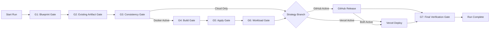

# ForgeOps Autonomous Deployment Orchestrator: Complete Technical Specification

**Document Version:** 1.0.0  
**Date:** 2026-10-10  
**Status:** Approved Architecture Specification  
**Specification File:** `docs/superpowers/specs/2026-10-10-autonomous-deployment-orchestrator-design.md`

---

## 1. Executive Summary & Goals

### 1.1 Purpose
The Autonomous Deployment Orchestrator introduces a production-grade CI/CD and deployment engine into ForgeOps. It enables operators to select a deployment strategy, configure project-specific parameters, pair their local ForgeOps agent once, and initiate an automated deployment. The system executes asynchronously in the backend, orchestrating validation gates, container operations, version control releases, and cloud deployments, while providing real-time, Jenkins Blue Ocean-style observability with live logs and gate metrics.

### 1.2 Core Architectural Principles
1. **Authoritative Backend State Machine:** The backend database (PostgreSQL) is the single source of truth for all run states, stage transitions, gate results, and logs. State is never synthesized by the frontend or simulated via local timers.
2. **Strategy-Aware Stage Graph:** The orchestrator executes only the stages required for the chosen strategy. Inapplicable operational stages (e.g., Docker for cloud-only strategies) are omitted from execution and UI visualization.
3. **Canonical G1–G7 Verification Pipeline:** All seven canonical gates from the ForgeOps verification engine are executed and rendered as distinct, inspectable nodes. Gates are never collapsed or conflated with operational tasks.
4. **Strict Worker Fencing & Crash Recovery:** Work execution uses atomic ownership claims, monotonic fencing tokens per claim epoch, and leased heartbeats. Stale workers are prevented from writing state or causing duplicate side effects.
5. **Separate Sequence Streams & Gap-Free Replay:** Persisted log lines (`log_seq`) and outbox streaming events (`event_seq`) maintain separate sequence spaces. Streaming consumers use a subscribe-before-replay protocol to eliminate race conditions and event loss.
6. **Immutable Run History:** A failed or rolled-back run is never mutated back to running. Retries create new run attempts chained via `parent_run_id` and an incremented `attempt_number`.
7. **Clean Separation of Creation and Execution:** Creating a run (`POST /autonomous-deploy`) and starting execution (`POST /autonomous-deploy/{run_id}/start`) are distinct operations. Navigating to the pipeline page does not implicitly start execution.

---

## 2. Supported Deployment Strategies & Stage Graph

### 2.1 Strategy Matrix
The orchestrator supports four deployment strategies:

| Strategy Key | Operational Targets | Required Configuration | Gates Evaluated |
| :--- | :--- | :--- | :--- |
| `docker_github_vercel` | Local Docker Container + Remote GitHub Repo + Vercel Deployment | `github_config`, `vercel_config`, optional `docker_config` | G1, G2, G3, G4, G5, G6, G7 (all targets) |
| `docker_github` | Local Docker Container + Remote GitHub Repo | `github_config`, optional `docker_config` | G1, G2, G3, G4, G5, G6, G7 (Docker + GitHub) |
| `github_only` | Remote GitHub Repo | `github_config` | G1, G2, G3, G7 (GitHub only) |
| `vercel_only` | Vercel Deployment | `vercel_config` | G1, G2, G3, G7 (Vercel only) |

### 2.2 Canonical Gate Definitions (G1–G7)
Each gate represents a formal checkpoint in the deployment pipeline:
- **G1: Blueprint Gate:** Validates project structure, detected frameworks, required manifests, and environment baseline.
- **G2: Existing Artifact Gate:** Inspects whether existing Dockerfile or Docker Compose definitions are valid, reusable, and secure without requiring synthetic regeneration.
- **G3: Pre-Execution Consistency Gate:** Checks port allocations, volume bindings, environment variables, base image pinning, and target branch configurations before executing side effects.
- **G4: Build / Compile Gate:** Validates that the container build succeeds without errors and passes syntax checks. *(Docker strategies only)*
- **G5: Apply / Startup Gate:** Validates container startup, healthcheck convergence, and process boot. *(Docker strategies only)*
- **G6: Workload Verification Gate:** Probes internal HTTP endpoints, API readiness, and service ports. *(Docker strategies only)*
- **G7: Final Deployment Gate:** Strategy-aware end-to-end verification of all deployed targets (probes Docker endpoints, verifies Git branch commit SHA, and checks live Vercel domain responses).

### 2.3 Stage Graph Workflow


---

## 3. Data Model & Database Schema

The database migration (`0038_autonomous_deployments.py`) introduces three core tables into PostgreSQL.

### 3.1 `autonomous_deployments`
Maintains the authoritative state of deployment runs and attempt chains.

```sql
CREATE TABLE autonomous_deployments (
    id UUID PRIMARY KEY DEFAULT gen_random_uuid(),
    project_id UUID NOT NULL REFERENCES projects(id) ON DELETE CASCADE,
    parent_run_id UUID REFERENCES autonomous_deployments(id) ON DELETE SET NULL,
    attempt_number INT NOT NULL DEFAULT 1,
    status VARCHAR(32) NOT NULL DEFAULT 'pending',
    strategy VARCHAR(32) NOT NULL,
    configuration JSONB NOT NULL DEFAULT '{}'::jsonb,
    progress_pct INT NOT NULL DEFAULT 0,
    current_stage VARCHAR(64),
    error_summary TEXT,
    primary_error JSONB,
    compensation_error JSONB,
    
    -- Worker Fencing and Lease Custody
    worker_id VARCHAR(128),
    fence_token BIGINT NOT NULL DEFAULT 0,
    lease_expires_at TIMESTAMPTZ,
    
    -- Dispatch and Lifecycle Tracking
    dispatch_status VARCHAR(32) NOT NULL DEFAULT 'pending',
    dispatch_requested_at TIMESTAMPTZ,
    idempotency_key VARCHAR(128),
    payload_hash VARCHAR(64) NOT NULL,
    
    -- Atomic Sequence Allocators
    log_sequence_counter INT NOT NULL DEFAULT 0,
    outbox_sequence_counter INT NOT NULL DEFAULT 0,
    
    created_by UUID NOT NULL REFERENCES users(id),
    created_at TIMESTAMPTZ NOT NULL DEFAULT now(),
    started_at TIMESTAMPTZ,
    completed_at TIMESTAMPTZ,
    
    CONSTRAINT uq_proj_idempotency UNIQUE (project_id, idempotency_key),
    CONSTRAINT chk_run_status CHECK (status IN (
        'pending', 'running', 'cancelling', 'cancelled', 'succeeded', 'failed', 'rolled_back'
    )),
    CONSTRAINT chk_progress_range CHECK (progress_pct >= 0 AND progress_pct <= 100)
);

CREATE INDEX idx_auto_deploy_proj_status ON autonomous_deployments(project_id, status);
CREATE INDEX idx_auto_deploy_lease ON autonomous_deployments(status, lease_expires_at);
```

### 3.2 `autonomous_deployment_stages`
Records individual operational stages and gates.

```sql
CREATE TABLE autonomous_deployment_stages (
    id UUID PRIMARY KEY DEFAULT gen_random_uuid(),
    run_id UUID NOT NULL REFERENCES autonomous_deployments(id) ON DELETE CASCADE,
    stage_name VARCHAR(64) NOT NULL,
    gate_id VARCHAR(16), -- 'G1', 'G2', 'G3', 'G4', 'G5', 'G6', 'G7', or NULL
    position INT NOT NULL,
    status VARCHAR(32) NOT NULL DEFAULT 'pending',
    progress_pct INT NOT NULL DEFAULT 0,
    started_at TIMESTAMPTZ,
    completed_at TIMESTAMPTZ,
    error_message TEXT,
    metadata JSONB NOT NULL DEFAULT '{}'::jsonb,
    created_at TIMESTAMPTZ NOT NULL DEFAULT now(),
    
    CONSTRAINT uq_run_stage UNIQUE (run_id, stage_name),
    CONSTRAINT chk_stage_status CHECK (status IN (
        'pending', 'waiting', 'running', 'cancelling', 'cancelled', 'succeeded', 'failed', 'skipped', 'rolled_back'
    ))
);

CREATE INDEX idx_auto_deploy_stages_run ON autonomous_deployment_stages(run_id, position);
```

### 3.3 `autonomous_deployment_logs`
Stores line-by-line formatted stdout/stderr logs.

```sql
CREATE TABLE autonomous_deployment_logs (
    id BIGSERIAL PRIMARY KEY,
    run_id UUID NOT NULL REFERENCES autonomous_deployments(id) ON DELETE CASCADE,
    stage_name VARCHAR(64) NOT NULL,
    log_seq INT NOT NULL,
    level VARCHAR(16) NOT NULL DEFAULT 'INFO',
    message TEXT NOT NULL,
    created_at TIMESTAMPTZ NOT NULL DEFAULT now(),
    
    CONSTRAINT uq_run_log_seq UNIQUE (run_id, log_seq),
    CONSTRAINT chk_log_level CHECK (level IN ('INFO', 'WARN', 'ERROR'))
);

CREATE INDEX idx_auto_deploy_logs_query ON autonomous_deployment_logs(run_id, log_seq);
```

### 3.4 `autonomous_deployment_outbox`
Guarantees transactional event delivery for streaming.

```sql
CREATE TABLE autonomous_deployment_outbox (
    id BIGSERIAL PRIMARY KEY,
    run_id UUID NOT NULL REFERENCES autonomous_deployments(id) ON DELETE CASCADE,
    event_seq INT NOT NULL,
    event_type VARCHAR(32) NOT NULL,
    payload JSONB NOT NULL,
    status VARCHAR(16) NOT NULL DEFAULT 'pending',
    created_at TIMESTAMPTZ NOT NULL DEFAULT now(),
    
    CONSTRAINT uq_run_outbox_seq UNIQUE (run_id, event_seq),
    CONSTRAINT chk_outbox_status CHECK (status IN ('pending', 'published'))
);

CREATE INDEX idx_auto_deploy_outbox_pending ON autonomous_deployment_outbox(status, id);
```

---

## 4. Execution Worker & Orchestration Lifecycle

### 4.1 Worker Claim & Fencing Protocol
To prevent duplicate workers and protect against split-brain scenarios:
1. **Atomic Ownership Claim:**
   When a worker attempts to claim a run:
   ```sql
   UPDATE autonomous_deployments
   SET fence_token = fence_token + 1,
       worker_id = :worker_id,
       lease_expires_at = now() + interval '30 seconds',
       dispatch_status = 'acknowledged'
   WHERE id = :run_id
     AND project_id = :project_id
     AND status IN ('pending', 'running')
     AND status NOT IN ('cancelling', 'cancelled', 'succeeded', 'failed', 'rolled_back')
     AND (lease_expires_at IS NULL OR lease_expires_at < now())
   RETURNING fence_token;
   ```
2. **Heartbeat Renewals:**
   Routine heartbeats (every 10 seconds) extend `lease_expires_at` **without** incrementing `fence_token`:
   ```sql
   UPDATE autonomous_deployments
   SET lease_expires_at = now() + interval '30 seconds'
   WHERE id = :run_id AND fence_token = :current_fence_token AND lease_expires_at > now();
   ```
3. **Write Guard:**
   All updates to run state, stages, logs, or outbox require `WHERE id = :run_id AND fence_token = :current_fence_token AND lease_expires_at > now()`. If 0 rows are updated, the worker immediately recognizes lease loss, terminates local child processes, and exits.

### 4.2 Crash Recovery Reconciliation
Before resuming or completing an external operation after worker crash:
- **GitHub:** Verifies whether the exact target commit SHA exists on the remote branch in the linked repository.
- **Docker:** Verifies running containers labeled with `forgeops.run_id = :run_id` and checks port mappings.
- **Vercel:** Queries the Vercel Deployments API for the specific `vercel_deployment_id` stored in stage metadata.

### 4.3 Monotonic Progress Calculation
Progress strictly increases and is defined by the formula:
$$\text{Progress} = \sum_{i=1}^{N} W_i \times \frac{\text{StageProgress}_i}{100}$$
where weights $W_i$ are assigned dynamically based on the active strategy graph. Progress cannot move backward during retries or compensation. $100\%$ is achievable only when G7 final verification succeeds.

### 4.4 Cooperative Cancellation Settlement
When cancellation is requested:
1. Run status transitions to `cancelling`.
2. Worker intercepts `cancelling` during execution or heartbeat checks.
3. Sends `SIGTERM` followed by `SIGKILL` after 5 seconds to active Docker subprocesses.
4. Aborts external API polling loops.
5. Settles run status to `cancelled` and records `completed_at = now()`.

---

## 5. API Layer & Event Streaming Protocol

### 5.1 Endpoints Specification

All endpoints are mounted on `/api/v1/projects/{project_id}/autonomous-deploy` and require `require_principal`.

#### `POST /` — Create Run (Idempotent)
- **Request Body:**
  ```json
  {
    "strategy": "docker_github_vercel",
    "github_config": {
      "repository_mode": "existing",
      "repository_name": "owner/repo",
      "target_branch": "main",
      "commit_message": "Automated deployment by ForgeOps"
    },
    "vercel_config": {
      "project_name": "my-app",
      "production_deploy": true
    },
    "docker_config": {
      "port_bindings": { "8080": 8080 }
    },
    "idempotency_key": "user-defined-uuid-or-key"
  }
  ```
- **Responses:**
  - `201 Created`: New run created and stages initialized to `pending`.
  - `200 OK`: Existing run returned when identical request matches `idempotency_key` and payload fingerprint.
  - `400 Bad Request`: Strategy and configuration mismatch.
  - `409 Conflict`: `idempotency_key` reused with differing payload.

#### `GET /{run_id}` — Authoritative Snapshot
- Returns public run state, sanitized stage list, monotonic progress, and live agent pairing status. Internal fields (`fence_token`, `worker_id`, `lease_expires_at`) are excluded.

#### `POST /{run_id}/start` — Initiate Execution
- **Preconditions:**
  - Run status must be `pending`.
  - Local agent must be paired (`DeviceService.active_device_for`) with a heartbeat within 30 seconds.
- **Behavior:**
  - Atomically transitions status to `running`.
  - Records dispatch intent in database and enqueues job via `TaskDispatcher.enqueue`.
  - Returns `200 OK`.

#### `POST /{run_id}/cancel` — Request Cancellation
- If `pending`: Immediately marks `cancelled`.
- If `running`: Marks `cancelling` and triggers worker shutdown settlement.
- Returns `202 Accepted`.

#### `POST /{run_id}/retry` — Create Immutable Attempt
- Validates target run is `failed` or `rolled_back`.
- Creates a new run record with `parent_run_id = target_run.id` and `attempt_number = target_run.attempt_number + 1`. Prior runs remain 100% immutable.
- Returns `201 Created` with the new run details.

#### `GET /{run_id}/logs` — Cursor-Based Log Pagination
- Query Parameters: `since_log_seq` (int, default 0), `limit` (int, default 500, max 1000), `stage_name` (optional).
- Returns logs strictly ordered by `log_seq ASC`, with `has_more` and `next_log_seq`.

### 5.2 Streaming Replay & Synchronization Protocol
- **Sequence Domains:**
  - `log_seq`: Per-run monotonic integer for log lines (1 to 5,000 cap).
  - `event_seq`: Per-run monotonic integer for outbox events.
- **Subscribe-Before-Replay Protocol:**
  1. Client connects to `/stream` and subscribes to live Redis Pub/Sub events, buffering incoming frames in memory.
  2. Server queries current high-water mark `high_water_mark = MAX(event_seq)` from `autonomous_deployment_outbox`.
  3. Server streams historical events where `event_seq > client_cursor AND event_seq <= high_water_mark`.
  4. Client merges buffered live events where `event_seq > high_water_mark` in strict sequence order.
  5. Client deduplicates events using `event_seq <= seen_event_seq`.
  6. If a sequence gap is detected, client falls back to REST snapshot synchronization.

---

## 6. Frontend User Interface & Pipeline Visualization

### 6.1 Project Interface Integration
In [`frontend/app/(shell)/projects/[projectId]/page.tsx`](file:///C:/IMP/antigravity-cli/Major%20Project/Devops%20Automation/frontend/app/(shell)/projects/[projectId]/page.tsx), add the primary action button to the project header:
```tsx
<div className="flex items-center gap-3">
  <Button
    variant="default"
    onClick={() => setAutonomousDeployOpen(true)}
    className="font-medium text-sm shadow-sm bg-primary text-primary-foreground hover:bg-primary/90"
  >
    Autonomous Deploy
  </Button>
  <Button
    variant="outline"
    onClick={() => setCloudDeployOpen(true)}
    className="font-medium text-sm shadow-sm"
  >
    Push to GitHub / Deploy to Vercel
  </Button>
</div>
```

### 6.2 Autonomous Deploy Modal (`AutonomousDeployModal.tsx`)
- **Strategy Selection Cards:** Four interactive strategy cards.
- **Inline Expansion Form:** Contextual fields for GitHub, Vercel, and Docker based on selection.
- **Agent Pairing Prerequisite:** Displays live agent pairing status. Explains that the agent is required to access project files.
- **Submission:** "Create Run & Open Pipeline" creates the run via `POST /autonomous-deploy` and redirects to the route. It does **not** start execution.

### 6.3 Dedicated Pipeline Route (`/projects/[projectId]/autonomous-deploy/[runId]/page.tsx`)
- **Header Bar:** Breadcrumb, Run ID, Attempt number, Strategy badge, Status badge, Monotonic progress bar, Duration timer.
- **Control Actions:**
  - "Start Pipeline" button: Enabled only when run is `pending` and agent is healthy.
  - "Cancel" button: Active during `running` or `pending`.
  - "Retry" button: Appears on `failed` or `rolled_back`.
  - "Back to Project" button: Safe navigation back to project dashboard.

### 6.4 Jenkins Blue Ocean Pipeline Graph (`JenkinsPipelineDashboard.tsx`)
- **Visual Node Layout:**
  - Distinct inspectable nodes for G1, G2, G3, strategy operational stages, and G7.
  - Inapplicable stages are omitted from the graph.
  - Visual status styles:
    - *Pending:* Gray hollow circle, "Queued".
    - *Waiting:* Amber circle, pulsing ring.
    - *Running:* Blue circle, spinning border, live duration.
    - *Succeeded:* Emerald green circle, checkmark, final duration.
    - *Failed:* Crimson red circle, exclamation mark.
    - *Cancelled:* Amber circle, strike mark.
    - *Skipped:* Dashed gray circle.
  - Responsive horizontal scrolling with snap points for mobile and narrow viewports.

### 6.5 Real-Time Terminal & Stage Inspector
- **Active Stage Summary:** Shows stage description, associated gate verdicts, container IDs, commit SHAs, and live URLs.
- **Virtualized Console:**
  - Formatted stdout/stderr stream with `log_seq`, timestamps, and log level colors.
  - Auto-scroll lock toggle ("Follow Logs").
  - Search filter and stage dropdown filter.
  - Sticky warning banner when 5,000-line cap is reached.

---

## 7. Security, Authorization & Secret Management

1. **Authorization Boundaries:** All REST and streaming endpoints enforce `require_principal` with project-level tenancy validation.
2. **No Credentials in Query Strings:** WebSocket and SSE connections use secure session cookies or standard HTTP authorization headers; query parameters never accept tokens.
3. **Secret Redaction Pipeline:** All stdout/stderr logs and stage metadata pass through `redact_secrets` from [`backend/src/core/logging.py`](file:///C:/IMP/antigravity-cli/Major%20Project/Devops%20Automation/backend/src/core/logging.py) (extended for GitHub PATs and Vercel tokens) before database insertion and before outbox emission.
4. **Reserved Variables Protection:** User configuration cannot overwrite system-reserved environment variables (`PORT`, `NODE_ENV`, `FORGEOPS_*`).

---

## 8. Verification & Test Suite Matrix

The implementation will be verified through the following mandatory automated tests:

| Test Identifier | Category | Scenario Verified | Pass Criterion |
| :--- | :--- | :--- | :--- |
| `test_create_run_idempotency` | API | Repeated `POST` with identical key and payload | Returns `200 OK` with existing run; exactly one run created |
| `test_idempotency_payload_mismatch` | API | Repeated `POST` with same key but different strategy | Returns `409 Conflict` |
| `test_start_requires_agent` | Orchestrator | `POST /start` called when agent is disconnected or heartbeat > 30s | Returns `412 Precondition Failed` |
| `test_concurrent_start_requests` | Worker | Two simultaneous `POST /start` calls | Exactly one dispatches worker; second returns idempotent `200 OK` |
| `test_worker_fence_preemption` | Worker | Worker with stale `fence_token` attempts to write state | Write updates 0 rows; worker halts immediately |
| `test_worker_crash_recovery` | Worker | Worker dies during Docker build; lease expires | Recovery sweeper detects expired lease, increments fence token, reconciles containers |
| `test_immutable_retry` | Data Model | `POST /retry` on failed run | Prior run, stages, and logs remain unchanged; new attempt created with `parent_run_id` |
| `test_stream_replay_gap_free` | Streaming | Client connects with `since_event_seq=10` while server is at 25 | Server streams events 11 to 25 before live stream; client deduplicates |
| `test_secret_redaction` | Security | Build log outputs synthetic GitHub PAT or authorization token | Database log and streaming outbox both store `[REDACTED]` |
| `test_cancellation_settlement` | Orchestrator | `POST /cancel` invoked during container build | Worker terminates child process, releases locks, settles run to `cancelled` |
| `test_strategy_graph_omission` | Frontend/API | Run created with `github_only` | Docker stages and G4-G6 are completely omitted from DB and UI graph |
| `test_strategy_aware_g7` | Gates | G7 executed on `vercel_only` run | Probes Vercel URL; marks Docker and GitHub checks as "Not Applicable" |
| `test_log_truncation_cap` | Logs | Worker emits 6,000 log lines | Exactly 5,000 lines stored; line 5,000 is truncation notice; lines > 5,000 dropped |

---

## 9. Non-Negotiables & Acceptance Criteria

1. **No Simulated States:** Every stage status, gate outcome, and progress percentage must originate from backend database records.
2. **No Emoji Usage:** All UI elements, log outputs, and API responses must maintain a professional standard without emojis.
3. **No Terminal Mutation on Retry:** Retries must always generate new immutable attempt runs.
4. **Clickable Links Standard:** All documentation, logs, and UI file/symbol references must use standard markdown formatting with `file:///` and forward slashes.
5. **No Code Without Spec Approval:** Implementation code will begin only upon final user approval of this specification document.
